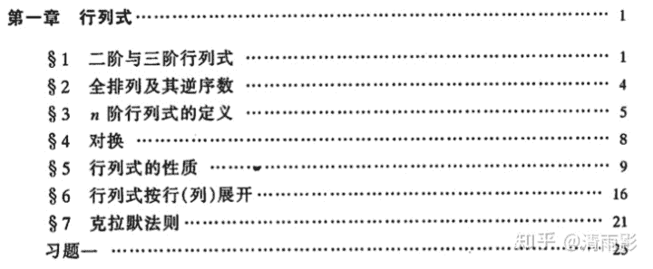
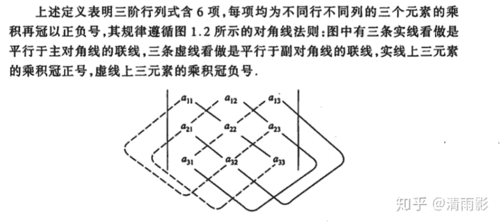
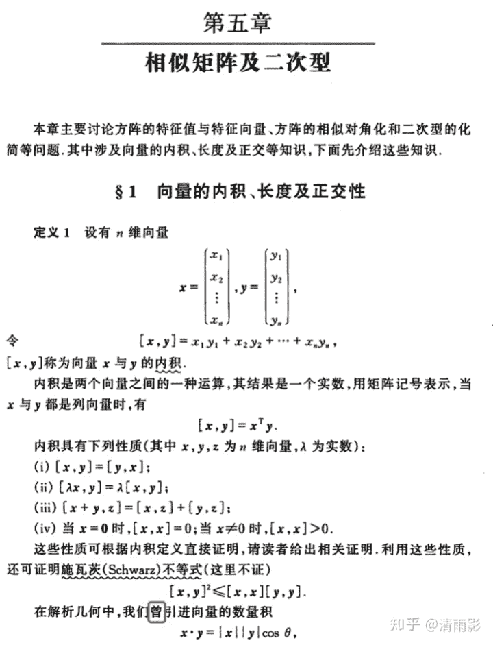
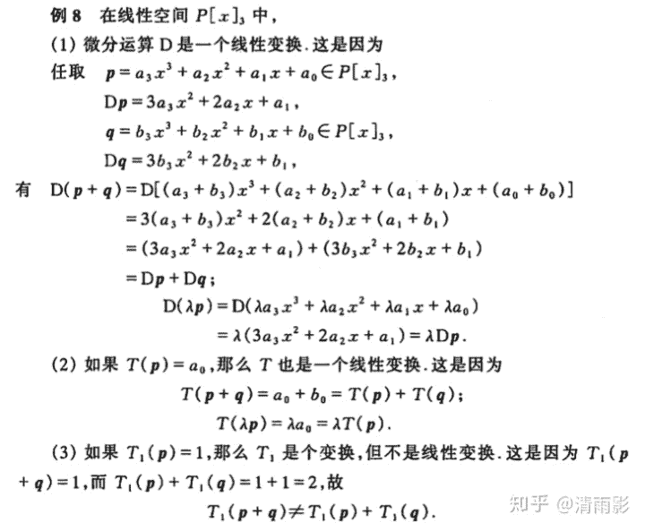
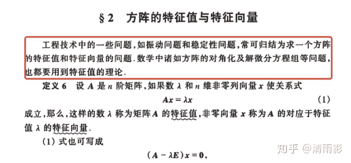
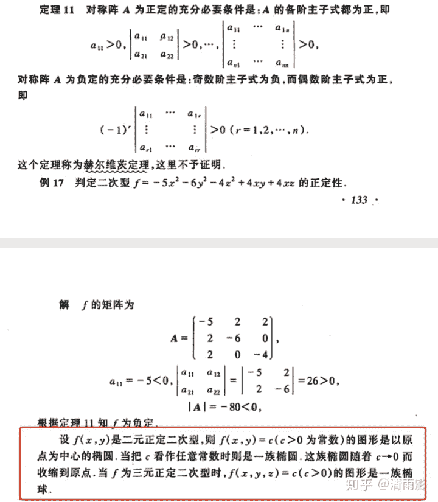

> 原文：[https://zhuanlan.zhihu.com/p/199665495](https://zhuanlan.zhihu.com/p/199665495)

老规矩，备份链接：

[https://blog.tsingjyujing.com/spam/tj-linear-algebra​blog.tsingjyujing.com](https://link.zhihu.com/?target=https%3A//blog.tsingjyujing.com/spam/tj-linear-algebra)

## 前言

最近读了

[弗兰克扬：白非立上进记（10）​zhuanlan.zhihu.com](https://zhuanlan.zhihu.com/p/94398141)

其中线性代数部分真的引起了我相当强烈的共鸣。

我们其实大多数人都是白非立，并不是每个学生都有较强的情报收集能力，或者有大学教授的父母，知道每一门课该怎么学，大家都在等老师来引导，而老师如果引导的乱七八糟，那就学生就只能根据教科书自学，这是最后的救命稻草，如果教科书也一塌糊涂，那就毁了。

其实很多课程，本来每个人都可以学好，结果硬生生毁在教科书上。如果一个人因为学校教科书的不适应而放弃这门课是事故，那么这么多年用同济版或者抄袭同济版的教材的大学可以称之为教学灾难了。 教材的选择错的越离谱，能顺利掌握这门课程的人就越少，到最后只有一些天资聪颖的大神级人物可以学会，这不得不说是学校的失职。

所以我准备吐槽一下这本旷世烂书：《线性代数》同济版。 我想把这本书钉在耻辱柱上，但是耻辱柱说这样会不会太耻辱，后来我还是算了。 我严重怀疑这本书是同济编写了用来拉低其它学校的教学水平的，他们自己可能都未必用。

说到线性代数教材，我上大学的时候用的并不是同济版的线代，那我为什么这么痛恨同济版的教材呢？ 因为我们大学用的是自己编的教材，说是自己编，其实就是抄同济版。具体临床表现为：第一章就讲行列式，知识点支离破碎，结构混乱，和同济版如出一辙。接下来我吐槽同济版的每一个点，基本都可以放到我们大学的教材上。 好在我们老师是明白人，没有完全按照顺序教。 但是书毕竟是买错了，看书复习的时候仍然让我十分痛苦。这样的学习方法，考后也遗忘的十分迅速。直到我遇到了Gilbert Strang，又看了《Linear Algebra Done Right》，重新学了一遍，第二遍让我一直没忘（当然一些证明细节可能糊了）直到今天。

我读大学的时候，可以不从学校手里买书，但是大多数人为了不出幺蛾子，都是按照学校的安排统一买书。我的建议是，别的书还不好说，线性代数就单独摘出来别买了，父母挣点钱不容易，买点擦屁股都太硬的废纸是不是有点浪费？

我本来以为，作为国内一流大学的同济大学，搞出来的教科书水平一定高到不知道哪里去了，至少是不错，就好像我们买东西会认牌子一样。 等我学了一圈别的线性代数再回头看，真是想多了啊，这是我见过的线性代数教材里第一烂的，不是之一，是第一！

下面我们就欣赏一下同济版的线性代数教材。

## 混乱的结构

如果说这本书最大的问题是什么，那就是结构混乱。

第一章，起手就行列式糊你熊脸：

兄弟，我们是线性代数课，你不先介绍一下什么叫线性，什么叫代数吗？起手就是n阶行列式的定义，实力劝退。

这里表扬一下我校老师，第一节课会介绍什么叫线性，什么叫代数。

随后就是行列式的计算了：

 你告诉我记这个有JetBrains卵用

啊，原来画对角线就行了啊，那你告诉我，为什么四阶行列式开始不能用这个方法呢？

然后开始讲全排列和逆序数，恍惚中我看到了概率老师在向我招手，一种走错片场恍如隔世的感觉瞬间袭来。可惜当时的我还没有这个感觉，因为我们的概率论安排在线性代数之后。

然后就是对换，转置之类的行列式的性质，以及行列式的……展开，争分夺秒的引入了一个没有什么卵用的……代数余子式。以上介绍伴随着严谨但是佶屈聱牙的证明，再次告诉你：你不是学数学的料，趁早收拾书包滚蛋。

在以上所有的介绍完成以后，终于告诉你，我们的行列式可以用克拉默法则来解线性方程组。无论手算还是计算机算，克拉默法则的计算量比直接消元大到不知道哪里去了，还要考虑全排列和逆序数，我当时已经知道怎么消元，所以我脑子里的第一反应是：脑子坏了才用克拉默法则。

我不知道这个法则在数学史上是什么地位，或者在这门课程里有什么意义——毕竟有些定理虽然直接用不上，但是用来引出概念或者引理之后会变得特别实用。至少克拉默法则在我的学习和工程师生涯中，没有发挥一次作用。后来我还看到一些吐槽，说这个法则解2x2矩阵都不稳定，鬼才用。

伴随着没有卵用的克拉默，第一章，就这样结束了，按照这样的节奏上一节课，脑子里不会有任何框架，概念，只有死记硬背的各种名词和性质。

抱着空空如也的大脑，我们开始了第二、三章的学习：矩阵及其运算+矩阵的初等变换及线性方程组。

就算你搞完这两章，你仍然只是堆积一堆名词概念，比如什么叫矩阵，什么叫秩，但是并不能让你直观的理解他们到底是干什么的。唯一值得“表扬”的是，在第三章的最后，终于犹抱琵琶半遮面的讲到了矩阵和线性方程组的解的关系，虽然这个时候我们已经知道了什么是秩，什么是逆矩阵，甚至已经搞了一把分块矩阵了。但是这个时候我们应该是不知道矩阵和线性方程组有什么关系的。

第四章，开始介绍向量……半本书过去了，矩阵，行列式，那么多复杂的性质介绍完了，矩阵的重要组成部分——向量——终于羞答答的出现在了我们的面前。我倍感欣慰啊，矩阵可以理解为是由向量组成的，BIG NEWS！您要不在第四章介绍，我在看前面的书还真想不到呢，虽然我连秩都应该理解了。哦，这一章又介绍了一遍向量组的秩……我只能说你开心就好。

在这一章的最后，终于开始介绍向量空间，但是通篇介绍还是围绕在向量组的秩，线性有关无关，终于在最后的例题里触及到了向量空间的变换，本书没有大篇幅的讲解空间变换的重要概念，用精炼的仅仅一个例题就教会了大家怎么求两个空间的过渡矩阵。——这也可以理解，最重要的线性空间要在第六章才讲呢，还是选讲。

讲完了向量空间，我们应该说说向量的运算了，所以第五章排的中规中矩，在经历了前四章的磨砺以后，伤痕累累的大脑终于得到了休息。

这一章，叫做“相似矩阵及二次型”。

我有点懵逼，这一本书难道就剩下这俩概念了吗？（让我们先忽略打星号的第六章）

当然不是，因为我们连向量的内积都还没有介绍呐！！！！

请注意这个“曾”字，看到这个字，我才知道我误会编者，误会的有多深，这本书，可能还有上册……

总的来说，这一章不止是“相似矩阵及二次型”，包含了向量的一些基本操作，正交基的介绍，特征值与特征向量（这两个衔接的还算自然），相似矩阵，之后才是二次型。

这一章偏应用，内容还算正常，硬要说什么的话，仍然是佶屈聱牙的所谓严谨证明，（对于初学者）炫技一样的例题，以及没有介绍SVD这个工科大杀器。以及，这一章的部分内容完全应该散到其它章节去。

不论如何这已经是最正常的一章节了，就先表扬一下吧！

现在开始打了星号的第六章，选学的第六章，屠龙少年过五关斩六将最后接触到整个线代的核心——线性空间。

WTF？这么重要的内容你现在才讲，这不是坑爹呢吗！整个线性代数的半壁江山（你说全部都可以）就在这线性空间里面，你居然是……选学？选学里不应该放SVD/PCA/雅可比迭代这种乱七八糟的应用类话题吗？你见过把甜点当正餐，然后牛扒或者烤鸡这样的正餐大菜随便啃几口说这是餐后“甜”点的吗？我小时候要是吃冰淇淋吃到吃不下饭是会被家长打的，我不知道谁来把这个编者打一顿。

我看了第六章，我承认，稍微有点向抽象代数的方向偏了，看上去好像数学专业才要学。但是线性空间完全是普通工科学生应该搞懂，可以搞懂的东西。

第六章也不是没有槽点，第六章终于介绍了，矩阵可以作为矢量的线性变换来理解，让我们看看例题吧：

你是觉得大家都已经把抽象代数学完了吗？——抱歉，我忘了，我一个工科狗，是不是不配学这一章。

## 不合理的内容安排

我的吐槽要停止了吗？

没有！

这本书还缺了很多东西，154页的书：

*   没有直观的几何理解，线性变换这种高度依赖几何直觉去理解的东西，居然没图。
*   行列式的几何意义也没有介绍，全是逆序数的炫技，更不要说秩的几何意义了
*   矢量的几何意义不介绍也行，矩阵作为线性变换的几何意义只是轻描淡写用了一个旋转矩阵的例题带过，我记得这个例题的地方还不是在介绍线性变换的地方。
*   二次型的几何意义，以及在优化问题里的工程意义，语焉不详。
*   线性相关和线性无关介绍完以后，没图，没说明
*   下一章讲施密特正交化的时候，有一张靠谱一点的图可以用来说明，让我知道，编书的人并不是手残，只是不想给你画。
*   憋着到了最后一章才讲线性空间，但是这个东西好歹是线性代数的核心，实在是憋不住，四章五节讲了向量空间。

向量，线性方程组，矩阵，以及他们生活的线性空间，不敢说面目全非，至少是被肢解的支离破碎，活生生的要把理科变成文科科目。

这本书有点想向工程实际靠拢，可是实际上，举的例子拙劣不堪，虎头蛇尾，且往往不举实际的例子，就是“我们在XX领域会遇到这样的计算”：

你这介绍和不介绍有啥区别……凑字数吗？

除此之外，这本书在该下功夫的地方浅尝辄止，在不该下功夫的地方费尽全力，154页当成100页看我觉得都高估了。

除了处处充斥着的“这里不予证明”的嘲讽式定理，还有无图式几何理解：

## 后记

吐槽完这本旷世烂书，我的心情没有好多少，现在还有多少工科的学生在学习这样一本烂书？他们和白非立一样，没有信息获取的渠道，他们信任的渠道：老师——不一定能给予他们真正的教导。

他们在和烂书缠斗的过程中，逐渐怀疑自己的智商，逐渐厌恶学习，就更不要说学分了，考试能过就阿弥陀佛了。

我不知道我校卖自己编写的教材每年可以增加多少财政收入，但是卖出多少，就可能毁掉很多人对线性代数了解的可能和热爱的可能。在我看来，这是杀鸡取卵，买椟还珠的操作。我们的老师也知道教材有问题，尽力在挽回这个局面。

## 但是，这个局面本来应该如此吗？