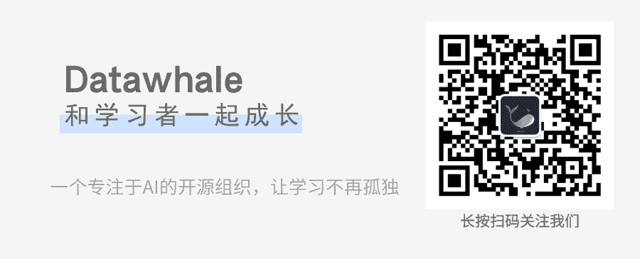

**Debug Your Life：江水**

直播概要

**江水** 

1\. 某互联网公司一线工程师

2\. 代码写的跟屎一样（大佬不要闹！），指点江山一套一套的

**如何学习** 

**1 了解互联网**

**1.1 程序员都有哪些领域？**

*   前端:

    CSS/JavaScript/TypeScript

*   后端:

    Java/C/C++/C#/Go/Erlang/PHP/Ruby/Python/NodeJS

*   手机端:

    Android/Java/Kotlin iOS/Objective-C/Swift

*   算法:机器学习/深度学习

*   硬件:嵌入式/PFGA

*   游戏

*   测试:测试开发

*   运维:运维开发

*   基础设施:网络、虚拟化/容器、大数据

**1.2 程序员的工资都是多少？**

*   校招 本科生 13-18k

*   校招 研究生 15-23k

*   工作三年 20k+

*   高级工程师 30k+

*   资深工程师 40k+

**1.3学历重要吗？**

*   **互联网行业只有两个大学**

    清/北/中科院 北航/北理/北邮/北科 哈工大 武大/华科 天大/南开 浙大 复旦/上交**和**其他大学

*   **但也**有高中学历的架构师**和**有清北毕业的普通工程师

**2 学习方法**

*   有效规划利用时间

*   买个好电脑 至少要能跑三个以上虚拟机

*   Linux不是一门课程/技术 而是一种工具

种一棵树最好的时间是十年前，其次是现在

人，更适合专注；而不是像计算机一样，不断切换、中断

世上无难事，只要肯放弃

**3 推荐书籍**

*   计算机组成原理

*   操作系统

*   计算机网络

*   数据结构与算法

关于编程的技术书

*   C程序设计语言

*   明解C语言

*   UNIX环境高级编程(APUE)

*   C++ Primer

*   Java核心技术

*   Effective java

*   SQL必知必会

*   高性能MySQL

*   Heading First系列

*   xx是怎样xx的

*   图解系列

关于编程的非技术书

*   设计模式 可复用面向对象软件的基础

*   深入浅出设计模式

*   重构 改善既有代码的设计

*   代码整洁之道

*   程序员修炼之道

*   人月神话

*   人件

*   哥德尔 艾舍尔 巴赫书 集异璧之大成

**如何面试**

**1 面试准备**

**1.1 做点正事**

*   基础算法 一定要多刷题（leetcode 牛课）

*   多看开源项目 多读源码（github stackoverflow）

*   函数式编程

*   写一个数据库或者是操作系统

**1.2 如何去大公司**

*   实习生/夏季实习生

*   内推

*   秋招/校招

*   春招

*   参加比赛：百度之星 阿里天池

**1.3 想好做什么**

*   一听秋招开始了，慌了->海投

*   第一份工作很重要，决定后续的工作->不要反复跳

*   从0到1的蜕变

**1.4 认清校招**

*   基础知识/基本技能+项目经验

*   学习态度 认认真真刷题，好好学习的一般offer都不差

*   实习经验 没实习就没实习经验

*   Web开发 要问SQL优化

*   服务端开发 要问操作系统

*   算法同学 一般这些是不问的

*   做工程 需要很多周边知识

*   如果不做基础设施 操作系统能知道是什么就可以

*   基础算法 请先学好数据结构

*   有些知识不会就是不会 虽然工作也不用

人生不能像做菜 把所有的材料都准备好了才下锅

珍惜每一个机会 但也不要打光所有底牌

**2 面试技巧**

*   态度很重要

*   如何证明你会

*   项目需要能讲出来

**3 面试官角度**

1.  基本算法和数据结构

    考察一个人的基本功

2.  算法复杂度分析、常规代码细节

    考察一个人是否具有性能优化、容量规划、方案对比的意识

3.  架构设计

    考虑问题是否全面

    是否具有全局观和前瞻性

    是否意识到学习的重要性

4.  场景题

    解决问题的能力 现实问题转化为工程模型

**如何工作与成长**

**1 如何工作**

**1.1 有些坏习惯**

*   眼高手低 再小的事情也要认真对待

*   是否足够重视 是否有功利心

*   没有想不想 只有该不该

*   不要想能得到什么 要想能提供什么

**1.2 学会沟通**

*   多人协作

    沟通交流、代码交互、接口规范 不仅是Git

*   太内向不好 需要融入团队

*   需要及时反馈

*   有效沟通

    能提供什么 需要反馈什么

    完整表达 客观事实+观点

    人少时 同步沟通 会议、电话

    人多时 异步沟通 邮件、文档、多人协作系统

*   学会提问 《提问的艺术》

    做了什么 现在是什么情况 感觉有什么问题

**1.3 项目**

*   项目 如期交付(守时守信)、质量保障(保质保量)、项目产出(完整结果)

*   过程 信息同步

*   目标 为何要做这件事 意义是什么

*   结果 目标的关键因素 核心指标

**2 如何成长**

*   50%工作 30%学习 剩下的其他

*   要么练剑 要么炼气

**2.1代码之外的技能**

**（翻墙 跳出周围的圈子 看看外面的世界）**

*   英语能力

*   自学能力 可以更快更有效的get到技能

*   思考能力 独立思考 思维训练 保持头脑灵活 知道什么样是对的，什么样是错的

*   写作能力 写博客 整理、记录

*   沟通能力 交流融入圈子 人是群居动物

*   分享能力 把技术讲给别人，也会提升自己

*   营销能力

**2.2 3F**

Focus专注、Feedback反馈、Fix修正

**2.3 ****追赶风口**

电商 P2P 陌生人社交 区块链 人工智能 计算硬件化

经历这个东西 技巧永远弥补不了

保持好奇心 怀疑心态

压力是常态 

要看到积极的一面 不要只提出问题 也要解决问题

**总结** 

没有银弹

钱 不是唯一目标

O ever youthful, O ever weeping

          --- Jack Kerouac <The Dharm Bums>

**Q&A**

Q:计算机岗位适合转行吗？

A:拼态度的行业！只要肯学！

Q:二本有得搞嘛？

A:知识是重要的，只要把知识面、积累搞好，问题不大

Q:刚开始刷题有必要先看视频吗？

A:刷算法、数据结构无所谓。无所谓方式，知识学到最重要。

Q:如何不要总犯错？

A:1.仔细认真，重视！2.考虑尽量全面一些。

Q:如何获取内推？

A:自己加一些社群，联系人帮内推；可以参考牛客网这类的网；可以关注脉脉，Boss直聘等APP信息。

Q:转行机器学习算法难度大吗？投入产出怎样?

A:如果你喜欢，你能学会，难度就不大。

Q:大数据是做什么的？

A:对公司内部数据分析，清洗，处理，对公司客户、对公司内部提供商业价值，或者对外提供大数据服务。

Q:没有实习怎么办？

A:简历的项目包括自学的项目、比赛经验、跟导师做的项目。真正学明白，懂了的项目经验。

........

文字整理 | 江水、蜉蝣

排版 |蜉蝣

图片 |蜉蝣

点击**阅读原文**，回看B站录播