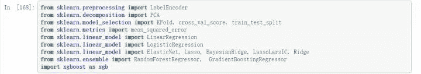

 写在前面     


大家好，我是鱼遇雨欲语与余，本次我将带来不一样的分享，这将是我的个人竞赛历程。将从三个部分展开分享，主要竞赛经历、关于我的竞赛和未来竞赛的我。一位竞赛小白是如何一路打怪升级，然后取得不错成绩的，到后来一年获得“两冠四亚一季”的佳绩。这里我尝试记录这两年主要做过的事情和其中的感想，希望对大家有所启发。

**首先感谢在这两年竞赛道路上帮助过我的人，@所有人**

**回想过去的两年，是折腾的两年，也是自我感悟和提升的两年。**


主要竞赛经历


2018，[印象盐城]数创未来大数据竞赛 - 乘用车零售量预测，Rank53

2018，IJCAI-18 阿里妈妈搜索广告转化预测，Rank29

2018，腾讯广告算法大赛，Rank11

2018，JDATA-如期而至-用户行为预测，Rank9

2018，科大讯飞营销算法大赛，冠军

2019，消费者人群画像—信用智能评分，Rank5

2019，TIANCHI-OGeek算法挑战赛，亚军

2019，TIANCHI-全球城市AI挑战赛，季军

2019，JDATA-用户对品类下店铺的购买预测，亚军

2019，腾讯广告算法大赛，冠军

2019，KDD Cup: Context-Aware Multi-Modal Transportation Recommendation，亚军

2019，第四届魔镜杯大赛数据应用大赛，亚军


 初次接触竞赛     


<figure>这是我第一次参加的数据竞赛，不得不说，印象深刻，不断的颠覆我的认知。</figure>

在经历过机器学习的理论学习，然后到Kaggle入门赛**Titanic: Machine Learning from Disaster**的学习，给我最初的观念是比赛需要各种各样的数据分析和模型的堆叠。带着这样一种观念，我选择在天池进行第一场比赛，“盐城-乘用车零售量预测”。官网论坛中并没有太多的分享，所有只能参照Kaggle那套，便开始了我的数据分析之路。

<figure></figure>

（如果参赛时能看到这样一篇分析文章，可能我能进top20也说不定呢）

数据分析

当时的数据分析还比较局限，因为并不知道对于时间序列相关问题的着重点和解决方案。并且收到大量异常值的影响，导致重心放在了异常值的处理。对于赛题的目标是预测每一车型的销量，再次出现了纠结的问题，同一车型的变速器档位、变速器形式、排量可能不同。我当时的做法就是用最多的替换。然后还分析了每种车型每月的销量情况，每月的总销量情况。

<figure></figure>

<figure>

<figcaption>每月销量分析
</figcaption>

</figure>

规则初探

数据的分析并未给我带来太多的提升，主要还是不明白分析的方向。比如时间序列问题，应该考虑趋势性、周期性、循环性。接下来我就想到了一个点子，我就直接用上一个月*120%，直接到了前排。然后之后再也没有超过那个分数，因为后面都是模型跑出来的分数。

<figure></figure>

<figure>模型选择</figure>

接下来的目标就是超过规则，只能搞模型了。可以看出来，我在特征工程部分做的是非常少的，所作的预处理也是给数据增加噪音和影响准确性的，帮上的只是帮倒忙。模型最终使用的是XGBoost，下面贴出我的远古代码:

```
import xgboost as xgb	
xgboost_model = xgb.XGBRegressor(colsample_bytree=0.4603, gamma=0.0468, 	
                             learning_rate=0.05, max_depth=3, 	
                             min_child_weight=1.7817, n_estimators=2200,	
                             reg_alpha=0.4640, reg_lambda=0.8571,	
                             subsample=0.5213, silent=1,	
                             random_state =7, nthread = -1)	
xc = ['sale_quantity']+['brand_id']+['sale_month']+['sale_year']	
xtrain = merge_train[merge_train['diff_quantity'].notnull()]	
xtr = xtrain[:][xc]	
xtest = merge_train[merge_train['diff_quantity'].isnull()]	
xte = xtest[:][xc]	
y_diff_train = merge_train['diff_quantity'][merge_train['diff_quantity'].notnull()]	
y_grow_train = merge_train['growth_rate'][merge_train['diff_quantity'].notnull()]	
xgboost_model.fit(xtr, y_diff_train)	
diff = xgboost_model.predict(xte)	
xgboost_model.fit(xtr, y_grow_train)	
grow = xgboost_model.predict(xte)	
xtest['diff_quantity'] = diff	
xtest['growth_rate'] = grow	
for idx in all_class_id:	
    merge_train['diff_quantity'].loc[(merge_train['class_id']==idx)&amp;(merge_train['diff_quantity'].isnull())]=xtest['diff_quantity'][xtest['class_id']==idx]	
    merge_train['growth_rate'].loc[(merge_train['class_id']==idx)&amp;(merge_train['growth_rate'].isnull())]=xtest['growth_rate'][xtest['class_id']==idx]
```

不要问我模型参数为何能够这么精准，因为全是Kaggle上粘贴复制的，再次感谢Kaggle帮我入门比赛。

<figure></figure>

<figure>

<figcaption>能够再次证明我的代码是粘贴复制Kaggle的图片</figcaption>

<figcaption>
</figcaption>

</figure>

乘用车销量预测方案代码
https://github.com/bettenW/Automobile-sale-predict


 第一次答辩现场     


<figure></figure>

我的第一次去答辩现场，是在半年后，在我竞赛的第一个半年，经历了6场比赛。2018年腾讯广告算法大赛，我的队友是鹏哥和宇翔，也算是我半路上车，因为是“IJCAI18-阿里妈妈”结束后才加入队伍。这次比赛也算是投入非常大的，首先就是复赛前团队租了个服务器，价值两千，然后是最后一周都在宿舍度过，过着黑白颠倒，没有固定休息时间的生活，随时与队友保持联系。

<figure></figure>

<figure>

<figcaption>去年腾讯广告算法大赛的方案分享文章</figcaption>

<figcaption>
</figcaption>

<figcaption>强大队友</figcaption>

<figcaption>
</figcaption>

</figure>

这次比赛使我见识到了鹏哥的强大，在进行IJCAI18的时候，鹏哥总是会找我讨论问题，然后到了腾讯赛完全被带的节奏。这也是我认识的第一位大腿，在之后的故事，鹏哥还会频频出现。

<figure></figure>

言归正传，这次比赛我又是怎么做的呢，已经可以构造出很多有效的特征，并且考虑多个维度下。我们还做了一件事情，就是进行启发式的特征选择。来看看当初的代码如何：

```
def evalsLoss(cols):	
    print('Runing...')	
    s = time.time()	
    clf.fit(train_part_x[:,cols],train_part_y)	
    ypre = clf.predict_proba(evals_x[:,cols])[:,1]	
    print(time.time()-s,"s")	
    return roc_auc_score(evals_y[0].values,ypre)	
print('开始进行特征选择计算...')	
all_num = int(len(se)/100)*100	
print('共有',all_num,'个待计算特征')	
loss = []	
break_num = 0	
for i in range(100,all_num,100):	
    loss.append(evalsLoss(col[:i]))	
    if loss[-1]&gt;baseloss:	
        best_num = i	
        baseloss = loss[-1]	
        break_num+=1	
    print('前',i,'个特征的得分为',loss[-1],'而全量得分',baseloss)	
    print('\n')	
    if break_num==2:	
        break	
print('筛选出来最佳特征个数为',best_num,'这下子训练速度终于可以大大提升了')
```

最后时刻

参加本次比赛的人都知道，在比赛的最后发生了两件极具影响排行榜的事件。

第一件，郭大开源nffm代码。在这之前，我们以为LightGBM能够稳定Top10，没想到代码一出，立即变天。无奈之下也只好用我们的特征去跑nffm模型，中途出现bug，还向郭大请教，真的是有问必答。

第二件，A榜数据可用。此消息在群里一透露，立马炸锅。到底要不要重新跑代码，如果跑的话，就只能赌上最后这次结果了。

然后，又出现了意外，服务器机房断电，跑了半天的代码，又得重新跑。最后时刻真的是又紧张又刺激。

最后虽然以Rank11结束比赛，但也收到了主办方的邀请，前去深圳观摩选手答辩。

2018腾讯广告算法大赛Rank11方案代码
https://github.com/liupengsay/2018-Tencent-social-advertising-algorithm-contest


 第一次答辩     


<figure></figure>

就在从深圳回来不久，我也进行了第一次比赛答辩，2018“JDATA-如期而至-用户行为预测”。

五人大团队

本次队伍成员达到五人（张浪浪、王超、刘好、赵超杰），是由两个团队B榜前的结合，更巧的是有一个跟我是校友，同时我们五个人都刚开始打比赛不久，而且都参加了“IJCAI18-阿里妈妈”的比赛。答辩前，他们到了北京，为尽地主之谊，我请他们在国贸吃了顿（真的很贵，量又很少）。

在B榜结束后，我们团队是Rank11，意外的是，前排两个小号，致使我们到了Rank9，获得前去答辩的机会。

比赛方案

那么这次比赛，我又学到了什么呢，主要的是数据分析和滑窗提取特征。下面是根据预测目标而考虑的分析方向。

*   **用户购买间隔**

*   **有收藏行为的用户购买间隔天数**

*   **有浏览行为的用户购买间隔天数(分为促销和非促销)**

*   **每月流量情况**

根据这些分析，能够做出相应的数据预处理。

*   **对订单表和行为表去重，减少了噪声**

*   **缺失值填充：离散特征众数填充，连续特征均值填充**

*   **删除缺失值较多的特征，例如sex特征，近一个千分点的提升**

*   **看下边的图表，可以看出618，双十一和双十二的流量出现异常，因此我们做s2时去掉了一些节日**

滑窗提取特征是时间序列问题必要的特征提取方式，主要来反映历史情况，或长或短。

不同于其它比赛，本次比赛有两个评价指标。第一个，预测下个月可能购买的用户；第二个，相应用户第一次购买的时间。

建模上，我们将两个评价指标分开来做，最后将其进行融合。

初识李老师

还有就是遇到了招我进京东的李老师，有幸能在赛前与李老师进行简单的交流和指导，这也是促使我毕业来的京东的原因。


 第一次冠军     


<figure></figure>

再次合体，完美配合

这是我与鹏哥第二次合作的比赛，初识队友阿水，2018“科大讯飞营销算法大赛”。可以说是比赛前就跟鹏哥商量好的，也是从比赛初期进入到比赛，一直肝到最后一天。虽说拿到了冠军，可还是收到了威胁，那就是林有夕和小兔子乖乖团队，他们团队初赛和复赛A榜都是第一，只是运气不佳，B榜均被我们反超。

首次分享

本次比赛，我也进行了第一次baseline的分享，虽然分数一般，但可以帮助快速进入到比赛。同时，结合之前相关比赛的方法，能得到不错的分数。

<figure></figure>

文章中也推荐了相关的比赛，因为“历史总是那么相似的”，所以结合历史比赛，总会带来一些比赛上的帮助。所以多总结相关比赛，以备以后更好的应对问题。

相约合肥

合肥之约记忆尤新，科大讯飞安排的也很充实，答辩、1024开发者节、音乐节。趁这次机会与鹏哥、林有夕、小兔子乖乖一起小酌一杯，比赛答辩不只是答辩，更多的是交流学习，朋友聚会。

比赛方案

经过之前比赛的积累和总结，本次比赛显得更加得心应手。本次比赛，除了传统的CTR特征外，我们团队还构造stacking特征，来获取更多信息，同时节省内存的消耗。一起来看看去年的代码：

*   **交叉统计特征太多内存不够怎么办？**

*   **如何才能在减少特征维度的同时最大限度地保留所有特征的区分度信息？** 

```
# 通过stacking获取新的特征，减少内存的同时，又能保留完整特征的信息	
def getStackFeature(df_,seed_):	
    skf = StratifiedKFold(n_splits=5,random_state=seed_,shuffle=True)	
    train = df_.loc[train_index]	
    test = df_.loc[test_index]	
    train_user = pd.Series()	
    test_user = pd.Series(0,index=list(range(test_x.shape[0])))	
    for train_part_index,evals_index in skf.split(train,train_y):	
        EVAL_RESULT = {}	
        train_part = lgb.Dataset(train.loc[train_part_index],label=train_y.loc[train_part_index])	
        evals = lgb.Dataset(train.loc[evals_index],label=train_y.loc[evals_index])	
        bst = lgb.train(params_initial,train_part, 	
              num_boost_round=NBR, valid_sets=[train_part,evals], 	
              valid_names=['train','evals'],early_stopping_rounds=ESR,	
              evals_result=EVAL_RESULT, verbose_eval=VBE)	
        train_user = train_user.append(pd.Series(bst.predict(train.loc[evals_index]),index=evals_index))	
        test_user = test_user+pd.Series(bst.predict(test))	
    return train_user,test_user
```

我们团队在建模过程中充分考虑了用户标签与其他信息的交互作用，并采用Stacking抽取特征信息的方式减少维度与内存的使用，对广告与用户交互信息的充分挖掘，也使得模型在AB榜测试相对稳定。

同时，用户标签集中含有很多的人工填充标签，对数据带来了很大的噪音，简单的filter特征选择并不能很好的过滤掉。这里呢，我们使用的是特征重要性对其进行筛选TopK个标签，保证标签的质量。

<figure></figure>


 山有龙鱼首站     


<figure></figure>

<figure>“三人合体，山有龙鱼首秀”</figure>

<figure>在“TIANCHI-全球城市AI挑战赛”中我与好友杰少、林有夕组队参赛，并起名“山有龙鱼”。十分荣幸能与天池数据科学家的杰少，以及竞赛圈的网红林有夕一同比赛。杰少的竞赛经验，林有夕的各种思路想法（骚操作），以及我的...emmm...，好吧，我就是个划水的，获得A榜第一，C榜第二的成绩。虽然发生了一些意外，但也不影响我们的默契合作以及超强实力的发挥。</figure>

<figure>紧张时刻</figure>

不得不说，在B榜代码提交的时候，当晚我还在火车上，在无法给笔记本充电的情况下，最后一刻完成代码提交，或许差几分钟，我们团队就无法提交。

**不过还是记得，杰少就提交一次，直接前排的场景。**还是非常遗憾没能去决赛现场，错失见到杰少的机会，不能与林有夕再次相聚。

比赛方案

本次比赛是时间序列问题，我们团队使用了三种方案，分别是**传统方案**、**平滑趋势**和**时序stacking**。最后将这三个方案预测的结果根据线下验证集的分数进行加权融合。

<figure></figure>

**平滑趋势**：我们设计了一种处理奇异值的方法，也就是第二个方案平滑趋势。方案思想是，对于周内分布大体相同的日期，如果相同时刻流量出现异常波动，那么我们将其定义为奇异值。然后选取与测试集有强相关性的日期作为基准，比如C榜测试集为31号，那么选择24号作为基准，对比24号与其它日期的相对应时刻的站点流量情况。这里我们构造其它日期对应24号时刻流量的趋势比，根据这个趋势比去修改对应时刻中每个10分钟的流量。因为小时的流量更具稳定，所以根据小时确定趋势比，再修改小时内10分钟的流量。对流量进行修改后再进行传统方案的建模，这里我们会保留周一和周二的数据。

**时序stacking**：因为历史数据中存在一些未知的奇异值,例如某些大型活动会导致某些站点在某些时刻流量增加,这些数据的影响很大,为了减小此类数据的影响,我们用了时序stacking的方式进行解决,如果模型预测结果和我们的真实结果相差较大,那么此类数据就是异常的,方案的可视化如下,通过下面的操作,我们线下和线上都能得到稳定的提升。

TIANCHI-全球城市计算挑战赛-完整方案
https://zhuanlan.zhihu.com/p/62257700


 第二次冠军     


<figure></figure>

<figure>圆满的经历</figure>

<figure>这应该是我所获得的最具分量的奖项，2019“腾讯广告算法大赛”，从报名的万人中夺得冠军，其中进入复赛的TOP 20队伍就涵盖了清华大学、华南理工大学、浙江大学、东南大学、北京大学、西安电子科技大学、北京航空航天大学、厦门大学等16所顶尖院校的37名学生，此外还有14名来自海内外工业界的精英选手。这是我以前不敢想的事情，还记得刚刚踏入比赛圈，怀着进复赛就好的心态，一路走到现在。</figure>

<figure>感谢队友</figure>

<figure>这也是我与郭大、刘育源第一次组队。赛前就与郭大商量一起组队，郭大是非常有实力的，可是运气不佳没能夺得过冠军。记得跟林有夕聊的时候，我说“我运气好，或许有我在，助郭大夺得冠军也说不定呢”。再然后刘育源的加入，让夺冠之路更近一步。虽说单模就能夺冠，但是队伍少了谁，都是很难夺得冠军的，感谢给力队友，感谢我们实力的配合。</figure>

比赛方案

更为细致的特征工程、贴近业务的统计策略、具备差异性的模型，促成我们取得冠军。本次尝试了新的方法"远程监督"，还有就是优化了训练目标，保证最终结果符合单调性，不需要人为调整。

# 2019腾讯广告算法大赛方案分享
https://zhuanlan.zhihu.com/p/73062485


 分享之路    


<figure></figure>

我的分享是从2017年10月14号开始，累计文章48篇，内容并不多，但也能看到分享内容发生的变化。最近的一年半主要是比赛方案分享为主，不断的自我总结。当然，这也是我与更多选手交流的一个平台，是一个相互学习提升的机会。

记得在最初比赛的时候，能够找到的竞赛分享是比较少的，更别说baseline和方案代码。一路走来磕磕绊绊，思维局限，有过这些经历，才让我有了这样的想法，做竞赛分享，与选手在文章中进行交流，同时也将整理比赛代码，进行开源。

分享之路上并不觉得孤独，因为杰哥也在分享，我也总能从他的文章中学习到不一样的思路。借用朋友的一句话，“**开放，归零，无极限**”。


 学习之路     


这里我想与大家分享关于我的学习之路，这是很多人都问过我的一件事，**“如何从普通三本到武大研究生，再到各种竞赛Top，收到满意offer”**。可以说我的前半生是一个三本学院的普通人，后半生通过知识改变命运，然后一路逆袭。

<figure></figure>

我这原因归结于三点，**考研、竞赛、分享**，然后就是制定明确的计划，去逐个完成。当然这里我注重分享我是如何从零基础入门机器学习，然后取得数据竞赛冠军，收获大厂算法岗offer。

<figure></figure>

基础必备

基础必备就是必须要掌握的内容，分为机器学习理论和编程基础。

刷题的话，我是剑指offer和leetcode一起刷的，没必要刷太难的题，中等为主。大多数互联网公司很少出太难的题，毕竟能把中等难度的题都做会的人也不多。

理论基础就是以看书为主，我在基础竞赛前看了一遍，当时也没纠结太深入，主要是熟悉理论体系，了解基本的内容，实在看不懂的也就跳过了。然后春招前又看了一遍，这次主要是结合热点问题去看的。

项目经历

这里可以是实验室的项目，也可以竞赛经历。我主要以竞赛为主。当然也有很多人问我，论文和竞赛该如何选择，我给出的答案如下：

（1）如果实验室方向很不错，而且科研氛围浓厚，以发论文为主，可以利用闲暇时间也可参加一两个比赛。

（2）很多跨专业，实验室放羊，方向不算太主流，我的建议可以打比赛为主，以此作为项目经历

既然是以找工作为主，竞赛作为项目经历，不必太纠结名次，主要是全身心投入到比赛，尝试不同的思路方案，认真总结前排的方法思路，找出与之差别之处，自身不足之处。大家也可以看到出来在我的项目经历中，三个比赛的名次也没有获得Top5，名次是一方面，最主要还是面试时的表现，对你项目的理解程度。

学习方法

接下来说说我是如何学习的，这里以统计学习方法为主，那么对于每个算法或模型，需要做几件事情：

（1）首先看一遍书上理论推导，这时会出现很多不理解的地方，可以上网搜一下。

（2）然后盖上书，在纸上推导一遍，忘了接着看书，然后接着盖上书重来一遍，我在春招的时候，每天到图书馆第一件事就是不看书先手推一边模型。

（3）接下来就要了解算法的优缺点，以GBDT和XGBoost为主，他们俩的优缺点，有什么差异， xgboost为什么快？xgboost如何支持并行？等等。


未来竞赛的我


继续竞赛

两年的时间20场比赛，接下来主要选择合适的比赛参加，就比如最近想了解推荐方面的知识，我就参加了CIKM和安泰杯，在比赛的同时，学习学习如何做召回，如何做排序，看看YouTube深度学习推荐系统。借助比赛来学习也是提升自己的一种方式，接下在还会继续活跃在竞赛圈，欢迎来撩。

继续分享

**“将分享继续到底，将开源传承下去”**

之后还会在知乎进行分享，这也作为我的写字的地方，进行学习总结。因为我发现，分享知识，不仅会给自身带来了提升，同时也帮助了更多的人。这也能让更多人看到你，了解你，提升自身影响力，这些对自己的求职和未来工作都有很大的帮助。

梳理与扩展

两年来接触太多的领域知识，需要对知识进行沉淀总结。所以接下来的日子，我会对之前所学进行梳理总结，当然这些内容我也会在知乎进行分享。目前所学知识还有一些浅显，需要深入学习，并且进行知识的扩展，要学的东西还很多。

最后用一句话来勉励你我，**“路漫漫其修远兮，吾将上下而求索”**。


写在最后


竞赛社区

前不久我和Datawhale的晶晶，还有杰少一起计划推出有关数据竞赛的高质量社区，并邀请了圈内大咖，有Kaggle上的Grand Master，也有天池的数据科学家，还有顶会科研大佬。筹备社区前，我们也一直考虑如何提供更好的体验和学习服务，为此做出大量的筹划，力求为学习者提供数据竞赛的一站式服务。

<figure></figure>

知识星球嘉宾 (部分)

1.  范晶晶：开源组织Datawhale创始人

2.  张 杰：南京大学LAMDA硕士，天池数据科学家，KDD2019全球亚军

3.  谈志旋：北京大学硕士，社交app算法负责人

4.  刘 洋：在读博士，IJCAI/KDD/ICME等顶会比赛前三，天池数据科学家

5.  钱 乾：资深算法工程师，Kaggle Grand Master

<figure>加入方式</figure>

