点击上方“**Datawhal****e**”，选择“星标”公众号

第一时间获取价值内容

这是在图灵联邦社区分享的一期，分别从方法论（思考维度）和套路（tricks）两方面展开，其中涉及到机器学习的方方面面，这里要感谢鹏哥在李开复deepcamp上的分享ppt，里面有一些拾人牙慧。其中就两种比赛讲了一些速推套路，分别是套路很集中的CTR和文本分类。效果就是，你看了这个，学会套路，拿个国内CTR套路赛前10完全没问题，kaggle银牌完全没问题。其实CV的比赛也是如此，有机会可以请seutao来讲一讲。

不过说实话trick是最不值钱的，一学就会，但是大家都藏着掖着，毕竟说出来就不值钱了。思考问题的角度比较重要，防止你漏掉一些东西，然后可以发现一些新的东西。其中有个特别简单的，关于指标优化，KDD CUP 2019 仅仅用这一招就可以从第100名直接提升到第10名。

分别对应着入门-进阶-速推三个层次。有关问题大家可以在评论区讨论，先把ppt放出来来吧。后面慢慢补充以及展开每一部分的内容，每一部分都可以单都讲很久，在图灵联邦上40分钟实在是密度太大了。

<figure></figure>

<figure>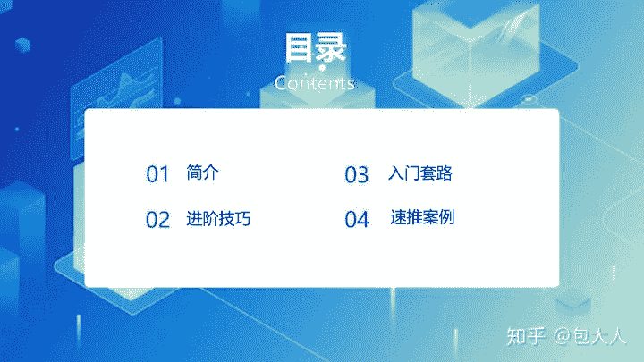</figure>

<figure></figure>

<figure></figure>

<figure>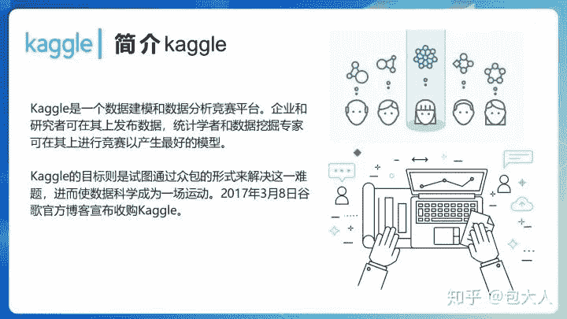</figure>

<figure></figure>

<figure>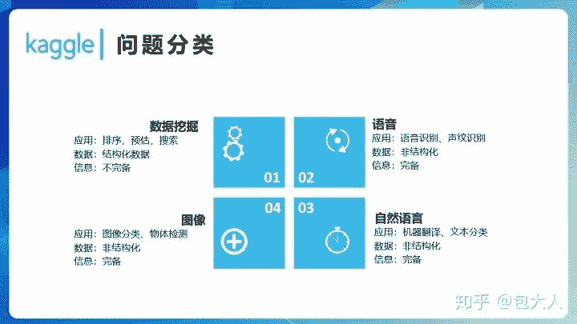</figure>

<figure>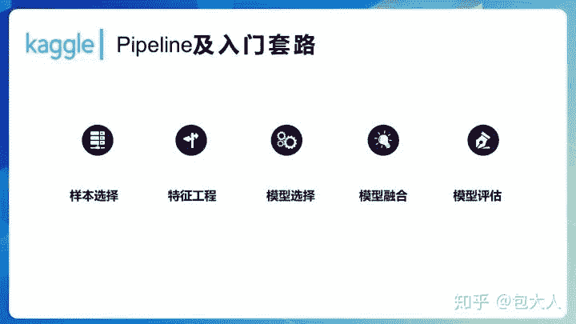</figure>

<figure>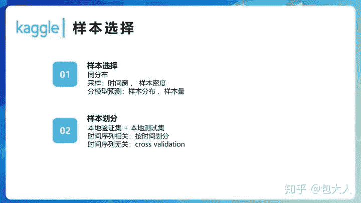</figure>

<figure>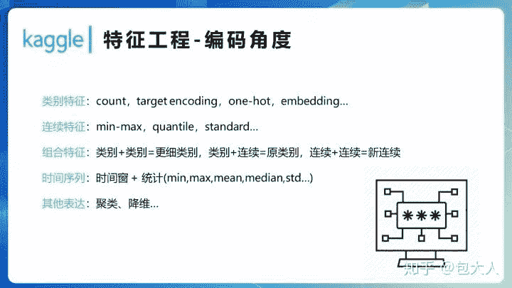</figure>

<figure>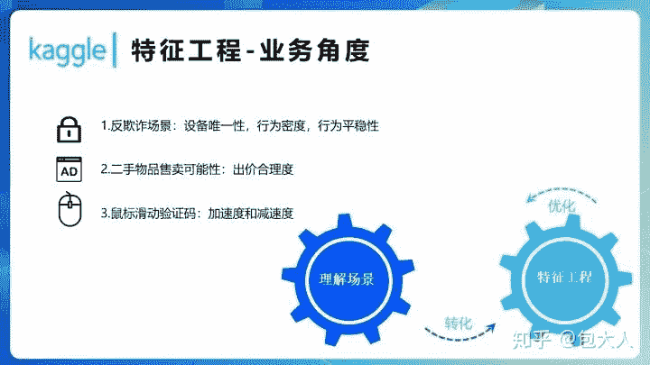</figure>

<figure>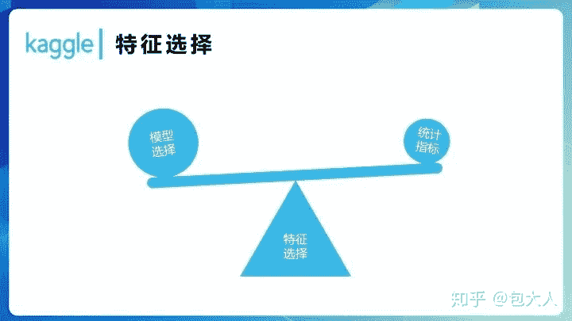</figure>

<figure>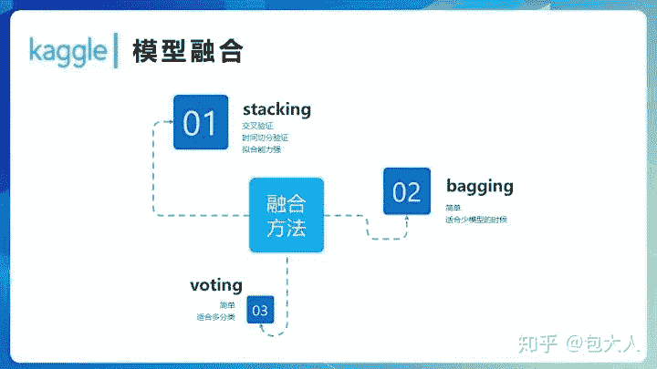</figure>

<figure></figure>

<figure>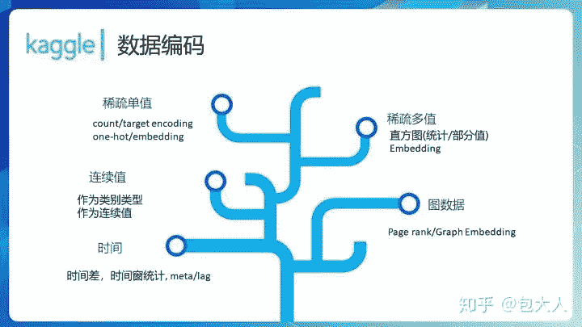</figure>

<figure>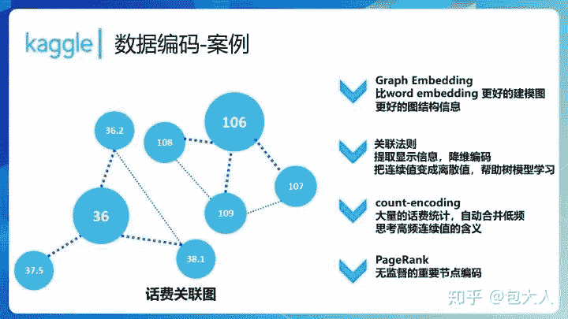</figure>

<figure></figure>

<figure>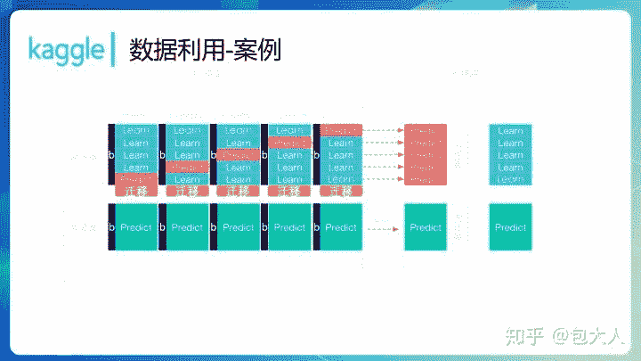</figure>

<figure>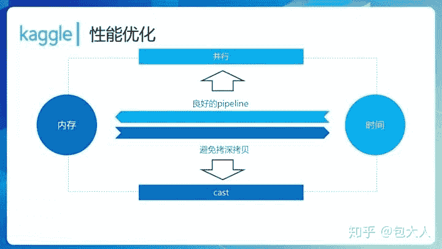</figure>

<figure>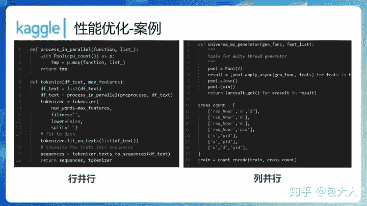</figure>

<figure>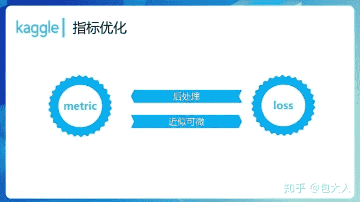</figure>

<figure>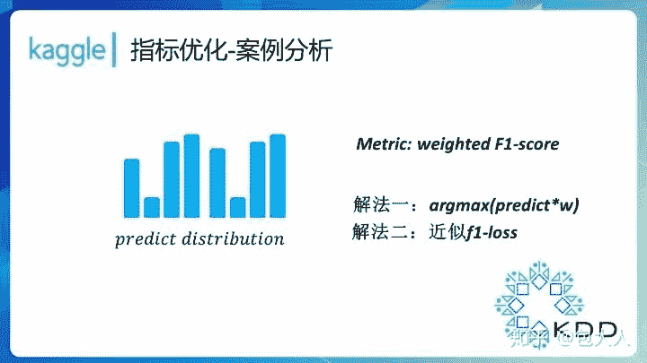</figure>

这个地方很有意思，KDD CUP 2019 仅仅用这一招就可以从第100名提升到第10名。

<figure></figure>

<figure>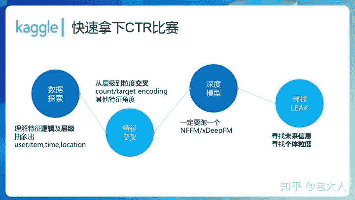</figure>

<figure>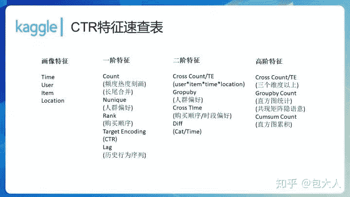</figure>

这个CTR特征速查表其实有好几页word，这里写了常用的一部分。

<figure>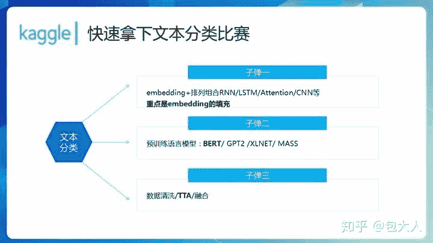</figure>

<figure>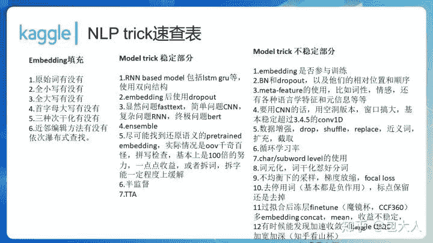</figure>

<figure></figure>

**  配套讲解视频**

**https://www.bilibili.com/video/av57480953/?p=2**

** 更多竞赛知识**

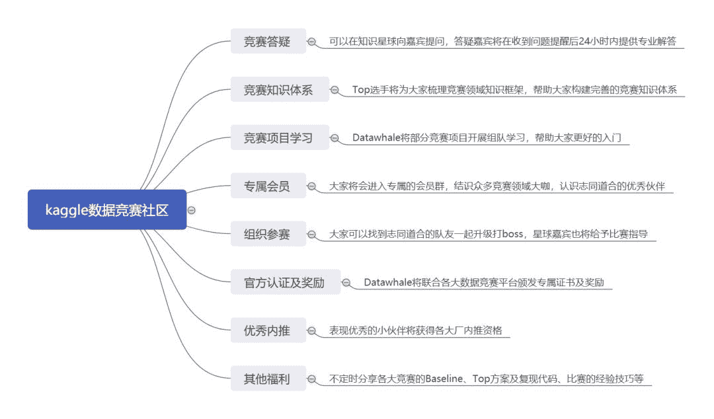

