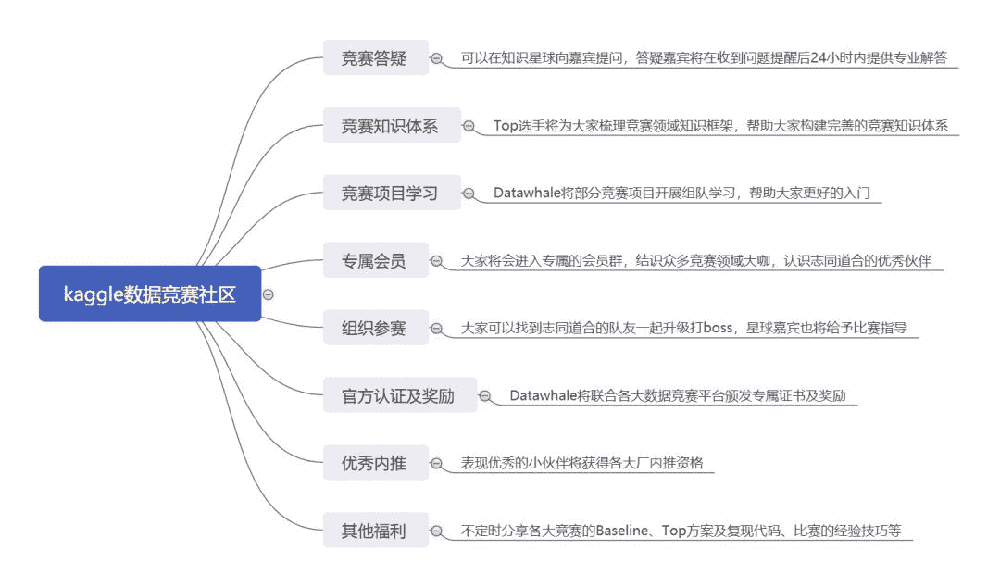

点击上方“**Datawhal****e**”，选择“星标”公众号

第一时间获取价值内容


为了帮助更多竞赛选手入门进阶比赛，通过数据竞赛提升理论实践能力和团队协作能力。DataFountain 和 Datawhale 联合邀请了数据挖掘，CV，NLP领域多位竞赛大咖，将从赛题理解、数据探索、数据预处理、特征工程、模型建立与参数调优、模型融合六个方面完整解析数据竞赛知识体系，帮助竞赛选手从0到1入门和进阶竞赛。

下面是大咖分享

???

数据挖掘方向


杰少 ID：尘沙杰少

简介：南京大学计算机系毕业，现任趋势科技资深算法工程师。20多次获得国内外数据竞赛奖项，包括KDD2019以及NIPS18 AutoML等。

进行数据预处理依赖的因素有很多，我个人认为数据预处理也可以分很多情况，最常见的可以分为下面三种情况：

第一种是最常见的也是都会进行的，**错误数据的处理**，这种数据很多可以直接通过EDA的方式就能发现，例如统计人的身高时，我们发现有的人的身高是10米，那这种很明显就是错误的数据；还有天池之前的医疗比赛，有些血压数据明显是仪器错误等造成的，而针对这些错误的数据，我们就需要对其进行清洗，删除或者将其当缺失值等；

第二种对数据预处理往往是**模型的原因**，例如我们采用线性类的模型，那么往往需要对类别特征进行特殊的处理，连续的值也往往需要进行简单的Normalize等，方便模型更好的吸收数据；这个在kaggle的Minist比赛中也很常见；如果我们用的是GBDT类的模型，例如LGB等，那么我们可能就需要考虑特征的相对大小等问题，而缺失值我们就不需要进行过多的处理等；

第三种是**方便特征的构建**等，我们需要对数据的结构进行某些变换，例如KDD19年的比赛，我们需要将结构性的文本类数据进行展开，这样不管是提取特征还是其他操作都会方便很多；还有时间序列类的问题，我们往往将数据进行pivot操作，将其展开为一行对应某个用户对应的历史消费等信息。


王贺 ID：鱼遇雨欲语与余

简介：武汉大学硕士，2019年腾讯广告算法大赛冠军选手，京东算法工程师，一年内获得两冠四亚一季的佳绩。

数据预处理主要内容包括数据清洗，数据集成，数据变换和数据规约。

**数据清洗**主要删除原始数据中的缺失数据，异常值，重复值，与分析目标无关的数据。

**处理缺失数据**

处理缺失数据处理缺失数据有三种方法，删除记录，数据插补和不处理。这里主要详细说明缺失值的删除。

**删除**

处理缺失值要事先知道数据缺失的原因，比如用户调查问卷里的缺失值是因为被调查者回答问题时漏掉了一个问题选项，那么这个缺失值就代表了该用户没有回答该问题，而信用卡激活日期的缺失，不能表明是丢失了信用卡的激活日期，按照系统的计算逻辑来看，凡是还没有激活的信用卡，其激活日期都记为缺失的，即NULL，还有的缺失是因为系统本身的计算错误造成的，比如某个字段除以零，某个负数取对数等错误的数学运算直接删除带有缺失值的某行数据，这种方法删除方法的好处就是删除后得数据都是完整的数据，不存在缺失数据，但是最大的不足之处就是如果缺失数据存在很大的比例，删除后会导致后面用于挖掘的数据过少，不足于进行有效的分析，其次直接删除可能会误删掉重要的信息。直接删除带有大量缺失值的变量，这种方法只针对那些缺失值占比超过20%或更多的变量，另外是否删除要结合其商业应用价值，比如删除信用卡未激活日期的这个变量，这个变量代表该用户属于未激活卡的用户群体，是带有一定商业价值的，那么如果删除会因此得不偿失。

**缺失值替换**

分类型变量：用众数或者一个新的类别去代替缺失值对于次序型变量和区间型变量而言，用中间值，众数，最大值，最小值，平均值，新定义的其他值来代替缺失值，这样做的好处在于简单直观，有依据，比如用众数代替，众数本身说明该值出现的几率最大。

**对缺失值进行赋值**

这种方法将通过例如回归模型，决策树模型，贝叶斯定理等去预测缺失值的最近替代值，也就是把缺失数据所对应的变量当做目标变量，把其他的输入变量当做自变量。为每个缺失值赋值的字段分别建立预测模型。从理论上看，该种方法最严谨，但是成本较高。是否采用该方法要与业务背景相结合。

**数据转换**由于原始数据，在此主要是指区间型变量的分布不光滑（或有噪声），不对称分布，也使得数据转化成为一种必需的技术手段数据转换主要分为以下四大类：

1. 产生新变量

2. 改善数据分布特征，主要针对不对称分布的转换

3. 区间型变量的分箱转换

4\. 数据标准化，主要是0,1均值化产生新变量：根据原始数据，通过数学公式推导，产生更加具有商业意义的新变量。

比如对用户的出生年月日进行处理，把当前的年月日减去用户出生年月日，得到一个**新的字段**’用户年龄’常用的衍生变量有：用户月均，年均消费金额和消费次数家庭人均年收入用户在线交易终止的次数占用户在线交易成功次数的比例用户下单付费的次数占用户下单次数的比例用户在制定商品类目的消费金额占其他全部消费金额的比例。

**改善数据分布特征**

通过取对数，开平方根，取倒数，开平方，取指数的方法使得不对称分布的数据呈现（或近似）正态分布，并形成倒钟形曲线。

**分箱转换**

分箱转换就是把区间型变量转换成次序型变量，转换目的如下：降低变量的复杂性，简化数据，比如一组用户的年龄，原始数据是区间型的，从20-80岁，每1岁的都是一个年龄段，如果通过分箱转换，每10岁构成一个年龄组，就可以有效简化数据，尤其是当自变量与因变量之间有比较明显的非线性关系时，分箱操作可用于探索和发现这些相关系性。

**数据的标准化**

数据标准化的目的就是将数据按照比例进行缩放，使之落入一个小的区间范围之内，使得不同的变量经过标准化处理后可以有平等分析和比较的基础。标准化转换主要俩种方式：

1.离差标准化

2.0-1均值化


林有夕 ID：林有夕

简介：2019 DCIC移动信用评估冠军/KDD CUP，全球Rank 2以及其他多个冠亚军。

数据预处理一般在伴随着数据探索，或者在数据探索之后进行，而处理方式因题而异。一般包括

**1\. 缺失值判断与填补**

第一种情况是数据种存在为**None的缺失值**，对于lightgbm和xgboost 而言，一般不需要处理，模型本身有一套机制去处理缺失值，具体原理见百度。但是对于NN或者lr 等模型而言，一般需要对缺失值进行填补，填补的本质是通过规则去做一个对缺失值的一个简单的预测。例如对数值特征取mean，对类别特征取mode等。同样如果已知缺失值和某些特征存在很强的关联，也可以做关联填充，例如，体重缺失的时候，使用身高^2 * 系数。的方法填充。同时，考虑到缺失值本身可能存在意义，也可以额外增加一列 isnull 特征，从而保留该信息。

第二种情况是数据中的缺失值已经**被填补为****固定值**。这里就要考虑该填充方式是否合理，例如体重0，身高0等。对于这种情况，也要分析好。模型是否可以很好的区分出这些缺失编码。如果不能。这种填充方式就有可能带来隐患。

第三种情况是数据中存在**各个版本的填充方式以及None值**。这种情况一般是由于版本迭代，导致的不同时期的数据的策略不同造成的。这时候就要做很多分析。因为不同编码的None值。其实带有很多的类别含义。比如版本，比如数据源等。

**2\. 数据质量分析**

数据质量分析的主要工作在于判断某些规则覆盖的样本的质量问题。例如：身高17800cm 是否合理？（单位错误）

例如：地图路径推荐场景下，用户发起请求，到点击反馈的时间差大于10min 是否合理？等等。

主要的处理流程包括，发现数据问题->分析原因->尝试修复如果无法合理的解释并修复，就可以考虑过滤该样本，或者对这批样本，做一个降低权重的处理（对lightgbm而言，见参数sample_weight）


王茂霖 ID：ML67

简介：华中科技大学研究生，DCIC-2019风电赛Top2选手。

**数据预处理：**

数据预处理应该是做模型里面很重要的一步，一个好的数据预处理能生成一个优质或者说良好的数据集，利于模型对于数据的利用。

**方法简述：**

数据预处理的方法也有很多，包括异常值识别，缺失值处理，字符类型编码，归一化，去噪，时间格式的预处理等等多个方面，以下一一来说明

**异常值识别：**

很多在真实情况下采集的数据并非一定完全正确的，有真实异常，也有可能存在记录异常等情况，比如电力负荷数据为负值，有固定取值范围，却在取值范围之外等。当然这些只是一些很简单能识别出来的异常值，还有比较难判断的异常值等，可以利用统计分布，3sigma原则等对于数据进行异常值识别，在识别出异常情况后分析对应是真实异常还是记录异常等。

**缺失值修复：**

缺失值的修复方法有多种，pandas中有用fillna函数可以调用，也可以自行设计修复算法。修复方式可以均值修复（连续分布），众数修复（离散分布），最小值修复，最大值修复，另一方向也可以利用KNN等算法，求解邻近样本，用邻近样本的对应值修复，所以缺失值修复是在不同问题下可以多种灵活选择的问题，但对应的后续结果也会有一定的差异性。

**字符类型编码：**

很多传统文本数据中，除了有数值类型的特征外，还有字符类型的特征，对于字符特征的利用在有些赛题中也很关键，当然这里的编码可能就有一些讲究了，比如年纪段的特征：’young’，’middle’，’old’这里我们直接把类别编码为 ‘young’->1，’middle’->2，’old’->3，还是做One-hot编码为’young’->[0,0,1]，’middle’->[0,1,0]，’old’->[1,0,0]，这就要看对于这个问题是只考虑类别，还是要考虑’young’ ‘middle’等不同年龄段的相对大小关系。

**归一化：**

归一化是为了消除不同特征之间不同量纲差异的一种方式，而归一化方式也有多种，比如0-1归一化，最大值归一化，也有做log特征分布调节等等，各种方式达到的效果也不同。

**去噪：**

部分比如电力负荷数据可能存在高频噪声，用傅里叶或者小波去噪有时会达到不错的效果。

**时间格式处理：**

时间特征维度在很多时序问题中是很关键的一个维度，可以和特征一起做很多有用的特征工程，表示数据时间的格式也有很多，比如时间戳，yyyymmdd，yy-mm-dd，可以转化为时间格式后进行很多灵活处理等等。


谢嘉元 ID：谢嘉嘉

简介：华南理工大学博士，多次数据挖掘竞赛中获得优异成绩。

数据预处理是数据挖掘任务中特别重要的一部分，数据预处理的部分在比赛中的重要性感觉会比较低，这是因为比赛中数据都是主办方已经初步处理过的。数据预处理环节还是需要认真做的，数据预处理的目的：**一是为了进一步提高数据的质量；二是为了让数据更好地适应特定的挖掘技术或工具。**

数据预处理我们主要放在EDA部分进行，对每个数据集的数据进行数据分析和异常值检测。如：年龄的数值出现>120部分；男女分类中出现其他等等。我们都需要将原始的数据进行清洗，这部分是为了提高数据的质量。

数据的预处理的另一个作用是让数据更好地适应特定的算法，比如说数据是否需要one-hot编码，数据的格式等等。


钟昌盛 ID：真我小兔子乖乖

简介：Kaggle: Elo Merchant Category Recommendation亚军、2019-kddcup top10、2018ccf电信套餐个性化匹配模型亚军。

实际数据的数据经常会受到噪声、缺失值和数据不一致的影响。为了消除数据比较“脏”的影响。

大家发明了各种数据预处理的方法：

数据清洗：剔除数据的噪声

数据集成：将各个数据合并在一起，保证数据的完整；

数据归约：将数据聚集，剔除相关性太多的特征；

数据变换：如将特征个归一化，剔除长尾分布等。

在数据清洗的时候：

**1\. 缺失值**

在我们经常填充缺失值的时候，我们会在使用Pandas会经常使用到fillna函数：

填充固定值：

```
data.fillna(0, inplace=True) # 填充 0
```

填充均值：

```
data.fillna(data.mean(),inplace=True) # 填充均值
```

填充中位数：

```
data.fillna(data.median(),inplace=True) # 填充中位数
```

填充众数：

```
data.fillna(data.mode(),inplace=True) # 填充众数
```

填充上下条数据：

```
data.fillna(method=’pad’, inplace=True) # 填充前一条数据的值，但是前一条也不一定有值	
data.fillna(0, inplace=True)	

data.fillna(method=’bfill’, inplace=True) # 填充后一条数据的值，但是后一条也不一定有值	
data.fillna(0, inplace=True)
```

填充 knn 数据

```
from fancyimpute import KNN	
data_x =pd.DataFrame(KNN(k=6).fit_transform(train_data_x), columns=features)
```

**2. 噪声数据**

剔除噪声在数据预处理当中也非常重要，在kaggle最近在比的ieee中，剔除噪声数据非常重要。对于模型预测非常重要

主要是因为被这些离群点大大降低了模型预测的泛化能力。

剔除噪声数据经常的方法为：1.分箱；2.回归

**3. 格式内容清洗**

这部分主要是将不符合模型预测的数据数据进行预处理：

如时间，日期，str格式的数据不能直接用户模型预测，需要将他们进行编码label encoder等

**4. 逻辑清洗**

逻辑清洗：

（1）去重

（2）删掉极端值

关于ieee 的部分tip 我放入了：https://www.kaggle.com/c/ieee-fraud-detection/discussion/103439#latest-598765

还有其他的预处理方式：https://www.kaggle.com/iasnobmatsu/xgb-model-with-feature-engineering

举例:

```
cols_to_drop=[‘V300’,’V309’,’V111’,’C3’,’V124’,’V106’,’V125’,’V315’,’V134’,’V102’,’V123’,’V316’,’V113’,	
‘V136’,’V305’,’V110’,’V299’,’V289’,’V286’,’V318’,’V103’,’V304’,’V116’,’V29’,’V284’,’V293’,	
‘V137’,’V295’,’V301’,’V104’,’V311’,’V115’,’V109’,’V119’,’V321’,’V114’,’V133’,’V122’,’V319’,	
‘V105’,’V112’,’V118’,’V117’,’V121’,’V108’,’V135’,’V320’,’V303’,’V297’,’V120’]	
print(‘{} features are going tobe dropped for being useless’.format(len(cols_to_drop)))	
train = train.drop(cols_to_drop, axis=1)	
test = test.drop(cols_to_drop, axis=1)
```

这是删除列的预处理；

```
a = np.zeros(train.shape[0])	
train[“lastest_browser”] = a	
a = np.zeros(test.shape[0])	
test[“lastest_browser”] = a	
def setbrowser(df):	
df.loc[df[“id_31”]==”samsung browser 7.0”,’lastest_browser’]=1	
df.loc[df[“id_31”]==”opera 53.0”,’lastest_browser’]=1	
df.loc[df[“id_31”]==”mobile safari 10.0”,’lastest_browser’]=1	
df.loc[df[“id_31”]==”google search application 49.0”,’lastest_browser’]=1	
df.loc[df[“id_31”]==”firefox 60.0”,’lastest_browser’]=1	
df.loc[df[“id_31”]==”edge 17.0”,’lastest_browser’]=1	
df.loc[df[“id_31”]==”chrome 69.0”,’lastest_browser’]=1	
df.loc[df[“id_31”]==”chrome 67.0 for android”,’lastest_browser’]=1	
df.loc[df[“id_31”]==”chrome 63.0 for android”,’lastest_browser’]=1	
df.loc[df[“id_31”]==”chrome 63.0 for ios”,’lastest_browser’]=1	
df.loc[df[“id_31”]==”chrome 64.0”,’lastest_browser’]=1	
df.loc[df[“id_31”]==”chrome 64.0 for android”,’lastest_browser’]=1	
df.loc[df[“id_31”]==”chrome 64.0 for ios”,’lastest_browser’]=1	
df.loc[df[“id_31”]==”chrome 65.0”,’lastest_browser’]=1	
df.loc[df[“id_31”]==”chrome 65.0 for android”,’lastest_browser’]=1	
df.loc[df[“id_31”]==”chrome 65.0 for ios”,’lastest_browser’]=1	
df.loc[df[“id_31”]==”chrome 66.0”,’lastest_browser’]=1	
df.loc[df[“id_31”]==”chrome 66.0 for android”,’lastest_browser’]=1	
df.loc[df[“id_31”]==”chrome 66.0 for ios”,’lastest_browser’]=1	
return df	
train=setbrowser(train)	
test=setbrowser(test) 
```

这是改值的预处理；

**Tips**: 在ieee 中，进一步的预处理还能上分，重点关注某些字段train和test 的区别，我们应该怎么改进。

CV方向


徐光福 ID：天灵灵地灵灵

简介：多次目标检测比赛第一、2018之江杯VQA比赛第二。

图像数据的预处理一般包括缩放、裁剪、翻转和旋转、模糊、色彩增强、随机噪声和遮挡、mixup、归一化等几个方面。

下面还是以以基于虚拟仿真环境下的自动驾驶交通标志识别https://www.datafountain.cn/competitions/339这个比赛为例，讲一下计算机视觉类比赛的数据预处理。

**缩放**

这个处理在图像比赛中一般都会用到，交通标志的比赛也不例外，即使没显式的调用resize语句，在detectron或者mmdetection中指定训练尺寸的时候，实际也是进行了resize的。它的一个最大的用处是进行多尺度训练和多尺度测试，看到这个你就知道它的重要性了，在图像类比赛中，就如同空气和水，重要到必不可少的时候，反而有时候被忽略了，实际上它仍无处不在。

**裁剪**

这个处理对也非常重要，如果能够裁剪的话，通常都会起到非常好的效果。对于交通标志这个比赛裁剪简直可以称得上取胜关键之一了。裁剪可以很大的增加样本的多样性，通常效果都比较明显，而且一个优点是起副作用的时候非常少，不像色彩方面的增强，有的时候基本不起作用，甚至有反作用。

下面是交通标志比赛中在线随机裁剪的主要代码，可能写的比较乱，见谅。

```
ori_h,ori_w,_=img.shape	
x_min=np.min(boxes[:,0])	
y_min=np.min(boxes[:,1])	
x_max=np.max(boxes[:,2])	
y_max=np.max(boxes[:,3])	
x_rand_range_min=x_max-self.long_size ifx_max-self.long_size&gt;0 else 0	
x_rand_range_max=x_min ifx_min&lt;=ori_w-self.long_size else ori_w-self.long_size	
y_rand_range_min=y_max-self.short_size ify_max-self.short_size&gt;0 else 0	
y_rand_range_max=y_min ify_min&lt;=ori_h-self.short_size else ori_h-self.short_size	
crop_x=x_rand_range_min ifx_rand_range_min&gt;=x_rand_range_max elsenp.random.randint(x_rand_range_min,x_rand_range_max)	
crop_y=y_rand_range_min ify_rand_range_min&gt;=y_rand_range_max elsenp.random.randint(y_rand_range_min,y_rand_range_max)	
crop_image=img[crop_y:crop_y+self.short_size,crop_x:crop_x+self.long_size,:]	
boxes -= np.tile((crop_x, crop_y), 2)
```

其中self.short_size、self.short_size为裁剪后的尺寸。

**翻转和旋转**

翻转一般来说包括水平翻转、垂直翻转，其中水平翻转在detectron、mmdetection等框架都内置了实现，直接设置即可，垂直翻转参照水平翻转的实现，实现起来也很简单。另外交换xy轴（img=img.swapaxes(0,1)）也可以算是翻转的一种。

旋转在目标检测比赛中常用的是旋转90度、180度、270度，因为这几个角度的旋转可以保持bbox的大小不变，而旋转随机角度会引起bbox大小的变化，所以在目标检测中并不常用，当然如果有目标的mask信息的话，也是可以使用随机角度的旋转的。

回到交通标志检测这个比赛，在这个比赛中我并没有使用翻转和旋转，因为检测目标中包含有左侧行驶、右侧行驶这类左右对称的目标，所以不能使用默认的左右翻转了，其它的翻转和旋转也存在类似的问题。不过如果自己加上一些特殊的处理的话，这个比赛也是可以使用的，就是在翻转的同时，相应的改一下目标的类别。

**模糊**

有时在测试集中会包含有一些比较模糊的图片，遇到这种情况，为了能让模型更好的识别，可以在训练的时候对一定比例的图片使用高斯模糊，高斯模糊在一定程度上也可以丰富样本的多样性，当然效果如何还得通过实际测试，在交通标志的比赛中并未使用。

**颜色增强**

颜色增强一般包括亮度、对比度、饱和度、颜色通道的随机调整，不过颜色增强在目标检测中通常起到的作用并不大，所以还是需要根据实际情况选用。在交通标志的比赛中并未使用图像颜色增强。

**Mixup**

关于mixup的内容大家可以参考相关论文和代码实现。个人觉得这是一种非常好的数据增强方式，而且使用起来也可以很灵活，比如可以只mixup不带目标的背景，这样目标处理起来就比较简单，有时一样也可以起到不错的效果；扩展开来的话，向背景里粘贴目标什么的也可以算是mixup的一种延申吧。

**归一化**

这个其实没什么好说的，总之如果是自己写代码话别忘了加上就行了，如果使用已有的框架的话就不用操心了，一般不会少的。

以上只是一些通常的数据预处理和增强，实际上还是需要根据赛题的特点做一些针对性的处理和增强，这就需要大家充分发挥自己的聪明才智了。


王博 ID：000wangbo

简介：西安电子科技大学研究生，一个不断在CV道路上探索的小白。

在比赛中，我们得到的数据会存在有缺失值、重复值等，在使用之前需要进行数据预处理。数据预处理没有标准的流程，通常针对不同的任务和数据集属性的不同而不同。数据预处理的常用流程为：读数据、看分布、查关联、找异常、填空值、转非数。

**1\. 查看Label分布**


对长尾分布数据取log

**2\. 观察关联**


绘制热力图，观察各个数值属性与Label的关联度，去除关联程度非常低的属性。越是白色越是关联紧密，可以观察Label跟哪些属性关联更紧密

**3\. 去除异常点**


通过2找到和Label相关性最强的特征，绘制散点图以及箱型图剔除异常点。不过具体问题需要具体分析，有的异常出现可能是因为Label标注问题，可以抢救的不剔除。

**4\. 填空数**

可以直接用中位数和众数填充，也可以通过KNN用邻近样本的数据均值填充，具体问题需要具体分析，个人认为主要是看业务规则。

**5\. 转非数**

大多数数据中不仅仅只有数字类型特征，还具有很多的字符特征。我的习惯是先用value_counts看下出现的字符串，如果有“无”、“没有”这类的字符串我会归成一类；最终选择Labelencoder还是One-hot 要具体问题具体分析。

NLP方向


张浩 ID：reborn_ZH

简介：CCF2018供应链需求预测亚军、2019搜狐内容识别算法大赛季军。

‍‍文本预处理方法有很多，比如**文本去噪、分词、停用词去除、同义词替换、词性识别**等等，具体采用哪些方法需要根据特定的任务来定，接下来我具体说说前面提到的2019搜狐内容识别算法大赛中涉及到的一些文本预处理操作。

1\. 数据清洗数据清洗可以减少数据的噪声，从而有利于分析数据以及帮助模型训练。数据清洗规则：大写英文字母转为小写英文字母，去除网页链接，去除@人名，繁体词转换

2\. 分词使用jieba进行分词，并且对词典进行了扩充，添加了THUOCL清华大学开放中文词库、大连理工情感词汇本体库和中文维基百科词条信息库等词典。

3\. 文本截取首先把新闻标题与新闻内容拼接在一起，然后进行文本序列化操作，最后对文本进行截取，保证每个文本的长度为400。‍‍

** 更多竞赛知识**



Datawhale和杰少，鱼佬等竞赛大咖一起成立了数据竞赛知识星球社区，并且邀请了国内很多知名实战高手和赛圈的大佬，在推出的三天中已经有**6**00****多的用户报名，如果你**真的对数据竞赛感兴趣而且希望一起学习进阶的话**，可以通过扫描下面的二维码进行报名，前1千人可以享有特惠129，每天不到4角钱，目前还有400左右的名额。


对于每个报名的会员，我们希望您能做到：

1.  **好好学习，真心想学点东西；**

2.  **礼貌的向大佬请教，如果大佬回答您的问题了，希望您能在后面说一句谢谢；如果没人回答，可能大家不一定会，您如果哪天会了，也可以分享给大家；**

3.  **希望在会员群不要讨论与学习或者机器学习实战，竞赛等无关的题材，包括政治，个人情感生活等琐碎的事宜，前两次会有人提醒，第三次我们将直接将您移出群；**

4.  **如果您成长了，也希望您今后可以帮助其他人。**

