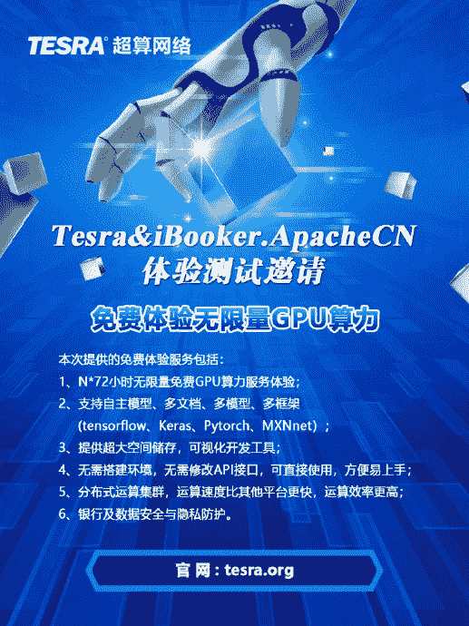

> Tesra 超算网络是由 SAIC 基金会发起的，专为人工智能产业提供底层技术及 AI 资源共享服务的分布式"超算中心"。Tesra 超算网络基于 GPU 并行计算技术，通过整合全球分散的 GPU 算力资源，在建设人工智能基础设施的同时，为全球 AI 开发者提供共享算力、分布式数据存储、AI 应用开发平台等生态服务。未来，Tesra 超算网络将链接全球 AI 开发者社区，共同构建人工智能超级大脑。

本次提供的兔费体验服务包括：

1.  N*72 小时无限量免费 GPU 算力服务体验
2.  支持自主模型、多文档、多模型、多框架（tensorflow、Keras、Pytorch、Mxnnet）
3.  提供超大空间储存，可视化开发工具
4.  无需搭建环境，无需修改 API 接口，可直接使用，方便易上手
5.  分布式运算集群，运算速度比其他平台更快，运算效率更高
6.  银行及数据安全与隐私防护

## 负责人

*   一极：2533524298

## 领取方式

1.  在官网 [tesra.org](https://www.tesra.org) 注册。
2.  [在这里登记用户 ID](https://docs.qq.com/sheet/DSXl0SkdaSndMY1l4?tdsourcetag=s_qq_aiomsg&preview_token=&t=1565357116843&coord=A1A0A0&tab=BB08J2)。
3.  等待我们发放算力激活码。领取到的算力 72 小时无限使用，用完后请重新申请使用。