点击上方“**Datawhal****e**”，选择“星标”公众号

第一时间获取价值内容


少年，你渴望力量么？

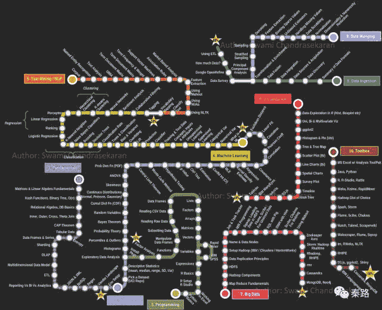

这才是真正的力量，年轻人！

这是Swami Chandrasekaran所绘制的一张地图。名字叫MetroMap to Data Scientist（数据科学家之路），别称怎么死都不知道的。

数据科学家是近年火爆兴起的职位，它是数据分析师的后续进阶，融合了统计、业务、编程、机器学习、数据工程的复合型职位。

该地图一共十条路线，分别是基础原理、统计学、编程能力、机器学习、文本挖掘／自然语言处理、数据可视化、大数据、数据获取、数据清理、常用工具。条条路线都不是人走的。因为网上只有英文版，我将其翻译成中文，并对内容作一些解释和补充。

该指南主要涉及硬技能，数据科学家的另外一个核心业务能力，这里没有涉及，它并不代表不重要。

——————
**Fundamentals原理**
算是多学科的交叉基础，属于数据科学家的必备素质。

**Matrices & Linear Algebra**
矩阵和线性代数

**矩阵（Matrix）**是一个按照长方阵列排列的复数或实数集合。涉及到的机器学习应用有SVD、PCA、最小二乘法、共轭梯度法等。

**线性代数**是研究向量、向量空间、线性变换等内容的数学分支。向量是线性代数最基本的内容。中学时，数学书告诉我们向量是空间（通常是二维的坐标系）中的一个箭头，它有方向和数值。在数据科学家眼中，向量是有序的数字列表。线性代数是围绕向量加法和乘法展开的。

矩阵和线性代数有什么关系呢？当向量进行线性变换时，这种变换可以想象成几何意义上的线性挤压和拉扯，而矩阵则是描述这种变换的信息，由变换后的基向量决定。

矩阵和线性代数是一体的，矩阵是描述线性代数的参数。它们构成了机器学习的庞大基石。

**Hash Functions,Binary Tree,O(n)**

哈希函数，二叉树，时间复杂度

**哈希函数**也叫散列函数，它能将任意的数据作为输入，然后输出固定长度的数据，这个数据 叫哈希值也叫散列值，用h表示，此时h就输入数据的指纹。

哈希函数有一个基本特性，如果两个哈希值不相同，那么它的输入也肯定不相同。反过来，如果两个哈希值是相同的，那么输入值可能相同，也可能不相同，故无法通过哈希值来判断输入。

哈希函数常用在数据结构、密码学中。

**二叉树**是计算机科学的一个概念，它是一种树形结构。在这个结构中，每个节点最多有两个子树（左子树和右子树），子树次序不能颠倒。二叉树又有多种形态。

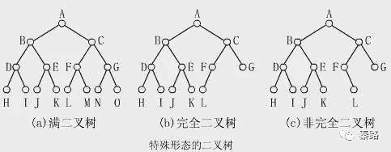

二叉树是树这类数据结构的第一种树，后续还有红黑树等，很多语言的set，map都是用二叉树写的。

**时间复杂度**是编程中的一个概念，它描述了执行算法需要的时间。不同算法有不同的时间复杂度，例如快排、冒泡等。

简便的计算方法是看有几个for循环，一个是O(n)，两个是O(n^2)，三个是O(n^3)。当复杂度是n^3+n^2时，则取最大的量级n^3即可。

与之相对应的还有空间复杂度，它代表的是算法占用的内存空间。算法通常要在时间和内存中取得一个平衡，既内存换时间，或者时间换内存。

**Relational Algebra**

关系代数

它是一种抽象的查询语言。基本的代数运算有选择、投影、集合并、集合差、笛卡尔积和更名。

关系型数据库就是以关系代数为基础。在SQL语言中都能找到关系代数相应的计算。

**Inner、Outer、Cross、Theta Join**

内连接、外连接、交叉连接、θ连接

这是关系模型中的概念，也是数据库的查询基础。

内连接，只连接匹配的行，又叫等值连接。

外连接，连接左右两表所有行，不论它们是否匹配。

交叉连接是对两个数据集所有行进行笛卡尔积运算，比如一幅扑克牌，其中有A集，是13个牌的点数集合，集合B则是4个花色的集合，集合A和集合B的交叉链接就是4*13共52个。

θ连接使用where子句引入连接条件，θ连接可以视作交叉连接的一个特殊情况。where 可以是等值，也可以是非等值如大于小于。

不同数据库的join方式会有差异。

**CAP Theorem**

CAP定理

指的是在一个分布式系统中， Consistency（一致性）、 Availability（可用性）、Partition tolerance（分区容错性），三者不可得兼。

一致性（C）：在分布式系统中的所有数据备份，在同一时刻是否同样的值。（等同于所有节点访问同一份最新的数据副本）

可用性（A）：在集群中一部分节点故障后，集群整体是否还能响应客户端的读写请求。（对数据更新具备高可用性）

分区容错性（P）：以实际效果而言，分区相当于对通信的时限要求。系统如果不能在时限内达成数据一致性，就意味着发生了分区的情况，必须就当前操作在C和A之间做出选择。

数据系统设计必须在三个性能方便做出取舍，不同的数据库，CAP倾向性不同。

**tabular data**

列表数据

即二维的表格数据，关系型数据库的基础。

**DataFrames & Series**

Pandas数据结构

Series是一个一维数据对象，由一组NumPy的array和一组与之相关的索引组成。Python字典和数组都能转换成数组。Series以0为开始，步长为1作为索引。

> ```
> x = Series([1,2,3,4,5])
> 
> x
> 0 1
> 1 2
> 2 3
> 3 4
> 4 5
> ```

DataFrames是一个表格型的数据，是Series的多维表现。DataFrames即有行索引也有列索引，可以看作Series组成的字典。

**Sharding**

分片

分片不是一种特定的功能或者工具，而是技术细节上的抽象处理，是水平拓展的解决方法。一般数据库遇到性能瓶颈，采用的是Scale Up，即向上增加性能的方法，但单个机器总有上限，于是水平拓展应运而生。

分片是从分区(Partition)的思想而来，分区通常针对表和索引，而分片可以跨域数据库和物理假期。比如我们将中国划分南北方，南方用户放在一个服务器上，北方用户放在另一个服务器上。

实际形式上，每一个分片都包含数据库的一部分，可以是多个表的内容也可以是多个实例的内容。当需要查询时，则去需要查询内容所在的分片服务器上查询。它是集群，但不同于Hadoop的MR。

如果能够保证数据量很难超过现有数据库服务器的物理承载量，那么只需利用MySQL5.1提供的分区(Partition)功能来改善数据库性能即可；否则，还是考虑应用Sharding理念。另外一个流传甚广的观点是：我们的数据也许没有那么大，Hadoop不是必需的，用sharding即可。

**OLAP**

联机分析处理（Online Analytical Processing）

它是数据仓库系统主要的应用，主要用于复杂的分析操作。

针对数据分析人员，数据是多维数据。查询均是涉及到多表的复杂关联查询，为了支持数据业务系统的搭建，OLAP可以想象成一个多维度的立方体，以维度（Dimension）和度量（Measure）为基本概念。我们用到的多维分析就是OLAP的具象化应用。

OLAP更偏向于传统企业，互联网企业会灵活变动一些。另外还有一个OLTP的概念。

**Multidimensional Data Model**

多维数据模型。

它是OLAP处理生成后的数据立方体。它提供了最直观观察数据的方法。

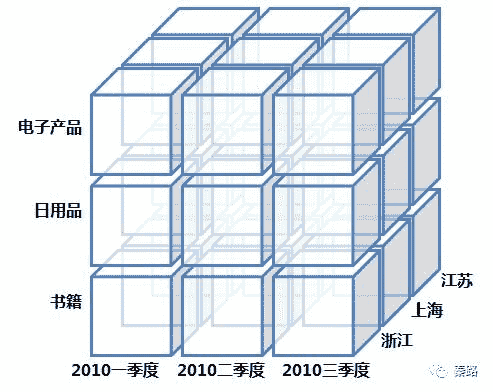

涉及钻取，上卷，切片，切块，旋转等操作，就是把上面的立方体变变变啦。

**ETL**

ETL是抽取（extract）、转换（transform）、加载（load）的过程。常用在数据仓库。

整个流程是从数据源抽取数据，结果数据清洗和转换，最终将数据以特定模型加载到数据仓库中去。

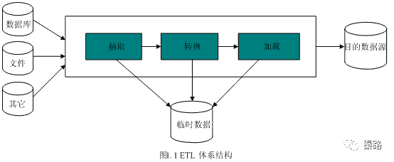

ETL是一个古老的概念，在以前SQL数据仓库时代和OLAP伴随而生，在现在日新月异的技术生态圈，会逐步演进到Hadoop相关的技术了。

**Reporting vs BI vs Analytics**

报表与商业智能与分析

这是BI的三个组成部分。Reporting是数据报表。利用表格和图表呈现数据。报表通常是动态多样的。数个报表的集合统称为Dashboard。

BI是商业智能，是对企业的数据进行有效整合，通过数据报表快速作出决策。

Analytics是数据分析，基于数据报表作出分析。包括趋势的波动，维度的对比等。

**JSON & XML**

JSON是一种轻量级的数据交换格式，易于阅读和编写，也易于机器解析和生成。

JSON的语法规则是：

*   { }保存对象；

*   [ ]保存数组；

*   数据由逗号分隔；

*   数据在键值对中；

下面范例就是一组JSON值

> ```
> {
>   "firstName": "John",
>   "lastName": "Smith",
>   "age": 25,
>   "address": {
>     "streetAddress": "21 2nd Street",
>     "city": "New York",
>     "state": "NY",
>     "postalCode": "10021"
>   }
> }
> ```

XML是可拓展标记语言，被设计用来传输和存储数据，与之对应的HTML则是显示数据。XML和HTML服务于不同目的，XML是不作为的。

> ```
> <note>
> <to>George</to>
> <from>John</from>
> <heading>Reminder</heading>
> <body>Don't forget the meeting!</body>
> </note>
> ```

上面的范例，纯粹就是用来传输的一段信息，没有任何意义。

**NoSQL**

泛指非关系型的数据库，意为Not Only SQL。

NoSQL是随着大数据时代发展起来的，传统的关系数据库在高并发大规模多数据类型的环境下力不从心，而NoSQL就是为了解决这些问题而产生的。

NoSQL主要分为四大类：

**键值KeyValue数据库**

这类数据库会使用哈希表，哈希表中有一个特定的键指向一个特定的值，KeyValue的特点是去中心化，不涉及业务关系。代表Redis。

**列数据库**

这类数据库用于分布式海量存储，和KeyValue的区别在于这里的Key指向的是列。横向拓展性好，适合大数据量高IO。代表HBase，Cassandra

**文档型数据库**

属于KeyValue数据库的升级版，允许嵌套键值。文档是处理信息的基本单位，一个文档等于一个关系数据库的一条记录。

因为文档的自由性，文档型数据库适合复杂、松散、无结构或半结构化的数据模型，和JSON类似，叫做BSON（MongoDB的存储格式）。代表MongoDB

**图形数据库**

基于图论算法的数据库，将数据集以图形元素（点、线、面）建立起来。这种数据库常应用在社交网络关系链，N度关系等。代表Neo4j

**Regex**

正则表达式（Regular Expression）

正则表通常被用来检索、替换那些符合某个模式(规则)的字符串。通过特定字符的组合，对字符串进行逻辑过滤。例如注册账号时检查对方邮件格式对不对啊，手机号格式对不对啊。

学起来靠记，记了也会忘，每次用得查，查了还得检验。网上记忆口诀一堆图表，相关网站也不少，仁者见仁了。

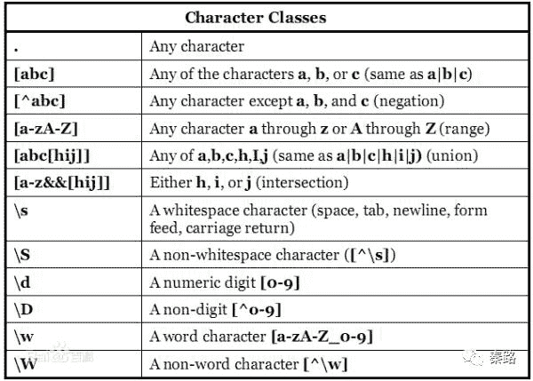

**Vendor Landscape**

不懂，供应商风景？

**Env Setup**

环境安装

想了半天，Env应该是环境安装的意思，IDE啊，GUI啊等等全部安装上去，再调各种路径啥的。针对数据科学家，Anaconda + Rstudio用的比较多。

——————

**Statistics 统计**

统计是数据科学家的核心能力之一，机器学习就是基于统计学原理的，我不算精通这一块，许多内容都是网络教科书式的语言。都掌握后再重写一遍。

**Pick a Dataset(UCI Repo)**

找数据（UCI数据集）

UCI数据库是加州大学欧文分校(University of CaliforniaIrvine)提出的用于机器学习的数据库，这个数据库目前共有335个数据集，其数目还在不断增加，可以拿来玩机器学习。网上搜的到。另外的数据来源是Kaggle竞赛等。

最经典的数据莫过于Iris了。

**Descriptive Statistics（mean, median, range, SD, Var）**

描述性统计（均值，中位数，极差，标准差，方差）

均值也叫平均数，是统计学中的概念。小学学习的算数平均数是其中的一种均值，除此以外还有众数和中位数。

中位数可以避免极端值，在数据呈现偏态的情况下会使用。

极差就是最大值减最小值。

标准差，也叫做均方差。现实意义是表述各数据偏离真实值的情况，反映的是一组数据的离散程度。平均数相同的两组数据，如[1,9]和[4,6]，平均数相同，标准差不一样，前者的离散程度更大。

方差，是标准差的平方。方差和标准差的量纲是一致的。在实际使用过程中，标准差需要比方差多一步开平方的运算，但它在描述现实意义上更贴切，各有优劣。

**Exploratory Data Analysis**

探索性数据分析

获得一组数据集时，通常分析师需要掌握数据的大体情况，此时就要用到探索性数据分析。

主要是两类：

1.  图形法，通过直方图、箱线图、茎叶图、散点图快速汇总描述数据。

2.  数值法：观察数据的分布形态，包括中位数、极值、均值等，观察多变量之间的关系。

探索性数据分析不会涉及到复杂运算，而是通过简单的方式对数据有一个大概的了解，然后才去深入挖掘数据价值，在Python和R中，都有相关的summary函数。

**Histograms**

直方图

它又称质量分布图，是一种表示数据分布的统计报告图。

近似图表中的条形图，不过直方图的条形是连续排列，没有间隔、因为分组数据具有连续性，不能放开。

正常的直方图是中间高、两边低、左右近似对称。而异常型的直方图种类过多，不同的异常代表不同的可能情况。

**Percentiles & Outliers**

百分位数和极值

它们是描述性统计的元素。

百分位数指将一组数据从小到大排序，并计算相遇的累积百分值，某一百分位所对应数据的值就称为这一百分位的百分位数。比如1～100的数组中，25代表25分位，60代表60分位。

我们常将百分位数均匀四等分：第25百分位数，叫做第一四分位数；第50百分位数，称第二四分位数，也叫中位数；第75百分位数，叫做第三四分位数。通过四分位数能够简单快速的衡量一组数据的分布。它们构成了箱线图的指标。

极值是最大值和最小值，也是第一百分位数和第一百百分位数。

百分位数和极值可以用来描绘箱线图。

**Probability Theory**

概率论，统计学的核心之一，主要研究随机现象发生的可能性。

**Bayes Theorem**

贝叶斯定理

它关于随机事件A和B的条件概率的定理。

现实世界有很多通过某些信息推断出其他信息的推理和决策，比如看到天暗了、蜻蜓低飞了，那么就表示有可能下雨。这组关系被称为条件概率：用P(A|B)表示在B发生的情况下A发生的可能性。

贝叶斯公式：P(B|A) = P(A|B)*P(B) / P(A)

现实生活中最经典的例子就是疾病检测，如果某种疾病的发病率为千分之一。现在有一种试纸，它在患者得病的情况下，有99%的准确判断患者得病，在患者没有得病的情况下，有5%的可能误判患者得病。现在试纸说一个患者得了病，那么患者真的得病的概率是多少？

从我们的直觉看，是不是患者得病的概率很大，有80%？90%？实际上，患者得病的概率只有1.9%。关键在哪里？一个是疾病的发病率过低，一个是5%的误判率太高，导致大多数没有得病的人被误判。这就是贝叶斯定理的作用，用数学，而不是直觉做判断。

最经典的应用莫过于垃圾邮件的过滤。

**Random Variables**

随机变量

表示随机试验各种结果的实际值。比如天气下雨的降水量，比如某一时间段商城的客流量。

随机变量是规律的反应，扔一枚硬币，既有可能正面、也有可能反面，两者的概率都是50%。扔骰子，结果是1～6之间的任何一个，概率也是六分之一。虽然做一次试验，结果肯定是不确定性的，但是概率是一定的。随机变量是概率的基石。

**Cumul Dist Fn(CDF)**

累计分布函数（Cumulative Distribution Function）

它是概率密度函数的积分，能够完整描述一个实数随机变量X的概率分布。直观看，累积分布函数是概率密度函数曲线下的面积。

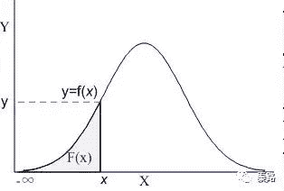

上图阴影部分就是一个标准的累积分布函数F(x)，给定任意值x，计算小于x的概率为多大。实际工作中不会涉及CDF的计算，都是计算机负责的。记得在我大学考试，也是专门查表的。

现实生活中，我们描述的很多概率都是累积分布函数，我们说考试90分以上的概率有95%，实际是90分～100分所有的概率求和为95%。

**Continuos Distributions(Normal, Poisson, Gaussian)**

连续分布（正态、泊松、高斯）

分布有两种，离散分布和连续分布。连续分布是随机变量在区间内能够取任意数值。

正态分布是统计学中最重要的分布之一，它的形状呈钟型，两头低，中间高，左右对称。

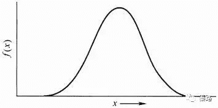

正态分布有两个参数，期望μ和标准差σ：μ反应了正态分布的集中趋势位置，σ反应了离散程度，σ越大，曲线越扁平，σ越小，曲线越窄高。

自然届中大量的现象都按正态形式分布，标准正态分布则是正态分布的一种，平均数为0，标准差为1。应用中，都会将正态分布先转换成标准正态分布进行计算。很多统计学方法，都会要求数据符合正态分布才能计算。

泊松分布是离散概率分布。适合描述某个随机事件在单位时间／距离／面积等出现的次数。当n出现的次数足够多时，泊松分布可以看作正态分布。


高斯分布就是正态分布。

**Skewness**

偏度

它是数据分布倾斜方向和程度的度量，当数据非对称时，需要用到偏度。

正态分布的偏度为0，当偏度为负时，数据分布往左偏离，叫做负偏离，也称左偏态。反之叫右偏态。

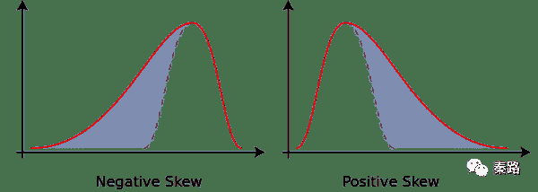

**ANOVA**

方差分析

用于多个变量的显著性检验。基本思想是：通过分析研究不同来源的变异对总变异的贡献大小，从而确定可控因素对研究结果影响力的大小。

方差分析属于回归分析的特例。方差分析用于检验所有变量的显著性，而回归分析通常针对单个变量的。

**Prob Den Fn(PDF)**

概率密度函数

PDF是用来描述连续型随机变量的输出值。概率密度函数应该和分布函数一起看:

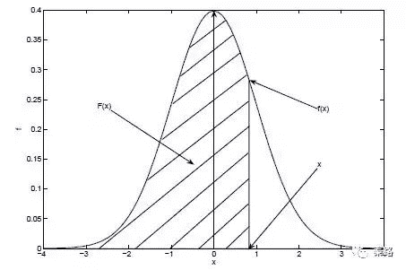

蓝色曲线是概率密度函数，阴影部分是累积分布函数。我们用概率密度函数在某一区间上的积分来刻画随机变量落在这个区间中的概率。概率等于区间乘概率密度，累积分布等于所有概率的累加。

概率密度函数：f(x) = P(X=x)

累积分布函数：F(x) = P(X<=x)

概率密度函数是累积分布函数的导数，现有分布函数，才有密度函数。累积分布函数即可以离散也可以连续，而密度函数是用在连续分布中的。

**Central Limit THeorem**

中心极限定理

它是概率论中最重要的一类定理。

自然届中很多随机变量都服从正态分布，中心极限定理就是理解和解释这些随机变量的。我们有一个总体样本，从中取样本量为n的样本，这个样本有一个均值，当我们重复取了m次时，对应有m个均值，如果我们把数据分布画出来，得到的结果近似正态分布。

这就是中心极限定理，它神奇的地方就在于不管总体是什么分布。我们很多推导都是基于中心极限定理的。

**Monte Carlo Method**

蒙特卡罗方法

它是使用随机数来解决计算问题的方法。

蒙特卡罗是一个大赌场，以它命名，含义近似于随机。我们有时候会因为各种限制而无法使用确定性的方法，此时我们只能随机模拟，用通过概率实验所求的概率来估计我们感兴趣的一个量。最知名的例子有布丰投针试验。

18世纪，布丰提出以下问题：设我们有一个以平行且等距木纹铺成的地板，木纹间距为a，现在随意抛一支长度l比木纹之间距离a小的针，求针和其中一条木纹相交的概率。布丰计算出来了概率为p = 2l/πa。

为了计算圆周率，人们纷纷投针，以实际的试验结果来计算。

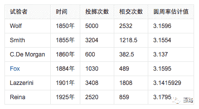

下图则是计算机模拟的结果

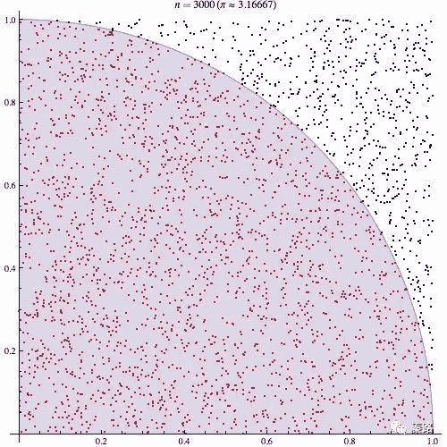

这就是蒙特卡罗方法的实际应用。它的理论依据是大数定理和中心极限定理。

**Hypothesis Testing**

假设检验

它是根据一定的假设条件由样本推断总体的方法。

首先根据实际问题作出一个假设，记作H0，相反的假设称为备择假设。它的核心思想是小概率反证法，如果这个假设发生的概率太小以至于不可能发生，结果它发生了，那么我们认为假设是不成立的。

假设检验是需要容忍的，因为样本会存在波动，这个波动范围不会太严格，在这个范围内出现的事件我们都能接受。但是我们都这么容忍了，还是出现了违背原假设的小概率事件，那么说明原假设有问题。不能容忍的范围即拒绝域，在拒绝域发生的概率我们都认为它是小概率事件。

假设检验容易犯两类错误，第一类错误是真实情况为h0成立，但判断h0不成立，犯了“以真为假”的错误。第二类错误是h0实际不成立，但判断它成立，犯了“以假为真”的错误。

假设检验有U检验、T检验、F检验等方法。

**p-Value**

P值

它是进行假设检验判定的一个参数。当原假设为真时样本观察结果（或更极端结果）出现的概率。P值很小，说明原假设发生的概率很小，但它确实发生了，那么我们就有理由拒绝原假设。

至于P值的选择根据具体情况，一般是1%，5%几个档次。

然而，P值在统计学上争议很大，P值是否是接受原假设的标准，都是统计学各种流派混合后的观点。P值从来没有被证明可以用来接收某个假设（所以我上文的说明并不严谨），它只是仅供参考。现在统计学家们也开始倡导：应该给出置信区间和统计功效，实际的行动判读还是留给人吧。

**Chi2 Test**

卡方检验

Chi读作卡。通常用作独立性检验和拟合优度检验。

卡方检验基于卡方分布。检验的假设是观察频数与期望频数没有差别。

独立性检验：卡方分布的一个重要应用是基于样本数据判断两个变量的独立性。独立性检验使用列联表格式，因此也被称为列联表检验。原假设中，列变量与行变量独立，通过每个单元格的期望频数检验统计量。

拟合优度检验：它依据总体分布状况，计算出分类变量中各类别的期望频数，与分布的观察频数进行对比，判断期望频数与观察频数是否有显著差异。目的是判断假设的概率分布模型是否能用作研究总体的模型。

独立性检验是拟合优度检验的推广。

**Estimation**

估计

统计学里面估计分为参数估计和非参数估计。

参数估计是用样本指标估计总体指标，这个指标可以是期望、方差、相关系数等，指标的正式名称就是参数。当估计的是这些参数的值时，叫做点估计。当估计的是一个区间，即总体指标在某范围内的可能时，叫做区间估计，简单认为是人们常说的有多少把握保证某值在某个范围内。

参数估计需要先明确对样本的分布形态与模型的具体形式做假设。常见的估计方法有极大似然估计法、最小二乘法、贝叶斯估计法等。

非参数估计则是不做假设，直接利用样本数据去做逼近，找出相应的模型。

**Confid Int(CI)**

置信区间

它是参数检验中对某个样本的总体参数的区间估计。它描述的是这个参数有一定概率落在测量结果的范围程度。这个概率叫做置信水平。

以网上例子来说，如果在一次大选中某人的支持率为55%，而置信水平0.95以上的置信区间是（50%,60%），那么他的真实支持率有95%的概率落在和50～60的支持率之间。我们也可以很容易的推得，当置信区间越大，置信水平也一定越大，落在40～70%支持率的可能性就有99.99%了。当然，越大的置信区间，它在现实的决策价值也越低。

置信区间经常见于抽样调研，AB测试等。

**MLE**

极大似然估计

它是建立在极大似然原理的基础上。

如果试验如有若干个可能的结果A，B，C…。若在仅仅作一次试验中，结果A出现，则一般认为试验条件对A出现有利，也即A出现的概率很大。

此时我们需要找出某个参数，参数能使这个样本出现的概率最大，我们当然不会再去选择其他小概率的样本，所以干脆就把这个参数作为估计的真实值。

**Kernel Density Estimate**

核密度估计

它是概率论中估计未知的密度函数，属于非参数检验。

一般的概率问题，我们都会假定数据分布满足状态，是基于假定的判别。这种叫参数检验。如果如果数据与假定存在很大的差异，那么这些方法就不好用，于是便有了非参数检验。核密度估计就是非参数检验，它不需要假定数据满足那种分布。

**Regression**

回归

回归，指研究一组随机变量(Y1 ，Y2 ，…，Yi)和另一组(X1，X2，…，Xk)变量之间关系的统计分析方法，又称多重回归分析。通常Y1，Y2，…，Yi是因变量，X1、X2，…，Xk是自变量。

回归分析常用来探讨变量之间的关系，在有限情况下，也能推断相关性和因果性。而在机器学习领域中，它被用来预测，也能用来筛选特征。

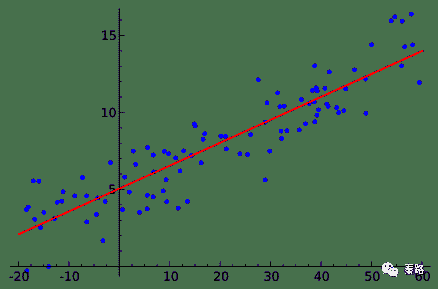

回归包括线性回归、非线性回归、逻辑回归等。上图就是线性回归。

**Convariance**

协方差

用于衡量两个变量的总体误差，方差是协方差的一种特殊情况，即两个变量相同。

协方差用数据期望值E计算：cov(x,y) = E[XY]-E[X][Y]。

如果XY互相独立，则cov(x,y)=0.此时E[XY] = E[X][Y]。

**Correlation**

相关性

即变量之间的关联性，相关性只涉及数学层面，即一个变量变化，另外一个变量会不会变化，但是两个变量的因果性不做研究。

相关关系是一种非确定性的关系，即无法通过一个变量精确地确定另外一个变量，比如我们都认为，一个人身高越高体重越重，但是不能真的通过身高去确定人的体重。

**Pearson Coeff**

皮尔逊相关系数

它是度量两个变量线性相关的系数，用r表示，其值介于-1与1之间。1表示完全正相关，0表示完全无关，-1表示完全负相关。


**Causation**

因果性

和相关性是一堆好基友。相关性代表数学上的关系，但并不代表具有因果性。

夏天，吃冷饮的人数和淹死的人数都呈现正相关。难道是吃冷饮导致了淹死？不是的，是因为天热，天热吃冷饮的人多了，游泳的人也多了。

《大数据时代》曾经强调，我们应该重视相关性而不是因果性，这是存疑的，因为对数据科学家来说，对业务因果性的了解往往胜于相关性，比如你预测一个人是否会得癌症，你不能拿是否做过放疗作为特征，因为放疗已经是癌症的果，必然是非常强相关，但是对预测没有任何帮助，只是测试数据上好看而已。

**Least2 fit**

最小二乘法

它是线性回归的一种用于机器学习中的优化技术。

最小二乘的基本思想是：最优拟合直线应该是使各点到回归直线的距离和最小的直线，即平方和最小。它是基于欧式距离的。

**Eculidean Distance**

欧氏距离

指在m维空间中两个点之间的真实距离。小学时求的坐标轴轴上两个点的直线距离就是二维空间的欧式距离。很多算法都是基于欧式距离求解的。

二维：


**——————**

**Programming 编程**

数据科学家是需要一定的编程能力，虽然不需要程序员那么精通，注重的是解决的能力，而不是工程化的能力。作者从内容看更推崇R，我个人是推崇Python的。

**Python Basics**

Python基础知识。

人生苦短，我用Python。

Python的基础内容比R丰富的多，近几年，Python有作为第一数据科学语言的趋势。基础内容就不多复述了。

**Working in Excel**

Excel干活

掌握常用函数，懂得数据分析库，会Power系列加分。VBA这种就不用学了。

**R Setup, RStudio R**

安装R和RStudio

R是一门统计学语言。下列的内容，都是R语言相关。

**R Basics**

R的基础，不多作陈述了。

**Varibles**

变量

变量是计算机语言中的抽象概念，可以理解成我们计算的结果或者值，不同计算语言的变量性质不一样。主要理解R和Python的变量就行。大数据那块可能还会涉及到Java和Scala。

R 用 <- 给变量赋值，=也能用，但不建议。

**Vectors**

向量

向量是一维数组，可以存储数值型、字符型或逻辑型数据的一维数组。R里面使用函数c( )创建向量。

> ```
> v <- c(1,2,3,4)
> ```

向量中的数据必须拥有相同的数据类型，无法混杂。

**Matrices**

矩阵

矩阵是一个二维数组，和向量一样，每个元素必须拥有相同的数据类型。当维度超过2时，我们更建议使用数组

> ```
> m <- matrix(1:20,nrow=5,ncol=4)
> ```

**Arrays**

数组

数组与矩阵类似，但是维度可以大于2，数据类型必须一样。

> ```
> a <- array(1:20,c(4,5))
> ```

**Factors**

因子

因子是R中的有序变量和类别变量。

类别变量也叫做名义变量，它没有顺序之分，比如男女，虽然编码中可能男为1，女为2，但不具备数值计算含义。有序变量则表示一种顺序关系，少年、青年、老年则是一种有序变量。

> ```
> f <- factor(c("type1","type2","type1))
> ```

在factor函数中加入参数ordered = True，就表示为有序型变量了。

**Lists**

列表

它是R最复杂的数据类型，它可以是上述数据结构的组合。

> ```
> l <- list(names = v,m,a,f ) 
> ```

上述例子就包含了向量、矩阵、数组、因子。我们可以使用双重方括号[[ ]]选取列表中的元素。R中的下标不从0开始，所以list[[1]] 选取的是v。

**Data Frames**

数据框

在R和Python中为常用的数据结构。

R语言中为data.frame，Python中为Pandas的DataFrame。这里以R语言举例。

数据框可以包含不同数据类型的列，它是比矩阵更广泛的概念，也是R中最常用的数据结构。每一列的数据类型必须唯一。

> ```
> x <- data.frame(col1,col2,col3)
> ```

**Reading CSV Data**

读取CSV

这一块比较坑的地方是中文，R语言对中文编码的支持比较麻烦。

**Reading Raw Data**

读取原始数据

不清楚这和CSV的区别。

**Subsetting Data**

构建数据集

R提供了常用函数方便我们构建数据集（反正来去都那几个英文）。

*   数据集合并使用merge函数。

*   添加数据行使用rbind函数。

*   dataframe选取子集用[ row,column]。

*   删除变量可以通过 <- Null。

*   复杂查询则使用subset函数。

*   如果已经习惯SQL函数，可以载入library(sqldf)后用sqldf函数。

**Manipulate Data Frames**

操作数据框

除了上面的构建数据集的技巧，如果我们需要更复杂的操作，加工某些数据，如求变量和、计算方差等，则要用到R语言的其他函数。

R本身提供了abs(x),sort(x),mean(x),cos(x)等常用的统计方法，如何应用在数据框呢？我们使用apply函数，可将任意一个函数应用在矩阵、数组、数据框中。

> ```
> apply(dataframe,margin,fun)
> ```

**Functions**

函数

R语言自带了丰富的统计函数，可以通过官方/第三方文档查询，R也可以自建函数。

> ```
> myfunction <- function(arg1,arg2,……){
>  statements
>  return(object)
> }
> ```

函数中的对象只在函数内部使用。如果要调试函数，可以使用warning( ),messagr( ),stop( )等纠错。

**Factor Analysis**

因子分析

我不知道这块的编程基础内容为什么要加入因子分析。R语言的因子分析函数是factanal()

**Install Pkgs**

调包侠

R的包非常丰富（Python更是），可以通过cran下载，包括爬虫、解析、各专业领域等。函数library可以显示有哪些包，可能直接加入包。RStudio则提供了与包相关的丰富查询界面。

——————

**Machine Learning机器学习**

数据科学的终极应用，现在已经是深度学习了。这条路也叫从调包到科学调参。这里的算法属于经典算法，但是向GBDT、XGBoost、RF等近几年竞赛中大发异彩的算法没有涉及，应该是写得比较早的原因。

**What is ML?**

机器学习是啥子哟

机器学习，区别于数据挖掘，机器学习的算法基于统计学和概率论，根据已有数据不断自动学习找到最优解。数据挖掘能包含机器学习的算法，但是协同过滤，关联规则不是机器学习，在机器学习的教程上看不到，但是在数据挖掘书本能看到。

**Numerical Var**

数值变量

机器学习中主要是两类变量，数值变量和分量变量。

数值变量具有计算意义，可用加减乘除。数据类型有int、float等。

在很多模型中，连续性的数值变量不会直接使用，为了模型的泛化能力会将其转换为分类变量。

**Categorical Var**

分类变量

分类变量可以用非数值表示，它是离散变量。

有时候为了方便和节省存储空间，也会用数值表示，比如1代表男，0代表女。但它们没有计算意义。在输入模型的过程中，会将其转变为哑变量。

**Supervised Learning**

监督学习

机器学习主要分为监督学习和非监督学习。

监督学习是从给定的训练集中学习出一个超级函数Y=F(X)，我们也称之为模型。当新数据放入到模型的时候，它能输出我们需要的结果达到分类或者预测的目的。结果Y叫做目标，X叫做特征。当有新数据进入，能够产生新的准确的结果。

既然从训练集中生成模型，那么训练集的结果Y应该是已知的，知道输入X和输出Y，模型才会建立，这个过程叫做监督学习。如果输出值是离散的，是分类，如果输出值是连续的，是预测。

监督学习常见于KNN、线性回归、朴素贝叶斯、随机森林等。

**Unsupervied Learning**

非监督学习

无监督学习和监督学习，监督学习是知道结果Y，无监督学习是不知道Y，仅通过已有的X，来找出隐藏的结构。

无监督学习常见于聚类、隐马尔可夫模型等。

**Concepts, Inputs & Attributes**

概念、输入和特征

机器学习包括输入空间、输出空间、和特征空间三类。特征选择的目的是筛选出结果有影响的数据。

**Traning & Test Data**

训练集和测试集

机器学习的模型是构建在数据集上的，我们会采用随机抽样或者分层抽样的将数据分成大小两个部分，拿出大部分样本进行建模型，留小部分样本用刚建立的模型进行预报，通过小样本的预测结果和真实结果做对比，来判断模型优劣。这个叫做交叉验证。

交叉验证能够提高模型的稳定性，但不是完全保险的，依旧有过拟合的风险。

通常用80%的数据构建训练集，20%的数据构建测试集

**Classifier**

分类

监督学习中，如果输出是离散变量，算法称为分类。

输出的离散变量如果是二元的，则是二元分类，比如判断是不是垃圾邮件{是，否}，很多分类问题都是二元分类。与之相对的是多元分类。

**Prediction**

预测

监督学习中，如果输出是连续变量，算法称为预测。

预测即可以是数值型，比如未来的销量，也可以是介于[0,1]间的概率问题。

有些算法适合分类、有些则是预测，也有算法可以两者都能做到。

**Lift**

Lift曲线

它是衡量模型性能的一种最常用的度量，它考虑的是模型的准确性。它核心的思想是以结果作导向，用了模型得到的正类数量比不用模型的效果提升了多少？

比如某一次活动营销，1000个用户会有200个响应，响应率是20%。用了模型后，我通过算法，讲用户分群，挑出了最有可能响应的用户200个，测试后的结果是有100个，此时的响应率变成了50%。此时的Lift值为5。

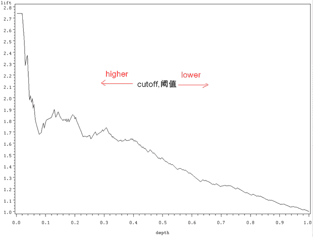

上图就是按Lift值画出曲线的范例。纵坐标是lift值，横坐标是挑选的的阀值。阀值越低，说明挑选的越严格，按上文的例子理解，挑选的就是最有可能响应的用户。当没有阀值时，lift就为0了。阀值通常是根据预测分数排序的。

还有一种常用的叫ROC曲线。

**Overfitting**

过拟合

过拟合是机器学习中常碰到的一类问题。主要体现在模型在训练数据集上变现优秀，而在真实数据集上表现欠佳。造成的原因是为了在训练集上获得出色的表现，使得模型的构造如此精细复杂，规则如此严格，以至于任何与样本数据稍有不同的文档它全都认为不属于这个类别。

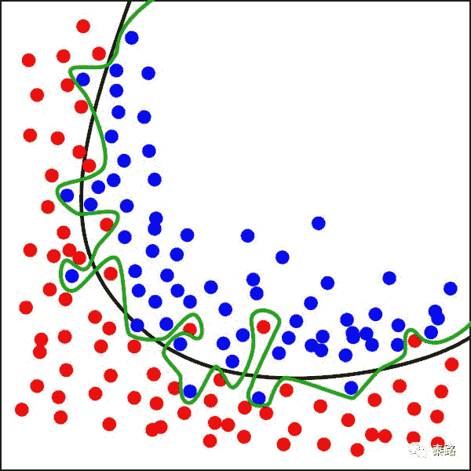

上图，黑色的线条是正常模型，绿色的线条是过拟合模型。

不同的机器学习算法，是否容易拟合的程度也不仅相同。通常采用加大样本数据量、减少共线性、增加特征泛化能力的方法解决过拟合。

与之相反的是欠拟合。

**Bias & Variance**

偏差和方差

偏差和方差除了统计学概念外，它们也是解释算法泛化能力的一种重要工具。

算法在不同训练集上得到的结果不同，我们用偏差度量算法的期望预测和真实结果的偏离程度，这代表算法本身的拟合能力，方差则度量了算法受数据波动造成的影响。

偏差越小、越能够拟合数据，方差越小、越能够扛数据波动。

**Trees & Classification**

树分类

树分类是需要通过多级判别才能确定模式所属类别的一种分类方法。多级判别过程可以用树状结构表示，所以称为树分类器。最经典的便是决策树算法。

**Classification Rate**

分类正确率

为了验证模型的好坏，即最终判断结果的对错，我们引入了分类正确率。

分类正确率即可以判断二分类任务，也适用于多分类任务。我们定义分类错误的样本数占总样本的比率为错误率，精确度则是正确的样本数比率。两者相加为1。

为了更好的判断模型，主要是业务需要，我们还加入了查准率(precision),查全率(recall)，查准率是预测为真的数据中有多少是真的。查全率是真的数据中有多少数据被预测对了。

这个有点绕，主要是为了业务判断，假如我们的预测是病人是否患了某个致死疾病，假设得病为真，我们显然希望把全部都得病的患者找出来，那么此时查全率（得病的患者有多少被准确预测出来）比查准率（预测得病的患者有多少真的得病了）更重要，因为这个会死人，那么肯定是选择有杀错无放过。此时更追求查全率。

算法竞赛就是基于上述指标评分的。

**Decision Tress**

决策树

它是基本的分类和回归方法。可以理解成If-Then的规则集，每一条路径都互斥且完备。决策树分为内部节点和叶节点，内部节点就是If-Then的规则，叶节点就是分类结果。

决策树主流有ID3、C4.5（C5.0也有了）、CART算法。

因为决策树形成的结构是根据树形递归产生，它对训练数据表现良好，但是会产生过拟合现象。为了避免这一现象，会进行减枝。剪纸通过损失函数或代价函数实现。

决策树的优点是：高校简单、可解释性强、在大型数据库有良好表现、适合高维数据。

缺点是：容易过拟合、并且分类结果会倾向拥有更多数值的特征（基于信息增益）。

随机森林算法是基于决策树的。

**Boosting**

提升方法

属于集成学习的一种。提升方法Boosting一般是通过多个弱分类器组成一个强分类器，提高分类性能。简而言之是三个臭皮匠顶一个诸葛亮。

通过对训练集训练出一个基学习器，然后根据基学习器的分类表现跳转和优化，分类错误的样本将会获得更多关注，以此重复迭代，最终产生的多个基分类器进行加强结合得出一个强分类器。

主流方法是AdaBoost，以基分类器做线性组合，每一轮提高前几轮被错误分类的权值。

**Naive Bayes Classifiers**

朴素贝叶斯分类

它基于贝叶斯定理的分类方法。朴素贝叶斯法的使用条件是各条件互相独立。这里引入经典的贝叶斯定理：


在算法中，我们的B就是分类结果Target，A就是特征。意思是在特征已经发生的情况下，发生B的概率是多少？

概率估计方法有极大似然估计和贝叶斯估计，极大似然估计容易产生概率值为0的情况。

优点是对缺失数据不太敏感，算法也比较简单。缺点是条件互相独立在实际工作中不太成立。

**K-Nearest Neighbour**

K近邻分类。

K近邻分类的特点是通过训练数据对特征向量空间进行划分。当有新的数据输入时，寻找距离它最近的K个实例，如果K个实例多数属于某类，那么就把新数据也算作某类。

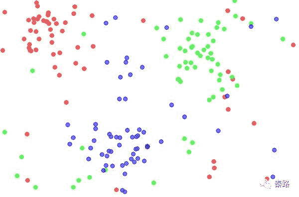

特征空间中，每个训练数据都是一个点，距离该点比其他点更近的所有点将组成一个子空间，叫做单元Cell，这时候，每个点都属于一个单元，单元将是点的分类。


k值的选择将会影响分类结果，k值越小，模型越复杂，容易过拟合，不抗干扰。K值越大，模型将越简单，分类的准确度会下降。上图是K=1时的子空间划分，下图是K=5时的子空间划分，从颜色很直观的看到影响。

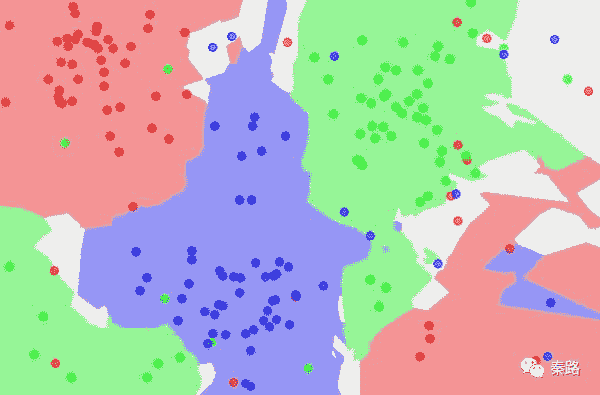

K近邻的这类基于距离的算法，训练的时间复杂度低，为O(n)，适用范围范围广。但是时间复杂度低是通过空间复杂度换来的，所以需要大量的计算资源和内存。另外样本不平衡问题解决不了。

**Logistic Regression**

逻辑斯谛回归，简称逻辑回归。

逻辑回归属于对数线性模型，虽然叫回归，本质却是分类模型。如果我们要用线性模型做分类任务，则找到sigmoid函数将分类目标Y和回归的预测值联系起来，当预测值大于0,判断正例，小于0为反例，等于0任意判别，这个方法叫逻辑回归模型。

模型参数通过极大似然法求得。逻辑回归的优点是快速和简单，缺点是高维数据支持不好，容易钱拟合。

**Ranking**

排序，PageRank

这里应该泛指Google的PageRank算法。

PageRank的核心思想有2点：

1.  如果一个网页被很多其他网页链接到的话说明这个网页比较重要，也就是pagerank值会相对较高；

2.  如果一个pagerank值很高的网页链接到一个其他的网页，那么被链接到的网页的pagerank值会相应地因此而提高。

PageRank并不是唯一的排名算法，而是最为广泛使用的一种。其他算法还有：Hilltop 算法、ExpertRank、HITS、TrustRank。

**Linear Regression**

线性回归

线性回归是机器学习的入门级别算法，它通过学习得到一个线性组合来进行预测。

一般写成F(x) = wx +b，我们通过均方误差获得w和b，均方误差是基于欧式距离的求解，就是最小二乘法啦。找到一条线，所有数据到这条线的欧式距离之和最小。

线性回归容易优化，模型简单，缺点是不支持非线性。

**Perceptron**

感知机

它是二类分类的线性分类模型。

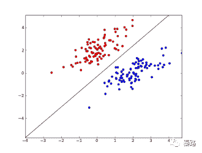

它通过一个wx+b的超平面S划分特征空间。为了找出这个超平面，我们利用损失函数极小化求出。超平面的解不是唯一的，采取不同初值或误分类点将会造成不同结果。


**Hierarchical Clustering**

层次聚类

层次聚类指在不同层次对数据集进行划分，从而形成树形的聚类结构。

它将样本看作一个初始聚类簇，每次运算找出最近的簇进行合并，该过程不断合并，直到满足预设的簇的个数。


上图就是所有样本重复执行最终K=1时的结果。横轴是聚类簇之间的距离，当距离=5时，我们有两个聚类簇，当距离=3时，我们有四个聚类簇。

**K-means Clusterning**

K聚类

全称K均值聚类，无监督学习的经典算法。物以类聚人以群分的典型代表。

K聚类需要将原始数据无量纲化，然后设置聚类点迭代求解。K聚类的核心是针对划分出的群簇使其最小化平方误差。直观说，就是让样本紧密围绕群簇均值。

设置多少个聚类点多少有点主观的意思，这也是K聚类唯一的参数，考察的是外部指标，即你聚类本身是想分出几类，通过对结果的观察以及E值判断。

K聚类不适合多维特征，一般3～4维即可，维度太多会缺乏解释性，RFM模型是其经典应用。因为物以类聚，所以对偏离均值点的异常值非常敏感。

**Neural Networks**

神经网络

神经网络是一种模仿生物神经系统的算法，神经网络算法以神经元作为最基础的单位，神经元通过将输入数据转换为0或1的阀值，达到激活与否的目的，但是0和1不连续不光滑，对于连续性数据，往往用sigmoid函数转换成[0,1] 间的范围。

将这些神经单元以层次结构连接起来，就成了神经网络。因为这个特性，神经网络有许多的参数，可不具备可解释性。多层神经网络，它的输入层和输出层之间的层级叫做隐层，就是天晓得它代表什么含义。

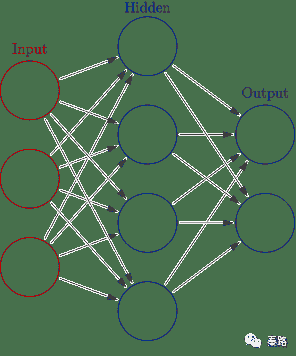

神经网络的层数一般是固定的，但我们也能将网络层数作为学习的目标之一，找到最适合的层数。

另外，层数越多，参数越多的神经网络复杂度越高，深度学习就是典型的层数很多的神经网络。常见的有CNN、DNN、RNN等算法。

**Sentiment Analysis**

情感分析

比较前沿的一个领域。包括情感词的正面负面分类，标注语料，情感词的提取等。

情感分析可以通过情感关键词库计算，比如汇总开心、悲伤、难过的词汇，计算情感值，再加入表示情感强烈程度的维度，如1～5的数值进行打分。用户对商品评论的分析就是一个常见的情感分析：这手机太TM破了，就是5分愤怒。

然而情感词典需要维护，构建成本较高，我们也可以用机器学习的方法将其看待为分类问题。讲关键词特征向量化，常用词袋模型（bag-of-words ）以及连续分布词向量模型（word Embedding），特征化后，往往用CNN、RNN或者SVM算法。

**Collaborative Fitering**

协同过滤

简称CF算法。协同过滤不属于机器学习领域，所以你在机器学习的书上看不到，它属于数据挖掘。

协同过滤的核心是一种社会工程的思想：人们更倾向于向口味比较类似的朋友那里获得推荐。协同过滤主要分为两类，基于用户的user-based CF以及基于物体的item-based CF。虽然协同过滤不是机器学习，但它也会用到SVD矩阵分解计算相似性。

优点是简单，你并不需要基于内容做内容分析和打标签，推荐有新颖性，可以发掘用户的潜在兴趣点。

协同过滤的缺点是无法解决冷启动问题，新用户没行为数据，也没有好友关系，你是最不到推荐的；推荐会收到稀疏性的约束，你的行为越多，才会越准；随着数据量的增大，算法会收到性能的约束，并且难以拓展。

协同过滤可以和其他算法混合，来提高效果。这也是推荐系统的主流做法。

**Tagging**

标签/标注

这里稍微有歧义、如果是标签，间接理解为用户画像，涉及到标签系统。用户的男女、性别、出生地皆是标签，越丰富的标签，越能在特征工程中为我们所用。

如果是分类标签/标注，则是数据标注。有监督学习需要训练集有明确的结果Y，很多数据集需要人工添加上结果。比如图像识别，你需要标注图像属于什么分类，是猫是狗、是男是女等。在语音识别，则需要标注它对应的中文含义，如果涉及到方言，则还需要将方言标注为普通话。

数据标注是个苦力活。

——————

个人水平一般，内容解读不算好，可能部分内容有错误，欢迎指正。

因为微信文章最多2W字，所以该指南需要拆分成三篇。本文写的是基础原理、统计学、编程能力和机器学习。请大家期待后续。

