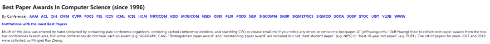
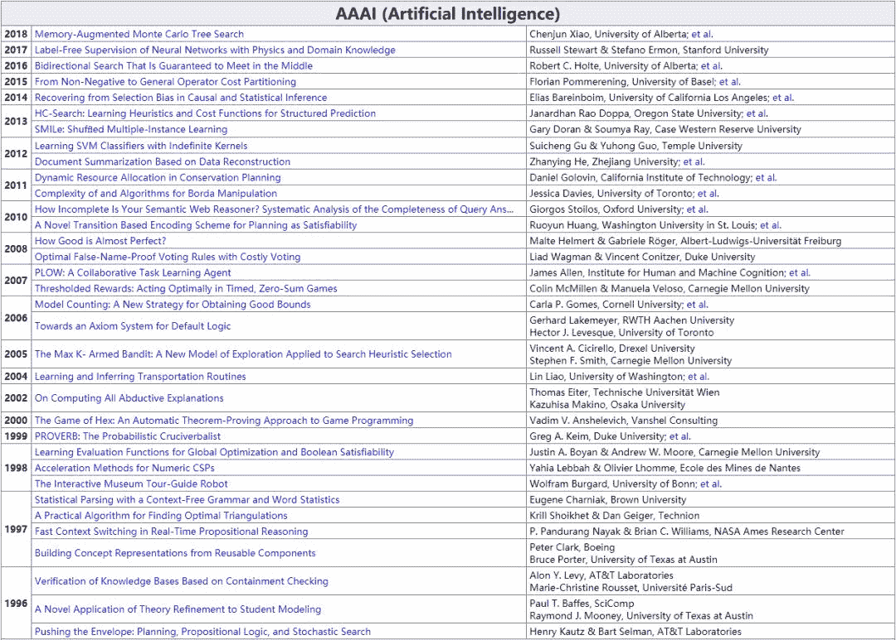
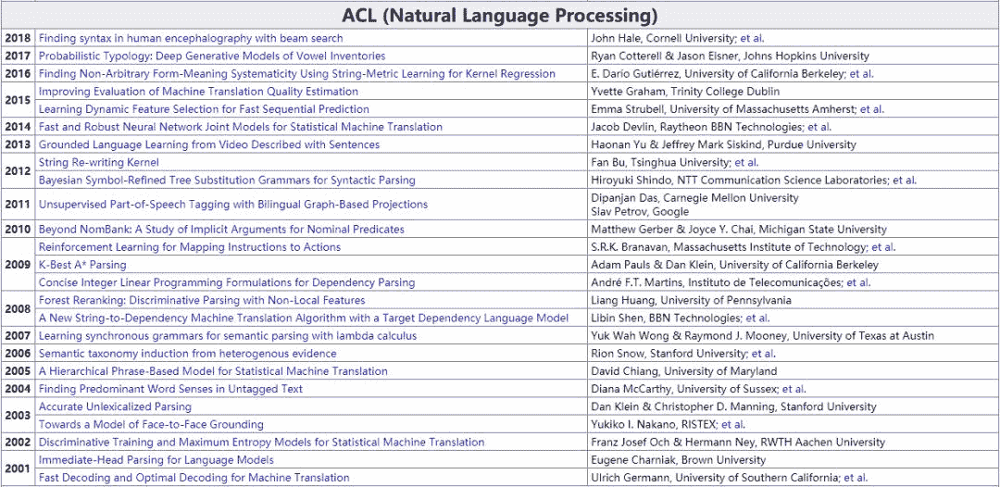
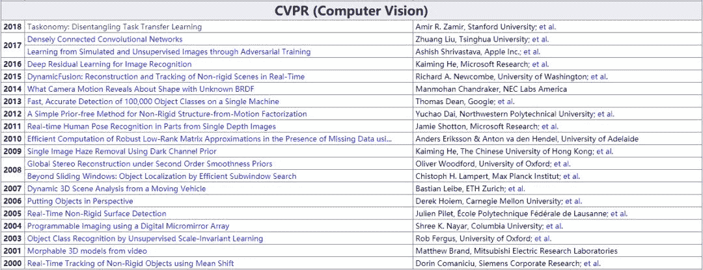
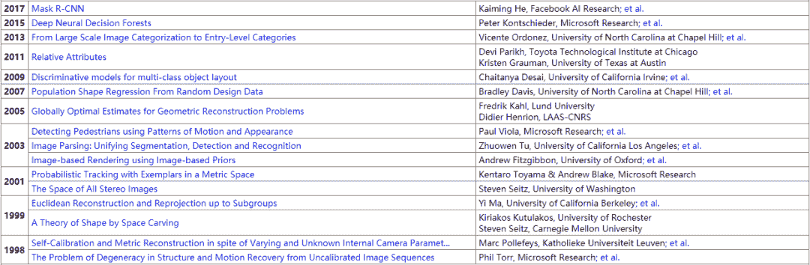
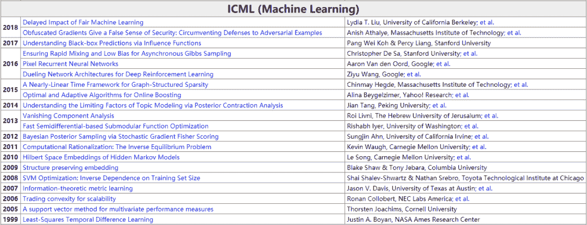
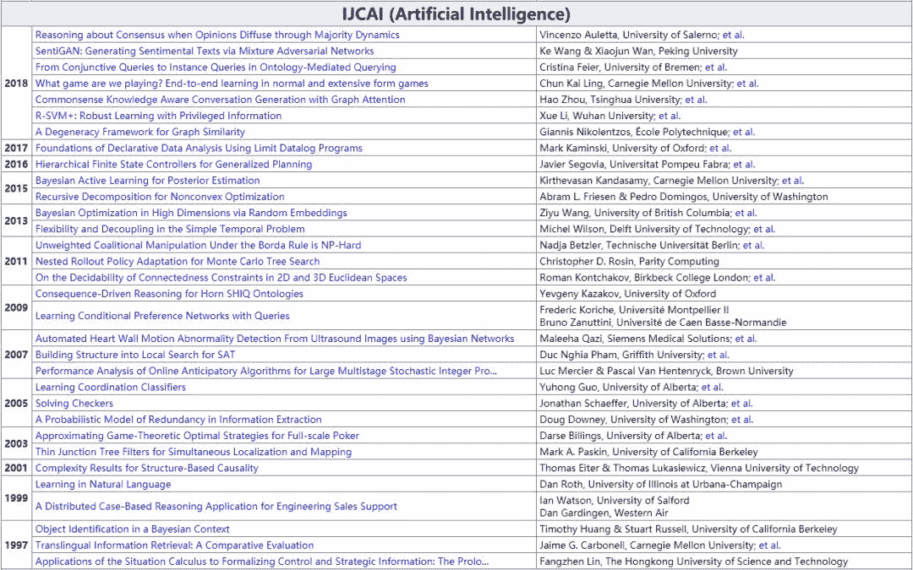

点击上方“**Datawhal****e**”，选择“星标”公众号

第一时间获取价值内容

工欲善其事必先利其器！今天给大家推荐一份非常棒的资源，该资源罗列收集了 CS 顶会历届最佳论文大列表，从 1996 年至 2018 年都包含了。机器学习、深度学习前沿 Paper 都能找得到！

这些“顶会”包括：**AAAI, ACL, CHI, CIKM, CVPR, FOCS, FSE, ICCV, ICML, ICSE, IJCAI, INFOCOM, KDD, MOBICOM, NSDI, OSDI, PLDI, PODS, S&P, SIGCOMM, SIGIR, SIGMETRICS, SIGMOD, SODA, SOSP, STOC, UIST, VLDB, WWW**。

直接放上该资源的网址：

https://jeffhuang.com/best_paper_awards.html

该网页上，按照不同顶会，列举了各个年份的最佳 CS 论文，论文源地址和作者信息都有了！

下面介绍几个 AI 领域的代表性顶会最佳论文资源。

**1. AAAI (Artificial Intelligence)**

**2. ACL (Natural Language Processing)**

**3. CVPR (Computer Vision)**

**4. ICCV (Computer Vision)**

**5. ICML (Machine Learning)**

**6. IJCAI (Artificial Intelligence)**

以上是人工智能领域具有代表性的几个顶会，相应的最佳论文都按照不同年份列举出来了，非常便于查找和定位。除此之外，还包括其他 CS 顶会的最佳论文。

最后再放上该资源的网址：

https://jeffhuang.com/best_paper_awards.html

