点击上方“**Datawhal****e**”，选择“星标”公众号

第一时间获取价值内容

大家新年好呀，在《 数据科学家成长指南(上) 》中已经介绍了基础原理、统计学、编程能力和机器学习的要点大纲，今天更新后续的第五、六、七条线路：自然语言处理、数据可视化、大数据。

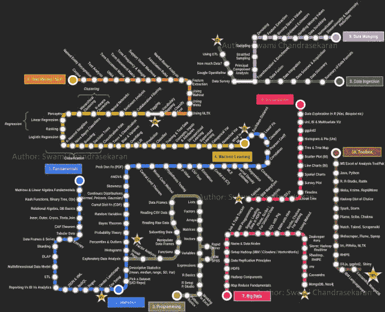

准备好在新的一年，学习成为未来五年最性感的职位么。

——————

**Text Mining / NLP**

文本挖掘，自然语言处理。这是一个横跨人类学、语言学的交叉领域。中文的自然语言处理更有难度，这是汉语语法特性决定的，英文是一词单词为最小元素，有空格区分，中文则是字，且是连续的。这就需要中文在分词的基础上再进行自然语言处理。中文分词质量决定了后续好坏。

**Corpus**

语料库

它指大规模的电子文本库，它是自然语言的基础。语料库没有固定的类型，文献、小说、新闻都可以是语料，主要取决于目的。语料库应该考虑多个文体间的平衡，即新闻应该包含各题材新闻。

语料库是需要加工的，不是随便网上下载个txt就是语料库，它必须处理，包含语言学标注，词性标注、命名实体、句法结构等。英文语料库比较成熟，中文语料还在发展中。

**NLTK-Data**

自然语言工具包

NLTK创立于2001年，通过不断发展，已经成为最好的英语语言工具包之一。内含多个重要模块和丰富的语料库，比如nltk.corpus 和 nltk.utilities。Python的NLTK和R的TM是主流的英文工具包，它们也能用于中文，必须先分词。中文也有不少处理包：TextRank、Jieba、HanLP、FudanNLP、NLPIR等。

**Named Entity Recognition**

命名实体识别

它是确切的名词短语，如组织、人、时间，地区等等。命名实体识别则是识别所有文字中的命名实体，是自然语言处理领域的重要基础工具。

命名实体有两个需要完成的步骤，一是确定命名实体的边界，二是确定类型。汉字的实体识别比较困难，比如南京市长江大桥，会产生南京 | 市长 | 江大桥 、南京市 |  长江大桥 两种结果，这就是分词的任务。确定类型则是明确这个实体是地区、时间、或者其他。可以理解成文字版的数据类型。

命名实体主要有两类方法，基于规则和词典的方法，以及基于机器学习的方法。规则主要以词典正确切分出实体，机器学习主要以隐马尔可夫模型、最大熵模型和条件随机域为主。

**Text Analysis**

文本分析

这是一个比较大的交叉领域。以语言学研究的角度看，文本分析包括语法分析和语义分析，后者现阶段进展比较缓慢。语法分析以正确构建出动词、名词、介词等组成的语法树为主要目的。

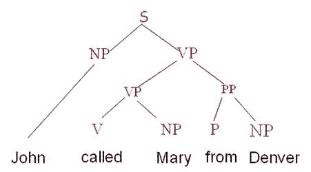

如果不深入研究领域、则有文本相似度、预测单词、困惑值等分析，这是比较成熟的应用。

**UIMA**

UIMA 是一个用于分析非结构化内容（比如文本、视频和音频）的组件架构和软件框架实现。这个框架的目的是为非结构化分析提供一个通用的平台，从而提供能够减少重复开发的可重用分析组件。

**Term Document Matrix**

词-文档矩阵

它是一个二维矩阵，行是词，列是文档，它记录的是所以单词在所有文档中出现频率。所以它是一个高维且稀疏的矩阵。

这个矩阵是TF-IDF（term frequency–inverse document frequency）算法的基础。TF指代的词在文档中出现的频率，描述的是词语在该文档的重要数，IDF是逆向文件频率，描述的是单词在所有文档中的重要数。我们认为，在所有文档中都出现的词肯定是的、你好、是不是这类常用词，重要性不高，而越稀少的词越重要。故由总文档数除以包含该词的文档数，然后取对数获得。

词-文档矩阵可以用矩阵的方法快速计算TF-IDF。

它的变种形式是Document Term Matrix，行列颠倒。

**Term Frequency & Weight**

词频和权重

词频即词语在文档中出现的次数，这里的文档可以认为是一篇新闻、一份文本，甚至是一段对话。词频表示了词语的重要程度，一般这个词出现的越多，我们可以认为它越重要，但也有可能遇到很多无用词，比如的、地、得等。这些是停用词，应该删除。另外一部分是日常用语，你好，谢谢，对文本分析没有帮助，为了区分出它们，我们再加入权重。

权重代表了词语的重要程度，像你好、谢谢这种，我们认为它的权重是很低，几乎没有任何价值。权重既能人工打分，也能通过计算获得。通常，专业类词汇我们会给予更高的权重，常用词则低权重。

通过词频和权重，我们能提取出代表这份文本的特征词，经典算法为TF-IDF。

**Support Vector Machines**

支持向量机

它是一种二类分类模型，有别于感知机，它是求间隔最大的线性分类。当使用核函数时，它也可以作为非线性分类器。

它可以细分为线性可分支持向量机、线性支持向量机，非线性支持向量机。

非线性问题不太好求解，图左就是将非线性的特征空间映射到新空间，将其转换成线性分类。说的通俗点，就是利用核函数将左图特征空间（欧式或离散集合）的超曲面转换成右图特征空间（希尔伯特空间）中的的超平面。

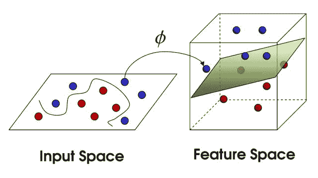

常用核函数有多项式核函数，高斯核函数，字符串核函数。

字符串核函数用于文本分类、信息检索等，SVM在高维的文本分类中表现较好，这也是出现在自然语言处理路径上的原因。

**Association Rules**

关联规则

它用来挖掘数据背后存在的信息，最知名的例子就是啤酒与尿布了，虽然它是虚构的。但我们可以理解它蕴含的意思：买了尿布的人更有可能购买啤酒。

它是形如X→Y的蕴涵式，是一种单向的规则，即买了尿布的人更有可能购买啤酒，但是买了啤酒的人未必会买尿布。我们在规则中引入了支持度和置信度来解释这种单向。支持度表明这条规则的在整体中发生的可能性大小，如果买尿布啤酒的人少，那么支持度就小。置信度表示从X推导Y的可信度大小，即是否真的买了尿布的人会买啤酒。

关联规则的核心就是找出频繁项目集，Apriori算法就是其中的典型。频繁项目集是通过遍历迭代求解的，时间复杂度很高，大型数据集的表现不好。

关联规则和协同过滤一样，都是相似性的求解，区分是协同过滤找的是相似的人，将人划分群体做个性化推荐，而关联规则没有过滤的概念，是针对整体的，与个人偏好无关，计算出的结果是针对所有人。

**Market Based Analysis**

购物篮分析，实际是Market Basket Analysis，作者笔误。

传统零售业中，购物篮指的是消费者一次性购买的商品，收营条上的单子数据都会被记录下来以供分析。更优秀的购物篮分析，还会用红外射频记录商品的摆放，顾客在超市的移动，人流量等数据。

关联规则是购物篮分析的主要应用，但还包括促销打折对销售量的影响、会员制度积分制度的分析、回头客和新客的分析。

**Feature Extraction**

特征提取

它是特征工程的重要概念。数据和特征决定了机器学习的上限，而模型和算法只是逼近这个上限而已。而很多模型都会遇到维数灾难，即维度太多，这对性能瓶颈造成了考验。常见文本、图像、声音这些领域。

为了解决这一问题，我们需要进行特征提取，将原始特征转换成最有重要性的特征。像指纹识别、笔迹识别，这些都是有实体有迹可循的，而表情识别等则是比较抽象的概念。这也是特征提取的挑战。

不同模式下的特征提取方法不一样，文本的特征提取有TF-IDF、信息增益等，线性特征提取包括PCA、LDA，非线性特征提取包括核Kernel。

**Using Mahout**

使用Mahout

Mahout是Hadoop中的机器学习分布式框架，中文名驱象人。

Mahout包含了三个主题：推荐系统、聚类和分类。分别对应不同的场景。

Mahout在Hadoop平台上，借助MR计算框架，可以简便化的处理不少数据挖掘任务。实际Mahout已经不再维护新的MR，还是投向了Spark，与Mlib互为补充。

**Using Weka**

Weka是一款免费的，基于JAVA环境下开源的机器学习以及数据挖掘软件。

**Using NLTK**

使用自然语言工具包

**Classify Text**

文本分类

将文本集进行分类，与其他分类算法没有本质区别。假如现在要将商品的评论进行正负情感分类，首先分词后要将文本特征化，因为文本必然是高维，我们不可能选择所有的词语作为特征，而是应该以最能代表该文本的词作为特征，例如只在正情感中出现的词：特别棒，很好，完美。计算出卡方检验值或信息增益值，用排名靠前的单词作为特征。

所以评论的文本特征就是[word11,word12,……]，[word21,word22,……]，转换成高维的稀疏矩阵，之后则是选取最适合的算法了。

垃圾邮件、反黄鉴别、文章分类等都属于这个应用。

**Vocabulary Mapping**

词汇映射

NLP有一个重要的概念，本体和实体，本体是一个类，实体是一个实例。比如手机就是本体、iPhone和小米是实体，它们共同构成了知识库。很多文字是一词多意或者多词一意，比如苹果既可以是手机也可以是水果，iPhone则同时有水果机、苹果机、iPhone34567的诸多叫法。计算机是无法理解这么复杂的含义。词汇映射就是将几个概念相近的词汇统一成一个，让计算机和人的认知没有区别。

——————

**Visualization数据可视化**

这是难度较低的环节，统计学或者大数据，都是不断发展演变，是属于终身学习的知识，而可视化只要了解掌握，可以受用很多年。这里并不包括可视化的编程环节。

**Uni, Bi & Multivariate Viz**

单/双/多 变量

在数据可视化中，我们通过不同的变量／维度组合，可以作出不同的可视化成果。单变量、双变量和多变量有不同作图方式。

**ggplot2**

R语言的一个经典可视化包

ggoplot2的核心逻辑是按图层作图，每一个语句都代表了一个图层。以此将各绘图元素分离。

> ggplot(...) +
> 
>   geom(...) + 
> 
>   stat(...) +
> 
>   annotate(...) +
> 
>   scale(...)

上图就是典型的ggplot2函数风格。plot是整体图表，geom是绘图函数，stat是统计函数，annotate是注释函数，scale是标尺函数。ggplot的绘图风格是灰底白格。

ggplot2的缺点是绘图比较缓慢，毕竟是以图层的方式，但是瑕不掩瑜，它依旧是很多人使用R的理由。

**Histogram & Pie(Uni)**

直方图和饼图（单变量）

直方图已经介绍过了，这里就放张图。

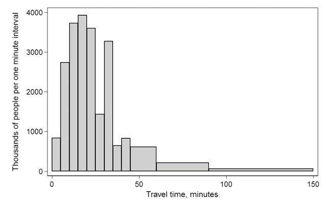

饼图不是常用的图形，若变量之间的差别不大，如35%和40%，在饼图的面积比例靠肉眼是分辨不出来。

**Tree & Tree Map**

树图和矩形树图

树图代表的是一种结构。层次聚类的实例图就属于树图。

当维度的变量多大，又需要对比时，可以使用矩形树图。通过面积表示变量的大小，颜色表示类目。

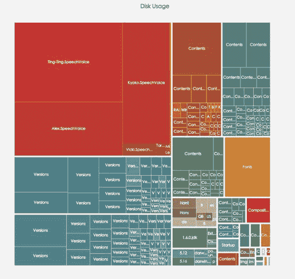

**Scatter Plot (Bi) **

散点图（双变量）

散点图在数据探索中经常用到，用以分析两个变量之间的关系，也可以用于回归、分类的探索。

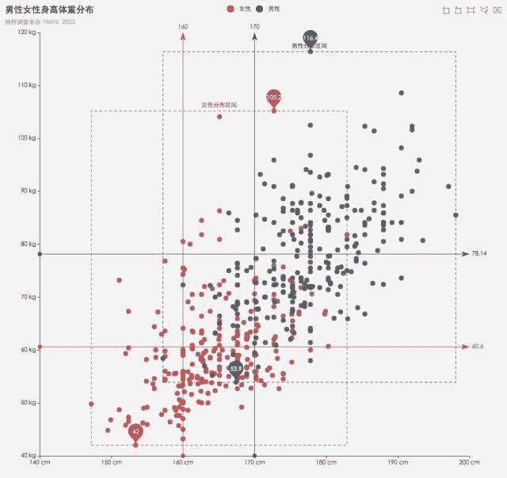

利用散点图矩阵，则能将双变量拓展为多变量。

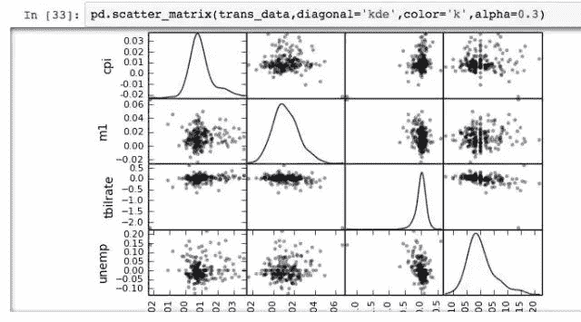

**Line Charts (Bi)**

折线图（双变量）

它常用于描绘趋势和变化，和时间维度是好基友，如影随形。

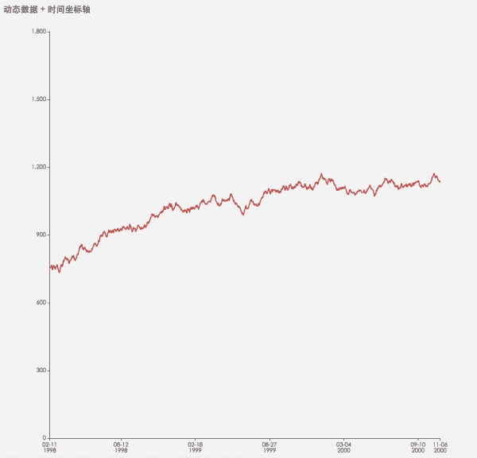

**Spatial Charts**

空间图，应该就是地图的意思

一切涉及到空间属性的数据都能使用地理图。地理图需要表示坐标的数据，可以是经纬度、也可以是地理实体，比如上海市北京市。经纬度的数据，常常和POI挂钩。

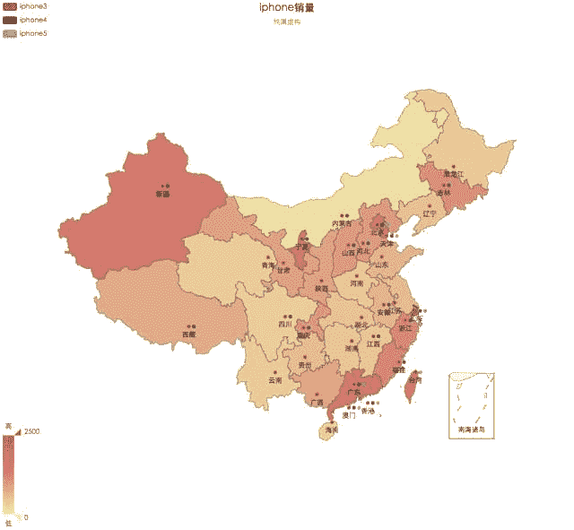

**Survey Plot**

不知道具体的含义，粗略翻译图形探索

plot是R中最常用的函数，通过plot（x，y），我们可以设定不同的参数，决定使用那种图形。

**Timeline**

时间轴

当数据涉及到时间，或者存在先后顺序，我们可以使用时间轴。不少可视化框架，也支持以时间播放的形式描述数据的变化。

**Decision Tree**

决策树

这里的决策树不是算法，而是基于解释性好的一个应用。

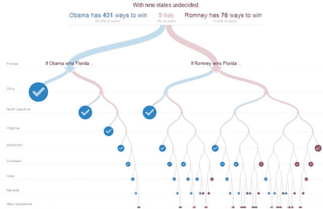

当数据遇到是否，或者选择的逻辑判断时，决策树不失为一种可视化思路。

**D3.js**

知名的数据可视化前端框架

d3可以制作复杂的图形，像直方图散点图这类，用其他框架完成比较好，学习成本比前者低。

d3是基于svg的，当数据量变大运算复杂后，d3性能会变差。而canvas的性能会好不少，国内的echarts基于后者。有中文文档，属于比较友好的框架。

R语言中有一个叫d3NetWork的包，Python则有d3py的包，当然直接搭建环境也行。

**IBM ManyEyes**

Many Eyes是IBM公司的一款在线可视化处理工具。该工具可以对数字，文本等进行可视化处理。应该是免费的。图网上随便找的。

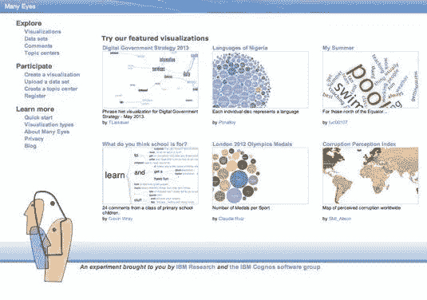

**Tableau**

国外知名的商用BI，分为Desktop和Server，前者是数据分析单机版，后者支持私有化部署。加起来得几千美金，挺贵的。图网上随便找的。

——————

**Big Data 大数据**

越来越火爆的技术概念，Hadoop还没有兴起几年，第二代Spark已经后来居上。 因为作者写的比较早，现在的新技术没有过多涉及。部分工具我不熟悉，就略过了。

**Map Reduce Fundamentals**

MapReduce框架

它是Hadoop核心概念。它通过将计算任务分割成多个处理单元分散到各个服务器进行。

MapReduce有一个很棒的解释，如果你要计算一副牌的数量，传统的处理方法是找一个人数。而MapReduce则是找来一群人，每个人数其中的一部分，最终将结果汇总。分配给每个人数的过程是Map，处理汇总结果的过程是Reduce。

**Hadoop Components**

Hadoop组件

Hadoo号称生态，它就是由无数组建拼接起来的。

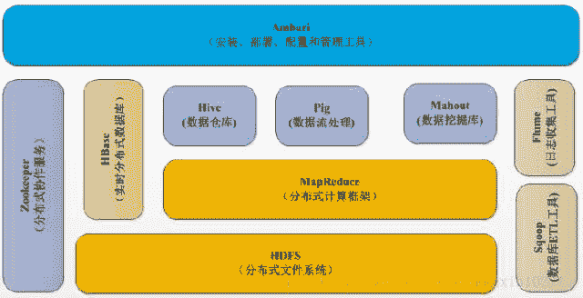

各类组件包括HDFS、MapReduce、Hive、HBase、Zookeeper、Sqoop、Pig、Mahout、Flume等。最核心的就是HDFS和MapReduce了。

**HDFS**

Hadoop的分布式文件系统

HDFS的设计思路是一次读取，多次访问，属于流式数据访问。HDFS的数据块默认64MB（Hadoop 2.X 变成了128MB），并且以64MB为单位分割，块的大小遵循摩尔定理。它和MR息息相关，通常来说，Map Task的数量就是块的数量。64MB的文件为1个Map，65MB（64MB+1MB）为2个Map。

**Data Replication Principles**

数据复制原理

数据复制属于分布式计算的范畴，它并不仅仅局限于数据库。

Hadoop和单个数据库系统的差别在于原子性和一致性。在原子性方面，要求分布式系统的所有操作在所有相关副本上要么提交， 要么回滚， 即除了保证原有的局部事务的原子性，还需要控制全局事务的原子性； 在一致性方面，多副本之间需要保证单一副本一致性。

Hadoop数据块将会被复制到多态服务器上以确保数据不会丢失。

**Setup Hadoop (IBM/Cloudera/HortonWorks)**

安装Hadoop

包括社区版、商业发行版、以及各种云。

**Name & Data Nodes**

名称和数据节点

HDFS通信分为两部分，Client和NameNode & DataNode。

NameNode：管理HDFS的名称空间和数据块映射信息，处理client。NameNode有一个助手叫Secondary NameNode，负责镜像备份和日志合并，负担工作负载、提高容错性，误删数据的话这里也能恢复，当然更建议加trash。

DataNode：真正的数据节点，存储实际的数据。会和NameNode之间维持心跳。

**Job & Task Tracker**

任务跟踪

JobTracker负责管理所有作业，讲作业分隔成一系列任务，然而讲任务指派给TaskTracker。你可以把它想象成经理。

TaskTracker负责运行Map任务和Reduce任务，当接收到JobTracker任务后干活、执行、之后汇报任务状态。你可以把它想象成员工。一台服务器就是一个员工。

**M/R Programming**

Map/Reduce编程

MR的编程依赖JobTracker和TaskTracker。TaskTracker管理着Map和Reduce两个类。我们可以把它想象成两个函数。

MapTask引擎会将数据输入给程序员编写好的Map( )函数，之后输出数据写入内存／磁盘，ReduceTask引擎将Map( )函数的输出数据合并排序后作为自己的输入数据，传递给reduce( )，转换成新的输出。然后获得结果。

网络上很多案例都通过统计词频解释MR编程：

原始数据集分割后，Map函数对数据集的元素进行操作，生成键-值对形式中间结果，这里就是{“word”,counts}，Reduce函数对键-值对形式进行计算，得到最终的结果。

Hadoop的核心思想是MapReduce，MapReduce的核心思想是shuffle。shuffle在中间起了什么作用呢？shuffle的意思是洗牌，在MR框架中，它代表的是把一组无规则的数据尽量转换成一组具有一定规则的数据。

前面说过，map函数会将结果写入到内存，如果集群的任务有很多，损耗会非常厉害，shuffle就是减少这种损耗的。图例中我们看到，map输出了结果，此时放在缓存中，如果缓存不够，会写入到磁盘成为溢写文件，为了性能考虑，系统会把多个key合并在一起，类似merge/group，图例的合并就是{"Bear",[1,1]},{"Car",[1,1,1]}，然后求和，等Map任务执行完成，Reduce任务就直接读取文件了。

另外，它也是造成数据倾斜的原因，就是某一个key的数量特别多，导致任务计算耗时过长。

**Sqoop: Loading Data in HDFS**

Sqoop是一个工具，用来将传统数据库中的数据导入到Hadoop中。虽然Hadoop支持各种各样的数据，但它依旧需要和外部数据进行交互。

Sqoop支持关系型数据库，MySQL和PostgreSQL经过了优化。如果要连其他数据库例如NoSQL，需要另外下载连接器。导入时需要注意数据一致性。

Sqoop也支持导出，但是SQL有多种数据类型，例如String对应的CHAR（64）和VARCHAR（200）等，必须确定这个类型可不可以使用。

**Flue, Scribe: For Unstruct Data**

2种日志相关的系统，为了处理非结构化数据。

**SQL with Pig**

利用Pig语言来进行SQL操作。

Pig是一种探索大规模数据集的脚本语言，Pig是接近脚本方式去描述MapReduce。它和Hive的区别是，Pig用脚本语言解释MR，Hive用SQL解释MR。

它支持我们对加载出来的数据进行排序、过滤、求和、分组(group by)、关联(Joining)。并且支持自定义函数（UDF），它比Hive最大的优势在于灵活和速度。当查询逻辑非常复杂的时候，Hive的速度会很慢，甚至无法写出来，那么Pig就有用武之地了。

**DWH with Hive**

利用Hive来实现数据仓库

Hive提供了一种查询语言，因为传统数据库的SQL用户迁移到Hadoop，让他们学习底层的MR API是不可能的，所以Hive出现了，帮助SQL用户们完成查询任务。

Hive很适合做数据仓库，它的特性适用于静态，SQL中的Insert、Update、Del等记录操作不适用于Hive。

它还有一个缺点，Hive查询有延时，因为它得启动MR，这个时间消耗不少。传统SQL数据库简单查询几秒内就能完成，Hive可能会花费一分钟。只有数据集足够大，那么启动耗费的时间就忽略不计。

故Hive适用的场景是每天凌晨跑当天数据等等。它是类SQL语言，数据分析师能直接用，产品经理能直接用，拎出一个大学生培训几天也能用。效率快。

可以将Hive作通用查询，而用Pig定制UDF，做各种复杂分析。Hive和MySQL语法最接近。

**Scribe, Chukwa For Weblog**

Scribe是Facebook开源的日志收集系统，在Facebook内部已经得到的应用。

Chukwa是一个开源的用于监控大型分布式系统的数据收集系统。

**Using Mahout**

已经介绍过了

**Zookeeper Avro**

Zookeeper，是Hadoop的一个重要组件，它被设计用来做协调服务的。主要是用来解决分布式应用中经常遇到的一些数据管理问题，如：统一命名服务、状态同步服务、集群管理、分布式应用配置项的管理等。

Avro是Hadoop中的一个子项目，它是一个基于二进制数据传输高性能的中间件。除外还有Kryo、protobuf等。

**Storm: Hadoop Realtime**

Storm是最新的一个开源框架

目的是大数据流的实时处理。它的特点是流，Hadoop的数据查询，优化的再好，也要基于HDFS进行MR查询，有没有更快的方法呢？是有的。就是在数据产生时就去监控日志，然后马上进行计算。比如页面访问，有人点击一下，我计算就+1，再有人点，+1。那么这个页面的UV我也就能实时知道了。

Hadoop擅长批处理，而Storm则是流式处理，吞吐肯定是Hadoop优，而时延肯定是Storm好。

**Rhadoop, RHipe**

将R和hadoop结合起来2种架构。

RHadoop包含三个包（rmr，rhdfs，rhbase），分别对应MapReduce，HDFS，HBase三个部分。

Spark还有个叫SparkR的。

**rmr**

RHadoop的一个包，和hadoop的MapReduce相关。

另外Hadoop的删除命令也叫rmr，不知道作者是不是指代的这个……

**Classandra**

一种流行的NoSql数据库

我们常常说Cassandra是一个面向列（Column-Oriented）的数据库，其实这不完全对——数据是以松散结构的多维哈希表存储在数据库中；所谓松散结构，是指每行数据可以有不同的列结构，而在关系型数据中，同一张表的所有行必须有相同的列。在Cassandra中可以使用一个唯一识别号访问行，所以我们可以更好理解为，Cassandra是一个带索引的，面向行的存储。

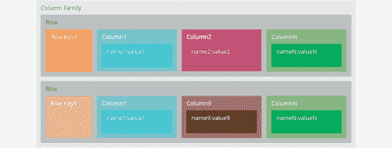

Cassandra只需要你定义一个逻辑上的容器（Keyspaces）装载列族（Column Families）。

Cassandra适合快速开发、灵活部署及拓展、支持高IO。它和HBase互为竞争对手，Cassandra+Spark vs HBase+Hadoop，Cassandra强调AP ，Hbase强调CP。

**MongoDB, Neo4j**

MongoDB是文档型NoSQL数据库。

MongoDB如果不涉及Join，会非常灵活和优势。举一个我们最常见的电子商务网站作例子，不同的产品类目，产品规范、说明和介绍都不一样，电子产品尿布零食手机卡等等，在关系型数据库中设计表结构是灾难，但是在MongoDB中就能自定义拓展。

再放一张和关系型数据库对比的哲学图吧：

Neo4j是最流行的图形数据库。

图形数据库如其名字，允许数据以节点的形式，应用图形理论存储实体之间的关系信息。

最常见的场景是社交关系链、凡是业务逻辑和关系带点边的都能用图形数据库。

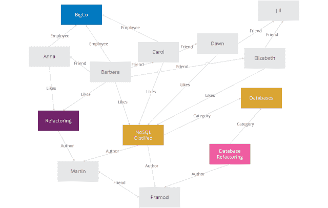

跟关系数据库相比，图形数据库最主要的优点是解决了图计算(业务逻辑)在关系数据库上大量的join操作，比如让你查询：你妈妈的姐姐的舅舅的女儿的妹妹是谁？这得写几个Join啊。但凡关系，join操作的代价是巨大的，而GraphDB能很快地给出结果。

——————

个人水平一般，内容解读不算好，可能部分内容有错误，欢迎指正。

本文写的是文本挖掘、数据可视化和大数据。后续只有一篇了。

