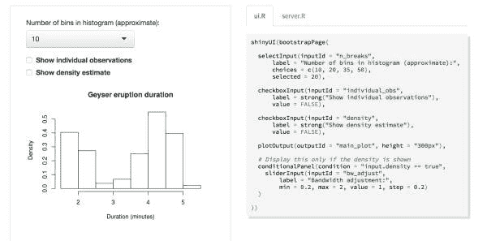

点击上方“**Datawhal****e**”，选择“星标”公众号

第一时间获取价值内容

本文是数据科学家学习路径的的完结篇，算上《数据科学家成长指南（上）》和《数据科学家成长指南 （中）》，总篇幅应该五万字多一点。今天更新数据获取、数据清洗、工具三条线路的内容，文字较少。

——————

Data Ingestion 数据获取

这一块的概念比较混乱，主要是涉及太多的名词概念，很混淆，我大致粗略的翻译一下。不保证一定对。

**Summary of Data Formats**

数据格式概要

在进行数据工程或者数据工作前，数据科学家应该针对数据格式有一个全面的了解。

数据格式各种各样，既有结构化数据，也有非结构化数据。既有文本数据，数值数据，也有时间日期数据。哪怕同一类，如时间日期，也会因为时区的不同而有差异。

对数据格式的了解有助于后续工作的开展。

**Data Discovery**

数据发现

这是一个挺大的问题，我也不清楚作者的真实含义，姑妄言之。

从大目标看，是了解自己拥有哪些数据，因为对数据科学家来说，问题不是数据少，而是数据太大了，导致无法确定分析主题而无从下手。我应该用哪些数据？哪些数据有帮助哪些无用？哪些数据有最大的利用价值？哪些数据又真实性存疑？现阶段最需要解决的数据问题是哪个？我想都是摆在数据科学家面前的问题。Discovery即是发现，也是探索。

从小细节看，是针对数据进行探索性研究，观察各变量的分布、范围。观察数据集的大小。主要目的是了解数据的细节。

这们把这一过程理解为，在挖掘到数据金矿前，得先知道哪一个地方会埋藏有金矿。

**Data Sources & Acquisition**

数据来源与采集

当你知道这块地方有金矿时，你得准备好自己的工具了：确定自己需要的数据源。比如要进行用户行为分析，那么就需要采集用户的行为数据。采集什么时间段、采集哪类用户、采集多少数据量。如果这些数据不存在，则还需要埋点进行收集。

**Data Integration**

数据集成

数据集成指代的是将不同来源的数据集成在一起成为一个统一的视图。即可以是数据战略层面，比如两家公司合并（滴滴和Uber，美团和点评），为了业务层面的统一和规范，就需要将用户数据业务数据都汇总到一起，这个过程就叫做数据集成。

也可以是将某一次分析所需要的数据源汇总。比如上文的用户行为分析，如果来源于不同数据、则需要确定主键，采集后放在一起便于我们使用。

除此以外，第三方数据接入，DMP应也从属于这个概念。

**Data Fusion**

数据融合

数据融合不同于数据集成，数据集成属于底层数据集上的合并。而数据融合接近模型层面，我们可以想成SQL的Join（不确定）。

**Transformation & Enrichament**

转换和浓缩

这一块，在地图上和另外一条分支【数据转换Data Munging】有了交集。两条支线合并后就是完整的数据特征工程。这一步骤是将我们采集的数据集进行统计学意义上的变换，成为数据输入的特征。

**Data Survey**

数据调查

我也不了解已经完成数据工程后，为什么还需要数据调查…

**Google OpenRefine**

Google发布的开源的数据处理软件。

**How much Data**

多大的数据

一句比较偏概念的话，数据量级决定了后续方方面面，比如抽样和置信度，比如适用的算法模型，比如技术选型。

**Using ETL**

使用ETL，已经介绍过了

——————

**Data Munging 数据清理/数据转换**

数据清洗过程，机器学习中最耗费时间的过程。

**Dimensionality & Numerosity Reduction**

维度与数值归约

虽然我们有海量数据，但是我们不可能在海量数据上进行复杂的数据分析和挖掘。所以要应用数据规约技术。它的目的是精简数据，让它尽可能的小，又能保证数据的完整性，使得我们在海量数据集和小数据集上获得相近的结果。

主要是删除不重要或不相关的特征，或者通过对特征进行重组来减少特征的个数。其原则是在保留、甚至提高原有判别能力的前提下进行。

**Normalization**

数据规范化

在机器学习过程中，我们并不能直接使用原始数据，因为不同数值间的量纲不一样，无法直接求和和对比。我们会将数据标准化，使之落在一个数值范围[0,1]内。方便进行计算。

常见的数据标准化有min-max，z-score，decimal scaling等。

最小-最大规范化（min-max）是对原始数据进行线性变换，新数据 = (原数据-最小值)／(最大值-最小值)。

z-score 标准化是基于均值和标准差进行计算，新数据=（原数据-均值）/标准差。

小数定标标准化（decimal scaling）通过移动数据的小数点位置来进行标准化，小数点移动多少取决于最大绝对值。比如最大值是999，那么数据集中所有值都除以1000。

温馨提示，标准化会改变数据，所以标准化应该在备份原始数据后进行操作，别直接覆盖噢。

**Data Scrubbing**

数据清洗

数据挖掘中最痛苦的工作，没有之一。数据一般都是非规整的，我们称之为脏数据，它是无法直接用于数据模型的，通过一定规则将脏数据规范活着洗掉，这个过程叫做数据清洗。

常见问题为：

缺失数据，表现为NaN，缺失原因各有不同，会影响后续的数据挖掘过程。

错误数据，如果数据系统不健全，会伴随很多错误数据，例如日期格式不统一，存在1970错误，中文乱码，表情字符等等。思路最好是从错误根源上解决。

非规范数据，如果大平台没有统一的数据标准和数据字典，数据会有不规范的情况发生。比如有些表，1代表男人，0代表女人，而有些表则反过来，也可能是上海和上海市这类问题。通常通过mapping或者统一的字典解决。

重复数据。将重复数据按主键剔除掉就好，可能是Join时的错误，可能是抽样错误，等等。

数据清洗是一个长期的过程。很多情况下都是靠人肉解决的。

**Handling Missing Values**

缺失值处理

数据获取的过程中可能会造成缺失，缺失影响算法的结果。

缺失值的处理有两类思路：

第一种是补全，首先尝试其他数据补全，例如身份证号码能够推断出性别、籍贯、出生日期等。或者使用算法分类和预测，比如通过姓名猜测用户是男是女。

如果是数值型变量，可以通过随机插值、均值、前后均值、中位数、平滑等方法补全。

第二种是缺失过多，只能剔除这类数据和特征。或者将缺失与否作为新特征，像金融风险管控，关键信息的缺失确实能当新特征。

**Unbiased Estimators**

无偏估计量

无偏估计指的是样本均值的期望等于总体均值。因为样本均值永远有随机因素的干扰，不可能完全等于总体均值，所以它只是估计，但它的期望又是一个真实值，所以我们叫做无偏估计量。

机器学习中常常用交叉验证的方法，针对测试集在模型中的表现，让估计量渐进无偏。

**Binning Sparse Values**

分箱稀疏值，两个合起来我不知道具体意思

分箱是一种常见的数据清洗方法，首先是将数据排序并且分隔到一些相等深度的桶(bucket)中，然后根据桶的均值、中间值、边界值等平滑。常见的分隔方法有等宽划分和等深划分，等宽范围是根据最大值和最小值均匀分隔出数个范围相同的区间，等深则是样本数近似的区间。

稀疏是统计中很常见的一个词，指的是在矩阵或者特征中，绝大部分值都是0。叫做稀疏特征或稀疏矩阵。协同过滤就用到了稀疏矩阵。

**Feature Extraction**

特征提取／特征工程

前面已经有过这个了，这里概念再扩大些。我们知道：数据和特征决定了机器学习的上限，而模型和算法只是逼近这个上限而已。说的再通俗一点，好算法+烂特征是远比不上烂算法+好特征的。

特征提取的过程主要分为：

数据预处理：将已经清洗过的数据进行转换，包括去量纲化、归一化、二元化、离散化、哑变量化、对数变换指数变换等。

特征选择：利用各类统计学选择特征，主要有Filter过滤法、Wrapper包装法、Embedded嵌入法。核心目的是找出对结果影响最大的特征。通常是从业务意义出发，好的业务专家能够直接挑选关键特征。另外有时候会遇到具备重要业务意义，但是非强特征的情况，这时候需要依据实际情况做抉择。

特征选择过程中需要考虑模型的泛化能力，避免过拟合。

降维：如果特征维度过大，会直接影响计算性能，需要降维。常用的降维方法有主成分分析法（PCA）和线性判别分析（LDA）。

当然暴力些也能直接选择全部变量，扔进RF或者XGBoost模型中跑一个晚上，直接根据Gini指数查看重要性。

**Denoising**

去噪

在机器学习和数据挖掘中，数据往往由很多噪声，去除噪声的方法有多种多样，一般说来，数据量越大，噪声造成的影响就越少。

噪声是非真实的数据，如果一个用户某些信息没有填写，为缺失值，它不应该属于噪声，真正的噪声应该是测试人员、机器人、爬虫、刷单黄牛、作弊行为等。这类数据没有业务意义，加入模型会影响结果，在早期就该排除掉。

另外一种噪声是无法解释的数据波动，和其他数据不相一致。因为数据会受一些客观条件影响造成波动，去噪是使异常波动消除。

去噪在数据清洗过程。

**Sampling**

抽样

很多时候统计不可能计算整体，比如中国平均工资就是拿14亿人口一个个计算过来的么？数据科学中，如果拿全样本计算，可能单机的内存吃不消，或者没有服务器资源。那么只能抽取部分样本作为数据分析。

抽样有简单随机抽样、系统抽样、分层抽样、整群抽样等。无论怎么样抽样，都要求样本有足够的代表性，即满足一定数量，又满足随机性。

**Stratified Sampling**

分层抽样

是抽样的一种。将抽样单位以某种特征或者规律划分成不同的层，然后从不同的层中抽样，最后结合起来作为总样本。

为什么需要分层抽样？如果整群符合随机性倒还好，如果不是会造成统计上的误差。我要做社会调研，各类人都需要，那么就必须有男有女、有老有少、有城市有农村，而不是呆在一个商场门口做调研。前者就属于分层抽样。

分层抽样可以降低样本量，效率高。

**Principal Component Analysis**

主成分分析

简称PCA，是一种统计方法。在实际工作中，我们会遇到很多变量数据（比如图像和信号），而我们又不可能一一列举所有的变量，这时候我们只能拿出几个典型，将这些变量高度概括，以少数代表多数的方式进行描述。这种方式就叫做主成分分析。

如果变量完全独立，那么主成分分析没有意义。PCA前提条件是存在一定相关性。

通过去均值化的m维原始矩阵乘以其协方差矩阵的特征向量获得k维投影，这里的k维就叫做主成分，用来代表m维。因为PCA的核心是少数代表多数，我们从k个主成分中选择n个作为代表，标准是能代表80%的原数据集。

在机器学习中，主要用来降维，简化模型。常见于图像算法。

——————

**ToolBox工具箱**

最后内容了，这一块作者有拼凑的嫌疑，都是之前已经出现的内容。数据科学的工具更新换代非常快，好工具层出不穷，所以该篇章的工具就仁者见仁，写的简略一些。

**MS Excel / Analysis ToolPak**

微软的Excel，不多说了。

后者是Excel自带的分析工具库，可以完成不少统计操作。

**Java, Python**

两种常见编程语言，请在这里和我念：人生苦短，快用Python。

**R, R-Studio, Rattle**

R语言不再多介绍了。

RStudio是R的IDE，集成了丰富的功能。

Rattle是基于R的数据挖掘工具，提供了GUI。

**Weka, Knime, RapidMiner**

Weka是一款免费的，基于JAVA环境下开源的机器学习以及数据挖掘软件。

KNIME是基于Eclipse环境的开源商业智能工具。

RapidMiner是一个开源的数据挖掘软件,提供一些可扩展的数据分析挖掘算法的实现。

**Hadoop Dist of Choice**

选择Hadoop的哪个发行版

Hadoop的发行版除了社区的Apache hadoop外，很多商业公司都提供了自己的商业版本。商业版主要是提供了专业的技术支持，每个发行版都有自己的一些特点。

**Spark, Storm**

Hadoop相关的实时处理框架

作者写的时候比较早，现在后两者已经非常火了。是对Hadoop的补充和完善。它们自身也发展出不少的套件，SparkML，SparkSQL等

**Flume, Scribe, Chukwa**

Flume是海量日志采集、聚合和传输的系统。

Scribe是Facebook开源的日志收集系统，在Facebook内部已经得到的应用。

chukwa是一个开源的用于监控大型分布式系统的数据收集系统。

**Nutch, Talend, Scraperwiki**

Nutch是一个开源Java实现的搜索引擎。它提供了我们运行自己的搜索引擎所需的全部工具。包括全文搜索和Web爬虫。

Talend是一家专业的开源集成软件公司，提供各类数据工具。

ScraperWiKi是一个致力于数据科学领域维基百科网站，帮助个人和企业获得最专业的可视化数据，并支持对数据进行分析和管理。

**Webscraper, Flume, Sqoop**

Webscraper是网页爬虫。

Flume是海量日志采集、聚合和传输的系统。

Sqoop是Haddop套件。

**tm, RWeka, NLTK**

tm是R语言的文本挖掘包。

RWeka是R的软件包，加载后就能使用weka的一些算法。

NLTK是自然语言工具包。

**RHIPE**

R与Hadoop相关的开发环境。

**D3.js, ggplot2, Shiny**

前两个不多说了。

Shiny是RStudio团队开发的一款在线网页交互可视化工具。可以将R语言作为半个BI用。

**IBM Languageware**

IBM的自然语言处理。

**Cassandra, MongoDB**

2种NoSql数据库。

读完这里，三篇文章总共七十年的功力我都已经传给你们了。

——————

这是最费时费力的三篇文章，当初翻译它，有巩固和学习的目的，只是内容远超我的预计。

谁让我春节假期长呢，哈哈。

