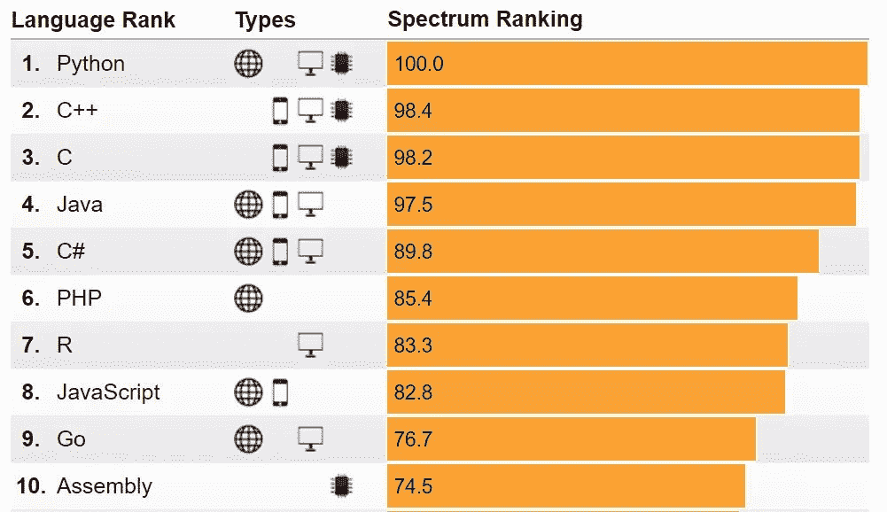

****编程语言2019****

**2019最受欢迎的编程语言**

IEEE Spectrum 于9月6日发布了2019年最受欢迎的编程语言排名。下面让我们来看下这份新鲜出炉的排名名单Top10吧。

接下来，是2018及2017年的排名数据。

2018最受欢迎的编程语言Top10

2017最受欢迎的编程语言Top10

无疑Python蝉联冠军，C++、Java、C江湖地位也不可动摇，还有matlab异军突起。来看下具体情况。

**冠军：**

python：自2017年首次登顶后，蝉联三届冠军。人生苦短，我用python不只是说说啊。Python的受欢迎程度在很大程度上受到大量可用的专用库的影响，特别是在人工智能领域，Keras库是深度学习开发人员中的重量级人物：Keras提供了TensorFlow的接口，CNTK，和Theano深度学习框架和工具包。深度学习并不是Python在1991年首次发布语言时无法预料的唯一领域，微控制器中计算能力的急剧增加意味着嵌入式Python版本，如CircuitPython和MicroPython，在制造商中越来越受欢迎。

**Top2-5：**

python，Java，C++，C稳居前四，C#跌出前5，R语言成功晋级，其流行程度很大程度得益于大数据的时代潮流。

**Top6-10：**

Go，R，JavaScript是前十名里的常客，PHP，Swift语言也都成功出现2次。matlab突进前10，官方对此给出了一个解释：反映了该语言在硬件工程中的突出地位，特别是对于那些对运行模拟感兴趣的人或者通过MathWorks的图形化Simulink软件包创建控制系统。

**拓展阅读·IEEE顶级编程语言**

**设计，方法和数据源**

IEEE Spectrum最受欢迎的编程语言评选过程中，综合应用了8个源11个指标的数据。 这些数据来源涵盖了包括社交聊天，开源代码生成和职位发布等方面的内容。 我们分析下这些数据源。

**海选---确定最初入围评选的名单：**

首先从GitHub上收集获得一份编程语言列表，包含300多种语言。利用“X编程”模板关键词搜索每个语言，得到该关键词在Google上找到的结果量，其中“X”是该语言的名称，例如，利用搜索“Python编程”关键词，得到在Google上的结果量数据。根据结果量数据，去除掉搜索结果数量非常少的语言，将剩余列表条目进行简单的人工筛选后，剩下了参与评选的52种语言。进行了简单的"海选"之后，接下来是凭借真本事竞争的时刻了。衡量这52个语言的受欢迎程度采用了哪些数据源呢，我们来看看数据的来源到底有哪些吧。

**数据来源及主要参考指标**

**谷歌搜索**

利用Google的API搜索模板“X编程”来衡量每种语言的点击次数。此数字表示每种编程语言的在线信息资源量。

**谷歌趋势**

使用模板“X编程” 测量了Google趋势报告的每种语言的索引数量。此数字表示对特定语言信息的需求，因为Google趋势衡量人们搜索特定术语的频率。由于它衡量的是搜索活动而非信息可用性，因此Google趋势可以提供评选结果的一种早期趋势。

**推特**

使用Twitter Search API测量截至2019年6月的12个月模板“X编程”在Twitter上的点击次数。此数字表示该语言在社交媒体上的聊天量，反映了新闻文章或书籍等在线资源的共享情况，以及黑客马拉松等物理社交活动数据。

**GitHub**

使用GitHub API和GitHub标记，测量截至2019年6月的12个月的两个数据：（1）为每种语言创建的新存储库的数量（2）每种语言的活动存储库的数量，其中“活动”表示有人编辑了已有存储库中的代码。新存储库的数量衡量围绕语言的新活动，而活动存储库的数量衡量了开发每种语言的持续兴趣。

**Stack Overflow网站**

Stack Overflow是一个受欢迎的网站，程序员可以在这里询问有关编码的问题。IEEE Spetrum官方测量了截至2019年6月结束的12个月中提及每种语言的问题数量。每个问题都标有正在讨论的语言，这个语言标签是参考的重要指标。

**Reddit网站**

Reddit是一个新闻和信息网站，用户可以在其中发布链接和评论。在Reddit上，同样也是使用2018年6月至2019年6月的模板“X编程”，在网站上的任何子版本中测量了提及每种语言的帖子数量。

**Hacker News**

Hacker News是一个新闻和信息网站，用户发布和评论有关技术的新闻链接。在截至2019年6月的12个月中，官方使用模板“X编程”测量了提及每种语言的帖子数量。就像Topsy，Stack Overflow和Reddit网站使用的那些，该指标还捕获社交活动和信息分享各种语言。

**CareerBuilder招聘网**

在CareerBuilder作业现场测量了对不同编程语言的需求。在美国网站上衡量提及该语言的新职位空缺数量（不到30天）。对于在纯文本中可能不明确的某些语言 - 例如D，Go，J，Processing和R(例如Go，纯文本中仅仅是走的意思，而不是指Go语言)-对这些语言使用“X编程”形式的严格匹配。对于其他语言，使用由“X AND编程”组成的搜索字符串，有益于捕获更广泛的相关帖子。

**IEEE Job Site**

在IEEE Job Site测量了工作发布中对不同编程语言的需求，文本类的处理方式与上一条完全相同。

**IEEE Xplore数字图书馆**

在IEEE Job Site测量了工作发布中对不同编程语言的需求。文本类的处理方式与上一条完全相同。

**为你喜欢的语言投一票**

看完了文章后，对常用的编程语言有了进一步的认识了吧。 那快来对你喜欢的或者常用的语言投上一票吧，或者可以在留言区分享一下你与它之间的故事吧~

文字整理 | 静修

排版 |蜉蝣

