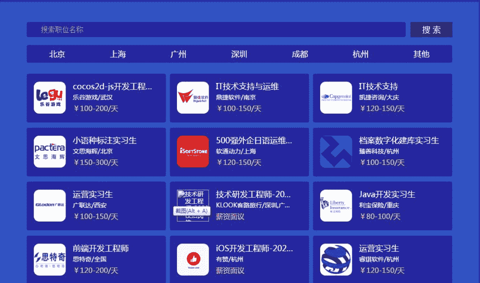
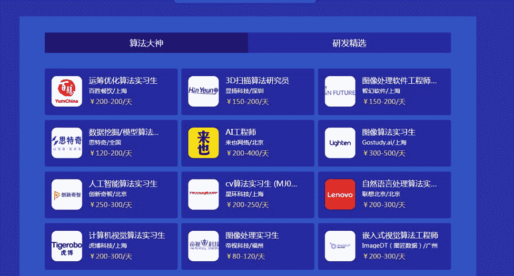
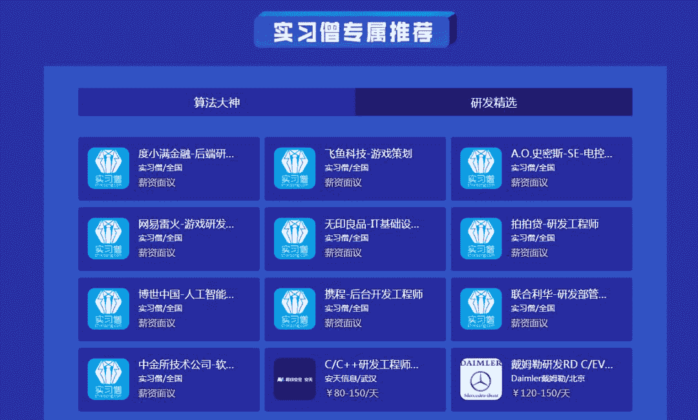
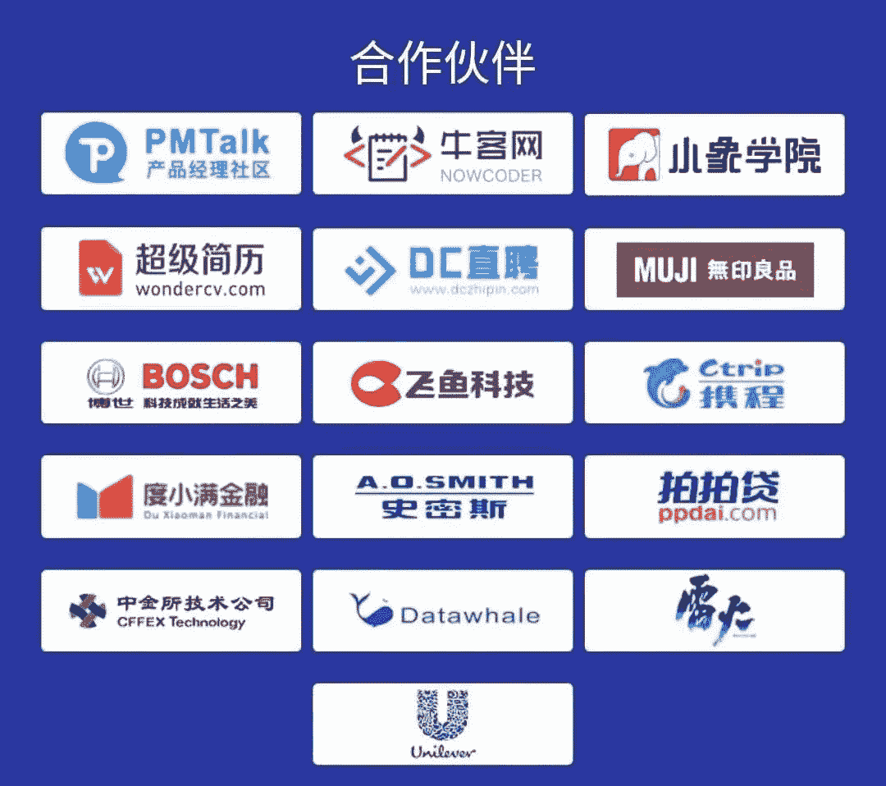

又到了“金九银十”，大家为找工作忐忑不安，跃跃欲试的时节。为了帮助准备就业或者实习的同学找到心仪的单位，Datawhale联合实习僧为大家带来秋招专场，涵盖了 **可** **转正专区、算法大师区、研发＆** **内** **推区** ，希望能为大家求职带来帮助。

**IT软件应届生招聘专场**

 转正专场+专属内推 

 实习僧带你玩转IT 

立即识别上方二维码

**查看职位**并**投递简历**

主要分为三个专区：实习可转正岗位、算法大神岗和研发岗。

**专区一：实习可转正岗位**

校招正当时，如果觉得互联网校招的难度太大，同学们可以考虑一下**可转正的实习职位**。因为实习的难度远小于秋招，实习结束的同时也顺便把offer拿了。

**专区二：算法大神黑科技区**

算法领域是IT行业门槛最高的岗位，堪比高数里的微积分（说多了都是泪），但算法能力又是IT行业最受重视的专业能力之一。

**联想、网易、阅文集团、新东方**等大厂都在招算法实习生，有能力的同学快戳进算法专场，把简历投起来！

**专区三：研发（含内推）专区**

除了推荐岗位，也为大家带来了**无印良品、联合利华、携程、网易雷火**等大厂的研发内推渠道，简历由实习僧筛选后直接发送至对应公司hr邮箱中，将有机会**直通面试**。

除了专属内推以外，还准备了**哈啰出行、飞利浦、百度、蚂蚁金服、滴滴出行**等知名大厂的研发岗位。

秋招的战役已经打响，既然选择了互联网行业，选择了秋招，不管有多艰难，既然选择了它，就把握时间，抓住机会，去不断完善自己。

加油！朝着自己想要的方向努力，相信你一定能斩获你心仪的offer！

-----------------------

中秋彩蛋：下面是1个抽奖链接按钮，9月14日晚上20点开奖，祝大家中秋快乐，工作美满。

点击**阅读原文**，立即报名。