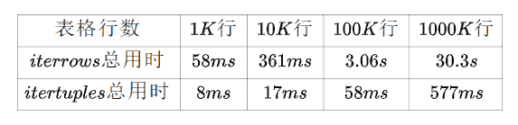
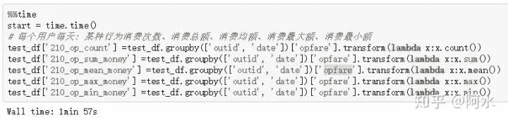
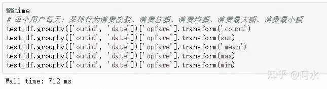
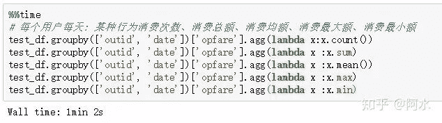
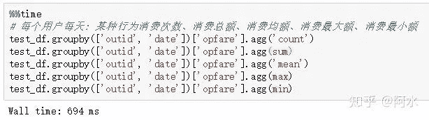
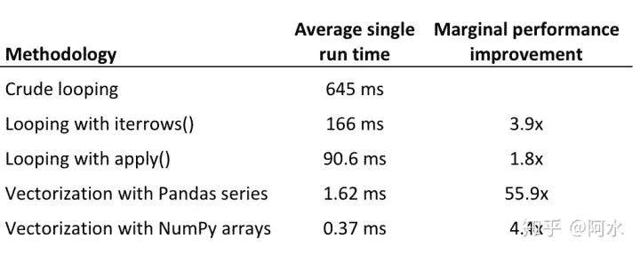

点击上方“**Datawhal****e**”，选择“星标”公众号

第一时间获取价值内容

`Pandas`是数据科学和数据竞赛中常见的库，我们使用`Pandas`可以进行快速读取数据、分析数据、构造特征。但`Pandas`在使用上有一些技巧和需要注意的地方，如果你没有合适的使用，那么`Pandas`可能运行速度非常慢。本文将整理一些`Pandas`使用技巧，主要是用来节约内存和提高代码速度。

## **1 数据读取与存取**

在`Pandas`中内置了众多的数据读取函数，可以读取众多的数据格式，最常见的就是`read_csv`函数从csv文件读取数据了。但`read_csv`在读取大文件时并不快，所以建议你使用`read_csv`读取一次原始文件，将`dataframe`存储为HDF或者feather格式。一般情况下HDF的读取比读取csv文件快几十倍，但HDF文件在大小上会稍微大一些。

> 建议1： 尽可能的避免读取原始csv，使用hdf、feather或h5py格式文件加快文件读取；

在某些定长的字符数据的读取情况下，`read_csv`读取速度比`codecs.readlines`慢很多倍。同时如果你想要表格尽量占用较小的内存，可以在`read_csv`时就设置好每类的类型。

## **2 itertuples与iterrows**

`itertuples`和`iterrows`都能实现按行进行迭代的操作，但在任何情况下`itertuples`都比`iterrows`快很多倍。

> 建议2：如果必须要要用iterrows，可以用itertuples来进行替换。

## **3 apply、transform和agg时尽量使用内置函数**

在很多情况下会遇到`groupby`之后做一些统计值计算，而如果用内置函数的写法会快很多。

<figcaption>*transform() 方法+自定义函数，用时1分57s*</figcaption>

<figcaption>
</figcaption>

<figcaption>*transform() 方法+内置方法，用时712ms*</figcaption>

<figcaption>
</figcaption>

<figcaption>*agg() 方法+自定义函数，用时1分2s*</figcaption>

<figcaption>
</figcaption>

<figcaption>*agg() 方法+内置方法，用时694ms*</figcaption>

<figcaption>
</figcaption>

> 建议3：在grouby、agg和transform时尽量使用内置函数计算。

这一部分的统计数据来自：https://www.cnblogs.com/wkang/p/9794678.html

## **4 第三方库并行库**

由于`Pandas`的一些操作都是单核的，往往浪费其他核的计算时间，因此有一些第三方库对此进行了改进：

*   modin：对读取和常见的操作进行并行；

*   swifter：对`apply`函数进行并行操作；

当然我之前也对此类库进行了尝试，在一些情况下会快一些，但还是不太稳定。在阿里云安全赛中我是用`joblib`库写的并行特征提取，比单核特征提取快60倍。

> 建议4：如果能并行就并行，用第三方库或者自己手写多核计算。

## **5 代码优化思路**

在优化`Pandas`时可以参考如下操作的时间对比：

> 建议5：在优化的过程中可以按照自己需求进行优化代码，写代码尽量避免循环，尽量写能够向量化计算的代码，尽量写多核计算的代码。

`Pandas`官方也写了一篇性能优化的文章，非常值得阅读：

https://pandas.pydata.org/pandas-docs/stable/user_guide/enhancingperf.html

