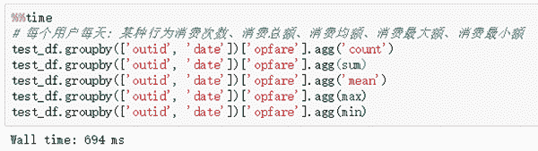

点击上方“**Datawhal****e**”，选择“星标”公众号

第一时间获取价值内容


为了帮助更多竞赛选手入门进阶比赛，通过数据竞赛提升理论实践能力和团队协作能力。DataFountain 和 Datawhale 联合邀请了数据挖掘，CV，NLP领域多位竞赛大咖，将从赛题理解、数据探索、数据预处理、特征工程、模型建立与参数调优、模型融合六个方面完整解析数据竞赛知识体系，帮助竞赛选手从0到1入门和进阶竞赛。

下面是大咖分享

???

数据挖掘方向


杰少 ID：尘沙杰少

简介：南京大学计算机系毕业，现任趋势科技资深算法工程师。20多次获得国内外数据竞赛奖项，包括KDD2019以及NIPS18 AutoML等。

特征工程被称为是数据挖掘竞赛的艺术，要做好特征工程需要不断的练习和总结。

特征工程的构建有很多方法，但目前有两类是比较常见的，

第一类，可以**从特征的类型出发**进行特征工程的构建，典型的就是AutoML比赛；通过整形，浮点型，类别型，多值型等数据出发对特征进行构建；

第二类，**从业务的角度出发**进行特征工程的构建，传统的有业务背景的比赛大多如此，可以从赛题的业务背景出发来进行特征工程的构建。对业务了解的越深，往往也可以取得更好的结果，最典型的比赛就是kaggle的天文赛，天文系的博士通过专业的背景知识构建了很多专业的特征，拿下了kaggletop1.

当然上面所说的特征工程，还需要看所**采用的模型**，模型选用的不同对于特征工程的构建也会带来些许区别。

最近CCF有很多比赛，希望大家去比赛中细细体会我上面说的，加油！


王贺 ID：鱼遇雨欲语与余

简介：武汉大学硕士，2019年腾讯广告算法大赛冠军选手，京东算法工程师，一年内获得两冠四亚一季的佳绩。

一般特征工程分为数据预处理、特征提取、特征选择三个部分。这里给大家推荐一个链接，包含特征工程的基本套路。

https://www.slideshare.net/HJvanVeen/feature-engineering-72376750
讲到了数据清洗的方法，对于数值特征、类别特征、时间和文本相关等特征的常 见处理方法。 最后讲到了三种特征选择的方法。 很值得反复学习的。


*双击查看大图*


林有夕 ID：林有夕

简介：2019 DCIC移动信用评估冠军/KDD CUP，全球Rank 2以及其他多个冠亚军。

为什么需要特征？ 因为你知道有些知识，模型学不到，所以首先你得大致的清楚，你的模型能学到什么样的特征。 不同的模型，学到的信息不一样，学不到的信息也不一样。
然后当你做一个特征的时候，你要想清楚为什么这样尝试？ 为什么你认为这个特征有用，比如，以前的类似比赛用过类似的特征； 通过对**业务的理解**进行推理出来的； 通过**数据观察**(EDA)，发现该特征下，label的表现差异比较大（如果特征是随机数的时候，label理论上差异是最小的），一个具有良好依据的特征解释，是特征有效的根本。
最直接有效的特征验证的方法就是代入模型验证，所以一个合理的验证策略变得极为重要。 这里一定要留意的一个问题就是，要正确理解什么是“抖动”，抖动存在很多地方，一个随机种子，不同的列的顺序，行的顺序，线上线下数据集等。 你所期望的结果，一般需要考虑一下数据集中自身存在的抖动收益。关于常用特征的套路和体系，在一些知乎上可以搜到。 我这里的建议是**结合业务，由自身理解出发**，假设如果没有模型，一个智慧的人，会得出那些和结果相关的基本事实和推理。 然后再去考虑如何将你的结论转化为具体的特征，输入给模型。


王茂霖 ID：ML67

简介：华中科技大学研究生，DCIC-2019风电赛Top2选手。

特征工程：比赛之中的必杀技

特征工程是比赛中最至关重要的的一块，特别的传统的比赛（非图像和NLP）,特征工程的好坏往往决定了排名和成绩，特征工程的处理我们可以分为几大块，当然现在我们所说的已经是数据做过异常值处理，缺失值处理，编码，去噪等预处理之后的特征处理方式。

首先是单纯**基于数据特征**的处理，往往有些比赛的特征是匿名特征，这导致我们并不清楚特征相互直接的关联性，这时我们就只有单纯基于特征进行处理，比如装箱，groupby,agg等这样一些操作进行一些特征统计，再进一步进行特征的log，exp等变换，对于特征相互之间进行四则运算，多项式组合等然后筛选等。当然，由于特性的匿名性其实限制了很多对于特征的处理，当然有些时候用NN去提取一些特征也会达到意想不到的良好效果。

另一方面是知道特征含义（非匿名）的特征工程，特别是在工业类型比赛中，会基于信号处理，频域提取，丰度，偏度等构建更为有实际意义的特征，这就是结合背景的特征构建，在推荐系统中也是这样的，各种类型点击率统计，各时段统计，加用户属性的统计等等，这样一种特征构建往往要深入分析背后的**业务逻辑**或者说物理原理，从而才能更好的找到magic。

当然特征工程其实是和模型结合在一起的，对于特征的处理效果和特征重要性往往要通过模型来验证。


谢嘉元 ID：谢嘉嘉

简介：华南理工大学博士，多次数据挖掘竞赛中获得优异成绩。

特征工程作为数据挖掘中极其重要的部分，我们在解决任务的时候是需要花大量的时间在这上面。做特征工程之前，我们要先构建好线下验证集，因为这样我们才可以对我们的特征进行验证。构建的线下验证集我们最理想的情况当然是线上线下同样的分数，但是这是很理想的情况了，我们往往得到的线下验证集只需要满足线上线下同增减便可。

那么构建好线下验证集之后，我们就需要开始进行特征工程了。对于大多数的分类问题而言，如购买预测，点击预测等等，都会出现两个对象，一个一般是用户，另一个则是商品或物品，抽象出来那么相当于就是**人**跟**物**了。那么我们便可以从三个方面进行思考特征工程。

‍1\. 人是怎么样的人？2\. 物是怎么样的物？3\. 人跟物是怎么样的一种关系？

那么，我们就可以从这三个问题或者三个方面进行特征构建。下图所示为购买预测比赛的特征，我们从user/item/user-item进行入手构建特征。


时间序列回归问题特征构建，时间序列问题需要对历史数据数值进行统计，我们需要选择好不同的/合适的窗口进行统计，统计出来正常的统计值sum，mean，median，std外，还可以使用乘以衰减系数的方法进行加权求和统计。


钟昌盛 ID：真我小兔子乖乖

简介：Kaggle: Elo Merchant Category Recommendation亚军、2019-kddcup top10、2018ccf电信套餐个性化匹配模型亚军。

工欲善其事，必先利其器。

数据和特征决定了机器学习的上限，而模型和算法只是逼近这个上限而已。

什么是特征工程呢？

特征工程最主要的是要考虑到工程上，由于工程的基础上，通过专业背景知识和技巧处理数据，改善特征或者构建新的特征能在机器学习算法上发挥更好的作用的过程。

下面这张图，归纳和总结了特征工程的方式。


特征工程有很多种方式：数据采集 / 清洗 / 采样

**特征处理**

**1\. 数值型**

    单独数值特征

**2\. 类别型**

    one-hot编码

**3\. 时间型**

    对时间进行特征工程

**4\. 文本型**

    Python中用CountVectorizer处理词袋．

    使用TF-IDF特征

    w2v特征

**5\. 统计型**

    https://www.cnblogs.com/wkang/p/9794678.html

    5.1 我经常使用transform构建


   5.2 经常使用apply构建

    5.3 经常使用agg构建



    5.4 如果还有困难，则可以使用函数（这个是pandas函数用在多列）

```
def my_test(a, b):	
return a + b	
df[‘value’] = df.apply(lambda row: my_test(row[‘c1’], row[‘c2’]), axis=1)	
df[‘value’] = df.apply(my_test2):函数用在单列
```

做完特征后，往往是**特征选择**：

**1\. Filter**

    1.1 方差选择法

    这种类型在高斯分布数据特别有效

```
from sklearn.feature_selectionimport VarianceThreshold
```

    （kaggle IG那题）

    1.2 相关系数法

    相关性越高，二者工程可能越小

```
from sklearn.feature_selectionimport SelectKBest	
from scipy.stats importpearsonr
```

    1.3 卡方检验

    卡方检验就是统计样本的实际观测值与理论推断值之间的偏离程度，实际观测值与理论推断值之间的偏离程度就决定卡方值的大小，如果卡方值越大，二者偏差程度越大；反之，二者偏差越小；若两个值完全相等时，卡方值就为0，表明理论值完全符合。

```
from sklearn.feature_selectionimport SelectKBest	
from sklearn.feature_selectionimport chi2
```

   1.4 互信息法

```
from sklearn.feature_selection importSelectKBest	
from minepy import MINE
```

**2\. Wrapper**

    2.1 递归特征消除法

```
from sklearn.feature_selectionimport RFE	
from sklearn.linear_modelimport LogisticRegression
```

**3\. Embedded**

    3.1 基于惩罚项的特征选择法

    3.2 基于树模型的特征选择法

```
from sklearn.feature_selectionimport SelectFromModel	
from sklearn.ensemble importGradientBoostingClassifier
```

    接下来就是降维了

    3.3 PCA 和LDA

    我们发现，机器学习特征工程基本囊获了数据预处理，特征工程，特征筛查等各种步骤，每一种方法对于你的模型预测是否有效，是需要通过你不断验证的。NLP方向


张浩 ID：reborn_ZH

简介：CCF2018供应链需求预测亚军、2019搜狐内容识别算法大赛季军。

在这一部分，我接着前面的内容继续介绍，还是针对2019搜狐内容识别算法大赛来讲解。

通过序列标注BIEOS的方式确定实体词的边界。其中，B表示实体首字，I表示实体中间位置，E表示实体词尾字，O表示非实体词，S表示单个字符实体。如下图所示：


将数据标注为BIEOS的方式后，使用BERT+CRF的方式进行序列标注。其中，我们把BERT和CRF结合起来是因为CRF可以通过统计label直接的转移概率对BERT的结果加以限制，比如I标签后面不能接O标签，B标签后面不能接B标签，如果没有CRF，光靠BERT就做不到这点。BERT+CRF的网络结构如下图所示：


在这里，我们不采用序列标注的方式来预测实体词，而是把该任务转化为一个四分类问题，即把实体的标签和情感的标签合在一起，预测每一个词语为实体正向情感、实体负向情感、实体中性情感和非实体的概率，然后选择概率最大的一类作为预测结果。如果一个词语的预测结果属于实体正向情感、实体负向情感或者实体中性情感，则认为这个词语是实体词，否则认为是非实体词。这样我们在预测核心实体词的同时，还能预测核心实体词的情感倾向，从而可以建立一个快速有效的端到端的模型。联合训练四分类模型网络结构如下图所示：


CV方向


徐光福 ID：天灵灵地灵灵

简介：多次目标检测比赛第一、2018之江杯VQA比赛第二。

CV方向的比赛虽然本质上也是抽取特征并对特征做相应处理，但似乎并不需要传统意义上的特征工程。


王博 ID：000wangbo

简介：西安电子科技大学研究生，一个不断在CV道路上探索的小白。

CV中特征工程不太常见，不过图像加结构化数据的比赛中特征工程仍然是一个重要的部分。

https://dianshi.baidu.com/competition/30/rule

附上亚军的github：

https://github.com/zhuqunxi/Urban-Region-Function-Classification