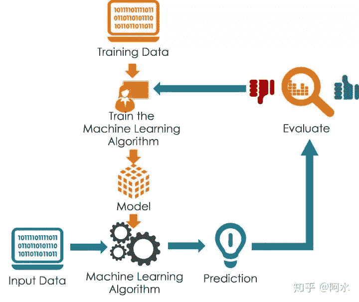
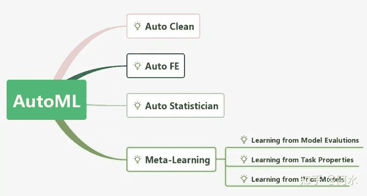
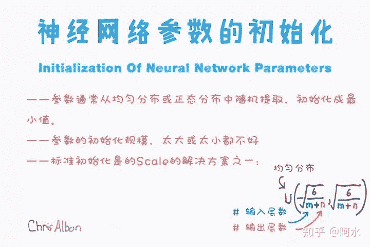

点击上方“**Datawhal****e**”，选择“星标”公众号

第一时间获取价值内容

本文将对数据竞赛的『技巧』进行全面的总结，同时还会分享下个人对比赛方法论的思考。前者比较客观，总结了不同数据类型下涉及到的比赛技巧；后者稍微主观，是我个人对解决比赛思路的总结。

2019年下半年对我触动很大的两个知识分享是：

*   志峰现场讲解的《Tricks in Data Mining Competitions 》

*   鱼佬知识星球分享的《Kaggle数据竞赛知识体系》

> 注： 这两个分享的原始资料，不要向我要，我没有所有权。

碰巧最近也想将一些知识点整理下，本文将会参考上述两个分享的结构来整理我个人的知识点。当然我整理的会比较杂，会按照讨论点进行整理。

## **1 数据竞赛的流程**

这是老生常谈的话题：数据分析主要目的是分析数据原有的分布和内容；特征工程目的是从数据中抽取出有效的特征；模型训练与验证部分包括数据划分的方法以及数据训练的方法；模型融合部分会简介模型融合的方法和实现方式。

**我想表达的是：****虽然数据挖掘在流程上可以看成是瀑布式的，但各个流程相互影响：**比如数据分析可以挖掘出数据的分布规律，可以指导特征工程；特征的验证又可以反馈数据分析的结果。**所以在实际比赛过程中这个流程是反复循环的，并不是一蹴而就的。**

*数据挖掘是一个循环的过程，并不是瀑布式的*

一个特征不是拍脑袋想的，其最开始从EDA发现的，然后通过模型本地CV和线上PB得分进行验证。所以我对比赛的baseline代码分享一向比较谨慎，一是baseline是最终的代码并不能包括失败的尝试；二是很多选手并不会跑baseline代码只是为了排名，并不会尝试去理解代码的逻辑。**在数据竞赛流程上比较重要的一点是：****你要知道你现在处于哪一个步骤，下一步应该做什么，还有哪些TODO和改进的地方。**

### **1.1 数据分析**

在拿到数据之后，首先要做的就是要数据分析(Exploratory Data Analysis,EDA)。数据分析是数 据挖掘中重要的步骤，同时也在其他阶段反复进行。可以说数据分析是数据挖掘中至关重要的一步，它给之后的步骤提供了改进的方向，也是直接可以理解数据的方式。

拿到数据之后，我们必须要明确以下几件事情：

1.  数据是如何**产生**的，数据又是如何**存储**的；

2.  数据是原始数据，还是经过人工处理(二次加工的)；

3.  数据由那些**业务背景**组成的，**数据字段**又有什么含义；

4.  数据字段是什么**类型**的，每个字段的**分布**是怎样的；

5.  训练集和测试集的数据分布是否有差异;

在分析数据的过程中，还必须要弄清楚的以下数据相关的问题：

1.  数据量是否充分，是否有**外部数据**可以进行补充；

2.  数据本身是否有噪音，是否需要进行**数据清洗**和**降维操作**；

3.  赛题的**评价函数**是什么，和数据字段有什么关系；

4.  数据字段与赛题标签的关系；

以上细节可能在部分赛题中非常有必要，但具体操作是否有效还是要具体进行尝试。

### **1.2 赛题背景分析**

在进行数据分析步骤前后，我们还需要对赛题的背景进行理解。赛题背景分析能够帮助我们理解赛题的任务，以及赛题数据的收集和评价方法。当然有些赛题的业务逻辑比较简单，容易理解；但有一些赛题的业务逻辑经过匿名处理，就会导致很难对赛题进行理解。

无论出题方给定了多少赛题介绍，参赛选手还是要自己从新理解一遍赛题，这样可以加深赛题的印象。有很多时候，赛题的一些细节会直接影响到最后的精度，而这些关键的细节是需要人工发现的。

总的说来赛题背景分析包括以下细节：

1.  赛题业务场景是什么，数据是如何产生的，数据标签如何得来的？

2.  赛题任务是什么，具体要解决的问题是如何定义的；

3.  赛题任务是否有对应的学术任务？

**在赛题背景分析步骤中最重要的是分析赛题是什么任务，赛题任务是什么问题，历史是否有类似的赛题，学术上是否有对应的问题。**如果历史有类似的比赛/学术上对应的问题，那么直接copy解决方案来就OK了。

### **1.3 数据清洗**

数据清洗步骤主要是对数据的噪音进行有效剔除。数据噪音可能有多个来源，来源于数据本身，来源于数据存储，或来源于数据转换的过程中。因为噪音会影响特征，也会影响最后的模型结果，因此数据清洗是非常有必要的。

数据清洗可以从以下几个角度完成：

1.  对于类别变量，可以统计比较少的取值；

2.  对于数字变量，可以统计特征的分布异常值；

3.  统计字段的缺失比例；

### **1.4 特征预处理**

特征预处理包括如下内容:

1.  量纲归一化：标准化、区间放缩

2.  特征编码：

    1.  对于类别特征来说,有如下处理方式:

        1.  自然数编码(Label Encoding)

        2.  独热编码(Onehot Encoding)

        3.  哈希编码(Hash Encoding)

        4.  统计编码(Count Encoding)

        5.  目标编码(Target Encoding)

        6.  嵌入编码(Embedding Encoding)

        7.  缺失值编码(NaN Encoding)

        8.  多项式编码(Polynomial Encoding)

        9.  布尔编码(Bool Encoding)

    2.  对于数值特征来说，有如下处理方式：

        1.  取整(Rounding)

        2.  分箱(Binning)

        3.  放缩(Scaling)

3.  缺失值处理

    1.  用属性所有取值的平均值代替

    2.  用属性所有取值的中位数代替

    3.  用属性所有出现次数最多的值代替

    4.  丢弃属性缺失的样本

    5.  让模型处理缺失值

这一部分内容可以参考这个PPT：

https://www.slideshare.net/HJvanVeen/feature-engineering-72376750

### **1.5 特征工程**

特征工程与EDA联系紧密，可以说是EDA具体的操作吧。因为数据分析本身就是“假设”-“分析”-“验证”的过程，这个验证的过程一般是指构建特征并进行本地CV验证。

可以从一下几个角度构建新的特征：

1.  数据中每个字段的含义、分布、缺失情况；

2.  数据中每个字段的与赛题标签的关系；

3.  数据字段两两之间,或者三者之间的关系；

特征工程本质做的工作是，将数据字段转换成适合模型学习的形式，降低模型的学习难度。

## **2 结构化数据技巧**

常规的特征工程已经人人都会，不过我还是建议可以学习AutoML的一些操作，互补学习下。至少在结构化数据领域，常见的操作它都会。

在结构化数据中，针对不同的赛题任务有不同的magic feature。比如用户违约风控类赛题需要考虑用户信息的交叉编码，用户流程等CTR类型赛题可以考虑target encoding，回归类赛题可以对对赛题目标进行标准化。如果赛题类型已知，则可以优先用此类方法进行求解。

如果赛题是匿名数据挖掘，则需要煎饼果子啥都来一套了（任何操作都试试）。此外在匿名数据和多模态数据赛题中，可以尝试下降噪自编码器。

## **3 非结构化数据技巧**

**非结构化数据一定要找准baseline，一定要找准base model。**

### **3.1 视觉类型任务**

常见的视觉任务包括:1\. 图像分类(ImageClassification)2\. 图像检索(Image)3\. 物体检测(ObjectDetection)4\. 物体分割(ObjectSegmentation)5\. 人体关键点识别(PoseEstimation)6\. 字符识别

OCR(OpticalCharacterRecognition)

如果是简单的分类任务，可以直接手写CNN分类模型；如果是物体检测、图像分割、人体关键点检测、人脸识别等，优先找成熟的框架和模型。都9012年了，学深度学习不要只会分类。

在视觉类型赛题中，数据扩增非常重要，具体的数据扩增方法与具体的赛题相关。找好base model，找好数据扩增方法，基本上成功了一半。

## **3.2 文本类型任务**

文本任务我不太熟，我只会BERT。文本任务设计到的技巧有：

1.  TFIDF

2.  词向量

3.  GPU

在这个bert满天飞的时期，大家一定要保持对技术的耐心。不要只会bert，盲目的使用bert。bert虽然很好，但NLP的基础不能跳过不学。

在炼丹过程中还有一些细节需要考虑，比如参数初始化、batch size、优化器、未登录词的处理和网络梯度裁剪等，这些都是要自己根据任务进行总结的。

## **4 如何选择一个合适的数据竞赛?**

最后我想聊聊如何选择一个合适的赛题。现在数据科学竞赛非常多，国内外大大小小的企业都可以组织各种类型的数据科学竞赛。竞赛多 了可选择的机会也多了，但对于每个参赛选手来说我们的时间和精力是有限的，所以选择一个合适的竞赛参赛就至关重要了。这里的合适的含义带有一定的主观色彩，我会从竞赛内容和个人收获两个方面来阐述。

首先数据竞赛的形式非常多：有的赛题要求选手开发应用，有的要求选手设计优化算法，有的要求选手提出解决方案。**选择赛题一定要选择自己擅长或者想学习的赛题**，一定要选择尽量靠谱公平的赛题(国内比赛偶尔会出现名次内定的情况)。此外还要根据具体的赛题日程和规则进行衡量，尽量选择日程安排比较紧凑合理的赛题，尽量选择换排行榜(切换不同测试集重新排名)的赛题。

此外赛题中也有不同的赛题类型，有结构化、语音、图像、视频和文本不同类型的。我期望大家是尽量能够多参加不同类型的赛题，不要受到数据形式的限制，多接触各种类型的算法和知识。其实很多知识点都是类似的，在语音识别和语音分类中的特征提取操作或许能够用在某些结构化数据上，CNN 操作也经常用在语音分类上，序列数据通常可以用词向量来编码。

此外由于数据竞赛本身具有一定的随机性(数据噪音、算法的随机性和优化过程的随机性)，导致不同选手使用相同的数据和相同代码得到的结果在精度上都有差异。举个例子在 XGBoost 算法中有很多超参数可以调节，而不同的超参数可能会带来一定的精度差异。我建议大家尽量参加不是由随机性主导排名的比赛，尽量参加随机性小一点的竞赛。

最后还可以从赛题的奖励和赛制进行选择，我个人比较倾向于 TOP10 都有钱的比赛，同时国内比赛都有现场答辩的环节，所以比赛答辩城市也可以考虑下。