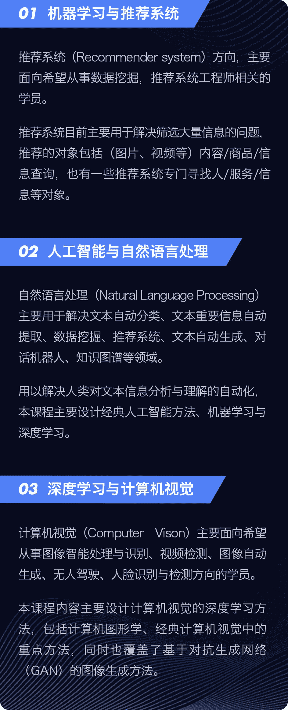
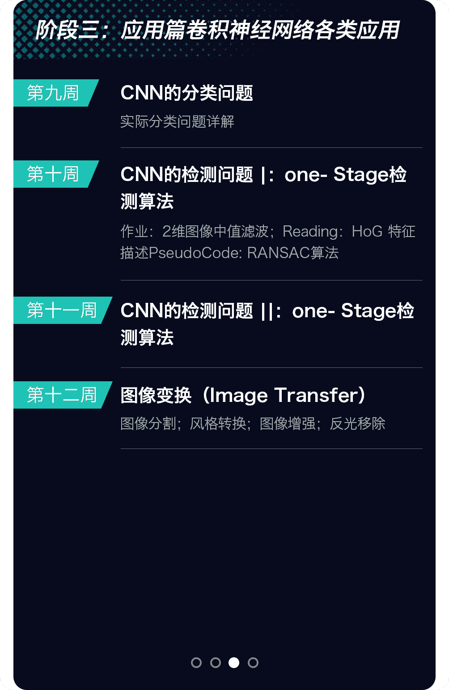
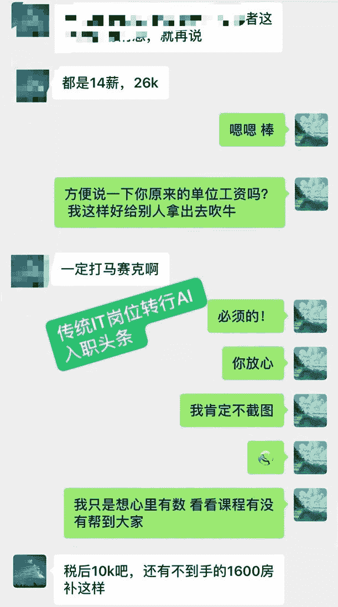

     2019年计算机科学最高奖金图灵奖，授予了三位AI领域的杰出科学家: Geoffrey Hinton, Yann LeCun和Yoshua Bengio。人工智能尤其是基于深度学习的人工智能，在科学界获得了最高的认可。

     而在产业界，前阵子朋友圈也被华为刷屏了，总裁办发布通知，宣布对8位2019届应届博士毕业生实行年薪管理制度，**研究人工智能的钟钊博士位居榜首，年薪高达201万！**

     AI行业正处于高速蓬勃发展阶段，无人驾驶、无人机、人脸识别等等技术应用正在逐渐深刻地改变着我们的生活。

     本课程可以帮助你在**4-6个月内**找到一份人工智能、机器学习、深度学习、数据科学家、算法工程师、Python工程师等AI相关岗位，学完**能力即可对标百度T4-T5/阿里P5-P6**的级别，或者也可申请到美国、欧洲相关院校AI方向的学位。

**本课程涉及3大AI主流方向**

     人工智能与机器学习目前应用于各个领域，常见到的有智能机器人、智能客服、人脸识别、无人驾驶、数据挖掘、异常检测、自动推荐系统等。总体来说可以分为**自然语言处理(NLP)、****计算机视觉(CV)**和**推荐系统(RS)**。本课程由相关领域的资深专家深度参与，讲解这3个方向的技术与原理要点，**课程难度对标一流大学研究生课程**，能够帮助同学们在4-6个月内达到能够解决企业常见问题、理解重要原理的水平。

**主修 + 选修系统性训练**

     本此课程培训采用大学的系统化培养方式，**每个同学可以主修一门课程，并且可以旁听另外一个方向的课****程。****并且****为所有学员精选了专业能力提升的选修课和全院公选课。****能够使不同基础、不同偏重的同学们有的放矢，获得相应的提升。**

**真实企业级项目驱动**

     课程组负责为大家提供数据集、项目指导。**这些项目均来自于企业的真实项目需求，其数据集和任务要求与企业中的真实水平一致。**参与这类项目一方面可以让大家巩固理论知识，另一方面也是大家可以**放进简历中极具含金量的项目经历。**

**REC**

**REC**

**REC**

**3大方向详细授课内容**

     本课程3个方向的主修课程特点是：**夯实基础**、**实践驱动，****能够带领大家从原理到实践，完成真正的AI能力提升。**具体大纲如下:

**推荐系统方向**

>>滑动查看课程 <<

**NLP方向**

>>滑动查看课程 <<

**CV方向**

>>滑动查看课程 <<

**报名后邮件自动发送完整大纲**

**从0到1掌握算法原理**

     我们的课程全部由真实代码驱动，能够让你从头到尾看到一个算法的实现过程。**提供给你从0到1实现算法的能力**，这是提升自身编程水平的重要保证。

**名校助教答疑+配套式课后作业**

     除了项目驱动，我们课程的每节课都会给大家布置充实的作业练习。**作业练习都具备一定难度，练习强度大，让同学们在实现完整算法模型的过程中同时具备解决实际问题的能力。**

**第一周作业：基于Syntax Tree&Language Model 实现西部世界智能对话系统**

**第二周作业：北京市地铁自动换乘**

**助教团队**

>>滑动查看助教介绍<<

   **本课程的老师，均来自国际名校（清华大学、佛罗里达大学、浙江大学）且均具备世界知名企业（阿里巴巴、商汤科技、IBM中国实验室）的实际工作经验****。**我们相信，唯有真正的资深老师 + 良好的表达传授能力，才能给同学们真正的知识。**同学们学到的，不仅仅是AI知识，更是一种学习习惯、思维方式和对世界的认知。**

      自2017年本AI课程招生开始，**连续四期，累计培养近千名学员，其中前三期（第四期还未毕业）80%的同学拿到了offer，其中不乏国内外知名企业的算法岗位或者国外名校的AI Phd，Master的offer**。下图所列举校友资源仅为第四期部分学员。

>>滑动查看校友情况 <<

**学员评价**

>>滑动查看往期学员反馈 <<

     考虑到广大学员的不同就业需求，本次班期开设以下课程类型可供选择。

     本次课程**培训为期时长6个月，其中核心授课时间4个月，就业指导2个月**。通关班与就业金牌班的课程内容一致，**保过班会在第三方公证平台上签订保过协议**。

**奖学金**

**满足以下任意条件的学员可减免 50%的学费：**

1\. 具有QS或US News世界排名前150名学校的硕士、博士学位或正在攻读硕士、博士学位； 

2\. Github 2018年提交次数达到150次以上； 

3\. ACM、MCM竞赛获得亚洲区或国际一等奖及以上；

4\. kaggle，天池竞赛获得过前10%成绩 ；

**分期付款**

本课程为同学提供 3、6、12 期分期付款

**全额退款**

    **报名保过班的同学，报名伊始即签订协议，若完成课程拿不到 offer 或者初始就业税前薪资低于22.5万/年（本科不低于16.5万/年），则退还全部学费。**

注：

1\. 报名时需要手机接收验证信息，在海外不能接收信息的同学请将个人信息发送至

course@computing-intelligence.com 进行报名；

2\. 准到上显示的报名人数为预报名人数，并非最终通过测试参加课程的学员人数。

———————————————————————

**对这些课程有意向的同学，也请扫描上方二维码预报名**，与相关课程顾问进行咨询。

点击**阅读原文**，参与报名。