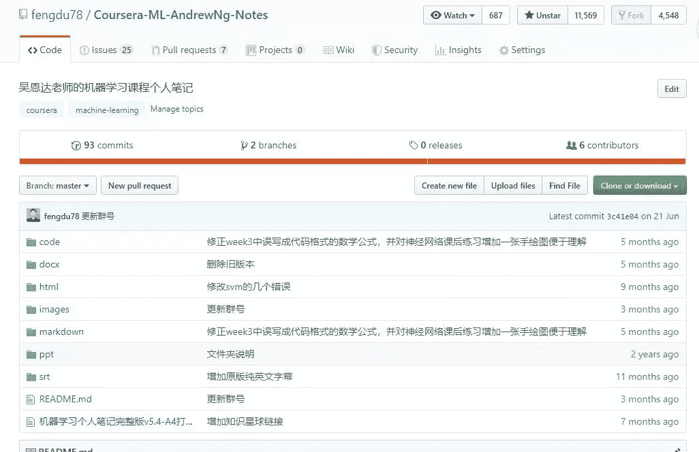
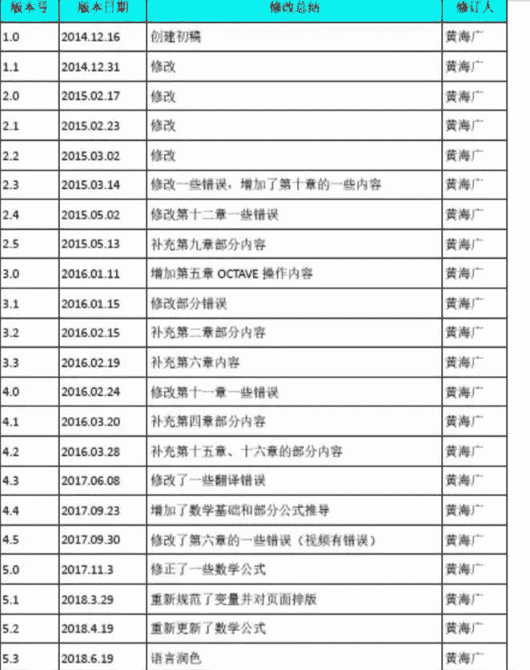
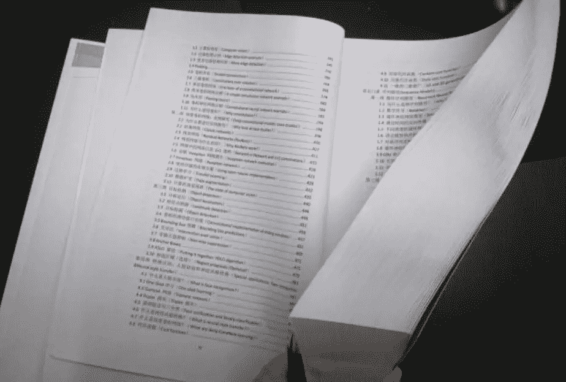
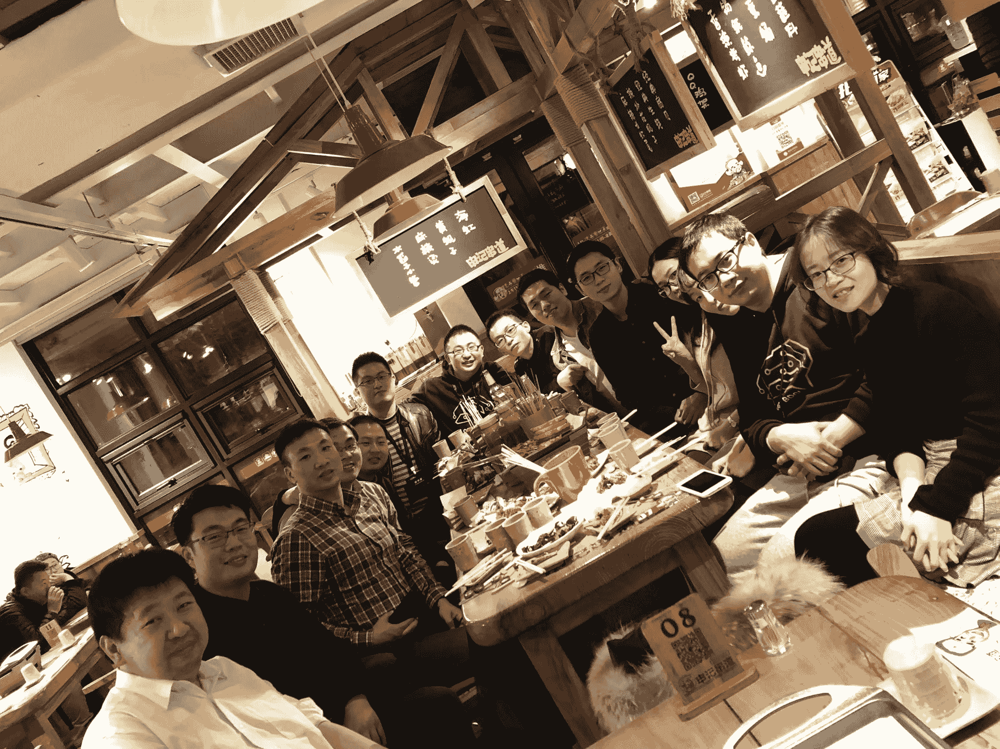
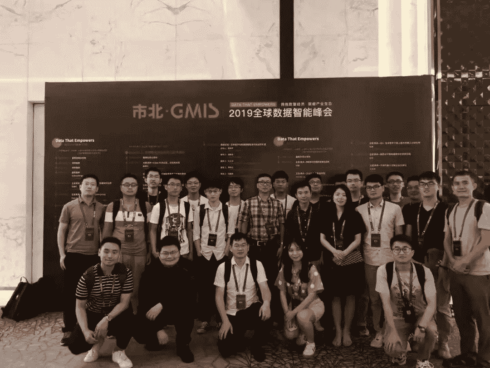

> 来源：[机器学习初学者](https://mp.weixin.qq.com/s/sxrkvjdShJCvK_FNYMfcvQ)

我叫黄海广，这篇文章主要写了我的学术公益之路。我希望初学者少踩一些坑，我也希望我能做个“雪中送炭”的人，希望越来越多的人加入到学术公益的道路上来。

2014年9月，我考上了博士，那时候已经36周岁7个月了，然后，第一次知道了“机器学习”，开始了学习之路。在学习的道路上，我踩了无数的坑，直到博三才感觉渐入佳境。我发现初学者最需要的是“**雪中送炭**”，而不是“**锦上添花**”。作为博士，要有社会责任感，我希望初学者少踩一些坑，我也希望我能做个“**雪中送炭**”的人。

## 一、学术作品

我的作品都比较简单，不需要太高知识水平，但是很少有人认真去做，或者坚持做下去，因为大部分人在学习过程中学会了，很少会把学习的东西重新整理分享给别人。做这些事情，需要专注和严谨。

我相信：**赠人玫瑰，手有余香。**

以下是几个学术公益作品，都是站在巨人的肩膀上完成的。

### **1.翻译吴恩达机器学习课程**

2014年12月开始到mooc网上学堂学习机器学习课程，该课程内容非常不错，但好多视频没有中文字幕，我就发动几位博士来一起翻译字幕，我整理和翻译了大部分视频，并把视频和中英文字幕压制到mkv文件中去。（该视频字幕已经无偿送给网易云课堂：**吴恩达机器学习**课程，由他们进行润色，致谢里有我的名字。这个课程有好多个翻译版本，我的可能是最差的一个版本，但可能下载最多。）

这个视频可以上网易云课堂搜索“**吴恩达机器学习**”，目前是最受欢迎的机器学习课程，课程免费。

此外，我的github里有离线视频下载，中英文字幕的。

https://github.com/fengdu78/Coursera-ML-AndrewNg-Notes

### **2.机器学习笔记**

在学习机器学习课程时，我发现看视频有点累，就边看边写笔记，大概写了三个月，写了差不多了，我在mooc学院发个帖子给大家下载。后来我也忘了发帖这个事情了，直到博二下学期有人发邮件告诉我链接失效了，我才发现笔记已经被下载了7000多次了，然后被百度云和谐了。我觉得笔记应该帮助了不少人，给了我继续修改完善笔记的动力，一直断断续续改了两年，期间收到几千封感谢邮件，后来我把笔记放到了github上提供下载，被下载了几十万次，获得11500+star。原课程的作业代码是octave的，现在几乎用不到了，我用python3.6复现了课程代码，并且公开了笔记的word和markdown版本。

图：四年来的笔记更新记录

以上资料都放在了我的github：

https://github.com/fengdu78/Coursera-ML-AndrewNg-Notes

### **3\. 深度学习笔记**

2017年8月，吴恩达老师推出了深度学习课（DeepLearning.ai），这门课是陆续推出的，我开始组织翻译课程，很多朋友加入义务翻译的队伍，翻译了第一门课之后，网易云课堂宣布他们得到授权翻译所有五门课程，我们就不再翻译了，开始编写这门课的笔记，我组织了很多同学来一起编写，最后由我来整理成word和markdown文件，那时候正好是写博士论文的时候，特别忙，但还是抽出时间来整理笔记。此外特别要感谢林兴木和祝彦森同学，他们提供了自己做笔记，我来修改整合。此外，我对DeepLearning.ai的课后测试题进行了翻译，建议初学者学习。所有题目都翻译完毕，适合英文不好的同学学习。

这个笔记相当详细，有700多页。

图：深度学习笔记打印后的效果

笔记放在github下载：

https://github.com/fengdu78/deeplearning_ai_books

为了宣传笔记，我把笔记放到了知乎，收到了6600多赞，并被各大人工智能方向的媒体广泛报道。

知乎链接：

https://zhuanlan.zhihu.com/p/35940466

### **4.统计学习方法的代码实现**

我初学机器学习过程中，李航老师的《统计学习方法》给我极大的帮助，我试着从github搜索下载和自己修改代码，把这本书用python代码实现了，并放到了github下载（差不多7000star）：

https://github.com/fengdu78/lihang-code

今年7月我参加机器之心举办的GMIS峰会，见到来了李航老师，加了微信，简单交流了下，我做的这个项目得到了李航老师的肯定，后来我邀请李航老师加入了我的博士微信群，李航老师热情应邀。

### **5.数学基础翻译**

机器学习的基础是数学，数学内容真的太多，初学者根本学不完。

我把考研和考博的数学笔记中跟机器学习有关的部分做成了markdown文件，提供下载。

今年8月，我学习了Stanford cs229 manchine learning课程，相比于Coursera中的机器学习有更多的数学要求和公式的推导，课程全英文，基础材料部分还没有翻译。这个基础材料主要分为线性代数和概率论，而且针对机器学习课程做了优化，非常适合学习。我已经翻译了线性代数部分，石振宇博士翻译完了概率论部分，我修改制作后放在github和百度云提供下载。

数学基础的github：

https://github.com/fengdu78/Data-Science-Notes/tree/master/0.math

### **6.其他**

*   python深度学习代码注释翻译

《python深度学习》由Keras之父、现任Google人工智能研究员的弗朗索瓦•肖莱（François Chollet）执笔，详尽介绍了用Python和Keras进行深度学习的探索实践，包括计算机视觉、自然语言处理、产生式模型等应用。书中包含30多个代码示例，步骤讲解详细透彻。

作者在github公布了代码，代码几乎囊括了本书所有知识点。在学习完本书后，读者将具备搭建自己的深度学习环境、建立图像识别模型、生成图像和文字等能力。但是有一个小小的遗憾：代码的解释和注释是全英文的，即使英文水平较好的朋友看起来也很吃力。

本人认为，这本书和代码是初学者入门深度学习及Keras最好的工具。

我对全部代码做了中文解释和注释，并下载了代码所需要的一些数据集（尤其是“猫狗大战”数据集），并对其中一些图像进行了本地化，代码全部测试通过。

github地址：

https://github.com/fengdu78/machine_learning_beginner/tree/master/deep-learning-with-python-notebooks

*   **翻译官方PyTorch简易入门教程（PyTorch1.0版本)**

“PyTorch 深度学习:60分钟快速入门”为PyTorch官网教程，网上已经有部分翻译作品，随着PyTorch1.0版本的公布，这个教程有较大的代码改动，我对教程进行重新翻译，并测试运行了官方代码，制作成Jupyter Notebook文件（中文注释）在github予以公布。

https://github.com/fengdu78/machine_learning_beginner/tree/master/PyTorch_beginner

*   **特征工程的宝典-《Feature Engineering for Machine Learning》翻译及代码实现**

由O’Reilly Media,Inc.出版的《Feature Engineering for Machine Learning》（国内译作《精通特征工程》）一书，可以说是特征工程的宝典，我在知名开源apachecn组织翻译的英文版基础上，将原文修改成jupyter notebook格式，并增加和修改了部分代码，测试全部通过。这个资料可以说是特征工程的宝典，值得推荐。

翻译代码放在数据科学的github仓库提供下载，仓库地址：

https://github.com/fengdu78/Data-Science-Notes/tree/master/9.feature-engineering

备注：我们的翻译版本与人民邮电出版社出版的《精通特征工程》有所不同，属于独立完成。

我的学术作品大部分放在我的github（**fengdu78**），获得很多好评，star数累计达到28785，排在世界123名。

## 二、学术交流

### **1.交流群**

我的qq和微信的机器学习爱好者朋友越来越多，我产生了建立机器学习交流群的想法。

2016年2月我建立了第一个qq群，群友是这么过来的：

*   我的笔记上印了群号，通过群号搜索加入

*   群内朋友介绍

*   我发出邀请

qq群只有通过群号才能找到，因此加人比较精准，而且群实行实名制，群的质量和活跃度在相关领域处于top1%行列，群人数平稳增长，每天增加几十人，就这样过了三年半，现在已经有9个机器学习爱好者qq群了（7个2000群，2个3000群），群友慢慢成长起来，我见证了很多菜鸟到大牛的转变。

此外，我也建立了微信群，目前有8个微信群，其中一个群是人工智能博士群，有430多人，包括李航老师那样的大佬也在群里。

通过网上的交流，我认识了李航老师、徐亦达老师等业界大神，也认识了很多学术界和工业界、竞赛圈的大佬。

### **2.知乎和公众号**

2017年底，我遇到了向老师，一位多次获得数据竞赛冠军的数据分析师，她推荐我注册了知乎（**ID：黄海广**），还介绍了很多数据竞赛的top选手给我认识。

我的知乎两年来，发了几十篇机器学习相关文章，粉丝达到20500多人。

在向老师指导下，2018年9月，我注册了公众号“**机器学习初学者**”，为机器学习爱好者提供学习的路线和基础资料，一年来粉丝达到31000人。

### **3.知识星球**

由于各个群的人数有限，不同的群很难互通消息，而且群里讨论气氛热烈，群友的问题很容易被覆盖，不利于知识的沉淀。

有位同学给我提了一个建议，建立**知识星球**。

他是个优秀的研究生，研二就获得了20万竞赛奖金，而且，现在研三开学，已经获得了多个大厂的offer。我相信缘分，他的名字叫[**黄海龙**](http://mp.weixin.qq.com/s?__biz=MzIwODI2NDkxNQ==&mid=2247484467&idx=1&sn=4e4ea07d5daa4491c47623ccae364053&chksm=97048f8fa07306991c41e1b36c241e66cfe329793b3868abf9b69c9f6c8e22ed65ccdc81050b&scene=21#wechat_redirect)，非常亲切的感觉，于是我请他做了知识星球的合伙人。

关于知识星球是否收费，我们讨论了好久，后来决定象征性地收费，第一是作为星球的运营费用，如嘉宾的和优秀回答者的奖励，第二是保证了群友的质量，加入的人比较精准，知识星球从今年3月建立至今，吸引了4000多名爱好者加入，知识星球名称：**黄博的机器学习圈子**。

其实，我们一直对优秀的爱好者免费，比如数据竞赛高手、博士等，目前星球是机器学习方向排名第一的星球。

**4.线下交流**

由于在不同的城市，我和机器学习爱好者的线下交流不是很多，但有机会一定会当面交流。

图：2018年12月，CCF BDCI决赛，沈阳，担任嘉宾，和数据竞赛大师撸串（左三）

图：2019年7月GMIS峰会，上海（C位）

### **5.学术公益合作**

我和几个知名AI一直有合作，联合Datawhale，ApacheCN，AI 有道推出了完备的 AI **学习路线**：内容涵盖 AI 入门基础知识、数据分析\挖掘、机器学习、深度学习、强化学习、前沿 Paper 和五大 AI 理论应用领域：自然语言处理，计算机视觉，推荐系统，风控模型和知识图谱，学习 AI 从入门到专家必备的学习路线和优质学习资源。

完备的 AI 学习路线，最详细的中英文资源整理：

https://zhuanlan.zhihu.com/p/64080846

## **结语**

机器学习课程在国内还不够普及，大部分初学者还是很迷茫，走了很多弯路，我是一名博士，博士应该有社会责任感，希望能尽自己的微薄之力，为机器学习初学者“**雪中送炭**”。

庆幸的是，很多朋友加入了学术公益的行列，有萌新，也有百万年薪的大佬。

**在学习的道路上，你不是一个人在战斗！**