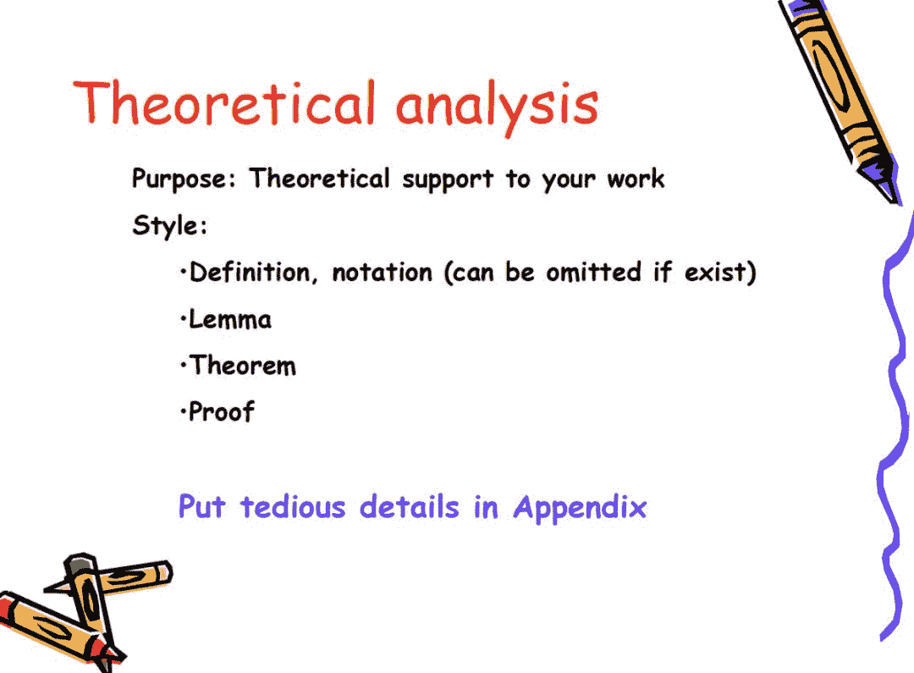

点击上方“**Datawhal****e**”，选择“星标”公众号

第一时间获取价值内容

来源 | 周志华教授报告PPT

编辑 | DeepRL-深度强化学习实验室

每个人从本科到硕士，再到博士、博士后，甚至工作以后，都会遇到做研究、写论文这个差事。论文通常是对现有工作的一个总结和展示，特别对于博士和做研究的人来说，论文则显得更加重要。

那么该如果做突出研究，并写出高水平的论文呢？

本文整理了著名人工智能学者**周志华**教授《做研究与写论文》的PPT(时间比较早，但方法永远不会过时)。其详细介绍了关于为什么要做研究？如何做研究，选择研究方向、选择研究课题(Topic)，学习领域知识、选期刊投稿、稿件处理过程、写高水平论文的方法与技巧等方面的知识，是一份非常优秀的做研究和写论文指南，值得每个人细读！

> 周志华个人简介
> 
> 他于2001年1月留校任教，2002年破格晋升副教授，2003年获 国家杰出青年科学基金，随后被聘任为教授，2004年获博士生导师资格，2006年入选教育部长江学者特聘教授。现任南京大学 校学术委员会委员、计算机科学与技术系 主任、人工智能学院 院长，主要从事人工智能、机器学习、数据挖掘等领域的研究工作。主持多项科研课题，出版《机器学习》(2016)、《Ensemble Methods: Foundations and Algorithms》(2012)、《Evolutionary Learning: Advances in Theories and Algorithms》(2019)。

第一部分

第二部分

点击**阅读原文**，下载原文件