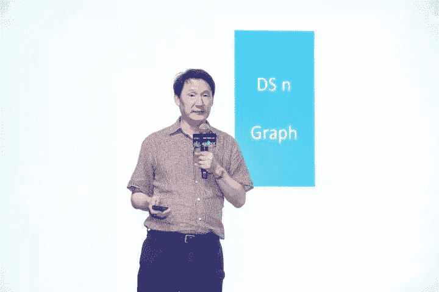
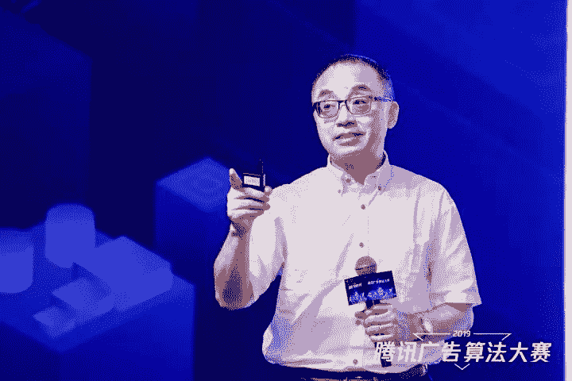
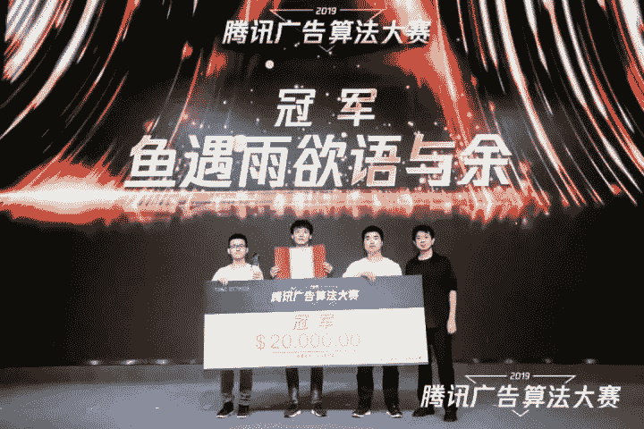
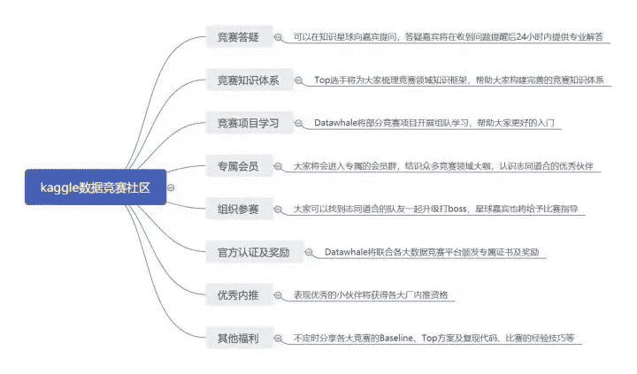
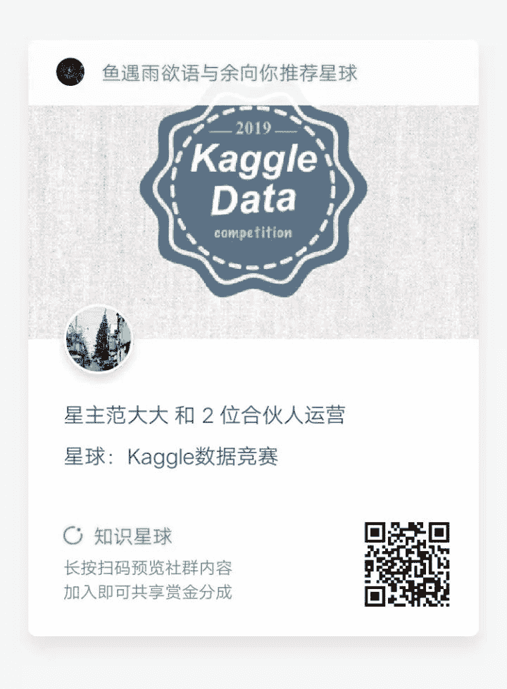
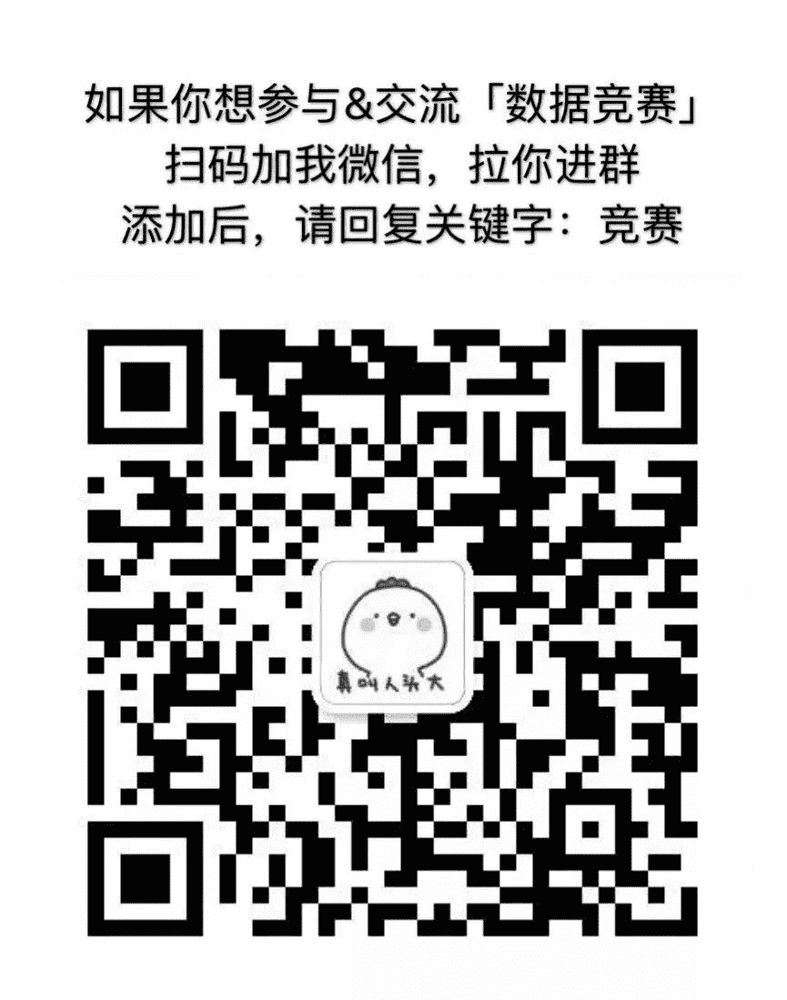

点击上方“**Datawhal****e**”，选择“星标”公众号

第一时间获取价值内容

写在前面

历时三个月腾讯广告算法大赛已经告一段落，在前两届成功经验的基础上，今年大赛在赛题专业性和赛事体验上都有了更大的提升，进而吸引了更多海内外优秀选手参加，最终报名人数高达10,571人。本届算法大赛选手的构成也更加多元化，其中进入复赛的TOP 20队伍就涵盖了清华大学、华南理工大学、浙江大学、东南大学、北京大学、西安电子科技大学、北京航空航天大学、厦门大学等16所顶尖院校的37名学生，此外还有14名来自海内外工业界的精英选手。

很幸运能从去年的11名一跃成为今年的冠军，这里是少不了团队的配合，感谢队友郭达雅和刘育源的带飞。

此次答辩上还见到了两位在数据挖掘领域享有盛誉的学术界权威——伊利诺伊大学芝加哥分校杰出教授俞士纶（Philip S. Yu）和亚利桑那州立大学计算机科学与工程教授刘欢（Huan Liu）进行现场分享，收获颇丰。

<figcaption>*伊利诺伊大学芝加哥分校杰出教授和Wexler主席、ACM和IEEE院士俞士纶（Philip S. Yu）*</figcaption>

<figcaption>
</figcaption>

<figcaption>*亚利桑那州立大学计算机科学与工程教授；* *ACM、AAAI、AAAS、IEEE院士刘欢（Huan Liu）*</figcaption>

<figcaption>
</figcaption>

<figcaption></figcaption>

比赛虽然过一段了，可是我们的学习是不能停的，需要做的就是对比赛进行一个完整的总结，去学习更多优秀的方案。在这里我也将对自己所有的分享进行一个梳理，希望帮助大家能从中学习到不一样的东西。同时也帮助未参加本次大赛的同学们对本赛题有更多的理解，并学习到优秀的方案。

正文

**1\. 初次接触本赛题**

# 2019腾讯广告算法大赛入门-Part1（竞赛小白晋升之路）

https://zhuanlan.zhihu.com/p/63718151

本部分内容可以帮助大家对赛题有个基础的理解，并且能够完成基本的建模。不仅如此，文章中还介绍了三个重要的提取特征思路，并对其取名“三刀流”，这三种方法也是贯穿整个比赛的始终。

**2\. 用腾讯大赛来入门**

如何进行一场数据挖掘算法竞赛

https://www.zhihu.com/lives/1101583435449151488

虽然都说本次比赛门槛比较高，但并不失为接触真是业务并入门算法大赛的好机会。比赛初期我也进行了我的第一次live分享，依“2019腾讯广告算法大赛”为例，介绍在进行算法中需要做那些准备。并从七部分进行分享

1\. 为什么要参加数据挖掘竞赛？能带来什么？

2\. 参加竞赛需要哪些基础知识和技能？

3\. 如何选择适合自己的竞赛？

4\. 竞赛中的几个主要模块

5\. 在竞赛过程中最为重要的事情

6\. 好的赛后总结比竞赛过程更重要

7\. 竞赛案例分享（天池「全球城市计算AI挑战赛」）

从我的经历和经验总结，并结合实际的案例来理解并实践所讲内容。

**3\. 初赛前的尝试**

# 2019腾讯广告算法大赛入门-Part2（初赛生存篇）

https://zhuanlan.zhihu.com/p/65418206

> 没到最后一刻，我们都还有机会。

本部分写在初赛A榜即将结束前，分享了比赛中尤为重要的内容。也是从三点来介绍的，这也是在比赛中需要掌握的技能。并且分享了一些能够尝试的方法，以及我的基本建模方法，从中帮助选手进入复赛。

**4\. 初探初赛冠军**

# 2019腾讯广告算法大赛初赛分享-Part3（冠军篇）

https://zhuanlan.zhihu.com/p/65418206

在本部分，讲到了我们团队在初赛中的方案，当然保留了部分trick。从初始建模、特征工程、模型选择、规则尝试四个方面进行分享。其中很多的点都在复赛有所保留，文章也是可以帮助大家学习基本分初赛方案。

**5\. 初赛完整方案**

# 2019腾讯广告算法大赛方案分享（初赛冠军）

https://zhuanlan.zhihu.com/p/69351598

本文将从初赛的赛题分析、赛题难点、探索性数据分析、数据预处理、特征工程、算法建模、模型融合等部分全面介绍初赛冠军方案。文中将具体部分结合代码进行讲解。可以带大家学习到初赛冠军的方案，并对应代码讲解。

**6\. 初赛代码分享**

https://github.com/guoday/Tencent2019_Preliminary_Rank1st

方案结合代码，这才是最“硬核”的，这部分为我们团队分享的初赛神经网路代码，在初赛nn的效果远好于LightGBM的效果。LightGBM部分代码在第五部分已经做了详细介绍。将第5、6两部分结合学习，帮助大家进一步深入探究初赛的问题解决方法。

**7\. 复赛完整方案**

# 2019腾讯广告算法大赛方案分享（冠军）

https://zhuanlan.zhihu.com/p/73062485

评委讲到“这是最接近腾讯真实业务的方案”

本文将介绍复赛冠军的完整方案。这里将给出完整的PPT内容，并对关键点进行详细的介绍，从特征工程到模型，再到最终的融合，一切都是那么的无懈可击。一起来看看被评委高度认可的方案是怎么做的。

**8\. 复赛代码分享**

https://github.com/bettenW/Tencent2019_Finals_Rank1st

这也将是“冠军之路”的最后一个部分，可以帮助大家将方案与代码结合，深入学习特征工程、模型设计和统计策略。

写在最后

一年半的竞赛经历，很幸运拿到这次冠军。在这一年半，不仅坚持比赛，同时也坚持不断的分享。在我看来，分享是一个自我总结的一个过程。当然，这也是我与更多选手交流的一个平台，是一个相互学习提升的机会。愿我的分享能够帮助到你。

竞赛社区

近期我们公众号和国内的开源组织Datawhale还有杰少一起成立了一个数据竞赛知识星球，并且邀请了国内的很多知名实战高手和赛圈的大佬，在推出的三天中也已经有了500多的用户报名，如果你真的对实战感兴趣而且希望好好学习的话，欢迎通过扫描下面的二维码进行报名，该优惠渠道可以帮助您省下9元的报名费用。

## **知识星球嘉宾（部分）**

范晶晶：开源组织Datawhale创始人

张 杰：南京大学LAMDA硕士，天池数据科学家，KDD2019全球亚军

谈志旋：北京大学硕士，社交app算法负责人

刘 洋：在读博士，IJCAI/KDD/ICME等顶会比赛前三，天池数据科学家

钱 乾：资深算法工程师，Kaggle Grand Master

## **数据竞赛群**

为了将热爱机器学习的大家聚在一起，推荐大家一个“数据竞赛”交流学习群，进群可与行业top级人物交流，可获得很强势的各方资源，大家有需要的可以进群哦~

一年半的竞赛经历，收获了两冠四亚一季的成绩。在这一年半，不仅坚持比赛，同时也坚持不断的分享。在我看来，分享是一个自我总结的一个过程。当然，这也是我与更多选手交流的一个平台，是一个相互学习提升的机会。愿我的分享能够帮助到你。

路漫漫其修远兮，吾将上下而求索。

