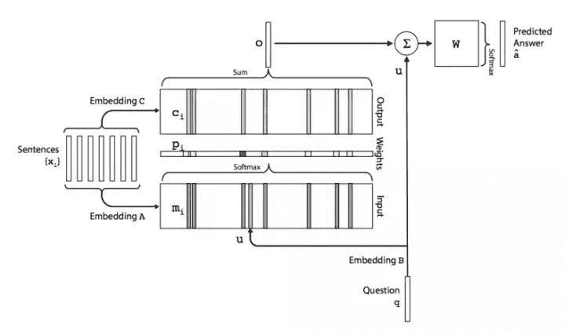

‍‍

点击上方“**Datawhal****e**”，选择“星标”公众号

第一时间获取价值内容


作为从本次比赛共157队伍中脱颖而出的冠军方案，评分达到87.9683，从数据清洗、模型构建、目标优化等有非常多值得学习的地方。比赛团队也挺有意思，分别来自哈工大、微软研究院和京东，算是学术界和工业界的强强联合，在多个数据竞赛中都有不错的名次。

> 评委：“这是最接近腾讯真实业务的方案。”

本文将从源码着手，深度解读该冠军方案是如何一步步从rough data清洗、特征工程到运用多种模型融合实现最佳效果的。作为一名数据竞赛经验薄浅的算法工程师，期望尽可能的将里面涉及到的知识、技巧、模型、算法作一个细致的总结，所以行文可能比较基础难免冗长。

注：冠军方案源码可以从Datawhale今天发的文章《2019腾讯广告算法大赛-冠军之路》中获取，也可以在Datawhale 公众号后台回复关键词 **源码 **获得。


背景介绍


作为国内领先的大数据营销平台，全新升级的腾讯广告，以更强大的全景连接、更全链的数字智慧、更友好的人本体验等三大核心能力，构建品牌与用户的智慧连接，助力广告主高效实现商业增长。而复杂的社交场景，多样的广告形态，以及庞大的人群数据，给实现这一目标带来了不小的挑战。为攻克这些挑战，腾讯广告也在不断地寻找更为优秀的数据挖掘方式和机器学习算法。

本次算法大赛[1]的题目是源于腾讯广告业务中一个面向广告主服务的真实业务产品 ——广告曝光预估。广告曝光预估的目的是在广告主创建新广告和修改广告设置时，为广告主提供未来的广告曝光效果参考。通过这个预估参考，广告主能避免盲目的优化尝试，有效缩短广告的优化周期，降低试错成本， 使广告效果尽快达到广告主的预期范围。比赛中使用的数据经过脱敏处理，通过本次大赛，我们旨在挑选出更为优秀的曝光预估算法以及遴选出杰出的社交广告算法达人。


比赛赛题


1.  **数据**
    主要是三个日志文件，分别为：

*   历史日志数据：广告请求时间、用户 id、广告位 id、竞价广告信息等
*   用户信息数据：用户 id、年龄、性别、地域、行为兴趣等
*   广告设置：广告操作信息、广告静态信息

**目标**
本次竞赛提供历史 n 天的曝光广告的数据（特定流量上采样），包括对应每次曝光的流量特征（用户属性和广告位等时空信息）以及曝光广告的设置和竞争力分数；测试集是新的一批广告设置（有完全新的广告id，也有老的广告id修改了设置），要求预估这批广告的日曝光。

**评价指标**
评价指标由两部分组成，准确性指标和出价单调性指标。

*   准确性指标SMAPE衡量了预测的准确度：


*   单调性指标MonoScore衡量了报价与曝光量的相关性，这是对应“由于竞价机制的特性，在广告其他特征不变的前提下，随着出价的提升，预估曝光值也 单调提升才符合业务直觉。”其中：


*   最终得分是将两个指标加权相加：


数据初探


这次比赛的数据非常原始，日志信息的raw data，因此原始数据是脏数据。那么，建模第一步必须是数据清洗，异常检测，重复缺失值等。第二步，建模，而这里面的数据并没有给定标签，需要统计曝光量。这里面大有学问，出价不同的广告不能视为同一个广告；24小时（0-24点）间隔内未修改的广告视为同一广告，如果有修改，那么修改时间点后的广告视为新的广告。详细的数据集解读可以参考CSDN上的技术博客[2][3]，对所有数据集的详细介绍见下图：


*双击查看大图*


冠军方案


作者在github [4] 上公开了源码，该库包含了比赛详细的介绍文件guide.pdf和数据集下载链接（百度网盘），再次感谢作者。下面是亲自跑一遍源码后进行的归纳总结。

### **数据清洗**

首先在preprocessing.py进行数据前处理，主要是以下几个函数：

*   parse_rawdata：曝光日志、静态广告属性、用户信息、测试数据都转化为Dataframe
*   construct_log：构造曝光日志，统计每一天各个广告的曝光量，同时将最后一天的数据择选出来

*   extract_setting：对广告操作日志进行日期纠正，缺失日期记录则copy填充

*   construct_train_data：构造训练集，根据曝光日志统计广告当天平均出价和曝光，通过crowd_direction和delivery_periods两个属性过滤其中未在广告操作日志出项的广告，并剔除出价过高（1000以上）和曝光过高（3000以上）的广告（这两个阈值怎么定的？）

*   construct_dev_data：构造验证集，输入为曝光日志中最后一天（[‘request_day’]==17974）的数据，根据广告操作日志剔除未出现操作记录、当天有操作记录和出价不唯一的广告的广告，奇怪的是源码里后面针对补全时间记录的广告操作日志又进行了一次未出现操作记录的过滤，这里有部分过滤重复，但没有错误，最终的dev_df也填补了缺失日期的记录。最后，构造了虚假广告用来测试单调性，这一点。

*   最后，对各个数据集merge广告静态特征。总共生成四个数据集：

*   *   train_dev_df：从广告日志+广告操作文件+广告静态文件提取出的数据集中减去最后一天的数据

    *   train_df：训练集，从广告日志+广告操作文件+广告静态文件聚合提取出的最全数据集

    *   dev_df：验证集，最后一天的广告数据

    *   test_df：直接读取的test数据
        这样切分的一个用处是，通过train_dev_df和dev_df进行有监督的模型训练，再通过train_df和test_df进行测试。

### **特征提取**

在extract_feature.py特征提取包括人群定向、投放时段、多值特征的主副键（即两两特征之间的数量统计量，主要是以ID为基础统计，例如f1=aid，f2=uid，k=100，则表示访问该广告最多的前100名用户）、历史统计（例如，最近一天该广告的曝光量，时间越近相关性越大）、聚合统计（例如某商品的不同用户访问次数）、五折统计（shuffle后分为五折计算均值、中位数，不知道这多大用处？）以及uid和good_id等ID特征之间的word2vec和deepwalk embedding特征。

### **格式转换**

最后在convert_format.py中，分别对训练集和测试集进行了去重、fillna、归一化以及将Word2Vec和DeepWalk得到的embedding拼接起来，并且掩盖到5%的广告。为什么掩盖掉5%的广告，作者给出的解释是为了保证训练集中也能出现无曝光的广告。新广告是没有历史信息的，所以如何构造新广告的特征，对新广告进行历史和整体性的描述成了提分的关键。这种处理主要解决以下两个问题：

1.  只有在日志中曝光过的广告才会有相应的嵌入向量，通过广告有无嵌入向量，会泄露了无曝光广告的标签；

2.  测试数据中存在曝光非0但无嵌入向量的广告，这在训练集中是不存在的，导致训练测试不一致。

## **模型解读**

> 俞士纶（Philip S. Yu）教授评价说 “冠军队伍已经在有意无意使用‘广度学习’ 的方法”。

该方案采用的模型组合包括CIN（xDeepFM）、Key-Value、Word2Vec和DeepWalk四种模型单元分别提取特征，然后concat输入到MLP中训练，模型框架如下图所示：


源码中训练的入口为train.py，从该文件代码可知，经过特征工程后提取的特征类型有single_features、cross_features、multi_features、dense_features、kv_features。与此同时，针对不同特征使用不同的子模型进行处理，特征数据类型介绍所示：

| 特征类型 | 描述 |
| --- | --- |
| single_features | 单值特征，年龄、ID、性别等等 |
| cross_features | 交叉特征，与single_features有很大重复 |
| multi_features | 多值特征，各种组合特征，与上面两个特征无重叠 |
| dense_features | 稠密特征，deepwalk、word2vec和投放时段特征 |
| kv_features | key-values特征，历史、统计特征 |

由上可以看出，除了single_features、cross_features有大部分数据重复，其他相互之间没有重叠特征。为何特征重复？可以参考xDeepFM的模型，作用应该是类似增加一个Linear单元。从CIN.py代码看，cross_features和multi_features都会输入到CIN网络（_build_extreme_FM函数）中，然后dnn_input将CIN的输出、single_features的直接嵌入、kv_features以及dense_features以concatenate的方式结合起来输入到后端的MLP中。下面分别介绍各个子网络。

### **压缩交互网络（CIN）**

要理解CIN网络，首先得理解FM因式分解机模型。FM旨在解决大规模稀疏数据下的特征组合问题，那么大规模稀疏数据是怎么来的呢？举个例子，用户访问某网站的日志数据中，我们可以发现许多特征是类别特征，性别、爱好、地址等等，而在特征处理过程中，通常会对categorical型特征进行one-hot编码，这必然带会导致特征空间稀疏性变大。在数据稀疏性的现实情况下，我们如何去利用这些特征来提升learning performance？

大量的研究和实际数据分析结果表明：某些特征之间的关联信息（相关度）对事件结果的的发生会产生很大的影响。从实际业务线的广告点击数据分析来看，也证实了这样的结论。而表示特征之间的关联，最直接的方法的是构造组合特征。样本中特征之间的关联信息在one-hot编码和浅层学习模型（如LR、SVM）是做不到的。目前工业界主要有两种手段得到组合特征：

1.  人工特征工程（数据分析＋人工构造，各种统计merge）；

2.  通过模型做组合特征的学习（深度学习方法、FM/FFM方法）

FM本质上是回归模型，不过是从一维延展到了高维，以二维多项式组合为例，其公式如下：


其中，n代表样本的特征数量，xi是第i个特征‍‍的值，ω0、ωi、ωij是模型参数。从公式(1)可以看出，组合特征的参数一共有n(n−1)/2个，每个参数ωij的训练需要大量xi和xj都非零的样本。然而，由于样本数据本来就比较稀疏，满足xi和 xj都非零的样本将会非常少。训练样本的不足，很容易导致参数ωij不准确，最终将严重影响模型的性能。

如何解决二次项参数的训练问题呢？矩阵分解提供了一种解决思路。关于FM中矩阵分解可以参见《深入FFM原理与实践》[5]。通过对参数ωij的矩阵（对称矩阵）进行矩阵分解，将ωij用⟨vi,vj⟩内积的方式来表达，那么公式(1)可以如下表达：


其中vi是第i维特征的隐向量，而隐向量的长度为k(k≪n)，这样二次项的参数数量减少为kn个，远少于多项式模型的参数数量，同时之前样本组合确实造成参数ωj的情况现在可以通过隐向量的方式学习到有效值。当然，这种变换方式也降低了计算复杂度，详细证明可以参见博客[6]。

对于一个基于CTR预估的推荐系统，最重要的是学习到用户点击行为背后隐含的特征组合。在不同的推荐场景中，低阶组合特征或者高阶组合特征可能都会对最终的CTR产生影响。广度模型（LR/ FM/ FFM）一般只能学习1阶和2阶特征组合；而深度模型（FNN/PNN）一般学习的是高阶特征组合。Goggle在2016年提出的 Wide&Deep 模型同时考虑了两者。Wide$Deep层次结构图如下所示：


但Wide部分需要人工参与的特征工程，于是DeepFM模型应运而生，DeepFM是用FM模型取代Wide的LR部分，Wide&Deep中LR部分和Deep部分是完全独立的，LR部分的输入是稀疏特征，Deep部分稀疏特征先经过embeding层变成embeding向量，再传入隐层。DeepFM中每一个feature field经过embeding层转化为一个隐向量，多个特征field concat成一个密集向量分别作为FM部分和Deep部分的输入。FM部分将每个field的隐向量两两组合，最后在输出层和Deep部分输出concat成最终的输出层。整体上来说，DeepFM有以下三大优点：

1.  DeepFM可以end-to-end训练，不需要任何的特征工程。FM作为低阶特征，DNN作为高阶特征。

2.  训练更加高效，Wide和Deep两者共享同一个输入和embedding向量。与Wide & Deep相比，由于Wide&Deep需要人工的进行特征工程，因此增加了模型的复杂度。

3.  CTR预测结果更准确。

关于DeepFM模型更详细的介绍、模型变种和评估对比可以参见另一篇博客[7]。从FM，到DeepFM，现在我们进入正题CIN，即XdeepFM。首先看看xDeepFM模型的结构：


由上图可知，xDeepFM基本框架依然基于标准的 Embedding&MLP，其中Linear、Plain DNN分别类似Wide和Deep部分，而CIN部分是我们要讨论的重点。CIN（Compressed Interaction Network），中文名压缩交互网络，从名字可预期模型使用类pooling压缩操作，以及特征交互方法。CIN的输入是所有field的embedding向量构成的矩阵X0∈Rm×D，该矩阵的第i行对应第i个field的embedding向量，并假设由M个field的embedding向量维度都为D。


CIN网络架构如上图所示，从H1−Hk每一层输入都是X0和上一层的输出Xk−1，且每一层都相当于是提取了更高一维的交叉特征，它们层层之间的计算为如下公式：


其中∘表示哈达玛积，即两个矩阵或向量对应元素相乘得到相同大小的矩阵或向量。Xj,∗0表示X0矩阵的第j行，简单可以理解为两个X矩阵的哈达玛积通过W矩阵变换为输出矩阵的一行，多个变换矩阵W映射为新的输出矩阵。

由于上述计算公式可能不是很好理解，论文作者给出了另一种更加方便理解的视角。在计算Xk+1时，定义一个中间变量Zk+1∈RHk×m×D，而Zk+1是一个数据立方体，由D个数据矩阵堆叠而成，其中每个数据矩阵是由Xk的一个列向量与X0的一个列向量的外积运算而得，如下图所示。Zk+1的生成过程实际上是由Xk与X0沿着各自embedding向量的方向计算外积的过程。


Zk+1可以被看作是一个宽度为m、高度为 Hk、通道数为D的图像，在这个虚拟的图像上施加一些卷积操作即得到 Xk+1。 Wk,h是其中一个卷积核，总共有Hk+1个不同的卷积核，因而借用CNN网络中的概念，Xk+1可以看作是由Hk+1个feature map堆叠而成，如下图所示。


正是通过卷积操作，CIN把第k+1层由Hk×m个向量压缩到了Hk+1个向量，起到了防止维数灾难的效果。值得注意的是，这种按列计算外积后进行转换，与公式（3）的方式按行计算示哈达玛积的变换在三维立方体Zk+1上是等效的。

CIN最终学习出的特征交互的阶数是由网络的层数决定的，而且交互发生在向量级上，每一层隐层都通过一个池化操作连接到输出层，从而保证了输出单元可以见到不同阶数的特征交互模式。同时不难看出，CIN的结构与循环神经网络RNN是很类似的，即每一层的状态是由前一层隐层的值与一个额外的输入数据计算所得。不同的是，CIN中不同层的参数是不一样的，而在RNN中是相同的；RNN中每次额外的输入数据是不一样的，而CIN中额外的输入数据是固定的，始终是X0。

### **Key-Value**

Key-Value记忆网络[8]是Facebook 在 2016 年 6 月发表的一篇文章，相比之前的两篇可以说是更加完美的将 Memory Networks 应用的了 QA 任务上。那么，我们从facebook的第一篇文章开始梳理一下记忆网络的知识。

#### **Memory Network**

传统的深度学习模型（RNN、LSTM、GRU 等）使用 hidden states 或者 Attention 机制作为他们的记忆功能，但是这种方法产生的记忆太小了，无法精确记录一段话中所表达的全部内容，也就是在将输入编码成 dense vectors 的时候丢失了很多信息（例如单词顺序）。所以 FaceBook 在 2014 年发表的论文 “Memory Networks”就提出了一种可读写的外部记忆模块，并将其和 inference 组件联合训练，最终得到一个可以被灵活操作的记忆模块。其框架如下：


可以看到模型基本分为四个模块，I（nput）、G（eneralization）、O（utput）、R（esponse），其功能为：

*   I 模块将输入的文本编码成向量

*   G 模块根据输入的向量对 memory 进行读写操作，即对记忆进行更新

*   O 模块会根据 Question对 memory 的内容进行权重处理，将记忆按照与 Question 的相关程度进行组合得到输出向量

*   R 模块根据输出向量编码生成一个自然语言的答案

根据原文，I 模块就是一个embedding lookup，将原始文本（先验知识）转化为词向量的形式。G 模块则是直接将输入的向量存储在 memory 数组的下一个位置，不做其他操作。O 模块根据输入的问题向量在所有的记忆中选择出 topk 相关的记忆，具体选择方式为：先选记忆中与输入问题向量x最相关的memory向量mo1，然后选择和x以及mo1最相关的mo2，迭代选择出TopK个memory向量即可。最后通过R 模块生成答案，具体方式为通过评分函数将[x,mo1,…mok]与词表中每个单词进行评分，得分最大的单词作为回答。详细的评分函数以及模型训练的损失函数可以学习原文。

#### **End-To-End Memory Networks**

上文提到的作为第一个普适性的框架模型，也有几点不完善的地方：

*   直接将原始文本进行向量化并保存，原始文本大的话内存消耗巨大

*   O 和 R 部分评分函数无法进行反向传播训练
    所以，Facebook AI在Memory networks之后提出了一个更加完善的模型End-To-End Memory Networks[9]，论文中提出了单层和多层的结构，单层的架构如下图：



对比上文的IGOR四个模块，这次模型架构稍微有些不同：

1.  将原文分别嵌入到Input和Output两部分记忆模块，其中input用来与Question 编码进行计算相关性，Output 则与该相关性进行加权求和得到输出向量

2.  输出o不再是直接进入到Response，而是先与问题q进行加和，再与字典W相乘，经过一个softmax函数产生各个单词是答案的概率，借此可以使用交叉熵损失函数最为目标函数进行训练

以此为基础模块，以堆叠的方式可以实现多层端到端记忆网络：


更详细的模型设计和模块介绍可以参考原文和记忆网络-知乎专栏[10]。

#### **Key-Value Memory Networks**

该模型是Facebook在 2016 年的一篇文章上发表的，相比上文的两个可以说是更加完美的将Memory Networks应用的了QA任务上。End-To-End Memory Networks实现了记忆网络的端到端的模型可训练，但效果提升并不明显，而Key-Value在模型架构上进一步创新，使其可以更好的存储QA所需要的先验知识。


Key-Value用Key addressing和Value reading分别代表End-To-End中的Input和Output部分，所有的记忆都被存储在Key-Value memory中，key负责寻址lookup，也就是对memory与Question的相关程度进行评分，而value则负责reading，也就是对记忆的值进行加权求和得到输出。整个模型的运行机制为：

*   key hashing：首先根据输入的问题从知识源中检索出与问题相关的facts，检索的方法可以是至少包含一个相同的实体等多种方法。也就是上图中下面的绿色部分，相当于一个记忆的子集。这部分工作可以在与处理数据的时候进行。然后将其作为模型输入的一部分训练的时候输入模型即可。

*   key addressing：寻址，也就是对memory进行相关性评分。用key memory与输入的Question相乘之后做softmax得到一个概率分布。概率大小等效于相关程度。其中AϕX 、AϕK 和 AϕV 都是embedding模型，对输入问题、key、Value进行编码得到其向量表示。

*   Value Reading：有了相关性评分Phi，接下来就对value memory AϕV 进行加权求和即可，得到一个输出向量。

这样就完成了一个hop操作，接下来跟End-To-End一样，将输出向量o与输入问题的向量表示q相加，经过Rj矩阵进行映射，在作为下一层的输入，重复循环得到qH+1，为问题答案的嵌入式向量表示。而BϕY是候选答案寻址空间，可以和字典空间一模一样，相当于在领域知识库内搜索答案，也可以是另一个领域外的候选词库，可以发现新词的答案。最终都是通过交叉熵作为损失函数，端到端的对模型进行反向传播训练。整个过程看下来其实跟end-to-end模型很相似，最关键的地方加在于Key-Value的memory如何进行表示，这也是本模型的创新所在。

Key-Value memory的好处在于可以方便的对先验知识进行编码，这样就可以让每个领域的人都方便的将本领域内的一些背景知识编码进记忆中，从而训练自己的QA系统，相比于end-to-end模型将相同的输入经过不同的矩阵分别编码到Input memory和Output memory，Key-Value则选择对输入首先进行一个（key， value）形式的表示，然后再分别编码进入key和value两个memory模块，这样就有了更多的变化和灵活性。我们可以按照自己的理解对数据进行key索引和value记忆，而不需要完全依赖于模型的embedding矩阵，这样也可以使模型更方便的找到相关的记亿并产生与答案最相近的输出。论文中根据不同形式的输入（KB或者wiki文章），提出了几种不同的编码方式，感兴趣的可以参见原文。

回到主题中来，Key-Value在这个方案中是如何被应用的？通过作者放出的PPT可以看到，作者通过Key-Value Memory的模型实现浮点数到向量的映射，不过采用的是下图的精简模型：


剔除掉了迭代HopHop部分和Response，毕竟只需要得到输入特征的嵌入式表达向量，通过索引方式设定kiki键值，最终需要训练得到的参数就是整个Key-Value Memory中的Value（即vector embedding矩阵）。下面再看看源码，其实现部分在CIN.py的78行，如下所示：

```
if hparams.kv_features is not None:
    index=[i/hparams.kv_batch_num for i in range(hparams.kv_batch_num+1)]
    index=tf.constant(index)
    distance=1/(tf.abs(self.kv_features[:,:,None]-index[None,None,:])+0.00001)
    weights=tf.nn.softmax(distance,-1) #[batch_size,kv_features_size,kv_batch_num]
    kv_emb=tf.reduce_sum(weights[:,:,:,None]*kv_emb_v2[None,:,:,:],-2)
    kv_emb=tf.reshape(kv_emb,[-1,len(hparams.kv_features)*hparams.k])
    dnn_input.append(kv_emb)
```

该段代码首先通过index将浮点数的区间（0~1）划分为N=20个子区间，每一个代表一个键值进行索引，然后计算每个样本的每个特征值与这20个区间的距离。这里需要注意的是weights已经增加了一个维度，每个kv_features都计算了与21个键值index的距离，然后每一个权重值与kv_emb_v2嵌入式特征矩阵相乘累加，reshape后得对最终的特征矩阵kv_emb，这里面的维度很容易出错，最终每个kv特征被嵌入式到hparams.k=16的向量空间中。

> 这里不由得产生了一个问题，key-value与连续值分桶嵌入式的区别是什么，为何模型要采用key-value？

### **Word2Vec**

Word2Vec是从大量文本语料中以无监督的方式学习语义知识的一种模型，它最初被大量地用在自然语言处理（NLP）中。那么它是如何帮助我们做自然语言处理呢？Word2Vec其实就是通过学习文本来用词向量的方式表征词的语义信息，即通过一个嵌入空间使得语义上相似的单词在该空间内距离很近。Embedding其实就是一个映射，将单词从原先所属的空间映射到新的多维空间中，也就是把原先词所在空间嵌入到一个新的空间中去。举个例子，cat这个单词和kitten属于语义上很相近的词，而 dog 和 kitten 则不是那么相近，iphone这个单词和kitten的语义就差的更远了。通过对词汇表中单词进行这种数值表示方式的学习（也就是将单词转换为词向量），能够让我们基于这样的数值进行向量化的运算从而能够表征语义信息。

Word2Vec模型中，主要有Skip-Gram和CBOW两种模型，从直观上理解，Skip-Gram是给定input word来预测上下文。而CBOW是给定上下文，来预测input word。本篇文章仅讲解Skip-Gram模型。


大部门嵌入式情况下都是使用Skip-Gram模型，其形式非常简单，模型架构如下图所示：


假设从我们的训练文档中抽取出10000个唯一不重复的单词组成词汇表，对这10000个单词进行one-hot编码，得到的每个单词都是一个10000维的向量，向量每个维度的值只有0或者1。而对模型训练的训练样本是 （input word, output word） 这样的单词对，训练时通过softmax函数将模型输出转化为10000维的向量，与output word的one-hot编码对应。模型训练完后得到的隐藏层参数矩阵为W，它的维度为10000*k（神经元个数，等效于嵌入式的特征空间维数），而由于输入为one-hot编码，隐藏层实现的功能其实类似于一个查找标，每一个向量从矩阵W中查找到其在隐空间中的向量表示，于是W的每一行就是一个原始变量的嵌入式向量，即原始位点在转换空间后的坐标。这时候大家容易发现一个问题，如果文本中某个词特别多怎么办，例如“the”在文章中出现频次超高，那模型就需要对高频词进行抑制，方法包括对高频次单词进行抽样来减少训练样本的个数、将常见的单词组合（word pairs）或者词组作为单个“words”来处理以及negative sampling。

关于Word2Vec更多朴实近人的介绍参考博客[11]。

### **Deepwalk**

Deepwalk源自图理论，关于图网络不得不提的是清华大学孙茂松组的图网络综述[12]，该文总结了近年来图神经网络领域的经典模型与典型应用，对于希望快速了解这一领域的读者，不妨先从这篇文章看起。而且该文还提到“DeepWalk、LINE、SDNE等方法在网络表示学习领域取得了很大的成功，然而，这些方法在计算上较为复杂并且在大规模的图上并不是最优的，GNN旨在解决这些问题。”也就是说Deepwalk是有一定局限性的模型，当然这并不是文本的重点，本文关心的是Deepwalk的理论知识以及作者是如何应用Deepwalk的思想来解决问题的。

对于一个图G，我们一般用点的集合V和边的集合EE来描述。即为G(V,E)。其中V为我们数据集里面所有的点(v1,v2,…vn)。对于V中的任意两个点，可以有边连接，也可以没有边连接。我们定义权重wij为点vi和点vj之间的权重，并且通常假设是无向图，有wij=wji。最简单的图示例如下所示：


左图共有7个顶点，两个顶点相连则表示为wij=wji=1，这时将W称为邻接矩阵，显而易见其为对称矩阵。将左图转化为矩阵后，就可以利用矩阵的运算方便地进行图计算。值得一提的是，wji表征的是两个点之间的关系度量，当然可以有欧式距离、联合概率等多种度量方式。

Deepwalk来源于《DeepWalk: Online Learning of Social Representations》这篇论文，它的思想简单易懂，主要借鉴了word2vec，产生句子的方式为从网络中随机一个节点，然后以此节点为起点，按概率从其邻居中选择下一个节点，迭代下去将得到的K的节点作为word2vec中的句子。于是，将网络结构通过Random walk的方式，转换为类似“sentence”的节点序列的形式，再借用Skim-gram模型实现节点的嵌入式向量表达。

## **总结**

本文详细介绍了冠军方案中涉及到的各个子模型的原理和用途，包括如何提取特征、提取了什么特征以及提取特征的意义。但由于经验的不足，尚未从特征角度阐述为什么要提取这些特征，以及如何通过数据EDA来辅助特征工程，构造出有意义的特征并最终提升模型的效果。

[1] 2019腾讯广告算法大赛
https://algo.qq.com/application/home/home/index.html 

[2] Guiliano，数据集探索博客
https://blog.csdn.net/jliang3/article/details/90610865 

[3] 鱼遇雨欲语与余，原作者知乎专栏
https://zhuanlan.zhihu.com/p/69351598 

[4] 大赛冠军源码
https://github.com/guoday/Tencent2019_Preliminary_Rank1st 

[5] FM
https://tech.meituan.com/2016/03/03/deep-understanding-of-ffm-principles-and-practices.html 

[6] FM博客
https://www.csuldw.com/2019/02/08/2019-02-08-fm-algorithm-theory/ 

[7] DeepFM博客
https://www.csuldw.com/2019/07/26/2019-07-25-introduction-of-deepFM/ 

[8] Facebook，记忆网络
https://arxiv.org/abs/1606.03126 

[9] Facebook，端到端记忆网络
https://arxiv.org/abs/1503.08895 

[10] 记忆网络-知乎专栏
https://zhuanlan.zhihu.com/p/29679742 

[11] AI研习社，Word2Vec结构
https://cloud.tencent.com/developer/article/1065628 

[12] 清华大学孙茂松组，图网络综述

https://arxiv.org/abs/1812.08434


‍‍