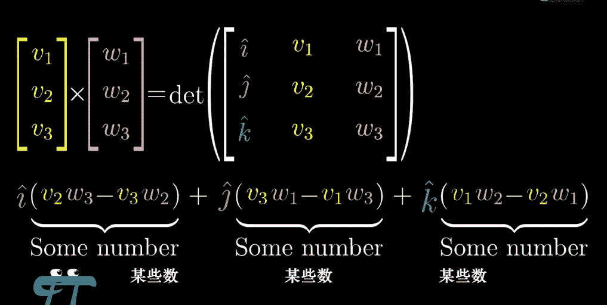
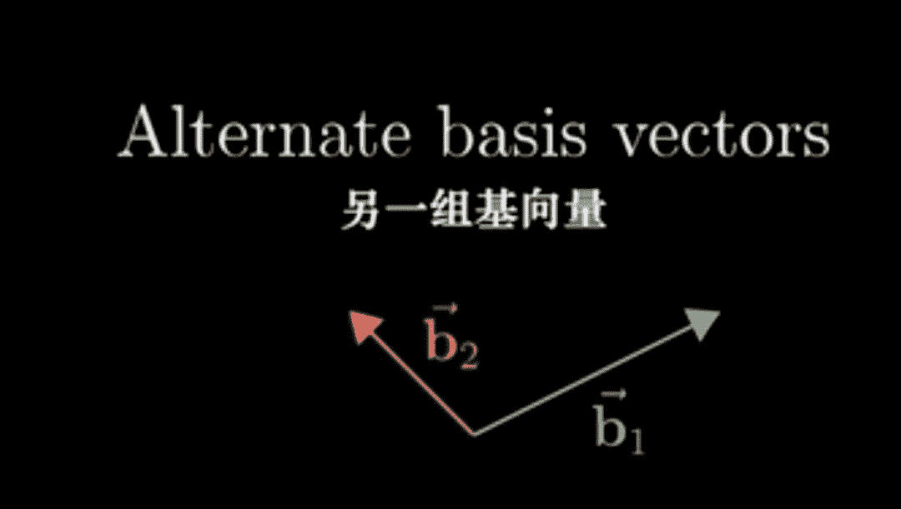
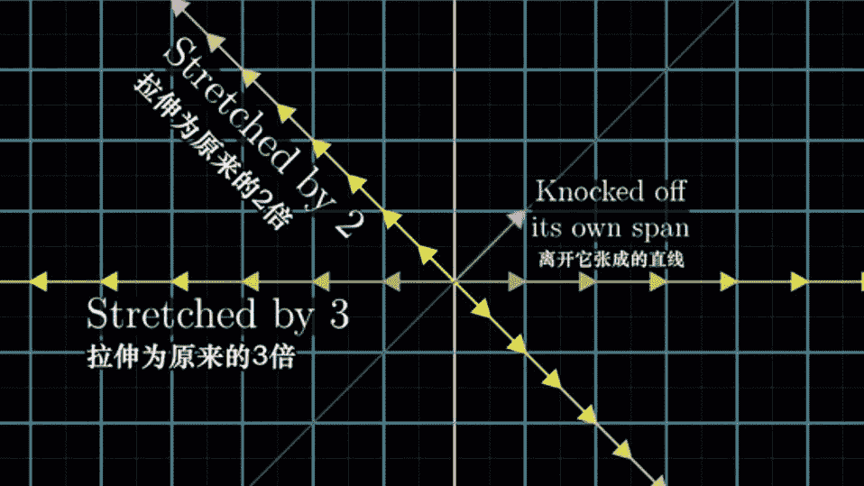
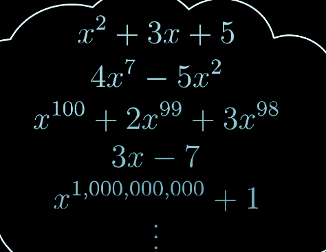
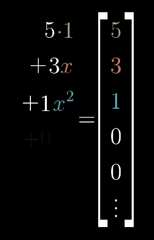

点击上方“**Datawhal****e**”，选择“星标”公众号

第一时间获取价值内容

系列目录

###### 1.向量究竟是什么
https://www.bilibili.com/video/av5987715/?spm_id_from=333.788.reco_list.2

###### 2.线性组合、张成的空间与基
https://www.bilibili.com/video/av6025713/?spm_id_from=333.788.videocard.0

###### 3.矩阵与线性变换
https://www.bilibili.com/video/av6043439/?spm_id_from=333.788.videocard.0

###### 4.矩阵乘法与线性变换复合
https://www.bilibili.com/video/av6128021/?spm_id_from=333.788.videocard.0
https://www.bilibili.com/video/av6143355/?spm_id_from=333.788.videocard.1

###### 5.行列式
https://www.bilibili.com/video/av6179111/?spm_id_from=333.788.videocard.0

###### 6.逆矩阵、列空间与零空间
https://www.bilibili.com/video/av6240005/?spm_id_from=333.788.videocard.0

###### 7.点积
https://www.bilibili.com/video/av6299284?from=search&seid=12903800853888635103

###### 8.叉积
https://www.bilibili.com/video/av6341515/?spm_id_from=333.788.videocard.1
https://www.bilibili.com/video/av6371571/?spm_id_from=333.788.videocard.19

###### 9.基变换
https://www.bilibili.com/video/av6500834?from=search&seid=3249893627908257126

###### 10.特征向量与特征值
https://www.bilibili.com/video/av6540378/?spm_id_from=333.788.videocard.0

###### 11.抽象向量空间
https://www.bilibili.com/video/av6661309?from=search&seid=11789080179301962680

一、向量究竟是什么？

**三种向量的观点**

线性代数中最基础，最根源的组成部分是向量，那么什么是向量呢？从不同学生的视角看，有以下三种观点：

物理专业学生的视角：向量是空间中的箭头，决定一个向量的是它的长度和所指的方向，只要这两个要素相同， 向量可以任意移动。

计算机专业学生的视角：向量是有序的数字列表，数字顺序不可以随意转变。

数学专业的视角：向量可以是任何东西，只要满足向量之间相加和数字与向量相乘都有意义即可。

我们先来考虑平面中的x-y坐标系，向量被定义为从原点出发的有方向的箭头。这与物理专业的看法略有不同，因为他们认为向量在空间中可以自由落脚，但是在线性代数中，向量是从原点作为起点的。而向量的坐标如[2,3]，则是有序性的体现，2代表横坐标，3代表纵坐标，二者不可交换。

接下来，我们来介绍下向量的几何意义、向量加法的几何意义，以及向量乘法的几何意义。

**向量的几何意义**

考虑平面中的x-y坐标系，由x轴和y轴组成，二者的交叉部分叫做原点。

一个向量的坐标由一对数组成，这对数指导我们如何从原点走到向量的终点。

如上图的向量，它告诉我们先沿x轴往左移动2个单位，再沿y轴移动3个方向。

向量加法的几何意义

假设我们现在有两个向量：

如果我们把w从原点移动到v的终点，然后再连接原点和w的终点，那么得到的向量就是二者的和。

为什么是这样，还是回到向量的意义来，他定义了一种移动方式，假设v的坐标是[1,2],w的坐标是[3,-1]。v告诉我们要沿x轴向右移动1个单位，沿y轴向上移动2个单位，而w告诉我们要沿x轴向右移动3个单位，沿y轴向下移动一个单位。这样总体的移动效果就是沿x轴向右移动5个单位，沿y轴向上移动1个单位，得到的结果是[5,1]。因此向量加法的几何意义，我们可以看作是多次移动的累积结果，从计算上来看，就是如下的式子：

**向量乘法的几何意义**

向量乘法就是对向量进行拉伸(乘以一个大于1的正数)，压缩(乘以一个小于1的正数)，翻转向量的行为(乘以一个负数)，这些行为统称为统称为scaling。而向量乘上的这些数值本身，称之为向量(scalars)。向量乘法的计算方式如下：

二、线性组合、张成的空间与基

**基****向量**

还是以二维平面为例，其实每一个向量都可以通过基向量(basis vectors)经由上面的两种运算得到，假设我们的基向量是[1,0]和[0,1]，如下图:

当然，基向量可以任意选择，定义两个向量v和w，以其为基向量，通过加法和乘法，可以得到平面中任意的向量：

基向量的严格定义为：向量空间中的基是张成该空间的一个线性无关的向量集：

**线性组合**

线性组合Linear Combination的几何意义如下图所示，完整上来说，其实是向量之间的线性组合，其主体是向量，线性组合是一个操作，将各个向量缩放之后，相加在一起，就得到了参与操作的向量之间的线性组合。

线性组合有下面是三种情况：

2）如果参与组合的一对向量共线，那么由它们进行线性组合所得到的向量的终点被限制在一条通过原点的直线：

3）如果参与组合的一对向量都是零向量，那么由它们进行线性组合所得到的向量永远是零向量：

**向量张成的空间**

v与w全部的线性组合所构成向量集合被称为张成的空间。

对于平面来说，如果两个向量不共线，那么可以张成整个二维平面，如果共线，只能张成一条直线。

对于三维空间来说，如果三个向量共线，那么只能张成一条直线，如果三个向量共平面，那么只能张成一个平面，如果三个向量不共平面，则可以张成整个三维空间。

**线性相关**

如果一组向量中，至少有一个对张成的空间没有帮助，或者说其中一个向量可以表示成其他向量的线性组合，或者说其中一个向量在其他向量所张成的向量空间中。

线性无关则与线性相关相反，所有向量都不能表示成其他向量的线性组合：

三、矩阵与线性变换

**线性变换Linear transformation**

整个过程，可以看作是输入的向量移动到了输出的输出的位置。考虑整个平面上的向量，在经过变换之后，得到了一个最新的位置。

变换前的向量

变换后的向量

那什么是线性变换呢？满足下面两个条件：

即原先终点在一条直线上的向量，在经过线性变换之后，这些向量还落在一条直线上。

那么如何来描述我们的线性变换呢？考虑向量v = [-1,2]，在i = [1,0]和j = [0,1]为基的情况下，v = -1 * i+2 * j，假设线性变换如下：

上图中，原先的i=[1,0]变换到i'=[1,-2]，原先的j=[0,1]变换到j'=[3,0],而原先的v变换到v'=[5,2]，而关系 v' = -1 * i' + 2 * j'仍然存在。即图中的式子成立。

所以说，一个2*2的矩阵，[[a,c],[b,d]]其实代表了一种线性变换，它把原来的[1,0]变换到[a,b]的位置，把原先空间中的[0,1]变换到[c,d]的位置。而该矩阵与一个向量[x,y]相乘的结果，相当于对该向量做了一次线性变换，把向量移动到新平面中对应的位置：

四、矩阵乘法与线性变换复合

两个2*2矩阵a和b相乘，可以看作是对原始空间连续做了两次线性变换，而得到的计算结果c也是一个2*2的矩阵。使用c对原始空间进行一次线性变换，和连续使用a和b对原始空间进行两次线性变换的效果相同。

矩阵的计算就不细讲了，我们只需要知道，矩阵相乘的几何意义是将两次单独的变换变为一次组合变换即可。

该结论到三维空间中也是同样成立的。

五、行列式

如果在二维空间中，我们画出相对应的网格，那么线性变换，就是对这些网格做了拉伸，收缩或者反转。那么如何来定义这种变换的程度呢？就需要用到行列式determinant的概念了。

举一个简单的例子吧：

线性变换前

线性变换后

在进行线性变换后，原来一个面积为1的单位方格，变成了面积为6的矩形。可以说，线性变换将原空间放大了6倍。

再看一个例子：

该线性变换把原二维空间压缩成一条直线，行列式为0

上面的例子中，当二维空间经过一次线性变换被压缩成一条直线甚至是一个点时，行列式为0，因此可以通过行列式是否为0来判断线性变换后的空间的维度是否与原空间相同。

我们知道，行列式的值是有正有负的，那么怎么判断是负数呢？我们可以通过变换后的基向量i和j的方向来判定。

在变换之前，j是在i的左侧的：

如果经过线性变换后，j变成了在i的右侧，那么得到的行列式的值是负的：

那么到三维空间中，行列式的值就告诉我们经过线性变换后，单位体积变化的程度，而行列式的值可以通过右手定则来判定：

那么行列式如何来计算呢？

二维空间行列式的计算

三维空间行列式的计算

六、逆矩阵、列空间与零空间

**逆矩阵**

看到这里，你也许已经知道这代表什么含义了，矩阵A相当于一个线性变换，向量x在经过A这个线性变换后，得到的向量为v。线性方程组的求解过程其实就是找到向量v在经由A这个线性变换之前所在的位置x。

因此，我们可以把它变成另一个过程，即将v所在的线性空间，经过另一个逆向的过程，变回x所在的线性空间，那么这个线性变换用矩阵表示，就是A的逆矩阵，用A-1表示。即逆矩阵A-1所代表的线性变换，是A所代表的线性变换的逆过程。因此A-1A相对于任何事情都没有做。

那么既然逆矩阵相当于线性变换的逆操作，因此只有在线性变换后空间的维数不变的情况下，才能进行逆操作。再结合之前学习到的，线性变换不降维，前提条件是矩阵的行列式值不为0，因此矩阵的逆矩阵存在的前提，即矩阵的行列式值不为0。

**矩阵的秩Rank**

比如在三维空间中，如果经过某个矩阵A代表的线性变换后，空间变为一条直线，那么这个矩阵的秩为1。如果空间变为一个平面，那么这个矩阵的秩为2。如果还是三维空间，那么矩阵的秩为3.

**列空间**有两种解释：

比如下面的例子，[[2,-2],[1,-1]]这个矩阵，将二维空间变换为一条直线，那么这条直线就是矩阵的列空间。

**零空间**：如果某个向量空间在线性变换之后，存在降维，那么就会有一系列原来不是零向量的向量落到了零向量的位置，所有这些向量的集合构成了零空间。

七、点积

**点积的标准观点**

如果我们有两个维数相同的向量，他们的点积就是对应位置的数相乘，然后再相加：

从投影的角度看，要求两个向量v和w的点积，可以将向量w朝着过原点的向量v所在的直线进行投影，然后将w投影后的长度乘上向量v的长度（注意两个向量的的夹角）。

当两个向量的夹角小于90度时，点积后结果为正，如果两个向量垂直，点积结果为0，如果两个向量夹角大于90度，点积结果为负。

一个有趣的发现是，你把w投影到v上面，或者把v投影到w上面，结果是相同的。

但是你不觉得上面两个过程是完全不同的嘛？接下来就直观解释一下。

假设我们有两个长度完全相同的向量v和w，利用其对称性，无论将v投影到w上还是将w投影到v上，结果都是一样的：

如果我们把其中一个向量变为2倍，这种对称性被破坏了。假设我们把w投影到v上，此时投影的长度没变，但v的长度变为两倍，因此是原来结果的两倍。同样如果把v投影到w上，投影长度变为2倍，但w长度没变，所以结果也是原结果的两倍。所以对于两个向量的点积来说，无论选择哪个向量进行投影，结果都是一样的。

问题又来了，投影的思路和对位相乘再相加的思路，有什么联系呢？联想之前所学的线性变换过程，假设u是二维空间变换到一维空间后的基向量：

在第三讲中我们已经知道，一个2*2的矩阵，[[a,c],[b,d]]其实代表了一种线性变换，它把原来的[1,0]变换到[a,b]的位置，把原先空间中的[0,1]变换到[c,d]的位置。那么想要知道什么样的线性变换可以将二维空间中的基向量i和j变换到一维空间中的基向量u，只需要知道i和j变换后的位置即可。i和j变换后的位置，相当于对u所在的直线进行投影，利用对称性，可以得到相应的结果，如下图：

所以二维空间中的任意一个向量，通过上面的线性变换可以得到的一维向量。这个过程相当于对二维向量进行了投影。而根据矩阵乘法的计算方法，便可以将投影的计算方法和对位相乘再相加的方法联系起来。

上面的思路总结起来，就是无论何时你看到一个二维到一维的线性变换，那么应用这个线性变换和与这个向量点乘在计算上等价：

上面是数学中“对偶性”的一个有趣实例。

八、叉积

首先来看叉积的标准介绍。叉积是通过两个三维向量生成一个新的向量，新的向量满足下面三个条件：

右手定则如下：

接下来看看叉积的具体计算，求行列式得到的是叉积后向量的长度，叉积得到的向量的坐标是下图中的三个“某些数”。

接下来，深入理解叉积的含义，我们通过线性变换的眼光来看叉积。我们首先定义一个三维到一维的线性变换：

先回顾一下行列式的定义，三维空间中，3 * 3矩阵的行列式是三个向量所形成的平行六面体的有向体积（绝对值是体积，但需要根据方向判定其正负号），但这并非真正的叉积，但很接近：

假设我们把第一个向量变为变量，输入一个向量(x,y,z)，通过矩阵的行列式得到一个数，这个数就代表我们输入的向量与v和w所组成的平行六面体的有向体积：

为什么要这么定义呢？首先要指出的是，上面的函数是线性的。所以我们就可以将上面的行列式过程表示成一个变换过程：

同时，当线性变换是从多维到一维时，线性变换过程又可以表示为点积的形式：

即p的结果是：

所以，问题其实变换为了，找到一个向量p，使得p和某个向量(x,y,z)求点积的结果，等于对应的三维方阵行列式的值（即(x,y,z)和向量u、v所组成的平行六面体的有向体积）。

左边是一个点积，相当于把(x,y,z)向p上投影，然后投影长度和p的长度相乘：

而右边平行六面体的体积，可以拆解为底面积 * 高。底面积可以认为是v和w所组成的平行四边形的面积，高的话是(x,y,z)在垂直于v和w所张成的平面的方向上的分量的长度。

那么：

点积 = (x,y,z)在p上投影的长度 * p的长度

根据二者相等，可以认为p的长度是v和w所组成的平行四边形的面积、p的方向垂直于v和w所张成的平面。这样我们的p就找到了，而p就是我们要找的叉积的结果，是不是很奇妙！

详细的过程还是推荐大家看一下视频，讲的真的非常好！

九、基变换

在二维空间中的向量[3,2]，我们可以将其看作向量伸缩再相加的结果，比如把i即[1,0]变长为3倍，把j即[0,1]变长为2倍，再相加。

一个向量本没有坐标，之所以能够把向量转换成一组坐标，或者说能把向量转换成一组有序的数，是因为我们设定了一个坐标系。

发生在向量与一组数之间的任意一种转化，都被称为一组坐标系。之所以上面的向量表示为[3,2]，是因为把i伸长为3倍、把j伸长为2倍，再相加的结果。平面中任意其他向量都可以表示为i和j的有向伸缩倍数，此时i和j就被称为坐标系的基向量。

但本节想主要介绍的是基变换的概念，假设我们的朋友詹妮弗使用另一组坐标系，即有另一组不同的基向量b1和b2。

那原先在我们的坐标系中[3,2]的向量，使用詹妮弗的坐标系的话，就不再是[3,2]了，而是b1和b2的缩放倍数，即[5/3,1/3]:

同一个向量，使用不同的坐标系，得到的坐标是完全不同的，那么如何在不同的坐标系中进行坐标转换呢？在詹妮佛的坐标系中，她的b1和b2是[1,0]和[0,1]:

但在我们的坐标系中，b1和b2分别是[2,1]和[-1,1]：

假设在詹妮佛的坐标系中，有一个坐标是[-1,2]的向量，那么在我们的空间中，这个向量的坐标是什么呢？

这个向量的坐标是-1 * b1 + 2 * b2，而b1和b2在我们的坐标系中的坐标分别是，[2,1]和[-1,1]，因此结果是[-4,1]

上面的过程用矩阵相乘来表示，即：

前面介绍过，一个矩阵其实代表一个线性变换，矩阵[2,-1;1,1]的意思可以理解为，将我们空间中的[1,0]、[0,1]，转换到詹妮佛空间中的[1,0]、[0,1]，而詹妮佛空间中的[1,0]、[0,1]，在我们空间看的话，坐标分别是[2,1]和[-1,1]。

因此将詹妮佛坐标系下一个向量的坐标转换成我们坐标系下的坐标，只需要左乘上这个矩阵即可。

相反的，如果把我们坐标系下的一个向量的坐标，转换成詹妮佛坐标系下对应的坐标，应该是一个相反的过程，因此使用对应矩阵的逆：

因此，想要知道我们空间中[3,2]如何转换在詹妮佛坐标系下的坐标，需要乘上相应的逆矩阵：

最后再总结一下上面的过程，现在有两个坐标系，我们的坐标系和詹妮佛的坐标系，两个坐标系各有一组基向量，从各自的角度看，基向量的坐标都是[1,0]和[0,1]，但是在我们的坐标系中，詹妮佛的基向量对应的坐标分别是[2,1]和[-1,1]，那么将用詹妮佛的坐标系描述的向量转换为用我们的坐标系描述的相同向量，只需要左乘用我们的坐标系来描述的詹妮佛的基向量矩阵即可：

逆矩阵则相反：

更进一步，考虑一个旋转90度的线性变换，我们的基向量[1,0]和[0,1]，变换后的坐标分别是[0,1]和[-1,0]：

那么在詹妮佛空间中如何表示同样的变换呢？是左乘下面的矩阵么？

答案是否定的，上面的矩阵是在追踪我们所选的基向量的变化，也就是说，把我们的坐标系旋转90度得到了另一个坐标系b，坐标系b下的基向量用我们的坐标系表示的话是[0,1]和[-1,0]。

那在詹妮佛坐标系下，一个向量旋转90度后的坐标是什么呢？比如詹妮佛坐标系下的坐标为[-1,2]的向量，首先需要转换到我们的空间中坐标，然后在进行旋转90度的变换，最后在变回到詹妮佛空间中的坐标：

三个矩阵相乘的结果，就是用詹妮佛语言描述的变换矩阵：

因此，每当你看到A-1MA的时候，它其实代表的是一种数学上的转移作用，将我们坐标系中的一个线性变换M，作用到另一个坐标系中！非常神奇！

十、特征向量与特征值

本篇来讲一下线性代数中非常重要的一个概念：特征向量／特征值。

前面介绍过，一个矩阵代表的是一种线性变换，考虑二维空间中的某个线性变换，它将i即[1,0]变换到[3,0]的位置，将j即[0,1]变换到[1,2]的位置，那么对应的矩阵就是[3,1;0,2]（先说一下写法，这里的[3,1;0,2]，其中3,1是第一行，0,2是第二行）:

在这个变换过程中，很多向量都离开了其原本所张成的空间，即所在的直线，但也有一些向量在变换后，仍恰好落在原来的直线上：

如上面的例子中，基向量i就落在了原来的直线即x轴上，只不过是被拉长了三倍，同样的，x轴上的任何其他向量在经过变换后都只是被拉伸为原来的三倍，且方向不变：

除了x轴上的向量外，向量[-1,1] 所在的直线上的向量在变换后仍在原来的直线上，只是长度被拉长了两倍：

总结一下，在刚才的线性变换中，有两条直线上的向量，在变换后仍在其所在的直线上，只不过长度和方向发生了改变，但其他的向量，都离开了它所张成的直线：

想必大家都知道结果了，经过上面矩阵所代表的线性变换，两条位置不变的直线上的向量都可以称之为特征向量，而对应伸缩的大小，就称之为特征值。值得一提的是，如果线性变换后是反向伸缩，那么特征值是负的：

接下来简单介绍一下特征值和特征向量的计算方法，首先根据刚才的介绍，一个矩阵A的特征向量，在经过这个矩阵所代表的线性变换之后，没有偏离其所张成的直线，而只是发生了伸缩或方向改变，所以首先可以写出下面的式子：

接下来要求解特征向量和特征值，首先需要做下变换，因为等式的左边代表的是矩阵和向量相乘，右边代表的是一个数和向量相乘，所以先把右边变为矩阵和向量相乘的形式，即让λ与单位矩阵相乘：

然后就可以都移到等号左边，提出公因子来：

接下来的目标就是求解向量v，使得v与(A-λI)相乘的结果为零向量。如果v本身是零向量的话，那等式恒成立。但我们真正想找的是非零的特征向量。

回顾本系列视频第五讲的内容，当一个二维矩阵的行列式为0时，它能代表的线性变换能将空间压缩为一条直线或者是零点。因此，想让v经过(A-λI)变换后的结果为零向量，(A-λI)的行列式值必须为0，所以整个过程如下：

以最开头提到的矩阵作为例子，很容易求解出特征值是2或者3：

求解出特征值了，如何求解对应的特征向量呢？以特征值2为例子，求解如下的方程组即可，你可以发现，一条直线上的所有向量都可以作为特征向量：

一般情况下，一个二维矩阵有两个特征值，而对应的特征向量在两条直线上，但也存在一些特殊情况。如有时候只有一个特征值，以及特征向量分布在一条直线上，如下面的矩阵，只有1个特征值，为1：

有一些矩阵并没有对应的特征值，比如将空间旋转90度的线性变换所对应的矩阵，空间中所有的向量在经过其变换后都偏离了原来的直线，旋转了90度，因此其没有特征向量。

更特别的，有时候一个矩阵只有一个特征值，但是其对应的特征向量分布在不同的直线上，如下面的矩阵将空间中所有的向量都拉伸了两倍，它只有一个特征值2，但是所有的向量都是其特征向量：

最后，讲一下特征基的概念。讲到基，又得搬出坐标系的概念了。假设我们坐标系的基是[1,0]和[0,1]，如果基向量都是特征向量，那么会发生什么呢？没错，如果基向量都是一个矩阵的特征向量，那么这个矩阵就是一个对角矩阵，而对角线上的值，就是对应的特征值：

这句话反过来说对不对呢？即如果一个矩阵是对角矩阵，那么对应的特征向量都是基向量？好像有点问题，比如刚才的[2,0;0,2]，它是一个对角矩阵，但其特征向量包括了所有的向量，而并非只有基向量。

但很多情况下，特征向量并非是基向量，但至少能够找到一组能够张成整个空间的向量集合，还是本文开头所讲的例子：

如果能找到这样一组向量，那我们就能变换坐标系，使这些向量成为新的坐标系下的基向量。这里先简单回顾一下上一个视频中所讲到的基变换的概念。假设我们的坐标系基向量分别是[1,0]和[0,1]，那么矩阵[2,-1;1,1]的意思可以理解为，将我们空间中的[1,0]、[0,1]，转换到另一个空间中的[1,0]、[0,1]，而另一个空间中的[1,0]、[0,1]，在我们空间看的话，坐标分别是[2,1]和[-1,1]（这里可能比较绕，需要转一下弯）。

因此，矩阵[2,-1;1,1]所代表的线性变换，可以理解为将另一组坐标系下某一个向量的坐标，转换到我们这组坐标系下的坐标，同样的，矩阵[2,-1;1,1]的逆代表将一个向量在我们坐标系下的坐标，转换成另一个坐标系下的坐标。

因此如果想要将我们坐标系下的一个线性变换M，作用到另一个坐标系中，需要怎么做呢？首先要将一个向量在另一个坐标系中的坐标转换到我们的空间中坐标，然后在进行线性变换M，最后在变回到另一个空间中的坐标：

最后还是最开始的例子，假设想让在我们的坐标系下得到的特征向量（因为直线上所有的向量都可以作为特征向量，因此这里取了一个特例[-1,1],[1,0])作为新的坐标系下的基向量，新的坐标系下[1,0]和[0,1]对应的向量，在我们的坐标系下分别是[1,0]和[-1,1]，那么就可以得到一个基变换矩阵[1,-1;0,1]（基变换矩阵可以将另一个坐标系下的坐标转换为我们这个坐标系下的坐标）。

思考下面三个矩阵相乘的结果的结果：

假设中间的矩阵为M，那么上面三个矩阵相乘的意思其实是对另一个坐标系下定义的向量坐标应用在我们坐标系下的线性变换M。三个矩阵相乘的结果是一个对角矩阵，且对角线元素为对应的特征值：

从直观上理解，由于选择了矩阵M的特征向量作为新坐标系下的基向量，基向量在变换中只是进行了缩放。从数学上理解，如果把上面式子中左右两边同左乘矩阵[1,-1;0,1]，其实就是特征向量的定义。把一个矩阵的特征向量作为基向量，这组基向量也称为特征基：

根据上面的式子，使用矩阵M的特征向量所组成的矩阵，成功将M进行了对角化。但并不是所有的矩阵都可以对角化，只有矩阵的特征向量够多，能够张成全空间时，才能进行对角化。

十一、抽象向量空间

这是本系列课程的最后一节，主要来重谈一下什么是向量。

什么是向量？以二维向量为例，可以认为他是一个平面内的一个箭头，然后在坐标系下给它赋予了一组坐标，也可以理解为是一组有序的实数对，我们只是将他形象理解为平面内的一个箭头。

但本节想讨论一下既不是箭头，也不是一组数字，但具有向量性质的东西，如函数。函数其实是另一种意义上的向量，如满足向量加法：

同样满足数乘性质：

再来说一下函数的线性变换，这个变换接受一个函数，然后把它变成另一个函数，如导数：

一个函数变换是线性的，需要满足什么条件呢？先回顾一下线性的严格定义，它需要满足如下的两个条件：

求导是线性运算，因为它也满足可加性和成比例：

接下来，我们尝试用矩阵来描述求导，先把眼光限制在多项式空间中，整个空间中可以包含任意高次的多项式：

首先给这个空间赋予坐标的含义，这需要选取一个基，这里更准确的说法是选择一组基函数，一个很自然的想法是(b0(x)=1,b1(x) = x,b2(x) = x2....)，这组基函数的包含无限多个基函数，因为多项式的次数可以是无限的：

这样，一个多项式函数可以表示成一组坐标，例如：

再比如：

更加通用的写法是：

在这个坐标系中，求导是用一个无限阶矩阵描述的，主对角线上方的次对角线有值，而其他地方为0，举个例子：

这个求导矩阵是怎么得到的呢？很简单，对每个基函数进行求导，然后放在对应的列上即可，比如b2:

所以，乍一看矩阵向量乘法和求导是毫不相关的，但其实都是一种线性变换，但是有时候名字可能不太一样：

哈哈，可以看到，数学中有很多类似向量的事物：

向量可以是任何事物，只要它满足下面的八条公理即可：

好了，本系列课程的笔记就到这里了，喜欢的大家点个赞哇！记得一定要去看原视频哟！

