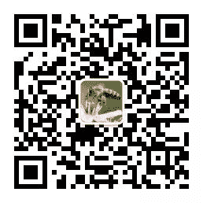

「Python与算法社区」号主现就职于某知名互联网公司，5年算法工程师，从事机器学习、深度学习、数据分析等相关工作。Pandas开源库贡献者。

这位大佬喜欢分享，在过去的两年中，已原创并分享 **280** 余篇文章。

公众号「Python与算法社区」是日常自学和工作的全部沉淀。内容以Python、数据科学、机器学习、深度学习为主，包括但不限于Python、数据分析与挖掘、机器学习、深度学习的个人技术学习与进阶公众号。内容适合以下群体：

*   相关岗位从业者

*   相关专业和方向

*   相关技术爱好者

**Python与算法社区**

长按二维码，关注我的公众号

**1、基础算法类** 

主要包括计算机科学中基本的算法与数据结构，结合算法思想和Leetcode实战，总结介绍。

**2、Python学习路线** 

主要包括Python的核心语法使用总结，以及基于Python常用的数据分析与处理包Numpy, Pandas 和 Matplotlib 的常用API使用和实战总结。

**3、机器学习路线** 

主要包括：入门机器学习必备的数学、线性代数、概论论等知识储备；AI上路指引系列；线性回归，逻辑回归、决策树、朴素贝叶斯、支持向量机、高斯混合聚类的理论和手写代码实现；北大才女机器学习笔记系列；数据挖掘；数据分析实战分析等

**4、深度学习路线** 

主要包括深度学习理论的通俗易懂入门文章，反向传播算法通俗讲解，手写字深度学习模型求解源码；CNN、RNN网络的通俗总结；TensorFlow斯坦福大学课程入门笔记、隐马尔科夫与自然语言处理相关。

**5、经典资料&面试题** 

主要包括老铁面试全程记录；BAT经典面试题；机器学习吴恩达视频，开源书籍推荐。

48.  [机器学习文章中用到的源码下载](https://mp.weixin.qq.com/s?__biz=MzI3NTkyMjA4NA==&mid=2247484810&idx=2&sn=dbd1d8c5e5f09e3622a30e585699e261&scene=21#wechat_redirect)

**Python与算法社区**

长按二维码，关注我的公众号