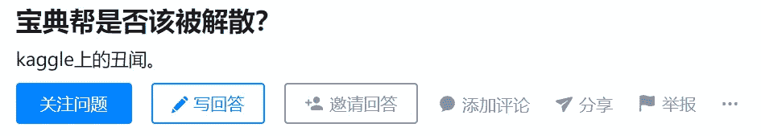

> 作者：[Datawhale](https://mp.weixin.qq.com/s?src=11&timestamp=1570372767&ver=1896&signature=i7mQIoDTVmndZVH1Trpou*xMThr*MqQgSgI*5nh*k7lk-FEvRVPXG6adjvEWkfw9Ntxjoe32whVOfsTZ*-929ubdoVSLgcnEspOf*jdenHoiPrw40ht4aPYc2U*cYBYE&new=1)

关于Kaggle瓜事件，最近得到很多竞赛圈朋友的关注，也导致很多参加竞赛的朋友深受其扰。事实上整个事件是因为kaggle比赛上两个队伍因为提交的sub一样，被取消了成绩，不管原因是什么，有错认错，该批评则批评。

但是杰少，鱼佬，有夕，小兔子乖乖等圈内竞赛选手，自始至终从没有被Kaggle点名和取消成绩，也被卷入了其中，矛头直指，甚至是Kaggle数据竞赛星球社区嘉宾某洋，某翔宇，某Kaggle GM等也无辜躺枪。

从打竞赛到成为竞赛圈头部选手，本身付出了比常人更多的艰辛，这样的人身攻击和公开诋毁对他们带来的负面影响有多大，谁又能感同深受？他们开始被同事，朋友，同学询问，开始被老师约谈，他们坚持很久的努力所带来的荣誉，就因为这些不用负责任的指责而倾覆。

整个事情从开始就是一直被有意带节奏的，慢慢大家发现，这些相关问题都是匿名用户发起的，矛头直指：宝典帮。Kaggle数据竞赛宝典是杰少等人负责的公众号平台，但宝典帮还真的是第一次听说，创造宝典帮新词的用意何在，从两个队伍的事情，直接归纳为宝典帮事件，到宝典帮是否应该解散，到国内数据竞赛已经乌烟瘴气。是不是需要这些头部选手隐退？劣币驱逐良币，最终收益的又是谁？

[外链图片转存失败,源站可能有防盗链机制,建议将图片保存下来直接上传(img-0MaaCKHv-1570372895245)(data:image/gif;base64,iVBORw0KGgoAAAANSUhEUgAAAAEAAAABCAYAAAAfFcSJAAAADUlEQVQImWNgYGBgAAAABQABh6FO1AAAAABJRU5ErkJggg==)]

被卷入的竞赛选手Smile也是深受其扰，很多问题和文章都是假借他的名义在分享，然后大家发现竞赛圈的很多选手被相互利用，他也是受害者，Smile开始删贴处理。

面对假借他名义的指责和分享，他本人也再三强调了是误会，很多知乎匿名回答还要假借他名义带节奏，直指宝典帮，用意何在？

一方面站在道德制高点，强调网络搜索个人信息的可恶，却在大量的回答中放上包含个人隐私的截图，而这些断章取义的截图给更多人带来了隐私问题和困扰。

事情的进一步发酵，在于大数据文摘借用这些网上信息发了Kaggle文章，所谓的"宝典帮"开始被更多人关注，由于文中引用了很多公开失实信息，在大量竞赛圈人的投诉，以及Simle等人和大数据文摘主编的积极沟通下，他们开始审视网上部分信息的真伪性，在意识到这些失实信息对大量头部竞赛选手的无端负面影响后，决定主动删文，也将更加客观公正的进行报道，在这里特别向大数据文摘说声感谢。

目前相关文章已删除

然而，匿名用户又开始假借大数据文摘的名义继续在知乎带节奏，官媒都删了，拿着大数据文摘的名义带节奏，用意何在?

最后想分享三段话：

1.  比赛整体的价值是向上的，大部分选手打比赛真心是为了想多实践，多提升能力，不要一味贬低国内，至于比赛问题，无论是国内国外都需要不断改善，它需要一个历程，而不是刻意人身攻击和放大偏见。

2.  宝典帮是一个被创造出来的新词，用意就不说了。唯一想表达的是大部分竞赛选手，在竞赛圈付出了很多，他们开源了很多分享，为国内竞赛环境发展做出了或多或少的贡献，真心期望这个社会能对竞赛选手多一些包容和多一些尊重，莫让劣币驱逐良币，小人咧嘴笑。

3.  大部分匿名问题都在带宝典帮和Kaggle数据竞赛星球的节奏，坦然的说，相比较竞赛领域机构成千上万的报名费，129的竞赛社区，每天4角钱不到。一心想攻击宝典帮，致力于让星球社区解散，最终收益的又是谁。星球社区成立两个月时间快1k人加入，近200个精华帖，本身社区也是三天无理由退款，至于价值与否，请少一些无端偏见和攻击，自可以亲身经历评判。（阅读原文可进入星球）

**事情终究会过去，只希望愿竞赛圈少一些人身攻击和热点炒作，回归学习和成长的初衷。**