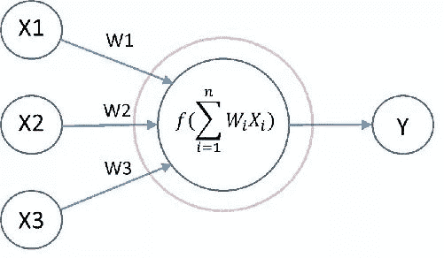
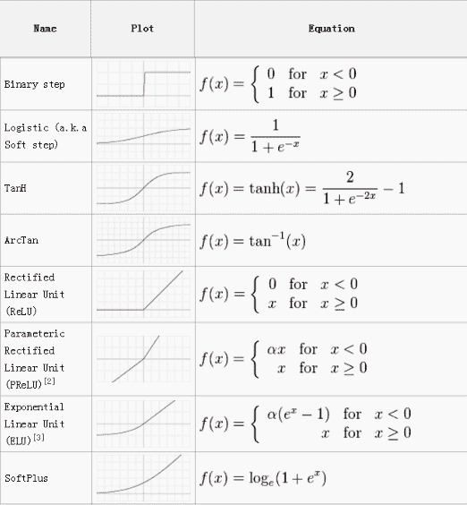
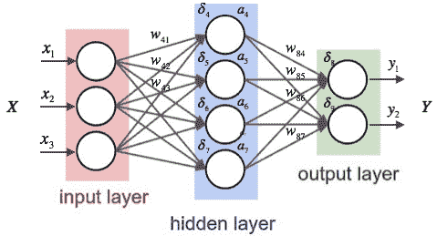
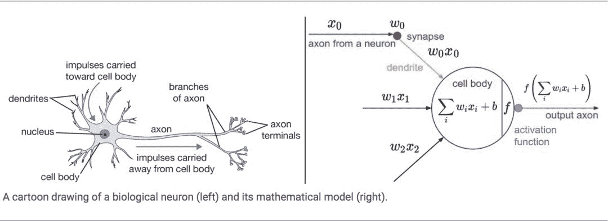
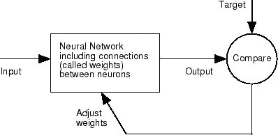
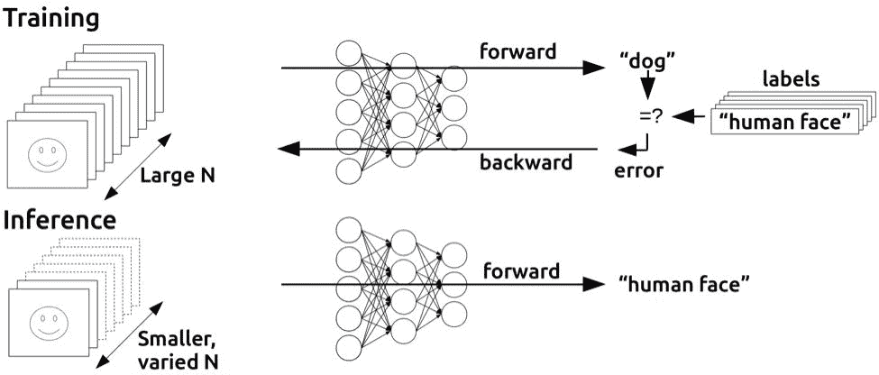

****

**小白深度学习入门系列**

* * *

**神经网络的构成、训练和算法**

**什么是神经网络**

人工神经网络（Artificial Neural Network，ANN），简称神经网络（Neural Network，NN），是一种模仿生物神经网络的结构和功能的数学/计算模型，用于拟合各种函数。

一个神经网络，有两个基本要素：神经元和连接。

##### 神经元

下图中红圈内就是一个神经元：

一个神经元，有输入（上图中神经元接受输入：x1，x2和x3x1、x2、x3），有输出（输出：yy），并在神经元内部进行操作，将输入映射为输出。

神经元内部的操作又包括两步：

1.  对输入进行线性加权；

2.  将线性加权结果经由激活函数映射为输出。

激活函数有很多种，下图中列举了一些常见的激活函数。

其中，NN 最常用的一种激活函数就是 Sigmoid 函数又叫做Logistic函数，就是逻辑回归的模型函数！

> 注意：如果神经元的激活函数是线性函数，那么这个 NN 就只能拟合线性函数。
> 
> 但如果激活函数是非线性的，哪怕是非常简单的非线性（例如 ReLu），由它构建的 NN 都可以用于拟合非常复杂的线性或非线性函数。
> 
> 因此实际使用中，一般都选用非线性函数作为激活函数。

##### 连接

所谓连接，就是神经元组织在一起的形式。

不同的神经元通过连接结合在一起，形成了一个网络，例如下图：

这是一个典型的全连接两层神经网络。

其中，全连接是指前一层每一个神经元的输出都连接到后一层所有的神经元。

明明一共有三层（红、紫、绿），为什么说两层？因为最左侧的输入层是不计算到神经网络层数里面的！

一个神经网络的不同层级分为：输入层、隐含层（简称隐层）和输出层（最后一层）。除了输入层和输出层之外，所有的层都叫做隐层。

上图例子中我们只有一个隐层。

### **神经网络的训练**

#### **对人类神经系统的模拟**

NN 可以用来做分类，也可以用来做回归，还可以用来聚类，总之这是一个几乎可以做任何事情的模型。

它的创造受到了人类中枢神经系统的启发。正是生物神经系统中的神经元及之间的连接，启发了 NN 的结构元素。

NN 的神奇之处在于，它只有结构，没有超参数，一旦结构确定，投入数据去训练就好了，并不需要一般机器学习模型必不可少的“调参”步骤。

而且，它可以用来拟合任意的函数（输入到输出的映射），具备无限的可能性。而不像统计学习模型那样，有一个预设的模型函数，适用范围明确但狭窄。

#### **已知和未知**

一个神经网络有几层，每层有几个神经元，这些神经元之间的连接是怎样的，以及这些神经元里的激活函数是什么——这些都是由用户指定的。在构建一个 NN 的时候，这些因素就都已经被定下来了。

既然这些都是确定的，那训练 NN 模型，又是在训练什么呢？实际上，对于一个典型 NN 而言，就是在训练各个神经元线性加权的权重。

NN 的学习任务可以是有监督的，也可以是无监督的，但无论如何，它实际输出的 Cost 函数都是可以得到的——对于有监督学习而言，Cost 就是输出与标签之间的差距；而对于无监督学习，Cost 则与模型的具体任务（领域）和先验假设有关。

#### **训练过程**

NN 的训练过程可以用下面这幅图来概括：

NN 的训练过程是一个迭代的过程，最初初始化可以认为是随机获得各个权值，然后每次迭代。

*   输入样本进入到当前 NN 的每一个神经元，用现有的权值加权，然后再由激活函数输出给后面连接的神经元。这样一层层递进，最终形成 NN 整体网络的输出。

*   这次运行的输出与目标相比对，计算出 Cost，然后再通过最小化 Cost 来反向调整网络各层、各个神经元的权值。

如此不断重复迭代，直至收敛。

**训练算法**

上述一次迭代中的两个运算过程，一个从前往后，从输入层算到输出层；一个从后往前，从输出层再反推回输入层。

这就引出了两个重要的概念：

前向传播（Forward Propagation，FP）和反向传播（Back Propagation，BP）。

简单而言，前向传播就是从前往后算，反向传播就是从后往前算。

当训练（Training）NN 的时候，我们既需要前向传播，也需要反向传播。但是当一个 NN 训练完成，用来进行推断（Inference）的过程中，就只需要前向传播了。（参见下图）

