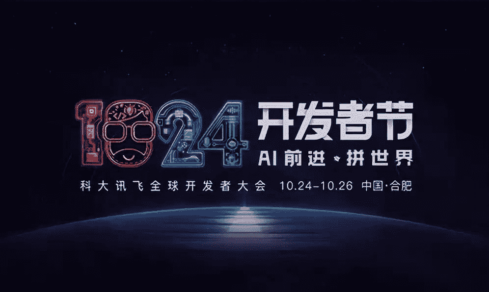
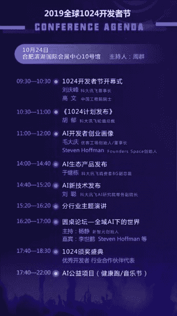
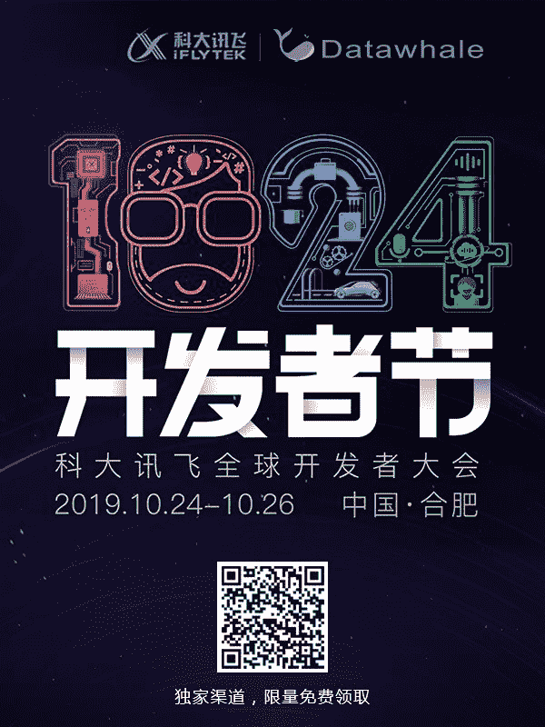

点击上方“**Datawhal****e**”，选择“星标”公众号

第一时间获取价值内容

大会亮点

知名企业的资深大咖汇聚一堂，分享A.I.产业全智能化时代的行业风向。

今年1024，我们还将邀请到中国工程院院士高文、优客工厂创始人毛大庆、硅谷创业教父Steven Hoffman等领军人物莅临现场，分享他们的犀利见解，深挖生态、商业、产品形态多样性的无限可能。

**2\. <生态产品&全新技术>现场亮相**

在去年的1024开发者节上，科大讯飞发布了两大生态新品：云端语音操作系统iFLYOS以及全链路IoT开放平台iFLYIoT。并基于iFLYOS和iFLYIoT，深化打造家居、车载、客服、医疗、营销等行业平台。

今年的1024开发者节现场，也会进行生态新品的发布以及新技术展示。万众瞩目之中又会有什么样的科技产品惊艳亮相呢？让我们拭目以待。

**3\. A.I.开发者大赛最终角逐**

去年，科大讯飞面向全球发起了首届“顶天立地”iFLYTEK A.I.开发者大赛。历时7个月，吸引了1万余名世界各地的优秀开发者，共收到全球3千多支团队提交参赛作品。

今年，算法挑战赛和应用开发创意挑战赛的获胜队伍将展开巅峰对决，获胜者将会登上1024的舞台。冠军奖杯最终花落谁家？等你来现场共同见证。

**4\. 互动展区带来创新体验**

在这片10000m2的互动展区里，不仅有来自讯飞生态伙伴的前沿产品，我们还开设了公益体验区和趣味寻宝环节，为你开启一段奇趣的A.I.旅程。

展区中还设有极客充电区，提供手机充电桩、饮品、食物以及其它贴心服务。观众在这里休憩的同时，还可以体验现场设置的互动游戏和黑科技设备。

**5\. OPEN DAY，让A.I.无限自由**

2019年开辟的全新板块——OPEN DAY。

没有限制，不设门槛！10月26日全天你可以自由进出展区，随心体验。百余家人工智能头部企业将设立展区，众多新奇有趣的A.I.设备惊艳亮相。

**6\. A.I.公益：****唱响热爱，奔向未来**

伴随鼓点和音乐，在这场开发者们的专属音乐节上，释放真实的自己！

本次A.I.公益音乐节将继续延续“三声有幸”的公益主题，盛邀公益音乐人亲临，用歌声传达鼓舞人心的力量，公益天使、儿童宝贝也将为大家带来精彩的歌舞表演。现场还将邀请到公益产品的开发者，讲述他们的开发故事。

除了音乐节，我们还将举办A.I.健康跑活动。在这段5.12KM的环跑道路上，有为你加油的助力点，有为你歌唱的音乐人，更有与你一同前进的小伙伴。夜空中最亮的星，将由你我的热情点亮！

议程安排

报名与活动

Datawhale作为AI开发者大赛AI开源社区合作伙伴，我们给大家申请了一定数量免费嘉宾票。数量有限，先到先得。

扫描下方二维码或点击**阅读原文**，即可报名。

AI前进，拼世界。

全球1024开发者节，我们将以科技之光、生态之念，立足当下、放眼未来。A.I.实现的更多可能，由你我共同见证！

