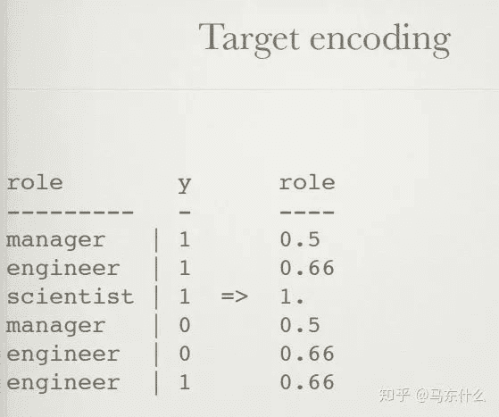
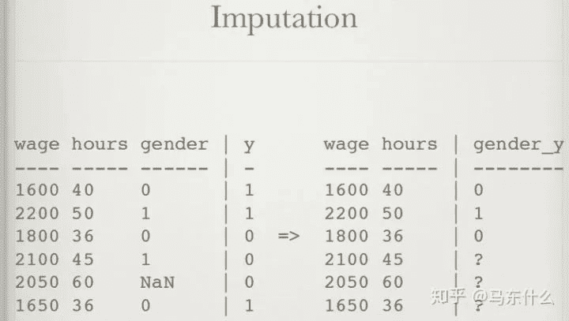

点击上方“**Datawhal****e**”，选择“星标”公众号

第一时间获取价值内容

“More data beats clever algorithms, but better data beats more data.”——名人名言哈哈哈哈，更多的数据打败聪明的算法，更好的数据打败更多的数据。
**特征工程**

*   数据科学最需要创意的方面。

*   像对待其他任何创造性工作一样对待特征工程，例如喜剧表演：

*   一起头脑风暴

*   创建特征工程的模板/公式

*   检查/重新检查以前的工作

**类别特征**

*   几乎总是需要一些处理

*   高基数类别特征会导致非常稀疏的数据

*   难以做缺失值插补

**Onehot编码**

*   对长度为K的数组进行K编码。

*   可以与大多数线性算法一起使用

*   删除第一列可避免共线性（pd.get_dummies中有参数可以达到这个目的，其实就是用全0来表示一种类别其它都用1-0表示）

*   稀疏格式对于内存友好（csr_matrix）

*   大多数当前的处理方法都不能很好地对待缺失值，以及新数据中的新类别

一个简单的例子

**哈希编码**

*   对固定长度的数组执行“ OneHot编码”。（不同的hash编码通过不同的算法将类别映射为一个唯一的值，例如对于类别A通过hash编码可能映射为qwe456这种6维序列，然后我们再去做onehot展开）

*   避免极为稀疏的数据

*   可能会引起碰撞（例如10000个类别用2位的hash编码，很容易出现不同类别最终映射的hash值是相同的，此现象称为碰撞—collisions）

*   可以重复使用不同的哈希函数和袋结果，以降低准确性（意思应该是用不同的hash算法得到不同的编码值然后concat到一起尽量避免碰撞的发生）

*   碰撞collisions通常会降低结果，但可能会改善结果（增强泛化性能）。

*   优雅地处理新变量（例如：新的用户代理）（新的类别重新hash然后合并即可）（关于hash编码可见facebook对于文本的处理的那篇论文，忘了叫啥了，回头补充在编码的文章里好了）

一个简单的例子

**为每个类别变量赋予唯一的数字ID**

*   对于基于非线性树的算法很有用（仅限于lightgbm和catboost这类可以直接处理类别的算法，xgb还是要进行别的处理）

*   不增加维度

*   将cat_var-> num_id映射随机化，然后进行平均再训练，以降低准确性。（没看明白）

一个简单的例子

**计数编码（频率编码）**

*   将类别特征替换为训练集中的计数（一般是根据训练集来进行计数，属于统计编码的一种，统计编码，就是用类别的统计特征来代替原始类别，比如类别A在训练集中出现了100次则编码为100）

*   对线性和非线性算法均有用

*   可能对异常值敏感

*   可以添加对数转换，可以很好地处理计数（主要是针对count编码之后特征分布不规则的问题和常规的处理不规则分布的连续特征是一样的方式）

*   用'1'替换新数据中没见过的类别（没见过的类别如果有n个则编码为n）

*   可能会产生冲突：相同的编码，不同的变量（不同类别出现次数一样）

一个简单的例子

**LabelCount编码（就是对count编码进行排名）**

*   通过训练集中的计数对分类变量进行排名

*   对线性和非线性算法均有用

*   对异常值不敏感

*   不会对不同的变量使用相同的编码

*   两全其美

一个简单的例子

**目标编码**

*   按目标变量的比例对分类变量进行编码（二分类或回归）（如果是多分类其实也可以编码，例如类别A对应的标签1有100个，标签2有100个，标签3有100个，则可以编码为【1/3,1/3,1/3】）

*   注意避免过拟合！（原始的target encoding直接对全部的训练集数据和标签进行编码，会导致得到的编码结果太过依赖与训练集）

*   堆叠形式：输出平均的目标的单变量模型

*   以交叉验证的方式进行（一般会进行交叉验证，比如划分为10折，每次对9折进行标签编码然后用得到的标签编码模型预测第10折的特征得到结果，其实就是常说的均值编码）

*   添加平滑以避免将变量编码设置为0。（某些类别可能只包含部分的类别会出现0值，此时会进行拉普拉斯平滑，不过对于回归则没有这种问题）

*   添加随机噪声以应对过拟合（我一般用交叉验证不怎么加噪声）

*   正确应用时：线性和非线性的最佳编码

一个简单的例子

**类别的embedding**

*   使用神经网络根据分类变量创建密集的嵌入。

*   将分类变量映射到欧几里得空间

*   更快的模型训练。

*   更少的内存开销。

*   可以提供比1热编码更好的精度。

*   Entity Embeddings of Categorical Variables（回头补充到类别编码的内容里）

一个简单的例子

**NaN编码**

*   给NaN值一个明确的编码，而不是忽略它

*   NaN值可以保存信息

*   注意避免过度拟合！

*   仅当nan值在训练集测试集中的NaN值是由相同的值引起的，或者当局部验证证明它可以保留信息时才使用（这里涉及到缺失值的缺失原因，比如客户处于某种不好的目的而故意不提供的情况下表示客户的某种不良的潜在行为则可以统一使用）

一个简单的例子

**多项式编码**

*   编码分类变量之间的交互

*   没有交互作用的线性算法无法解决XOR问题

*   多项式编码可以解决XOR

*   扩展功能空间：使用FS，哈希和/或VW

其实就是做了类别交叉然后再使用其它的编码方式来处理

一个简单的例子

**扩展编码**

*   从单个变量创建多个类别变量

*   一些高基数功能（例如用户代理）在其中包含更多信息：

*   is_mobile？

*   is_latest_version？

*   Operation_system

*   Browser_build

*   等等。

kaggle的常见magic feature的产生方式，这里需要人工思考和头脑风暴的结果

一个简单的例子

**合并编码**

*   将不同的分类变量映射到同一变量

*   拼写错误，职位描述略有不同，全名或缩写

*   真实数据混乱，自由文本尤其如此

其实就是数据预处理中把相同含义的类别统一用一个类别表示

一个简单的例子

前面都是关于**类别特征**的常见处理，下面是关于**连续特征**的。

**数值特征**

*   可以更轻松地输入算法

*   可以构成浮点数，计数，数字

*   更容易做缺失值插补

**四舍五入**

*   舍入数值变量

*   保留数据的最重要特征。

*   有时精度太高只是噪音

*   舍入变量可以视为分类变量

*   可以在四舍五入之前应用对数转换

当然要确保不损失信息的情况下使用，比如kaggle ieee的欺诈比赛，不同精度的交易金额代表了不同国家。。。这就不能直接四舍五入了。

**分箱**

*   将数值变量放入bin并使用bin-ID进行编码

*   可以通过分位数，均匀地务实地设置分箱，或使用模型找到最佳分箱

*   可以与超出训练集的范围的变量正常配合

**标准化**

*   将数字变量缩放到一定范围

*   标准（Z）缩放 standard scaler

*   MinMax 标准化

*   root scaling（这是啥。。。）

*   log 变换（log变换是box cox变换的特例）

**缺失值插补**

*   估算缺失变量

*   硬编码可以与插补结合使用

*   平均值：非常基础

*   中位数：对异常值更健壮

*   忽略：只是忽略问题

*   使用模型：会引入算法偏差

（缺失值的处理是一门大学问，这里写的太简单）

**连续特征的交互**

*   编码数值变量之间的相互作用

*   尝试：减法，加法，乘法，除法（还有更骚的，指数。。。）

*   使用：通过统计测试选择特征，或训练模型特征的重要性，用于特征的筛选（这种方法很容易得到噪声，所以噪声特征也要注意筛选掉）

*   忽略：有时候违背直觉的计算反而可以显着改善模型的训练效果！

**线性算法的非线性编码**

*   硬编码非线性以改善线性算法（hash、各类embedding等）

*   多项式编码

*   Leafcoding（随机森林嵌入）（acebook的gbdt+lr这种思路）

*   遗传算法（典型代表gplearn）

*   局部线性嵌入，频谱嵌入，t SNE （降维提取重要特征）

**按照行计算统计值**

*   在一行数据上创建统计信息

*   NaN的数量，这个在拍拍贷的top解决方案上看到过，不过实际效果不稳定

*   0的数量

*   负值数量

*   平均值，最大值，最小值，偏度等。

**时间特征**

*   时间特征，例如日期，需要更好的局部验证方案（如回测）

*   容易在这里犯错误

*   能够给模型效果带来很多好的提升

**投射到一个圆圈**

*   将单个要素（例如day_of_week）转换为圆上的两个坐标

*   确保最大和最小之间的距离与最小和最小+1相同。

*   用于day_of_week，day_of_month，hour_of_day等。

趋势编码，简单说就是根据时间序列来计算某段时间的一些统计值，比如对总支出进行编码，例如：在上周支出，在上个月支出，在去年支出。这个也是比较常见的方法。

**事件编码**

*   硬编码分类功能，例如：date_3_days_before_holidays：1

*   尝试：国定假日，重大体育赛事，周末，每月的第一个星期六等。

*   这些因素可能对消费行为产生重大影响。

**空间编码**

*   空间变量是对空间中的位置进行编码的变量

*   示例包括：GPS坐标，城市，国家/地区，地址

*   克里格（这是啥。。。）

*   K-均值聚类

*   原始纬度

*   将城市转换为经度

*   在街道名称中添加邮政编码

**位置编码**

*   查找当前位置与重要地点之间的距离

*   小城镇继承了附近大城市的某些文化/背景

*   电话位置可以映射到附近的企业和超市

**位置所反应出来的欺诈行为**

*   位置事件数据可以指示可疑行为

*   不可能的旅行速度：在不同国家/地区同时进行多项交易

*   花费在与住所或送货地址不同的城镇

*   从未在同一地点消费

接下来是关于**数据探索**的一些资料：

**数据探索**

*   数据探索可以发现数据质量问题，异常值，噪声，要素工程构想，要素清理构想。

*   可以使用：spyder，jupyter notebook，pandas

*   尝试简单的统计信息：最小值，最大值

*   合并目标，以便找到信息之间的相关性。

**迭代/调试**

*   特征工程是一个迭代过程：使您的管道适合于快速迭代。

*   使用亚线性调试：输出有关过程的中间信息，进行伪记录。

*   使用允许快速实验的工具与方法

*   失败的想法多于行之有效的想法

关于**标签**的一些处理方法：

*   可以将标签/目标变量/因变量视为数据的特征，反之亦然。

*   对数转换：y-> log（y + 1）| exp（y_pred）-1

*   平方变换

*   Box-Cox变换

*   创建一个分数，把二分类问题转化为回归问题。

*   训练回归器预测测试集中不可用的特征。

关于**自然语言处理**的一些方案，当然，很多方法类别特征也是很合适的。

*   可以使用来自分类功能的相同想法。

*   深度学习（自动特征工程）正在逐渐占领这一领域，但是具有精心设计的特征的浅层学习仍然具有竞争力。

*   数据的稀疏性使您进入“维数的诅咒”

*   很多挖掘出好特征的机会：

重要的还是多实战，多总结，就像打策略游戏一样（比如魔兽争霸3），基本功要扎实，在实战中形成自己的一套处理问题的风格，不要抄kernel，不要窃取别人的特征，自己多思考和总结。

