> ? 说起特征工程，都说是机器学习建模中最为重要而且费时的一项工作，而且它涉及的知识点会非常地多，经验老道的老司机自然是轻车熟路了，但对于刚刚入门的新手司机，学习到的知识点都是东一点西一点的，不够系统化，本篇文章是在阅读了一本评分极高的特征工程书籍 ? 《特征工程入门与实践》后的一篇笔记文，记录下相对比较系统的知识点以及可运行复现的代码，希望对各位同行有所帮助哈。

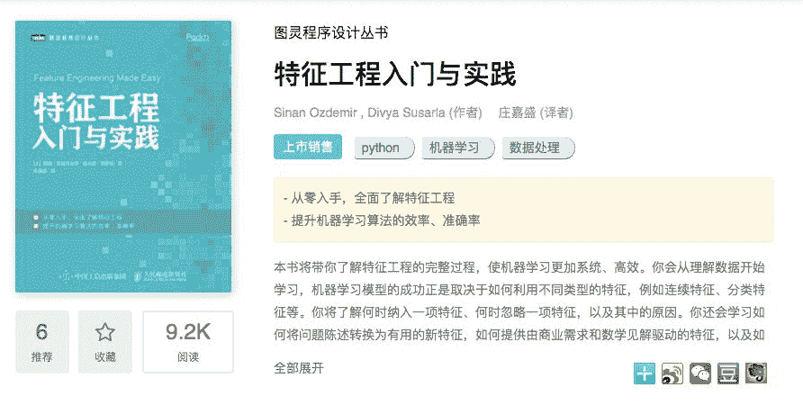

### ? 目录

*   ? 特征理解
*   ? 特征增强
*   ?  特征构建
*   ✅  特征选择
*   ?  特征转换
*   ?  特征学习

大家可以先看下思维导图：

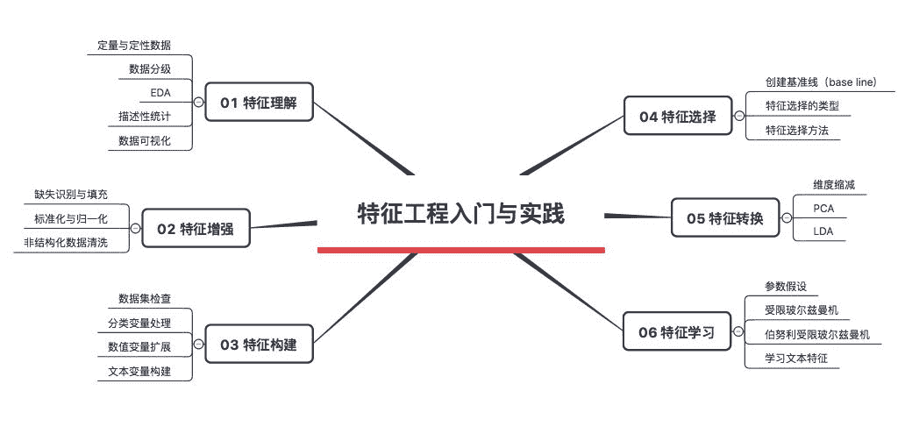

### ? 01 特征理解

在拿到数据的时候，我们第一步需要做的是理解它，一般我们可以从下面几个角度入手：（注：本节用到了两个数据集，分别是Salary_Ranges_by_Job_Classification 和 GlobalLandTemperaturesByCity）

#### 1\. 区分结构化数据与非结构化数据

> 如一些以表格形式进行存储的数据，都是结构化数据；而非结构化数据就是一堆数据，类似于文本、报文、日志之类的。

#### 2\. 区分定量和定性数据

> 定量数据：指的是一些数值，用于衡量某件东西的数量；定性数据：指的是一些类别，用于描述某件东西的性质。

其实区分了定量和定性数据，还可以继续细分下去，分为定类（nominal）、定序（ordinal）、定距（interval）、定比数据（ratio），下面我们分别对这4类数据进行举例说明，加深大家对它们的印象。**1）定类（nominal）**也就是分类，比如：血型（A／B／O／AB型）、性别（男／女）、货币（人民币／美元／日元），而且值得注意的是这些分类之间没有大小可比性。一般画图的话就只能看下分布占比，可以用条形图、饼图来表示。

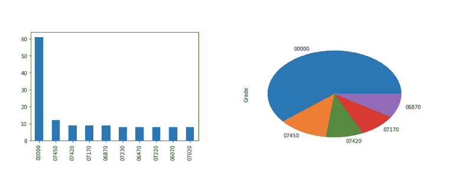

**2）定序（ordinal）**定序相比于定类，也就是多了一个“可排序”的属性，也就是说虽然它们是类别变量，但是它们的变量值之间是存在“大小”之分的。比如：期末绩点（A、B、C、D、E、F）、问卷答案（非常满意、满意、一般、不满意）。可视化方面，和定类一样，不过就是多了一个 箱体图 可以用（因为定序变量可以有中位数）。

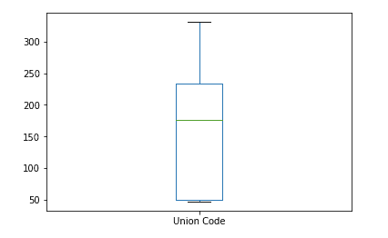

**3）定距（interval）**定距的话，就是变量值之间可以做加减法计算，也就是可以引入均值、方差之类的名词了，而且能够画的图也多了，包括先前的那些，还包括了直方图。

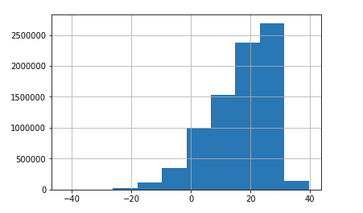

**4）定比（ratio）**定比相比于定距更加严格，不仅仅有定距的所有属性，同时，有一个 绝对零点 的概念，可以做加减乘除运算，比如说某个商品的价格是另一个的2倍。值得注意的是，温度一般不归入定比，而是定距，没有说20度是10度的两倍这种说法。

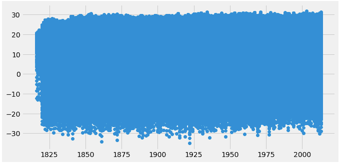

最后把上面的内容总结一下：

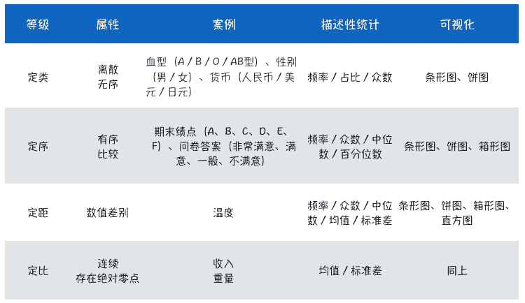

#### 3\. 关键代码汇集

以下的代码只是核心片段，完整代码可在公众号（SAMshare）后台输入关键字 特征工程 获取。

1）常见简易画图

```
# 绘制条形图
salary_ranges['Grade'].value_counts().sort_values(ascending=False).head(10).plot(kind='bar')

# 绘制饼图
salary_ranges['Grade'].value_counts().sort_values(ascending=False).head(5).plot(kind='pie')

# 绘制箱体图
salary_ranges['Union Code'].value_counts().sort_values(ascending=False).head(5).plot(kind='box')

# 绘制直方图
climate['AverageTemperature'].hist()

# 为每个世纪（Century）绘制平均温度的直方图
climate_sub_china['AverageTemperature'].hist(by=climate_sub_china['Century'],
                                           sharex=True,
                                           sharey=True,
                                           figsize=(10, 10),
                                           bins=20)

# 绘制散点图
x = climate_sub_china['year']
y = climate_sub_china['AverageTemperature']

fig, ax = plt.subplots(figsize=(10,5))
ax.scatter(x, y)
plt.show()
```

2）检查缺失情况

```
# 移除缺失值
climate.dropna(axis=0, inplace=True)

# 检查缺失个数
climate.isnull().sum()
```

3）变量类别转换

```
# 日期转换, 将dt 转换为日期，取年份, 注意map的用法
climate['dt'] = pd.to_datetime(climate['dt'])
climate['year'] = climate['dt'].map(lambda value: value.year)

# 只看中国
climate_sub_china = climate.loc[climate['Country'] == 'China']
climate_sub_china['Century'] = climate_sub_china['year'].map(lambda x:int(x/100+1))
climate_sub_china.head()
```

### ? 02 特征增强

这一步其实就是数据清洗了，虽然上一步中也有涉及到部分清洗工作（比如清除空值、日期转换之类的），但却是分散的，这节重点讲讲数据清洗的一些技巧和实践代码，供大家在实际项目中去使用。

#### Step1: 进行EDA（Exploratory Data Analysis），思路如下：

（1）首先看看目标占比情况（针对二分类问题，也就是0和1的占比情况），直接 `value_counts()`就可以解决，看看样本是否失衡。（2）接着看看有没有空值，直接统计 `isnull().sum()` 的个数，不过需要注意的是，可能统计出来没有缺失，并不是因为真的没有缺失，而且缺失被人用某个特殊值填充了，一般会用 -9、blank、unknown、0之类的，需要注意⚠️识别，后面需要对缺失进行合理填充。（2.1）怎么识别缺失值呢？一般可以通过 `data.describe()` 获取基本的描述性统计，根据均值、标准差、极大极小值等指标，结合变量含义来判断。

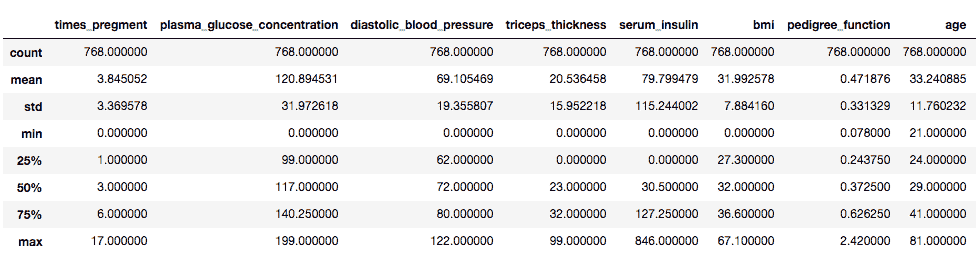

（3）再接着看不同类别之间的特征值分布情况，可通过画直方图（数值型变量）和计算变量值占比分布（类别变量）来观察。（4）观察不同变量之间的相关性情况，可以通过绘制 相关矩阵的热力图 来观察大体情况。

#### Step2: 处理数据缺失问题

缺失处理的办法有好多种，但最为常用的作者讲到有两种：填充和删除。而在处理缺失前，我们在上面的小节中识别出来了部分被人工填充的缺失，

需要还原一下：

```
# 处理被错误填充的缺失值0，还原为 空(单独处理)
pima['serum_insulin'] = pima['serum_insulin'].map(lambda x:x if x !=0 else None)
# 检查变量缺失情况
pima['serum_insulin'].isnull().sum()

# 批量操作 还原缺失值
columns = ['serum_insulin','bmi','plasma_glucose_concentration','diastolic_blood_pressure','triceps_thickness']

for col in columns:
   pima[col].replace([0], [None], inplace=True)

# 检查变量缺失情况
pima.isnull().sum()
```

1) 删除含有缺失值的行
这里的话比较简单，就是使用 `dropna()` 来处理即可，同时我们还可以检查下我们到底删除了多少数据量：`round(data.shape[0]-data_dropped.shape[0])/float(data.shape[0])` 就可以统计出来了。当然，删除之后，我们还需要看看数据的分布，对比目标占比、特征分布与先前的是否存在明显差异，如果是的话，建议不要使用这种办法。

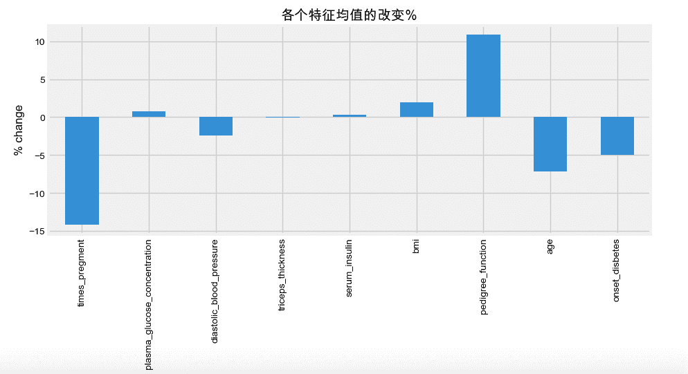

2) 缺失值合理填充缺失填充，这里介绍的有均值填充、-9填充、中位数填充。这里会比较简单，我们可以通常都是通过 sklearn的 Pipeline以及 Imputer来实现，下面是一个简单的完整

Demo：

```
# 使用sklearn的 Pipeline以及 Imputer来实现缺失值填充
from sklearn.pipeline import Pipeline
from sklearn.neighbors import KNeighborsClassifier
from sklearn.model_selection import GridSearchCV
from sklearn.preprocessing import Imputer

# 调参候选
knn_params = {'classify__n_neighbors':[1,2,3,4,5,6]}

# 实例化KNN模型
knn = KNeighborsClassifier()

# 管道设计
mean_impute = Pipeline([('imputer', Imputer(strategy='mean')),
                      ('classify',knn)
                      ])

x = pima.drop('onset_disbetes', axis=1) # 丢弃y
y = pima['onset_disbetes']

# 网格搜索
grid = GridSearchCV(mean_impute, knn_params)
grid.fit(x, y)

# 打印模型效果
print(grid.best_score_, grid.best_params_)
# 0.73177
```

#### Step3: 标准化和归一化

经过上面的处理，模型的精度可以达到0.73177，但我们可以继续优化吗？那是肯定的。

我们可以先看看所有特征的分布（特征少的时候可以这么看）：

```
pima_imputed_mean.hist(figsize=(15,15))
```

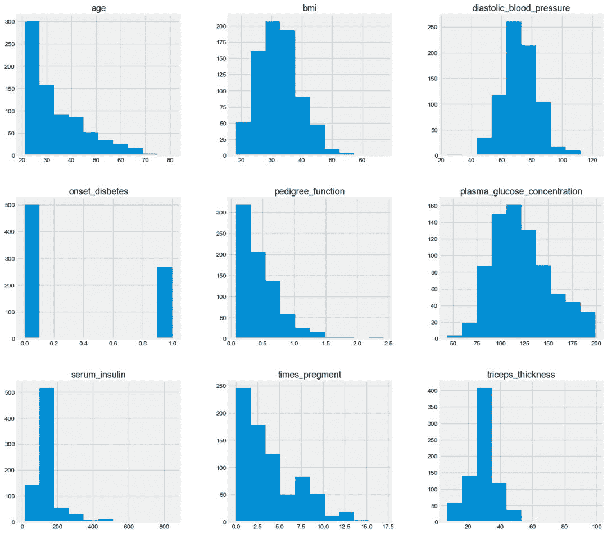

从上图中我们可以看出一个问题，那就是每个特征之间的量纲都是不一样的，这对于knn这种基于距离的模型来说是“致命”的bug，因此我们需要进行标准化和归一化处理。我们重点关注3种方法：

1）Z分数标准化

最为常用的标准化技术，利用了统计学中的z分数思想，也就是将数据转换为均值为0，标准差为1的分布，其在python中的调用方法：

```
# z分数标准化（单一特征）
from sklearn.preprocessing import StandardScaler
# 实例化方法
scaler = StandardScaler()
glucose_z_score_standarScaler =scaler.fit_transform(pima[['plasma_glucose_concentration']].fillna(-9))
# 可以看看转换之后的均值和标准差是否为0和1
glucose_z_score_standarScaler.mean(), glucose_z_score_standarScaler.std()

# z分数标准化（全部特征）
from sklearn.preprocessing import StandardScaler
# 实例化方法
scaler = StandardScaler()
pima_imputed_mean_scaled = pd.DataFrame(scaler.fit_transform(pima_imputed_mean),columns=pima_columns)
# 看下标准化之后的分布
pima_imputed_mean_scaled.hist(figsize=(15,15), sharex=True)

# 在Pipeline中使用
model = Pipeline([
  ('imputer', Imputer()),
  ('standardize', StandarScaler())
])
```

2）min-max标准化

min-max标准化和z-score类似，其公式为：（X - Xmin)/(Xmax - Xmin)

在python中的调用方法：

```
# min-max标准化
from sklearn.preprocessing import MinMaxScaler
# 实例化方法
min_max = MinMaxScaler()
# 使用min-max标准化
pima_min_maxed = pd.DataFrame(min_max.fit_transform(pima.fillna(-9)),columns=pima_columns)
```

3）行归一化

行归一化针对的是每一行数据，不同于上面的两种方法（针对列），对行进行处理是为了保证每行的向量长度一样（也就是单位范围，unit norm），有L1、L2范数。

在python中的调用方法：

```
# 行归一化
from sklearn.preprocessing import Normalizer
# 实例化方法
normalize = Normalizer()
# 使用行归一化
pima_normalized = pd.DataFrame(normalize.fit_transform(pima.fillna(-9)),columns=pima_columns)
# 查看矩阵的平均范数（1）
np.sqrt((pima_normalized**2).sum(axis=1)).mean()
```

### ? 03 特征构建

如果我们对变量进行处理之后，效果仍不是非常理想，就需要进行特征构建了，也就是衍生新变量。

而在这之前，我们需要了解我们的数据集，先前两节中我们了解到了可以通过 `data.info` 和 `data.describe()` 来查看，同时结合数据等级（定类、定序、定距、定比）来理解变量。

#### ? 基础操作

本小节中我们使用一个自定义数据集。

```
# 本次案例使用的数据集
import pandas as pd

X = pd.DataFrame({'city':['tokyo',None,'london','seattle','san fancisco','tokyo'],
                 'boolean':['y','n',None,'n','n','y'],
                 'ordinal_column':['somewhat like','like','somewhat like','like','somewhat like','dislike'],
                 'quantitative_column':[1,11,-.5,10,None,20]})
X
```

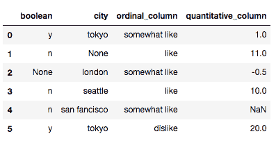

首先我们需要对分类变量进行填充操作，类别变量一般用众数或者特殊值来填充，回顾之前的内容，我们也还是采取Pipeline的方式来进行，因此可以事先基于`TransformMixin`基类来对填充的方法进行封装，然后直接在Pipeline中进行调用，代码可以参考：

```
# 填充分类变量（基于TransformerMixin的自定义填充器，用众数填充）
from sklearn.base import TransformerMixin

class CustomCategoryzImputer(TransformerMixin):
   def __init__(self, cols=None):
       self.cols = cols

   def transform(self, df):
       X = df.copy()
       for col in self.cols:
           X[col].fillna(X[col].value_counts().index[0], inplace=True)
       return X

   def fit(self, *_):
       return self  

# 调用自定义的填充器
cci = CustomCategoryzImputer(cols=['city','boolean'])
cci.fit_transform(X)
```

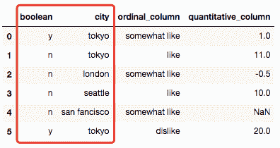

又或者利用 scikit-learn 的 `Imputer`类来实现填充，而这个类有一个 `Strategy`的方法自然就被继承过来用了，包含的有mean、median、most_frequent可供选择。

```
# 填充分类变量（基于Imputer的自定义填充器，用众数填充）
from sklearn.preprocessing import Imputer
class CustomQuantitativeImputer(TransformerMixin):
   def __init__(self, cols=None, strategy='mean'):
       self.cols = cols
       self.strategy = strategy

   def transform(self, df):
       X = df.copy()
       impute = Imputer(strategy=self.strategy)
       for col in self.cols:
           X[col] = impute.fit_transform(X[[col]])
       return X

   def fit(self, *_):
       return self

# 调用自定义的填充器
cqi = CustomQuantitativeImputer(cols = ['quantitative_column'], strategy='mean')
cqi.fit_transform(X)
```

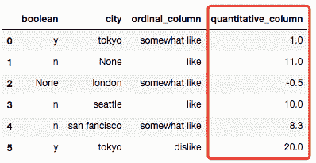

对上面的两种填充进行流水线封装：

```
# 全部填充
from sklearn.pipeline import Pipeline

imputer = Pipeline([('quant',cqi),
                  ('category',cci)
])

imputer.fit_transform(X)
```

完成了分类变量的填充工作，接下来就需要对分类变量进行编码了（因为大多数的机器学习算法都是无法直接对类别变量进行计算的），一般有两种办法：独热编码以及标签编码。

1）独热编码

独热编码主要是针对定类变量的，也就是不同变量值之间是没有顺序大小关系的，我们一般可以使用 scikit_learn 里面的 `OneHotEncoding`来实现的，但我们这里还是使用自定义的方法来加深理解。

```
# 类别变量的编码（独热编码）
class CustomDummifier(TransformerMixin):
   def __init__(self, cols=None):
       self.cols = cols

   def transform(self, X):
       return pd.get_dummies(X, columns=self.cols)

   def fit(self, *_):
       return self

# 调用自定义的填充器
cd = CustomDummifier(cols=['boolean','city'])
cd.fit_transform(X)
```

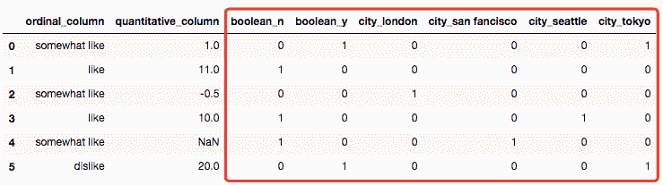

2）标签编码

标签编码是针对定序变量的，也就是有顺序大小的类别变量，就好像案例中的变量ordinal_column的值（dislike、somewhat like 和 like 可以分别用0、1、2来表示），同样的可以写个自定义的标签编码器：

```
# 类别变量的编码（标签编码）
class CustomEncoder(TransformerMixin):
   def __init__(self, col, ordering=None):
       self.ordering = ordering
       self.col = col

   def transform(self, df):
       X = df.copy()
       X[self.col] = X[self.col].map(lambda x: self.ordering.index(x))
       return X

   def fit(self, *_):
       return self

# 调用自定义的填充器
ce = CustomEncoder(col='ordinal_column', ordering=['dislike','somewhat like','like'])
ce.fit_transform(X)
```

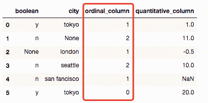

3）数值变量分箱操作

以上的内容是对类别变量的一些简单处理操作，也是比较常用的几种，接下来我们就对数值变量进行一些简单处理方法的讲解。

有的时候，虽然变量值是连续的，但是只有转换成类别才有解释的可能，比如年龄，我们需要分成年龄段，这里我们可以使用pandas的 `cut`函数来实现。

```
# 数值变量处理——cut函数
class CustomCutter(TransformerMixin):
   def __init__(self, col, bins, labels=False):
       self.labels = labels
       self.bins = bins
       self.col = col

   def transform(self, df):
       X = df.copy()
       X[self.col] = pd.cut(X[self.col], bins=self.bins, labels=self.labels)
       return X

   def fit(self, *_):
       return self

# 调用自定义的填充器
cc = CustomCutter(col='quantitative_column', bins=3)
cc.fit_transform(X)
```

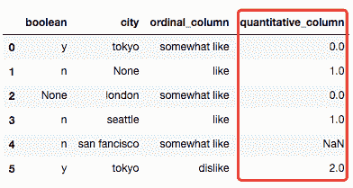

综上，我们可以对上面自定义的方法一并在Pipeline中进行调用，Pipeline的顺序为：

1）用imputer填充缺失值

2）独热编码city和boolean

3）标签编码ordinal_column

4）分箱处理quantitative_column

代码为：

```
from sklearn.pipeline import Pipeline

# 流水线封装
pipe = Pipeline([('imputer',imputer),
                ('dummify',cd),
                ('encode',ce),
                ('cut',cc)
])

# 训练流水线
pipe.fit(X)

# 转换流水线
pipe.transform(X)
```

#### ? 数值变量扩展

这一小节我们使用一个新的数据集（人体胸部加速度数据集），我们先导入数据：

```
# 人体胸部加速度数据集,标签activity的数值为1-7
'''
1-在电脑前工作
2-站立、走路和上下楼梯
3-站立
4-走路
5-上下楼梯
6-与人边走边聊
7-站立着说话

'''
df = pd.read_csv('./data/activity_recognizer/1.csv', header=None)
df.columns = ['index','x','y','z','activity']
df.head()
```

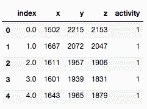

这边只介绍一种多项式生成新特征的办法，调用`PolynomialFeatures`来实现。

```
# 扩展数值特征
from sklearn.preprocessing import PolynomialFeatures

x = df[['x','y','z']]
y = df['activity']

poly = PolynomialFeatures(degree=2, include_bias=False, interaction_only=False)

x_poly = poly.fit_transform(x)
pd.DataFrame(x_poly, columns=poly.get_feature_names()).head()
```

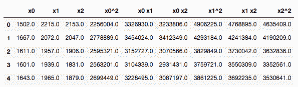

还可以查看下衍生新变量后的相关性情况，颜色越深相关性越大：

```
# 查看热力图(颜色越深代表相关性越强)
%matplotlib inline
import seaborn as sns

sns.heatmap(pd.DataFrame(x_poly, columns=poly.get_feature_names()).corr())
```

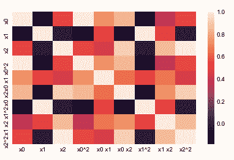

在流水线中的实现代码：

```
# 导入相关库
from sklearn.neighbors import KNeighborsClassifier
from sklearn.model_selection import GridSearchCV
from sklearn.pipeline import Pipeline

knn = KNeighborsClassifier()

# 在流水线中使用
pipe_params = {'poly_features__degree':[1,2,3],
              'poly_features__interaction_only':[True,False],
              'classify__n_neighbors':[3,4,5,6]}

# 实例化流水线
pipe = Pipeline([('poly_features',poly),
                ('classify',knn)])

# 网格搜索
grid = GridSearchCV(pipe, pipe_params)
grid.fit(x,y)

print(grid.best_score_, grid.best_params_)
```

```
0.721189408065 {'classify__n_neighbors': 5, 'poly_features__degree': 2, 'poly_features__interaction_only': True}
```

#### ? 文本变量处理

文本处理一般在NLP（自然语言处理）领域应用最为广泛，一般都是需要把文本进行向量化，最为常见的方法有 词袋（bag of words）、CountVectorizer、TF-IDF。

1）bag of words

词袋法分成3个步骤，分别是分词（tokenizing）、计数（counting）、归一化（normalizing）。

2）CountVectorizer

将文本转换为矩阵，每列代表一个词语，每行代表一个文档，所以一般出来的矩阵会是非常稀疏的，在`sklearn.feature_extraction.text` 中调用 `CountVectorizer` 即可使用。

3）TF-IDF

TF-IDF向量化器由两个部分组成，分别为代表词频的TF部分，以及代表逆文档频率的IDF，这个TF-IDF是一个用于信息检索和聚类的词加权方法，在 `sklearn.feature_extraction.text` 中调用 `TfidfVectorizer` 即可。

> TF：即Term Frequency，词频，也就是单词在文档中出现的频率。
> 
> IDF：即Inverse Document Frequency，逆文档频率，用于衡量单词的重要度，如果单词在多份文档中出现，就会被降低权重。

### ✅ 04 特征选择

好了，经过了上面的特征衍生操作，我们现在拥有了好多好多的特征（变量）了，全部丢进去模型训练好不好？当然是不行了?，这样子既浪费资源又效果不佳，因此我们需要做一下 特征筛选 ，而特征筛选的方法大致可以分为两大类：基于统计的特征筛选 和 基于模型的特征筛选。

在进行特征选择之前，我们需要搞清楚一个概念：到底什么是更好的？有什么指标可以用来量化呢？

这大致也可以分为两大类：一类是模型指标，比如accuracy、F1-score、R^2等等，还有一类是元指标，也就是指不直接与模型预测性能相关的指标，如：模型拟合/训练所需的时间、拟合后的模型预测新实例所需要的时间、需要持久化（永久保存）的数据大小。

我们可以通过封装一个方法，把上面提及到的指标封装起来，方便后续的调用，代码如下：

```
from sklearn.model_selection import GridSearchCV

def get_best_model_and_accuracy(model, params, x, y):
   grid = GridSearchCV(model,
                       params,
                       error_score=0.)
   grid.fit(x,y)

   # 经典的性能指标
   print("Best Accuracy:{}".format(grid.best_score_))
   # 得到最佳准确率的最佳参数
   print("Best Parameters:{}".format(grid.best_params_))
   # 拟合的平均时间
   print("Average Time to Fit (s):{}".format(round(grid.cv_results_['mean_fit_time'].mean(), 3)))

   # 预测的平均时间
   print("Average Time to Score (s):{}".format(round(grid.cv_results_['mean_score_time'].mean(), 3)))

############### 使用示例 ###############
# 导入相关库
from sklearn.neighbors import KNeighborsClassifier
from sklearn.model_selection import GridSearchCV
from sklearn.pipeline import Pipeline

knn = KNeighborsClassifier()

# 在流水线中使用
pipe_params = {'poly_features__degree':[1,2,3],
              'poly_features__interaction_only':[True,False],
              'classify__n_neighbors':[3,4,5,6]}

# 实例化流水线
pipe = Pipeline([('poly_features',poly),
                ('classify',knn)])

# 网格搜索
get_best_model_and_accuracy(pipe, pipe_params, x, y)
```

通过上面的操作，我们可以创建一个模型性能基准线，用于对比后续优化的效果。接下来介绍一些常用的特征选择方法。

#### 1）基于统计的特征选择

针对于单变量，我们可以采用 皮尔逊相关系数以及假设检验 来选择特征。

（1）皮尔逊相关系数可以通过 corr() 来实现，返回的值在-1到1之间，绝对值越大代表相关性越强；

（2）假设检验也就是p值，作为一种统计检验，在特征选择中，假设测试得原则是：” 特征与响应变量没有关系“（零假设）为真还是假。我们需要对每个变量进行检测，检测其与target有没有显著关系。可以使用 `SelectKBest` 和 `f_classif` 来实现。一般P值是介于0-1之间，简而言之，p值越小，拒绝零假设的概率就越大，也就是这个特征与target关系更大。

#### 2）基于模型的特征选择

（1）对于文本特征，`sklearn.feature_extraction.text`里的 `CountVectorizer`有自带的特征筛选的参数，分别是 max_features、min_df、max_df、stop_words，可以通过搜索这些参数来进行特征选择，可以结合 `SelectKBest` 来实现流水线。

（2）针对?树模型，我们可以直接调用不同树模型算法里的 特征重要度 来返回特征重要度，比如 DecisionTreeClassifier里的feature_importances_，（除此之外还有RandomForest、GBDT、XGBoost、ExtraTreesClassifier等等）都可以直接返回每个特征对于本次拟合的重要度，从而我们可以剔除重要度偏低的特征，可以结合 `SelectFromModel`来实现流水线。

（3）使用正则化来筛选变量（针对线性模型）。有两种常用的正则化方法：L1正则化（Lasso）和L2正则化（岭）。

#### 总结一下，有几点做特征选择的方法经验：

（1）如果特征是分类变量，那么可以从SelectKBest开始，用卡方或者基于树的选择器来选择变量；

（2）如果特征是定量变量，可以直接用线性模型和基于相关性的选择器来选择变量；

（3）如果是二分类问题，可以考虑使用 SelectFromModel和SVC；

（4）在进行特征选择前，还是需要做一下EDA。

### ? 05 特征转换

经过了上面几个环节的“洗礼”，我们来到特征转换的环节，也就是使用源数据集的隐藏结构来创建新的列，常用的办法有2种：PCA和LDA。

#### ✅ PCA：

PCA，即主成分分析（Principal Components Analysis），是比较常见的数据压缩的办法，即将多个相关特征的数据集投影到相关特征较少的坐标系上。也就是说，转换后的特征，在解释性上就走不通了，因为你无法解释这个新变量到底具有什么业务逻辑了。PCA的原理这里就不展开来讲了，太多的文章把它讲得十分透彻了。这里主要是复现一下PCA在sklearn上的调用方法，一来继续熟悉下Pipeline的使用，二来理解一下PCA的使用方法。

```
# 导入相关库
from sklearn.datasets import load_iris
import matplotlib.pyplot as plt
%matplotlib inline

from sklearn.decomposition import PCA

# 导入数据集
iris = load_iris()
iris_x, iris_y = iris.data, iris.target

# 实例化方法
pca = PCA(n_components=2)
# 训练方法
pca.fit(iris_x)
pca.transform(iris_x)[:5,]

# 自定义一个可视化的方法
label_dict = {i:k for i,k in enumerate(iris.target_names)}
def plot(x,y,title,x_label,y_label):
   ax = plt.subplot(111)
   for label,marker,color in zip(
   range(3),('^','s','o'),('blue','red','green')):
       plt.scatter(x=x[:,0].real[y == label],
                  y = x[:,1].real[y == label],
                  color = color,
                  alpha = 0.5,
                  label = label_dict[label]
                  )

   plt.xlabel(x_label)
   plt.ylabel(y_label)

   leg = plt.legend(loc='upper right', fancybox=True)
   leg.get_frame().set_alpha(0.5)
   plt.title(title)

# 可视化
plot(iris_x, iris_y,"original iris data","sepal length(cm)","sepal width(cm)")
plt.show()

plot(pca.transform(iris_x), iris_y,"Iris: Data projected onto first two PCA components","PCA1","PCA2")
```

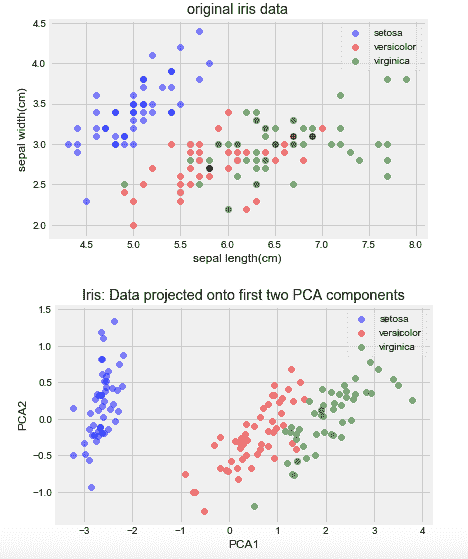

以上是PCA在sklearn上的简单调用和效果展示，另外，作者提出了一个很有意思的问题：

> 一般而言，对特征进行归一化处理后会对机器学习算法的效果有比较明显的帮助，但为什么在书本的例子却是相反呢？

给出的解释是：在对数据进行缩放后，列与列之间的协方差会更加一致，而且每个主成分解释的方差会变得分散，而不是集中在某一个主成分上。所以，在实际操作的时候，都要对缩放的未缩放的数据进行性能测试才是最稳妥的哦。

#### ✅ LDA：

LDA，即线性判别分析（Linear Discriminant Analysis），它是一个有监督的算法（哦对了, PCA是无监督的），一般是用于分类流水线的预处理步骤。与PCA类似，LDA也是提取出一个新的坐标轴，将原始的高维数据投影到低维空间去，而区别在于LDA不会去专注数据之间的方差大小，而是直接优化低维空间，以获得最佳的类别可分性。

```
# LDA的使用
# 导入相关库
from sklearn.discriminant_analysis import LinearDiscriminantAnalysis
# 实例化LDA模块
lda = LinearDiscriminantAnalysis(n_components=2)
# 训练数据
x_lda_iris = lda.fit_transform(iris_x, iris_y)
# 可视化
plot(x_lda_iris, iris_y, "LDA Projection", "LDA1", "LDA2")
```

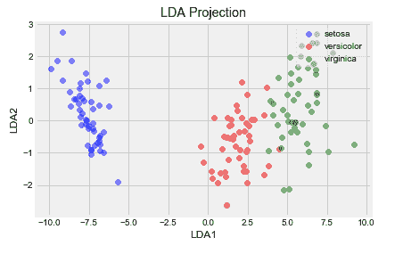

### ? 06 特征学习

来到最后一章了，这章的主题是“以AI促AI”。看起来还蛮抽象的，反正我是觉得有点奇怪，特征学习算法是非参数方法，也就是不依赖数据结构而构建出来的新算法。

#### ? 数据的参数假设

参数假设指的是算法对数据形状的基本假设。比如上一章的PCA，我们是假设：

> 原始数据的形状可以被（特征值）分解，并且可以用单个线性变换（矩阵计算）表示。

而特征学习算法，就是要去除这个“假设”来解决问题，因为这算法不会依赖数据的形状，而是依赖于随机学习（Stochastic Learning），指的是这些算法并不是每次输出相同的结果，而是一次次按轮（epoch）去检查数据点以找到要提取的最佳特征，并且可以拟合出一个最优的解决方法。而在特征学习领域，有两种方法是比较常用的，也是下面来讲解的内容：受限玻尔兹曼机（RBM）和词嵌入。

#### ? 受限玻尔兹曼机（RBM）

RBM是一种简单的深度学习架构，是一组无监督的特征学习算法，根据数据的概率模型学习一定数量的新特征，往往使用RBM之后去用线性模型（线性回归、逻辑回归、感知机等）的效果极佳。从概念上说，RBM是一个浅层（2层）的神经网络，属于深度信念网络（DBN，deep belief network）算法的一种。它也是一种无监督算法，可以学习到的 特征数量只受限于计算能力，它可能学习到比原始要少或者多的特征，具体要学习的特征数量取决于要解决的问题。

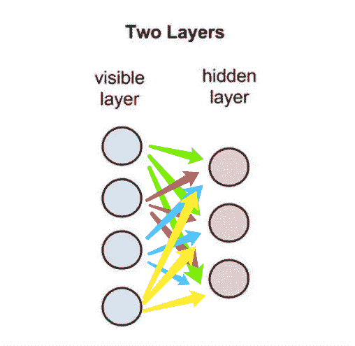

“受限”的说法是因为它只允许层与层之间的连接（层间连接），而不允许同一层内的节点连接（层内连接）。

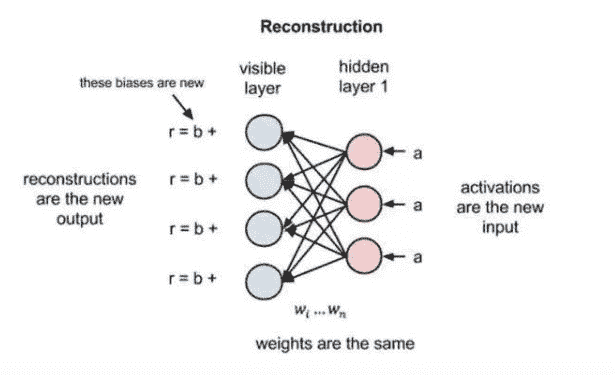

在这里需要理解一下“重建”（Reconstruction），也就是这个操作，使得在不涉及更深层网络的情况下，可见层（输入层）和隐含层之间可以存在数次的前向和反向传播。在重建阶段，RBM会反转网络，可见层变成了隐含层，隐含层变成了可见层，用相同的权重将激活变量a反向传递到可见层，但是偏差不一样，然后用前向传导的激活变量重建原始输入向量。RBM就是用这种方法来进行“自我评估”的，通过将激活信息进行反向传导并获取原始输入的近似值，该网络可以调整权重，让近似值更加接近原始输入。在训练开始时，由于权重是随机初始化的（一般做法），近似值与真实值的差异可能会极大的，接下来就会通过反向传播的方法来调整权重，最小化原始输入与近似值的距离，一直重复这个过程，直到近似值尽可能接近原始输入。（这个过程发生的次数叫 迭代次数 ）大致的原理就是上面的说法了，更加详细的解释可以自行百度哦。下面我们来讲讲RBM在机器学习管道中的应用，我们还是使用MNIST数据集，这个数据集在之前讲Keras的时候

```
# RBM的使用
# 我们使用MNIST数据集来讲解
# 导入相关库
import numpy as np
import matplotlib.pyplot as plt
%matplotlib inline

from sklearn.linear_model import LogisticRegression
from sklearn.neural_network import BernoulliRBM
from sklearn.pipeline import Pipeline

# 导入数据集
images = np.genfromtxt('./data/mnist_train.csv', delimiter=',')
print(images.shape)
# 划分数据
images_x, images_y = images[:,1:], images[:,0]

# 缩放特征到0-1
images_x = images_x/255.

# 用RBM学习新特征
rbm = BernoulliRBM(random_state=0)
lr = LogisticRegression()

# 设置流水线的参数范围
params = {'clf__C':[1e-1, 1e0, 1e1],
         'rbm__n_components':[100, 200]
        }
# 创建流水线
pipeline = Pipeline([('rbm', rbm),
                    ('clf', lr)])
# 实例化网格搜索类
grid = GridSearchCV(pipeline, params)
# 拟合数据
grid.fit(images_x, images_y)
# 返回最佳参数
grid.best_params_, grid.best_score_
```

#### ? 词嵌入

在NLP领域应用极为广泛了，它可以将字符串（单词或短语）投影到n维特征集中，以便理解上下文和措辞的细节，我们可以使用sklearn中的`CountVectorizer` 和 `TfidfVectorizer` 来将这些字符串进行转为向量，但这只是一些单词特征的集合而已，为了理解这些特征，我们更加要关注一个叫 `gensim`的包。常用的词嵌入方法有两种：Word2vec和GloVe。Word2vec：Google发明的一种基于深度学习的算法。Word2vec也是一个浅层的神经网络，含有输入层、隐含层和输出层，其中输入层和输出层的节点个数一样。GloVe：来自斯坦福大学的算法，通过一系列矩阵统计进行学习。词嵌入的应用很多，比如信息检索，意思是当我们输入关键词时，搜索引擎可以回忆并准确返回和关键词匹配的文章或者新闻。


PS：附本书链接~

