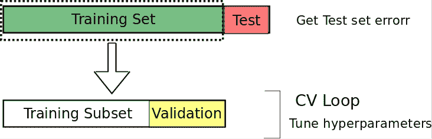
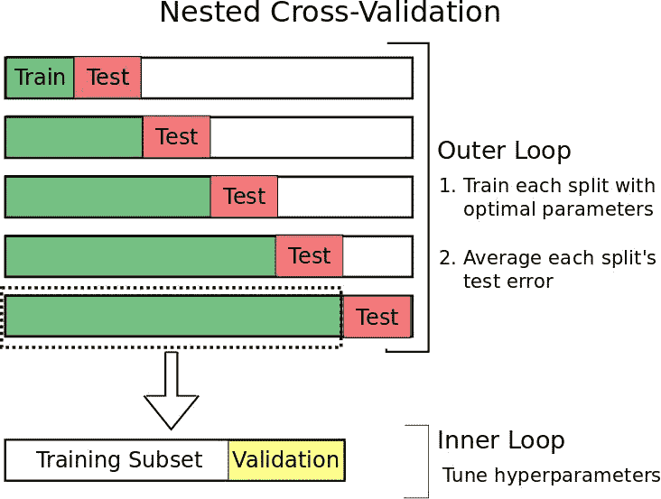
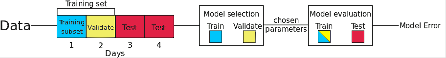
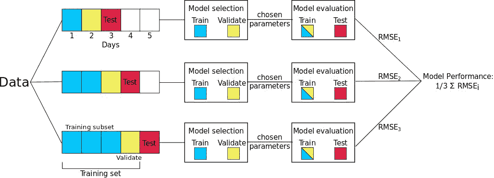
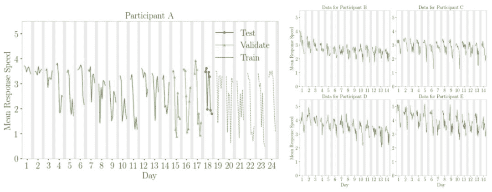
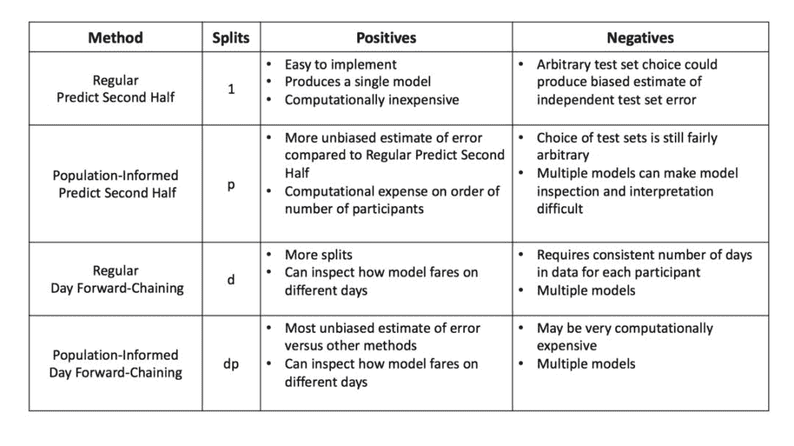

选自toward data science

**作者：Courtney Cochrane**

****编译**：机器之心**

> 本文简要讲解了交叉验证和嵌套交叉验证，并介绍了针对单个时序数据和多个时序数据的嵌套交叉验证方法。

本文讨论了对时序数据使用传统交叉验证的一些缺陷。具体来说，我们解决了以下问题：

1）在不造成数据泄露的情况下，对时序数据进行分割；2）在独立测试集上使用嵌套交叉验证得到误差的无偏估计；3）对包含多个时序的数据集进行交叉验证。

本文主要针对缺乏如何对包含多个时间序列的数据使用交叉验证的在线信息。

本文有助于任何拥有时间序列数据，尤其是多个独立的时间序列数据的人。这些方法是在医疗研究中被设计用于处理来自多个参与人员的医疗时序数据的。

**交叉验证**

交叉验证（CV）是一项很流行的技术，用于调节超参数，是一种具备鲁棒性的模型性能评价技术。两种最常见的交叉验证方式分别是 k 折交叉验证和 hold-out 交叉验证。

由于文献中术语的不同，本文中我们将明确定义交叉验证步骤。首先，将数据集分割为两个子集：训练集和测试集。如果有需要被调整的参数，我们将训练集分为训练子集和验证集。模型在训练子集上进行训练，在验证集上将误差最小化的参数将最终被选择。最后，模型使用所选的参数在整个训练集上进行训练，并且记录测试集上的误差。

*图 1：hold-out 交叉验证的例子。数据被分为训练集和测试集。然后训练集进一步进行分割：一部分用来调整参数（训练子集），另一部分用来验证模型（验证集）。*

为什么时序数据的交叉验证会有所不同？

在处理时序数据时，不应该使用传统的交叉验证方法（如 k 折交叉验证），原因有2：

**1\. 时序依赖**

为了避免数据泄露，要特别注意时间序列数据的分割。为了准确地模拟「我们现在所处、预测未来的真实预测环境」（Tashman 2000），预测者必须保留用于拟合模型的事件之后发生的事件的数据。因此，对于时间序列数据而言，我们没有使用 k 折交叉验证，而是使用 hold-out 交叉验证，其中一个数据子集（按照时间顺序分割）被保留下来用于验证模型性能。例如，图 1 中的测试集数据在时间顺序上是位于训练数据之后的。类似地，验证集也在训练集之后。

**2\. 任意选择测试集**

你可能注意到了，图 1 中测试集的选择是相当随意的，这种选择也意味着我们的测试集误差是在独立测试集上不太好的误差估计。为了解决这个问题，我们使用了一种叫做嵌套交叉验证（Nested Cross-Validation）的方法。嵌套交叉验证包含一个用于误差估计的外循环，以及一个用于调参的内循环（如图 2 所示）。内循环所起的作用和之前谈到的一样：训练集被分割成一个训练子集和一个验证集，模型在训练子集上训练，然后选择在验证集上能够使误差最小化的参数。但是，现在我们增加了一个外循环，它将数据集分割成多个不同的训练集和测试集，为了计算模型误差的鲁棒估计，对每一次分割的误差求平均值。这样做是有优势的：

> 嵌套交叉验证过程可以提供一个几近无偏的真实误差估计。(Varma and Simon 2006)

*图 2：嵌套交叉验证示例*

**用于时间序列的嵌套交叉验证**

我们推荐两种嵌套交叉验证的方法，来处理仅具有一个时间序列的数据。我们也会处理来自一个病人/参与者的多天医疗数据：

1\. 预测后一半（Predict Second Half）

2\. 日前向链（Day Forward-Chaining）

**预测后一半**

第一种方法「预测后一半」，这是嵌套交叉验证的「基本情况」，只有一次训练/测试分割。它的优势是这种方法易于实现；然而，它仍然面临着任意选择测试集的局限性。前一半数据（按照时间分割的）作为训练集，后一半数据成为测试集。验证集的大小可以根据给定问题的不同而变化（例如图 3 中的例子用一天的数据作为验证集），但是保证验证集的时间顺序在训练子集后面是非常重要的。

*图 3：预测后一半嵌套交叉验证方法*

**日前向链（Day Forward-Chaining）**

预测后一半嵌套交叉验证方法的一个缺陷是 hold-out 测试集的任意选择会导致在独立测试集上预测误差的有偏估计。为了生成对模型预测误差的更好估计，一个常用的方法就是进行多次训练/测试分割，然后计算这些分割上的误差平均值。我们使用日前向链技术是一种基于前向链（Forward-Chaining）的方法（在文献中也被称为 rolling-origin evaluation（Tashman，2000）和 rolling-origin-recalibration evaluation（Bergmeir & Benitez，2012））。利用这种方法，我们将每天的数据作为测试集，并将以前的所有数据分配到训练集中。例如，如果数据集有五天，那么我们将生成三个不同的训练和测试分割，如图 4 所示。请注意，在本示例中，我们有三次拆分，而不是五次拆分，因为我们需要确保至少有一天的训练和验证数据可用。该方法产生许多不同的训练/测试分割，并且对每个分割上的误差求平均，以计算模型误差的鲁棒估计。

*图 4：日前向链嵌套交叉验证*

注意，在这个例子中我们使用「日」前向链，但是也可以在每个数据点上进行迭代，而不是按天迭代（但这明显意味着更多的拆分）。

**多时序嵌套交叉验证**

现在有两种分割单个时间序列的方法，接下来我们将讨论如何处理具有多个不同时间序列的数据集。同样，我们使用两种方法：

**常规（regular）**

「常规」嵌套交叉验证（regular nested cross-validation）的训练集／验证集／测试集分割基本思路和之前的描述是一样的。唯一的变化是现在的分割包含了来自数据集中不同参与者的数据。如果有两个参与者 A 和 B，那么训练集将包含来自参与者 A 的前半天的数据和来自参与者 B 的前半天的数据。同样，测试集将包含每个参与者的后半天数据。

**群体知情（Population-Informed）**

对于「群体知情嵌套交叉验证」方法而言，我们利用了不同参与者数据之间的独立性。这使得我们打破严格的时间顺序，至少在个人数据之间（在个人数据内打破严格时序仍然是必要的）。由于这种独立性，我们可以稍微修改常规嵌套交叉验证算法。现在，测试集和验证集仅包含来自一个参与者（例如参与者 A）的数据，并且数据集中所有其他参与者的所有数据都被允许存在于训练集中。图 5 描述了这种方法是如何适用于群体知情的日前向链嵌套交叉验证的。该图显示，参与者 A 第 18 天的数据是测试集（红色），之前三天是验证集（黄色），训练集（绿色）包含参与者 A 的所有先前数据以及其他参与者（本例中为 B、C、D 和 E）的所有数据。需要强调的一点是，由于其他参与者的时间序列的独立性，使用这些参与者的「未来」观测不会造成数据泄漏。

*图 5：群体知情日前向链（Population-Informed Day Forward-Chaining）交叉验证示例。其中除了对参与者 A 的日前向链方法（左图），我们也允许其他参与者的数据存在于训练集中（右图）。请注意，灰色线条表示参与者睡眠的时间。*

最后，我们总结了不同嵌套交叉验证方法的优缺点，特别是独立测试集误差估计的计算时间和偏差。分割的次数假定数据集包含 p 个参与者，以及每个参与者共有 d 天的数据。

**总结**

我们首先回顾了交叉验证，并列举了使用嵌套交叉验证的基本原理。然后讨论了如何在不造成数据泄漏的情况下分割单个时间序列数据，具体提出了两种方法：预测后一半嵌套交叉验证和日前向链嵌套交叉验证。接着我们讨论了如何处理多个独立的时间序列，两种方法：常规嵌套交叉验证和群体知情嵌套交叉验证。

*原文链接：https://towardsdatascience.com/time-series-nested-cross-validation-76adba623eb9*

