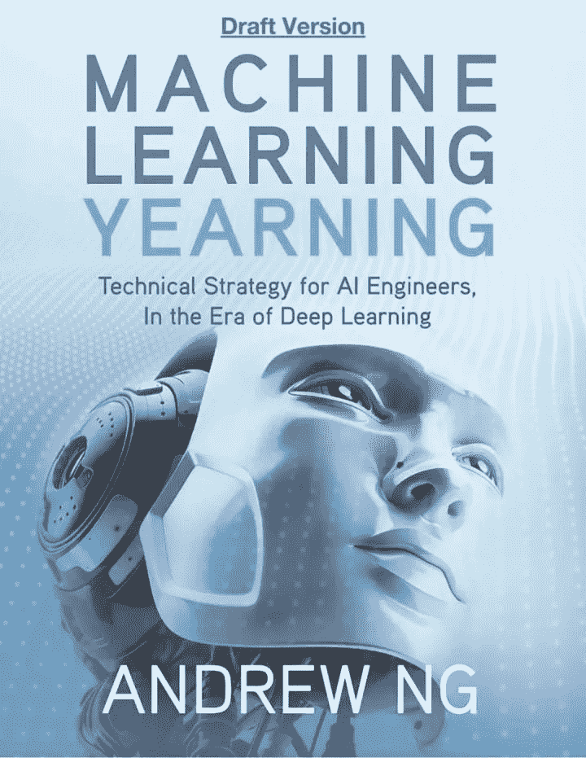
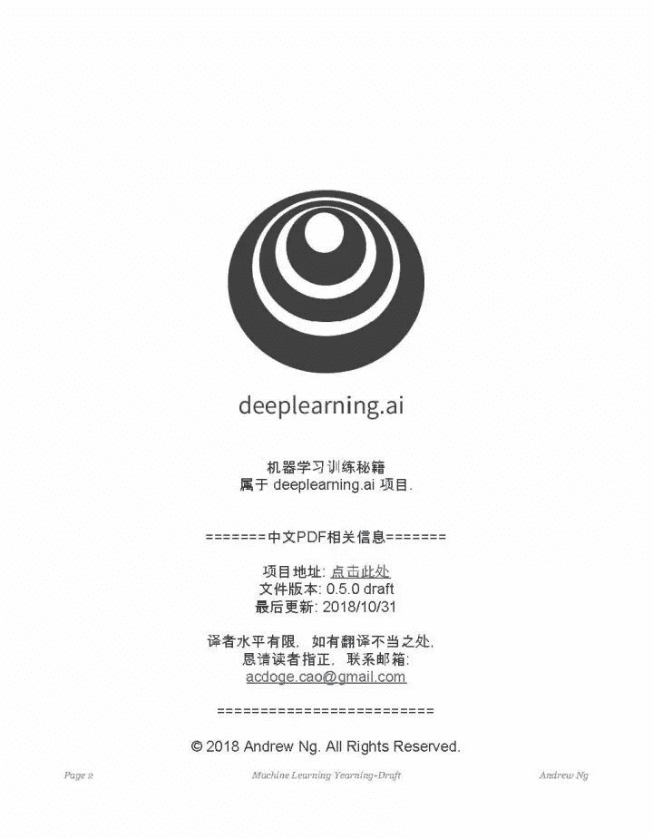
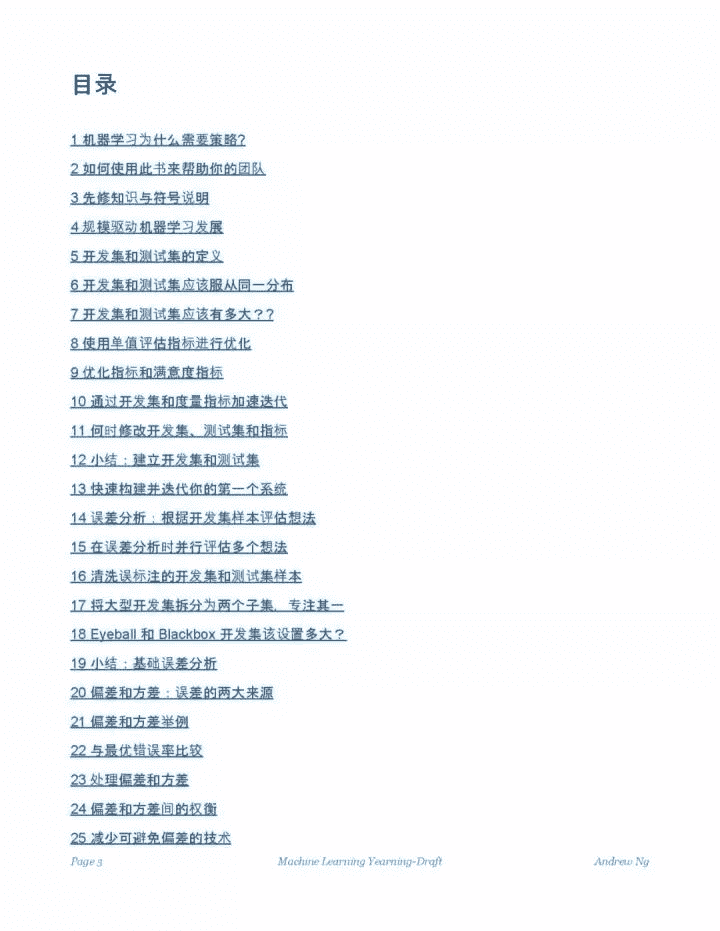

选自Github

**来源：机器学习算法与自然语言处理**

吴恩达新书《Machine Learning Yearning》完整中文版开源，整理给大家。《**Machine Learning Yearning**》是吴恩达历时两年，根据自己多年实践经验整理出来的一本机器学习、深度学习实践经验宝典。 **作为一本 AI 实战圣经，本书主要教你如何在实践中使机器学习算法的实战经验。**

**资源下载**

《Machine Learning Yearning》完整中文版的电子版 pdf 已经打包完毕，需要的可以按照以下方式获取：

**公众号后台回复关键词：MLY**

