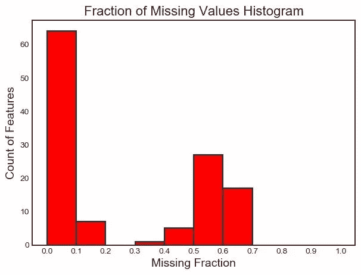
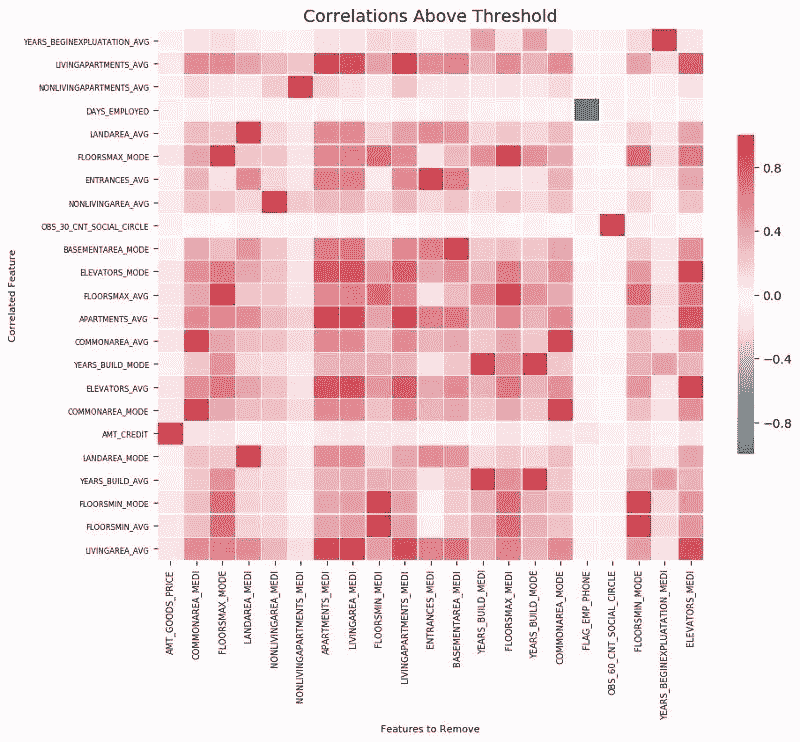
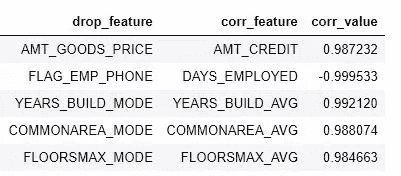
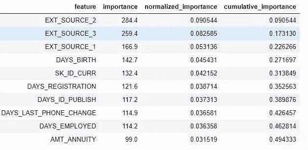
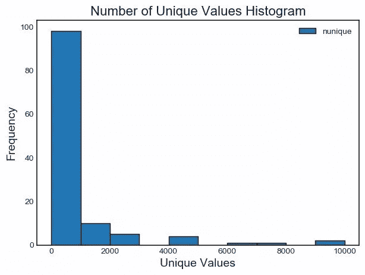

点击上方“**Datawhal****e**”，选择“星标”公众号

第一时间获取价值内容


编辑 | 机器学习算法与Python实践

特征选择（feature selection）是查找和选择数据集中最有用特征的过程，是机器学习流程中的一大关键步骤。不必要的特征会降低训练速度、降低模型可解释性，并且最重要的是还会降低其在测试集上的泛化表现。

目前存在一些专用型的特征选择方法，我常常要一遍又一遍地将它们应用于机器学习问题，这实在让人心累。所以我用 Python 构建了一个特征选择类并开放在了 GitHub 上。这个 FeatureSelector 包含一些最常用的特征选择方法：

1.  具有高缺失值百分比的特征

2.  共线性（高度相关的）特征

3.  在基于树的模型中重要度为零的特征

4.  重要度较低的特征

5.  具有单个唯一值（unique value）的特征

项目地址：

https://github.com/WillKoehrsen/feature-selector

有关使用方法，请参阅Feature Selector的使用指南

https://github.com/WillKoehrsen/feature-selector/blob/master/Feature%20Selector%20Usage.ipynb

## 1 示例数据集

为了进行演示，我们将使用来自 Kaggle「家庭信用违约风险」机器学习竞赛的一个数据样本。这个竞赛是一个监督分类问题，这也是一个非常合适的数据集，因为其中有很多缺失值、大量高度关联的（共线性）特征，还有一些无助于机器学习模型的无关特征。

## 2 创建实例

要创建一个 FeatureSelector 类的实例，我们需要传入一个结构化数据集，其中观察在行中，特征在列中。我们可以使用一些仅操作特征的方法，但基于重要度的方法也需要训练标签。因为这是一个监督分类任务，所以我们将使用一组特征和一组标签。

```
from feature_selector import FeatureSelector
# Features are in train and labels are in train_labels
fs = FeatureSelector(data = train, labels = train_labels)
```

## 3 方法

这个特征选择器有 5 种用于查找待移除特征的方法。我们可以访问任何已被识别出来的特征并通过人工方式将它们移出数据，也可以使用 FeatureSelector 中的 remove 函数。

这里我们将介绍其中每种识别方法，还将展示如何同时运行这 5 种方法。此外，FeatureSelector 还有几个图表绘制功能，因为可视化地检查数据是机器学习的一大关键部分。

## 4 缺失值

查找和移除特征的第一个方法很简单：查找缺失值比例超过特定阈值的特征。下面的调用能识别缺失值比例超过 60% 的特征（粗体是输出结果）。

```
fs.identify_missing(missing_threshold = 0.6)

17 features with greater than 0.60 missing values.
```

要查看待移除特征，我们可以读取 FeatureSelector 的 ops 属性，这是一个 Python 特征词典，特征会以列表的形式给出。

```
missing_features = fs.ops['missing']
missing_features[:5]

['OWN_CAR_AGE',
 'YEARS_BUILD_AVG',
 'COMMONAREA_AVG',
 'FLOORSMIN_AVG',
 'LIVINGAPARTMENTS_AVG']
```

最后，我们可以绘制一张所有特制的缺失值分布图：

## 5 共线性特征

共线性特征是指彼此之间高度关联的特征。在机器学习领域，高方差和较低的模型可解释性导致在测试集上的泛化能力下降。

identify_collinear 方法能基于指定的相关系数值查找共线性特征。对于每一对相关的特征，它都会标识出其中要移除的一个（因为我们只需要移除其中一个）：

```
fs.identify_collinear(correlation_threshold = 0.98)

21 features with a correlation magnitude greater than 0.98.
```

使用热图可以很好地可视化共线性。下图展示了所有至少有一个相关关系（correlation）超过阈值的特征：

```
fs.plot_collinear()
```



和之前一样，我们可以访问将会被移除的整个相关特征列表，或者在一个 dataframe 中查看高度相关的特征对。

```
# list of collinear features to remove
collinear_features = fs.ops['collinear']
# dataframe of collinear features
fs.record_collinear.head()
```



如果我们想全面了解数据集，我们还可以通过将 plot_all = True 传入该调用，绘制出数据中所有相关性的图表：


## 6 零重要度特征

前面两种方法可被应用于任何结构化的数据集并且结果是确定的——对于一个给定的阈值，每次结果都一样。接下来的方法是专为监督式机器学习问题设计的，其中我们有训练模型的标签并且是非确定性的。identify_zero_importance 函数能根据梯度提升机（GBM）学习模型查找重要度为零的特征。

我们可以使用基于树的机器学习模型（比如 boosting ensemble）求取特征重要度。这个重要度的绝对值没有相对值重要，我们可以将相对值用于确定对一个任务而言最相关的特征。我们还可以通过移除零重要度特征来在特征选择中使用特征重要度。在基于树的模型中，零重要度的特征不会被用于分割任何节点，所以我们可以移除它们而不影响模型表现。

FeatureSelector 能使用来自 LightGBM 库的梯度提升机来得到特征重要度。为了降低方差，所得到的特征重要度是在 GBM 的 10 轮训练上的平均。另外，该模型还使用早停（early stopping）进行训练（也可关闭该选项），以防止在训练数据上过拟合。

下面的代码调用了该方法并提取出了零重要度特征：

```
# Pass in the appropriate parameters
fs.identify_zero_importance(task = 'classification',
 eval_metric = 'auc',
 n_iterations = 10,
 early_stopping = True)
# list of zero importance features
zero_importance_features = fs.ops['zero_importance']
63 features with zero importance after one-hot encoding.
```

我们传入的参数解释如下：

task：根据我们的问题，要么是「classification」，要么是「regression」

eval_metric：用于早停的度量（如果早停禁用了，就不必使用）

n_iterations：训练轮数，最后结果取多轮的平均

early_stopping：是否为训练模型使用早停

这时候我们可以使用 plot_feature_importances 绘制两个图表：

```
# plot the feature importances
fs.plot_feature_importances(threshold = 0.99, plot_n = 12)
124 features required for 0.99 of cumulative importance
```

左图给出了 plot_n 最重要的特征（重要度进行了归一化，总和为 1）。右图是对应特征数量的累积重要度。蓝色竖线标出了累积重要度为 99% 的阈值。

对于基于重要度的方法，有两点需要记住：

训练梯度提升机是随机的，这意味着模型每次运行后，特征重要度都会改变。

这应该不会有太大的影响（最重要的特征不会突然就变成最不重要的），但这会改变某些特征的排序，也会影响识别出的零重要度特征的数量。如果特征重要度每次都改变，请不要感到惊讶！

要训练机器学习模型，特征首先要经过 one-hot 编码。这意味着某些被识别为零重要度的特征可能是在建模过程中加入的 one-hot 编码特征。

当我们到达特征移除阶段时，还有一个选项可移除任何被添加进来的 one-hot 编码的特征。但是，如果我们要在特征选择之后做机器学习，我们还是必须要 one-hot 编码这些特征。

## 7 低重要度特征

接下来的方法基于零重要度函数，使用来自模型的特征重要度来进一步选择。identify_low_importance 函数能找到重要度最低的特征，这些特征无助于指定的总重要性。

比如，下面的调用能找到最不重要的特征，即使没有这些特征也能达到 99% 的重要度。

```
fs.identify_low_importance(cumulative_importance = 0.99)

123 features required for cumulative importance of 0.99 after one hot encoding.
116 features do not contribute to cumulative importance of 0.99.
```

根据前面的累积重要度图和这一信息，梯度提升机认为很多特征都与学习无关。重申一下，每次训练运行后该方法的结果都不一样。

我们也可以在一个 dataframe 中查看所有特征重要度：

```
fs.feature_importances.head(10)
```



low_importance 方法借鉴了主成分分析（PCA）中的一种方法，其中仅保留维持一定方差比例（比如 95%）所需的主成分是很常见的做法。要纳入考虑的总重要度百分比基于同一思想。

只有当我们要用基于树的模型来做预测时，基于特征重要度的方法才真正有用。除了结果随机之外，基于重要度的方法还是一种黑箱方法，也就是说我们并不真正清楚模型认为某些特征无关的原因。如果使用这些方法，多次运行它们看到结果的改变情况，也许可以创建具有不同参数的多个数据集来进行测试！

## 8 单个唯一值特征

最后一个方法相当基础：找出任何有单个唯一值的列。仅有单个唯一值的特征不能用于机器学习，因为这个特征的方差为 0。举个例子，如果一个特征仅有一个值，那么基于树的模型就永远不能进行区分（因为没有可做区分的依据）。

```
fs.identify_single_unique()

4 features with a single unique value.
```

我们可以绘制每个类别唯一值数量的直方图：

```
fs.plot_unique()
```



## 9 移除特征

在确定了待移除特征之后，我们有两种移除它们的选择。所有要移除的特征都存储在 FeatureSelector 的 ops 词典中，我们可以使用这个列表来手动移除它们，当然也可使用内置的 remove 函数。

对于这一方法，我们需传入要用于移除特征的 methods。如果我们想使用所实现的所有方法，我们只需使用 methods = 'all'

```
# Remove the features from all methods (returns a df)
train_removed = fs.remove(methods = 'all')

['missing', 'single_unique', 'collinear', 'zero_importance', 'low_importance'] methods have been runRemoved 140 features.
```

这个方法会返回一个包含被移除特征的 dataframe。另外，要移除在机器学习过程中创建的 one-hot 编码的特征：

```
train_removed_all = fs.remove(methods = 'all', keep_one_hot=False)

Removed 187 features including one-hot features.
```

在执行操作之前检查将被移除的特征可能是个好想法！原来的数据集会被存储在 FeatureSelector 的 data 属性中用作备份！

## 10 一次运行所有方法

除了单独使用各个方法之外，我们也可通过 identify_all 一次性使用所有方法。我们需要使用一个词典来设定其中每个方法的参数：

```
fs.identify_all(selection_params = {'missing_threshold': 0.6,
 'correlation_threshold': 0.98,
 'task': 'classification',
 'eval_metric': 'auc',
 'cumulative_importance': 0.99})

151 total features out of 255 identified for removal after one-hot encoding.
```

## 总结

这个特征选择器类实现了训练机器学习模型之前几种用于移除特征的常见操作。其提供了可用于识别待移除特征的函数以及可视化函数。这些方法可以单独使用，也可以一次全部应用以实现高效的工作流程。

其中 missing、collinear 和 single_unique 方法是确定性的，而基于特征重要度的方法会随每次运行而变化。与机器学习领域很相似，特征选择很大程度上是实证式的，需要测试多种组合才能找到最优解。最好的做法是在流程中尝试多种配置，并且 FeatureSelector 提供了一种用于快速评估特征选择参数的方法。

*原文链接：*

*https://www.cnblogs.com/whig/p/9285736.html*

