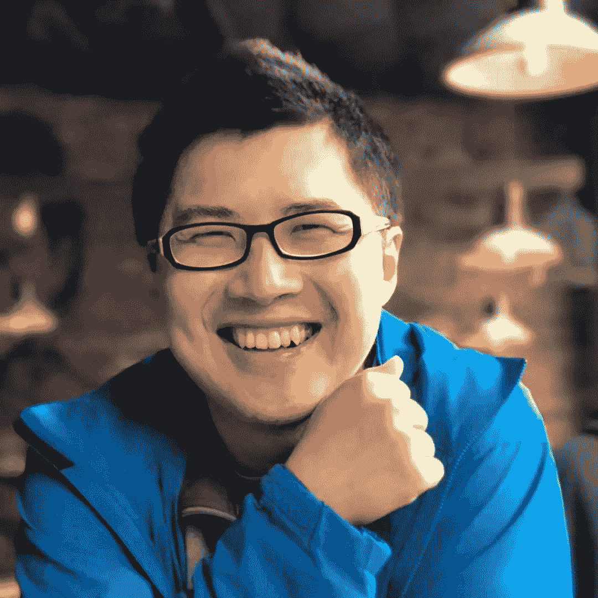

Datawhale转载

**作者：陈天奇**

> 陈天奇是机器学习领域著名的青年华人学者之一，本科毕业于上海交通大学ACM班，博士毕业于华盛顿大学计算机系，研究方向为大规模机器学习。上个月，陈天奇在Twitter上宣布自己将于2020年秋季加入CMU任助理教授，成为加入CMU的年轻华人学者之一。在本文中，陈天奇回顾了自己做机器学习科研的十年。

十年前，MSRA 的夏天，刚开始尝试机器学习研究的我面对科研巨大的不确定性，感到最多的是困惑和迷茫。十年之后，即将跨出下一步的时候，未来依然是如此不确定，但是期待又更多了一些。这其中的变化也带着这十年经历的影子。

**起始：** **科研是什么**

我从大三开始进入交大 APEX 实验室，有幸随着戴文渊学长做机器学习，当时的我觉得「机器学习」这个名字十分高大上然后选择了这个方向，但是做了一年之后依然摸不着头脑，心中十分向往可以做科研，独立写论文的生活，却总是不知道如何下手。文渊在我进实验室的一年后去了百度。当时还没有得到学长真传的我，开始了我科研的第一阶段，从大四到硕士的第二年，期间一直自己摸索，不断地问自己「科研是什么」。

和课程作业不同，学术研究没有具体的问题，具体的方法，具体的答案。文渊的离开让我一下子不知道该怎么做，当时的我的想法很简单，快点寻找一个具体的方向，完成一篇论文。因为 ACM 班的机会暑假在 MSRA 的短暂实习，虽然学会了很多东西，但并没有给我答案。MSRA 回来之后，在实验室薛老师的建议下，我选择了一个现在看来正确而又错误的方向 -- 深度学习。那是 AlexNet 出现之前两年，深度学习的主流热点是非监督学习和限制玻尔兹曼机。没有导师的指导，没有工具，当时我靠着实验室的两块显卡和自己写的 CUDA 代码开始了死磕深度学习的两年半。实验室的学长问我，你准备要干啥，我说：「我要用卷积 RBM 去提升 ImageNet 的分类效率。」这一个回答开启了图书馆和实验室的无数个日日夜夜，为了给实验室的老机器多带一块高功率的显卡，我们打开了一台机器的机箱，在外面多塞了一个外接电源。我的生活就持续在调参的循环中：可视化权重的图片, 看上去那么有点像人脸，但是精度却总是提不上来，再来一遍。从一开始 hack 显卡代码的兴奋，到一年之后的焦虑，再到时不时在树下踱步想如何加旋转不变的模型的尝试，在这个方向上，我花费了本科四年级到硕士一年半的所有时间，直到最后还是一无所获。现在看来，当时的我犯了一个非常明显的错误 -- 常见的科学研究要么是问题驱动，比如「如何解决 ImageNet 分类问题」；要么是方法驱动，如「RBM 可以用来干什么」。当时的我同时锁死了要解决的问题和用来解决问题的方案，成功的可能性自然不高。如果我在多看一看当时整个领域的各种思路，比如 Lecun 在很早的时候就已经做 end to end，或许结局会不那么一样吧。

当然没有如果，赌上了两年半的时间的我留下的只是何时能够发表论文的紧张心情。焦虑的我开始打算换一个方向，因为 RBM 当时有一个比较经典的文章应用在了推荐系统上，我开始接触推荐系统和 kddcup。比较幸运的是，这一次我并没有把 RBM 作为唯一的一个方法，而是更加广泛地去看了推荐系统中的矩阵分解类的算法，并且在实验室搭建了一个比较泛用的矩阵分解系统。推荐系统方向的耕耘逐渐有了收获，我们在两年 KDDCup11 中获得了不错的成绩。KDD12 在北京，放弃了一个过年的时间，我完成了第一篇关于基于特征的分布式矩阵分解论文，并且非常兴奋地投到了 KDD。四月底的时候，我们收到了 KDD 的提前拒搞通知 -- 论文连第一轮评审都没有过。收到拒搞通知时候的我的心情无比沮丧，因为这是第一篇自己大部分独立推动完成的文章。转折在五月，KDDCup12 封榜，我们拿到了第一个 track 的冠军，我依然还记得拿到 KDDCup12 冠军的那一个瞬间，我在状态里面中二地打了 excalibur，仿佛硕士期间的所有阴霾一扫而尽。那时候的我依然还不完全知道科研是什么，但是隐隐之中觉得似乎可以继续试试。

**第零年：** **可以做什么**

我对于科研看法的第一个转折，在于我硕士临近毕业的时候。李航老师来到我们实验室给了关于机器学习和信息检索的报告，并且和我们座谈。在报告的过程中，我异常兴奋，甚至时不时地想要跳起来，因为发现我似乎已经知道如何可以解决这么多有趣问题的方法，但是之前却从来没有想过自己可以做这些问题。联系了李航老师之后，在同一年的夏天，我有幸到香港跟随李航和杨强老师实习。实验室的不少学长们曾经去香港和杨强老师工作，他们回来之后都仿佛开了光似地在科研上面突飞猛进。去香港之后，我开始明白其中的原因 -- 研究视野。经过几年的磨练，那时候的我或许已经知道如何去解决一个已有的问题，但是却缺乏其他一些必要的技能 -- 如何选择一个新颖的研究问题，如何在结果不尽人意的时候转变方向寻找新的突破点，如何知道整个领域的问题之间的关系等等。「你香港回来以后升级了嘛。」-- 来自某大侠的评论。这也许是对于我三个月香港实习的最好概括的吧。香港实习结束的时候我收获了第一篇正式的一作会议论文 (在当年的 ICML)。因为 KDDCup 的缘故，我认识了我现在博士导师 Carlos 的 postdoc Danny，Danny 把我推荐给了 Carlos(UW) 和 Alex(CMU)。我在申请的时候幸运地拿到了 UW 和 CMU 的 offer。在 CMU visit 的时候我见到了传说中的大神学长李沐，他和我感叹，现在正是大数据大火的时候，但是等到我们毕业的时候，不知道时代会是如何，不过又反过来说总可以去做更重要的东西。现在想起这段对话依然依然唏嘘不已。我最后选择了 UW 开始了我六年的博士生活。

感谢博士之前在 APEX 实验室和香港的经历，在博士开始的时候我似乎已经不再担心自己可以做什么了。

**第一年：** **意外可以收获什么**

如果给我在 UW 的第一年一个主题的话，或许是「意外」。在交大时候因为兴趣的关系一直去蹭系统生物研究员敖平老师的组会探讨随机过程和马尔可夫链。到 UW 的第一个学期，我无意看到一篇探讨如何用 Lagevin 过程做采样的文章，我想这不就是之前组会上探讨过的东西么，原来这些方法也可以用到机器学习上。我直接借用了原来的交大学会的知识完成了第一篇高效采样 HMC 的文章。我后来并没有继续在这个方向上面耕耘下去，不过另外一位同在组会的学弟继续基于这个方向完成了他的博士论文。

同样的在这一年，我和导师开始「质疑深度学习」-- 如果别的的机器学习模型，有足够大的模型容量和数据，是否可以获得和深度学习一样的效果呢？当时 Carlos 看好 kernel methods，而我因为过去的一些经历决定尝试 Tree Boosting。虽然最后在 vision 领域依然被卷积网络打败而尝试挑战失败，但是为了挑战这一假说而实现高效 Tree boosting 的系统经过小伙伴建议开源成为了后来的 XGBoost。

在第一年暑假结束的时候，因为偶然的原因，我开始对 quantile sketch 算法感兴趣。这里主要的问题是如何设计一个近似的可以合并的数据结构用来查找 quantile。这个方向有一个经典的方案 GK-sketch 的论文，但是只能够解决数据点没有权重的情况。经过一两天的推导，我在一次去爬山的路上终于把结论推广到了有权重的情况。有趣的是新的证明比起原来的证明看起来简单很多。这个结论没有单独发表，但是后来意想不到地被用到了分布式 XGBoost 算法中，证明也收录在了 XGboost 文章的附录中。

研究并不是一朝一夕，做想做的事情把它做好，开始的时候兴趣使然，而在几年之后意想不到的地方获得的收获，这样的感觉走非常不错。

**第二年和第三年：** **选择做什么**

在新生聚会上，Carlos 对我说，你已经有论文的发表经历了，接下来要静下心来做发大的，「只做 best paper 水平的研究」。和很多 nice 的导师不同，Carlos 对于学生的要求非常严格，说话也是非常直白甚至于「尖刻「。很多的老师不论我们提出什么样的想法，总会先肯定一番，而 Carlos 则会非常直接地提出质疑。一开始的时候会非常不习惯，感觉到信心受到了打击，但是慢慢习惯之后开始习惯这样风格。到现在看来，诚实的反馈的确是我收益最大的东西。我进入博士的一年之后，主要在想的问题是做什么样的问题，可以值得自己深入付出，做扎实有影响力的工作。

在博士的第三年，Carlos 在建议我把 XGBoost 写成论文，用他的话说：「写一篇让读者可以学到东西的文章」。和传统的写法不同，我们在文章的每一个章节插入了实验结果验证当章节提出的观点。而他对于做图的处理也成为了我现在的习惯，直接在图里面插入箭头注释，减少读者的阅读负担。经过几次打磨论文终于成为了我们想要的模样。

博士前对于深度学习遗憾让我又逐渐把目光转回到深度学习。这个时候，我选择了不再一个人作战，在博士的第二年和第三年，我和兴趣使然的小伙伴们合作，一起开始了 MXNet 的项目。项目从零开始，在短短的一年时间里面做出完整的架构。我第一次看到集合了大家的力量齐心协力可以创造出什么样的东西。研究的乐趣不光是发表论文，更多还是可以给别人带来什么，或者更加大胆地说 -- 如何一起改变世界。

博士第二年暑假，我在小伙伴的介绍下进入 Google Brain 跟随 Ian Goodfellow 实习。当时 GAN 的论文刚刚发表，我也有幸在成为 Ian 的第一个实习生。实习的开始，我们讨论需要做的问题，Ian 和我把可能要做的项目画在一个风险和回报的曲线上，让我选择。到最后我选择了自己提出的一个课题，在这个曲线里面风险最高，回报也最高。我一直有一个理想，希望可以构建一个终身学习的机器学习系统，并且解决其中可能出现的问题。这个理想过于模糊，但是我们想办法拿出其中的一个可能小的目标 -- 知识迁移。如果一个机器学习系统要终生学习，那么在不断收集数据之后必然需要扩充模型的规模来学习更广或者更深，按照现在的做法我们在模型改变之后只能抛弃原来的模型重新训练，这显然是不够高效的。是否有一个方法可以从已经训练好的网络上面进行知识迁移也就成为了一个重要的问题。我先花了一个半月的时间尝试了比较显然的 Knowledge distillation 的方法一直没有得到正面的结果。在最后的一个月，我改变了思路。实习结束的前一个星期，我打开 Tensorborard 上最近一组实验的结果：实验表明新的思路正面的效果。这最后几步的幸运也让我的这一个冒险之旅有了一个相对圆满的结果。这篇论文最后被发表在了 ICLR 上，也是我最喜欢的结果之一。

博士的第三年，我和小伙伴们开发了一种可以用低于线性复杂度就可以训练更深模型的内存优化算法。当时我非常兴奋地把这一结果写下来然后把稿子后给导师看。他和我说：Hmm, 这个结果如果投到 NeurIPS 的话或许可以中一篇 poster，但是这并不是特别有意思。在我沉默之后他又补充了一句：论文并非越多越好，相反你可能要尝试优化你的论文里面最低质量的那一篇。最后我们只是把这篇论文挂在了 Arxiv 上。Carlos 的说法或许比较极端（这篇论文依然影响了不少后面的工作），但也的确是对的，用李沐之前说过的一句话概括，保证每一篇论文的质量接近单调提升，已经是一件难以做到但是又值得最求的事情。

选择做什么眼光和做出好结果的能力一样重要，眼界决定了工作影响力的上界，能力决定了到底是否到达那个上界。交大时敖平老师曾经和我说过，一个人做一件简单的事情和困难的事情其实是要花费一样多的时间。因为即使再简单的问题也有很多琐碎的地方。要想拿到一些东西，就必然意味着要放弃一些其他东西，既然如此，为什么不一直选择跳出舒适区，选一个最让自己兴奋的问题呢。

**第四年之后：** **坚持做什么**

博士第三年，我和小伙伴们参加 GTC，结束后老黄 party 的角落里，我一个人在发呆。深度学习的框架发展已经铺开，可接下来应该做什么，我一下子感到迷茫。第三年的暑假我没有去实习，而是决定一个人在学校尝试开发脑海中显现的抽象概念 -- 深度学习中间表示。暑假结束之后，我完成了第一个版本，可以比较灵活地支持深度学习系统里面的计算图内存优化。但是总是觉得还缺少着什么 -- 系统的瓶颈依然在更接近底层的算子实现上。暑假之后在去加州的飞机上，我尝试在纸上画出为了优化矩阵乘法可能的循环变换，回来之后，我们决定推动一个更加大胆的项目 -- 尝试用自动编译生成的方式优化机器学习的底层代码。

这个项目早在之前我也有一些想法，但是一直没有敢去吃这个螃蟹。原因是它的两个特点：从零开始，横跨多领域。因为要做底层代码生成和想要支持新的硬件，我们需要重新重新搞清楚很多在之前被现有的操作系统和驱动隐藏掉的问题，这就好象是在一个荒岛上一无所有重新搭建起一个城堡一样。而这里面也涉及了系统，程序语言，体系结构和机器学习等领域。这让我想起之前在 ACM 班时候重头搭建编译器和 MIPS 处理器并且连接起来的经历。也是那段经历让我觉得为了解决问题去吃多个领域的螃蟹是个让人兴奋的事情。那段经历给我留下的第二个印记是理解了合作和传承的重要性。这门课程设计有一个传统，每一门课程的老师都由上一届学长担任。每一届的同学都会在之前的基础上有所改进。我也曾经为这门课做过一些微小的贡献。演化到现在，这门课程已经从只做简单的答辩，到现在已经有在线评测的 OJ。大家一起的合作塑造了这个课程。推动新的机器学习系统和塑造这门课程一行，需要各个团队的同学合作，足够时间的耐心关注和不断地改进。

我的合作者们也被「卷入」到了这个项目中。我的体系结构合作者一直想要设计新的 AI 硬件，我在雏形完成之后花了大量的时间讨论如何协同设计新的硬件的问题。我们开始讨论怎么管理片上内存，怎么可以比较容易地生成指令集，甚至怎么调度内存读写和计算并行的问题都暴露出来。有一天，我和合作者说我们需要引入虚拟线程的概念来隐藏内存读写开销，然后他很快和我说，这是体系结构里面经典的超线程技术，发明人正是我们的系主任 Hank。我们也在不断地重新发现经典的问题的解决方法在新场景的应用，让我觉得上了一堂最好的体系结构课程。

两年间的不少关键技术问题的突破都是在有趣的时候发生的。我在排队参观西雅图艺术博物馆的 infinity mirror 展览的途中把加速器内存拷贝支持的第一个方案写在了一张星巴克的餐巾纸上。到后来是程序语言方向的同学们也继续参与进来。我们争论最多的是如何如何平衡函数式语言和经典计算图做让大家都可以搞懂的中间表达，这一讨论还在不断继续。经过大家的努力，TVM 的第一篇论文在项目开始的两年之后终于发表。两年间参与项目的同学也从两个人，到一个团队，再到一个新的 lab 和一个社区，这两年也是我博士期间最充实的两年。

因为做了不少「跨界」的工作，我常被问起你到底属于哪个领域。过去半年一直在各地给报告，报告这样开头：算法突破，数据的爆发，计算硬件的提升三者支撑了机器学习的变革，而整合这三者的，则是机器学习系统。这也是为什么我要做机器学习系统的原因。曾经一个教授问我这样的问题，如果明天有一样新的化学反应过程可能带来机器学习的变革，你会怎么做。我答道：「我投入会去学习研究这个化学过程」。虽然我不知道遥远的未来会需要什么，到底是系统，算法，还是化学，从问题出发，用尽所有可能的方法去最好地解决机器学习问题，应该这就是我想要坚持的研究风格吧。

**总结**

在写这篇总结的时候，心中有不少感叹。我常想，如果我在焦虑死磕深度学习的时候我多开窍一些会发生什么，如果我并没有在实习结束的时候完成当时的实验，又会是什么。但现在看来，很多困难和无助都是随机的涨落的一部分，付出足够多的时间和耐心，随机过程总会收敛到和付出相对的稳态。

每个人的研究道路都各不相同，我的经历应该也是千万条道路中其中一条罢了。博士的经历就好像是用五年多时间作为筹码投资给自己，去突破自己做自己原来想不到的事情。中不管坎坷曲折都是无可替代的一部分。

科研从来不是一个人的事情，对于我来说特别是如此。我在交大的时候和一群年轻的同学一起摸索推荐系统的算法，而在博士期间搭建的每一个系统都包含了很多合作者一起的努力。也正是大家一起的努力才带来了现在的成果。我个人在这十年间受到了不少老师，同学，家人的鼓励和帮助，感谢他们他们给予了我这无比珍贵的十年时光。************

*原文链接：**https://zhuanlan.zhihu.com/p/74249758?utm_source=wechat_session&utm_medium=social&utm_oi=36286488379392&from=timeline&s_s_i=0Adl1SNt%2FB3gEe0APUZZYAVRCRw%2F801frkyc0v%2BsfIo%3D&s_r=1*

