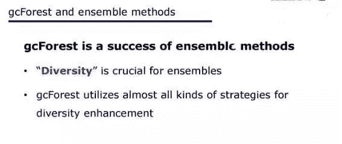
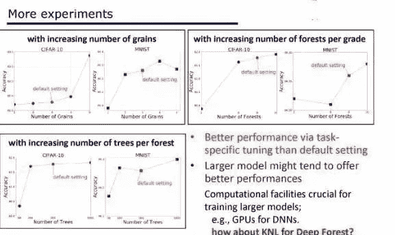

IJCAI 2019 在中国澳门隆重召开，南京大学周志华教授进行特邀大会演讲，演讲主题是《Deep Learning: Why deep and is it only doable for neural networks?》。在演讲中，周志华教授从自己的角度解读了深度神经网络之所以获得成功的本质因素，以及如何在兼顾这些因素的同时，找到神经网络之外的其它的深度模型。

演讲全文整理如下。

一、深度学习就等于深度神经网络吗？

深度学习今天已经有各种各样的应用，到处都是它，不管图像也好，视频也好，声音自然语言处理等等。那么我们问一个问题，什么是深度学习？

我想大多数人的答案，就是深度学习差不多就等于深度神经网络。有一个非常著名的学会叫 SIAM，是国际工业与应用数学学会，他们有一个旗舰的报纸叫 SIAM news。在去年的 6 月份，这个报纸的头版上就有这么一篇文章，直接就说了这么一句话，说**深度学习是机器学习中使用深度神经网络的的子领域**。所以如果我们要谈深度学习的话，是绕不开深度神经网络的。

首先我们必须从神经网络说起。神经网络其实并不是一个新生事物，神经网络可以说在人工智能领域已经研究了超过半个世纪。但是以往的话，一般我们用的是很浅的神经网络，就是中间只有一个隐层，或者有两个隐层。在这样的神经网络里面，它的每一个连续的单元都是非常简单、有条件的，这样才能起作用。我们收到一些简单的神经行为输入，这些输入通过一些计算得到输出，成为后续的神经元的输入。它就是这么一个非常简单的公式。所谓的神经网络，是很多这样的公式经过嵌套迭代得到的一个系统，这叫做 M-P 模型。**如今我们使用的神经网络里的神经元就是这样的，即便它是半个世纪前的产物。**

那么今天当我们说用深度神经网络的时候，它和以前的神经网络的区别是什么？简单来说，就是我们用的层数会很深很深，网络有很多个隐层。在 2012 年深度学习、卷积神经网络刚刚开始受到大家重视的时候，那时候 ImageNet 竞赛的冠军是用了 8 层的神经网络。那么到了 2015 年是用了 152 层，到了 2016 年是 1207 层。如今，数千层深的网络非常常见。这是个非常庞大非常巨大的系统，把这么一个系统训练出来，难度是非常大的。

有一点非常好的消息，我们现在有很强大的计算设施。但是说到最基础的层面，很幸运的是，神经网络里面的计算单元，最重要的激活函数是连续的、可微的。比如说我们在以往常用这样的 sigmoid 函数，它是连续可微的，现在大家常用的 ReLu 函数或者它的变体，也是这样。这使得我们可以容易地进行梯度计算，这样就可以很容易用著名的 BP（backpropagation，反向传播）算法来训练。通过这样的算法，我们的神经网络已经取得了非常多的胜利。

不过它的前提是依赖梯度。**如果一个问题是不可微分的、不可计算梯度的，我们就无法为它训练一个神经网络。这非常重要。**而且在 2006 年之前，也没有人知道如何训练深度超过 5 层的神经网络，不是因为计算设施不够强大，而是我们无法解决梯度消失的问题。Geoffery Hinton 等人做出了巨大的贡献，他们表明通过逐层训练（layer-by-layer precision）和预训练（pre-training）我们可以克服梯度消失的问题。介绍这些都是为了说明神经网络需要可微的函数、需要能够计算梯度，这是最根本最重要的。虽然如今有一些研究不可微的函数的，但还是需要转换成某种可微的。

二、为什么深的模型是有效的

但是实际上在学术界大家一直没有想清楚一件事情，就是我们为什么要用这么深的模型，或者说为什么深的模型要比浅的模型表现好那么多？到今天为止，学术界都还没有统一的看法。有很多的论述。我在这里面跟大家讲一个我们前段时间给出的一个论述。这个论述其实主要是从模型的复杂度的角度来讨论。

我们知道一个机器学习模型，**它的复杂度实际上和它的容量有关，而容量又跟它的学习能力有关。**所以就是说学习能力和复杂度是有关的。机器学习界早就知道，如果我们能够增强一个学习模型的复杂度，那么它的学习能力能够提升。

那怎么样去提高复杂度，对神经网络这样的模型来说，有两条很明显的途径。一条是我们把模型变深，一条是把它变宽。如果从提升复杂度的角度，那么变深是会更有效的。当你变宽的时候，你只不过是增加了一些计算单元，增加了函数的个数，在变深的时候不仅增加了个数，其实还增加了它的嵌入的程度。所以从这个角度来说，我们应该尝试去把它变深。

那大家可能就会问了，既然你们早就知道要建立更深的模型了？那么现在才开始做？这就涉及到另外一个问题，我们把机器学习的学习能力变强了，这其实未必是一件好事。因为机器学习一直在斗争的一个问题，就是经常会碰到过拟合（overfit）。这是一种什么样的现象？你给我一个数据集，我做机器学习要把数据集里面的东西学出来，学出来之后，**我希望学到的是一般规律，能够用来预测未来的事情。****但是有时候我可能把这个数据本身的一些独特特性学出来了，而不是一般规律。错误地把它当成一般规律来用的时候，会犯巨大的错误。**这种现象就是所谓的过拟合，就是因为模型的学习能力太强了。所以我们以往通常不太愿意用太复杂的模型。

****

那现在我们为什么可以用很复杂的模型？其实我们设计了许多方法来对付过拟合，比如神经网络有 dropout、early-stop 等。但有一个因素非常简单、非常有效，那就是**用很大的数据**。比如说我手上如果只有 3000 个数据，那我学出来的特性一般不太可能是一般规律，但是如果有 3000 万、30 亿的数据，那这个数据里面的特性可能本身就已经是一般规律。所以使用大的数据是缓解过拟合的一个关键的途径。**第二，今天我们有了很多很强大的计算设备，这使得我们能够使用大规模数据训练模型。第三，通过我们这个领域很多学者的努力，有了大量的训练这样复杂模型的技巧、算法，这使得我们使用复杂模型成为可能。**总结一下就是：第一我们有了更大的数据；第二我们有强力的计算设备；第三我们有很多有效的训练技巧。这导致我们可以用高复杂度的模型，而深度神经网络恰恰就是一种很便于实现的高复杂度模型。

所以用这么一套理论，好像是能够解释我们现在为什么能够用深度神经网络，为什么深度神经网络能成功？就是因为复杂度大。在一年多之前，我们把这个解释说出来的时候，其实国内外很多同行也还很赞同，觉得还蛮有道理的。但是其实我自己一直对这个解释不是特别的满意，因为一个潜在的问题我们一直没有回答。

如果从复杂度这个角度去解释的话，我们就没法说清楚为什么扁平的（flat），或者宽的网络做不到深度神经网络的性能？实际上我们把网络变宽，虽然它的效率不是那么高，但是它同样也能起到增加复杂度的能力。

实际上只要有一个隐层，加无限多的神经元进去，它的复杂度也会变得很大。但是这样的模型在应用里面怎么试，我们都发现它不如深度神经网络好。所以从复杂度的角度可能很难回答这个问题，我们需要一点更深入的思考。所以我们要问这么一个问题：深度神经网络里面最本质的东西到底是什么？

三、深度神经网络有效性的三点猜测

今天我们的回答是，本质是表征学习的能力。这已经成为了学术界的新的共识，甚至有了专门的会议 ICLR。以往我们用机器学习解决一个问题的时候，首先我们拿到一个数据，比如说这个数据对象是个图像，然后我们就用很多特征把它描述出来，比如说颜色、纹理等等。这些特征都是我们人类专家通过手工来设计的，表达出来之后我们再去进行学习。而今天我们有了深度学习之后，现在不再需要手工去设计特征了。你把数据从一端扔进去，结果从另外一端就出来了，中间所有的特征完全可以通过学习自己来解决。所以这就是我们所谓的特征学习，或者说表征学习。我们都认可这和以往的机器学习技术相比可以说是一个很大的进步，这一点非常重要。我们不再需要依赖人类专家去设计特征了。

这个过程中的关键点是什么呢？**是逐层计算，layer-by-layer processing。**

****

我引述最近非常流行的一本书——《深度学习》里面的一个图：当我们拿到一个图像的时候，我们如果把神经网络看作很多层，首先它在最底层，好像我们看到的是一些像素这样的东西。当我们一层一层往上的时候，慢慢的可能有边缘，再网上可能有轮廓，甚至对象的部件等等。当然这实际上只是个示意图，在真正的神经网络模型里面不见得会有这么清楚的分层。但是总体上当我们逐渐往上的时候，它确实是不断在对对象进行抽象。我们现在认为这好像是深度学习为什么成功的关键因素之一。因为扁平神经网络能做很多深层神经网络能做的事，但是有一点它是做不到的。当它是扁平的时候，它就没有进行这样的一个深度的加工。所以深度的逐层抽象这件事情，可能是很浅层神经网络和深层神经网络之间的关键区别。

当然了，这也是一种猜测，我们目前还无法从数学上证明。

「逐层计算」在机器学习里面也不是新东西。比如说决策树就是一种逐层处理，这是非常典型的。决策树模型已经有五六十年的历史了，但是它为什么做不到深度神经网络这么好呢？我想答案很简单。首先它的复杂度不够，决策树的深度，如果我们只考虑离散特征的话，它最深的深度不会超过特征的个数，所以它的模型复杂度是有限的；而在神经网络中，当我们想要增加模型复杂度的时候，我们增加任意数目的层，没有任何的限制。第二，也是更重要的，在整个决策树的学习过程中，它内部没有进行特征的变换，从第一层到最后一层始终是在同一个原始特征空间里面进行的，这非常重要。我们相信这两点对于深度神经网络是非常重要的。

而当我们考虑到这两件事情的时候，我们就会发现，其实深度模型是一个非常自然的选择。有了这样的模型，我们很容易就可以做上面两件事。但是当我们选择用这么一个深度模型的时候，我们就会有很多问题，它容易 overfit，所以我们要用大数据；它很难训练，我们要有很多训练的 trick；这个系统的计算开销非常大，所以我们要有非常强有力的计算的设备，比如 GPU 等等。

实际上所有这些东西是因为我们选用了深度模型之后产生的一个结果，它们不是我们用深度学习的原因。所以这和以往的思考不太一样，以往我们认为有了这些东西，导致我们用深度模型。其实现在我们觉得这个因果关系恰恰是反过来，因为我们要用它，所以我们才会考虑上面这些东西。这曾经是使用浅网络的原因，如今也可以是使用很深的网络的原因。

另外还有一点我们要注意的，当我们有很大的训练数据的时候，这就要求我们必须要有很复杂的模型。否则假设我们用一个线性模型的话，给你 2000 万样本还是 2 亿的样本，其实对它没有太大区别。它已经学不进去了。而我们有了充分的复杂度，恰恰它又给我们使用深度模型加了一分。所以正是因为这几个原因，我们才觉得这是深度模型里面最关键的事情。

这是我们现在的一个认识：**第一，我们要有逐层的处理；第二，我们要有特征的内部变换；第三，我们要有足够的模型复杂度。**这三件事情是我们认为深度神经网络为什么能够成功的比较关键的原因。或者说，这是我们给出的一个猜测。

四、深度神经网络不是唯一选择

那如果满足这几个条件，我们其实马上就可以想到，那我不一定要用神经网络。神经网络可能只是我可以选择的很多方案之一，我只要能够同时做到这三件事，那我可能用别的模型做也可以，并不是一定只能是用深度神经网络。

第一，凡是用过深度神经网络的人都会知道，你要花大量的精力来调它的参数，因为这是个巨大的系统。那这会带来很多问题。首先我们调参数的经验其实是很难共享的。有的朋友可能说，你看我在第一个图像数据集上调参数的经验，当我用第二个图像数据集的时候，这个经验肯定是可以重用一部分。但是我们有没有想过，比如说我们在图像上面做了一个很大的深度神经网络，这时候如果要去做语音的时候，其实在图像上面调参数的经验，在语音问题上基本上不太有借鉴作用。所以当我们跨任务的时候，这些经验可能就很难共享。

第二个问题，今天大家都非常关注我们做出来的结果的可重复性，不管是科学研究也好，技术发展也好，都希望这个结果可重复。而在整个机器学习领域，可以说深度学习的可重复性是最弱的。我们经常会碰到这样的情况，有一组研究人员发文章说报告了一个结果，而这个结果其他的研究人员很难重复。因为哪怕你用同样的数据，同样的方法，只要超参数的设置不一样，你的结果就不一样。

还有很多问题，比如说我们在用深度神经网络的时候，模型复杂度必须是事先指定的。因为我们在训练这个模型之前，我们这个神经网络是什么样就必须定了，然后我们才能用 BP 算法等等去训练它。其实这会带来很大的问题，因为我们在没有解决这个任务之前，我们怎么知道这个复杂度应该有多大呢？所以实际上大家做的通常都是设更大的复杂度。

如果大家关注过去 3、4 年深度学习这个领域的进展，你可以看到很多最前沿的工作在做的都是在有效的缩减网络的复杂度。比如说 RestNet 这个网络通过加了 shortcuts，有效地使得复杂度变小。还有最近大家经常用的一些模型压缩，甚至权重的二值化，其实都是在把复杂度变小。实际上它是先用了一个过大的复杂度，然后我们再把它降下来。那么我们有没有可能在一开始就让这个模型的复杂度随着数据而变化，这点对神经网络可能很困难，但是对别的模型是有可能的。还有很多别的问题，比如说理论分析很困难，需要非常大的数据，黑箱模型等等。

那么从另外一个方面，有人可能说你是做学术研究，你们要考虑这些事，我是做应用的，什么模型我都不管，你只要能给我解决问题就好了。其实就算从这个角度来想，我们研究神经网络之外的模型也是很需要的。

虽然在今天深度神经网络已经这么的流行，这么的成功，但是其实我们可以看到在很多的任务上，性能最好的不见得完全是深度神经网络。比如说 Kaggle 上面的很多竞赛有各种各样的真实问题，有买机票的，有订旅馆的，有做各种的商品推荐等等，还有一些来自企业的真实的工业问题，他们只考虑模型的表现，我们就可以看到在很多任务上的胜利者并不是神经网络，它往往是像随机森林，像 xgboost 等等这样的模型。深度神经网络获胜的任务，往往就是在图像、视频、声音这几类典型任务上，都是连续的数值建模问题。而在别的凡是涉及到混合建模、离散建模、符号建模这样的任务上，其实深度神经网络的性能可能比其他模型还要差一些。这也就是我们说的「没有免费的午餐定理」，已经有数学证明，一个模型不可能在所有任务中都得到最好的表现。所以我们有必要探索神经网络之外的深度模型。

五、需要探索深度学习之外的方法

那么，有没有可能做出合适的深度模型，在这些任务上得到更好的性能呢？

我们从学术的观点来总结一下，今天我们谈到的深度模型基本上都是深度神经网络。如果用术语来说的话，它是多层、可参数化的、可微分的非线性模块所组成的模型，而这个模型可以用 BP 算法来训练。

那么这里面有两个问题。第一，我们现实世界遇到的各种各样的问题的性质，并不是绝对都是可微的，或者用可微的模型能够做最佳建模的。第二，过去几十年里面，我们的机器学习界做了很多模型出来，这些都可以作为我们构建一个系统的基石，而中间有相当一部分模块是不可微的。

现在我们遇到了这样一个大挑战，可不可以用不可微的模块构建深度模型？这不光是学术上的，也是技术上的一个挑战，就是我们能不能用不可微的模块来构建深度模型？

这个问题一旦得到了回答，我们同时就可以得到很多其他问题的答案。比如说深度模型是不是就是深度神经网络？我们能不能用不可微的模型把它做深，这个时候我们不能用 BP 算法来训练，那么同时我们能不能让深度模型在更多的任务上获胜？

六、一个成果：gcForest

我们小组近期做出了一些成果，提出了一种新的模型结构 gcForest。这是一个基于决策树森林的方法，是基于集成模型的深度模型；它也可以在除了大规模图像数据之外的任务中获得和深度神经网络相似的表现。在大规模图像数据任务中不能取胜，其中原因是我们目前没有适当的硬件训练足够大的模型。

从名字可以看出，这个模型有两个关键性质：级联树结构，以及多粒度。我今天主要介绍第一部分的一些要点，这也是这个方法的关键所在。

这是它的级联树结构。图中我用红色标出了原始的输入特征向量。基于输入的特征向量，我们可以训练出一些森林，每个森林都是多个决策树的集成模型。假设我们有三个分类需要预测，每个分类用一个 bit 来表示，那么每个森林的输出就有 3 个 bit 长。在第一个标签训练完成后，我们把这 3bit 输出和原始的输入特征向量串联起来，也就是说我们用更多的特征扩增了原始的输入向量；接着，我们用扩增后的向量，训练模型的下一层。这个过程可以不断地重复，直到最后一个标签，就可以对所有预测值取平均，得到最终的预测结果。模型的最终层数可以由各种指标决定，比如当你发现增加更多的层之后模型的表现并没有提升，这时候你就可以停下来了。这样，你就不需要在开始训练前就设定好模型有多少层。另外，在工业应用中，当你的数据非常大的时候，你也可以用训练误差（training error）来控制这个过程什么时候停止：当训练误差不再继续下降的时候，就可以停止。就这么简单。

在这里，当你把输出从第一层传递到第二层的时候，对集成方法比较熟悉的人能看出来这和层叠（stacking）有点像：这是一种 kaggle 比赛中常见的方法，先训练一个模型，然后把输入和第一个模型的预测结果一起输入第二个模型，形成一个两层的模型。但是，如果我们只是这样简单地做层叠的话，想要训练一个超过 3 层的模型是非常困难的，原因是会发生非常严重的过拟合；即便是模型的第二层就会出现过拟合。

但我们做出了非常深的模型。这是不同模型表现随层数变化的曲线，和 CNN、MLP 等其它模型做对比。随着层数变多，模型的表现越来越好。当我们使用 cross-validation 的时候，模型的表现会停在这里。但如果我们可以有更好的办法决定停止时机，也许我们可以停在更靠右的位置，模型的表现可以更好。但这并不重要，我们只需要知道模型可以有非常多层就够了。

我们要如何做出有很多层的模型？关键是要有多样性（diversity），决定整个模型表现的就是多样性。有更好的多样性，我们就可以有一个更深的模型。这也是来自集成学习的一个启发，集成学习中我们就希望不同的学习者各自既准确又多种多样。

在 gcForest 中，我们也设计了很多机制来提高多样性。我举一个例子说明，在这个模型的第一层中我们使用了两种不同的森林，用两种颜色表示。红色的是随机森林，是随机树的集成模型。我们都知道，对于决策树，首先给定一系列特征，然后选择最佳的特征用于分叉：比如你有 100 个不同的特征，在分叉时需要从其中选择最好的那一个。在这个树中，我们首先从 100 个特征里随机挑选 10 个，然后从这 10 个特征中选择最好的那个特征。通过这种方式，我们为模型引入了一些随机性，可以鼓励模型增加多样性。蓝色的就更有趣了，它是完全随机的树的集成，就是说完全随机地选择特征并用它们分叉。可以看到，我们构建这些树和森林的过程中甚至都不需要用到任何的标注数据，只需要随机选择特征、随机分配特征。

为什么我们要在模型的同一层使用这两种不同的森林呢？如果把整个一层看作一个模型的话，这就是几个集成模型组成的集成模型，其中的每个集成模型都有所不同，这就可以增加模型的多样性。那么一个很自然的后续问题是，为什么不使用更多的模型、更多不同类型的树？这当然是可以尝试的，我们目前只是演示了一种轻微的改进，而它已经可以带来一些好处。可以期待，当你使用更多种不同的模型、有了更好的多样性，就可以得到更好的最终结果。我们还使用了其它的一些技巧，由于时间限制我就不展开介绍了。

这是模型的总体架构。给定数据以后，我们首先会做一些扫描，用窗口扫描一些样本以后得到特征，并得到数据的表征。我们使用不同大小的窗口，也就是不同的粒度（grain）；对于每一种粒度，都有许多集成模型。所以全局来看，这就是一群级联模型的级联模型；每个级联模型里有多种不同的粒度，每个粒度里含有集成模型的集成模型。模型的结构也许复杂，但是它可以做得很深。

这种模型也会涉及到一些超参数问题，比如，每个森林里有多少树、树生长到什么深度或者什么时间、扫描数据的时候要使用多少个不同的窗口，但总的来说涉及到的超参数的数量还是比神经网络少。

我们也在许多种不同的任务上运行了实验，除了大规模图像数据之外，在其中的大多数任务上 gcForest 都可以获得和深度神经网络类似的表现。它的重要意义在于，这是首个不依赖梯度、不依赖反向传播的深度模型。对于可微分的机器学习问题，我们可以把神经网络的那一系列技巧都利用起来；基于决策树的模型虽然无法转换成神经网络模型，但是可以解决不可微、无法计算梯度的问题。

七、gcForest前途如何

Keras 作者 François Chollet 曾说，可微分的层是当前的模型的基础弱点；gcForest 不使用任何可微分的层。深度学习之父 Geoffery Hinton 说，他**想把反向传播扔掉、从头再来**；gcForest 就不使用反向传播，连梯度都不使用。所以，从学术研究的角度讲，研究 gcForest 这样的不依赖梯度的深度模型将会是机器学习的重要分支。

有一些来自工业界的人可能会说，这当然是很好的学术新成果，但是它对实践能起到什么帮助吗？那么我来给大家汇报一个工业应用的成果，这是关于非法套现检测的。中国的电子支付非常发达、交易量非常大，即便其中只有一小部分是非法的，也会造成很大的影响。和我们合作的这家公司有很强的技术功底，他们设计了大规模分布式的 gcForest，并且用在了他们的分布式机器学习系统中。下面我展示一个测试结果，这可能是非法套现检测的最大规模的真实数据集，训练数据超过 1.3 亿条交易数据，测试数据也超过 5200 万条；每条交易数据由超过 5000 个特征描述。

他们自己也有逻辑回归、深度神经网络和自研的模型，可以看到不论对于学术评价指标还是工业界指标，大规模分布式的 gcForest 都得到了最好的表现。这也印证了我们的猜测：gcForest 可以在某些任务中发挥很好的作用，尤其是在带有离散信息、符号信息的任务中。在这里，用户信息中的很多内容就是符号化的。

虽然 gcForest 有一些成功的应用，但我还是要提醒大家，不要立刻就对 gcForest 抱有过高的期待。实际上我们已经开源了适用于小规模、中等规模数据的代码，但如果你希望下载代码以后就直接应用，希望得到不错的结果的话，那你的期待太高了。对于每种新技术，都要经历很长的研发之路。如果你在笔记本上直接运行的话，你的内存很快就会用完。想要完全发挥这种技术的优点的途径有两种，一种是刚才这样的大规模分布式部署，另一种是借助现代计算硬件。

八、gcForest面临的挑战

相比于 CNN 已经经历了 30 年的发展，gcForest 还在自己的幼年时期。下面我简单介绍一些值得研究的挑战、开放性问题。

刚才我介绍了 gcForest 代表了集成模型，**其中的多样性非常重要，实际上 gcForest 使用到了集成模型研究领域内的各种增加多样性的方法**。如果大家对集成模型感兴趣的话，欢迎阅读我的这本关于专著《Ensemble Methods: Foundations and Algorithms》，里面有一整章的内容是介绍如何增加多样性的。

我们发现 gcForest 和神经网络有一些相似性。在神经网络的训练中，我们希望避免梯度消失，而在 gcForest 中，我们希望避免多样性消失。如果多样性消失了，我们最多只能做出三层、四层的网络。如何设计更多的机制给模型增加更多的多样性，这将是 gcForest 研究的关键，就像研究如何避免梯度消失是神经网络研究的关键一样。

下一点是**特征扩增**。刚才我提到，如果要预测三个类、每个类用一个 bit 表示，那么每个森林只能在原来的特征向量的基础上增加 3 个 bit。这是一个非常小的数字，比如当你有 1000 维的数据特征时，只增加 3 个 bit 太少了，很容易淹没在原有的特征中。所以对于高维数据，我们需要设计新的机制，提取更多的特征来扩增原有的特征向量。

这一点非常重要，但在动手之前，我们也需要提出这个问题：森林是否能够提取出足够的信息，用来重构出有用的扩增特征。如果森林的提取能力不强，那么也许 3 个 bit 就够用了。

我们也针对这个问题做了一些研究。我们发现，**一个经过训练的森林甚至可以被用作一个自动编码器（AutoEncoder）**。此前人们都认为「可以用作自动编码器」是神经网络模型专属的一种特性，如今我们也可以用森林做到这一点。在给定数据上训练完成一个森林模型以后，再拿一些新数据做预测，你可以找到新数据可以归属在下面的叶子节点。那么，对于叶子信息，你就可以几乎完美地回溯、重建出原始数据。这就意味着，如果你有一个数据集、基于数据集构建了森林，你甚至可以丢弃整个数据集，它的信息都已经编码在了森林模型里。它的重现表现很好，比如在图像数据集上有很好的重建结果，在文本数据集上也比神经网络更好，因为神经网络处理符号信息之前需要先通过 word2vec 之类的方法把它转换为数值信息，这就会带来额外的偏倚。但树模型就可以直接处理符号化信息，不需要任何转换。所以，基于森林方法设计更好的特征增强方法其实有非常多的可能性等待我们探索。

除此之外，我们还发现一些以往人们认为神经网络独有的能力也可以在森林中实现。比如在这篇 NerIPS2018 论文中，**我们表明了森林可以做层次化分布式表征学习。****曾经这也被认为是神经网络独有的性质。**这都意味着，许多我们以前认为的特殊性质，其实并不需要仅仅局限于神经网络。未来也许我们还能找到更多可以实现这些能力的模型。

另一件事，**对于提高模型的运行速度来说非常重要的，就是改进使用的硬件。**这是来自我们实验的图表，可以看到，如果增加粒度数目，模型的表现总体是提升的；增加森林的数量、增加每个森林中的树的数量，模型的表现都可以提升。就是说，更大的模型总的来说可以带来更好的表现。不幸的是，我们没法把模型做得更深，因为我们没有适当的计算设备，就类似于做深度神经网络需要有 GPU。

实际上，如果我们考虑训练时的计算开销的话，深度森林的开销比深度神经网络要小，然而深度神经网络可以用 GPU 加速，因为其中的计算都可以转换为矩阵运算；在深度森林中，大多数的树生长过程是基于切换的，很难用 GPU 加速。所以，如果考虑到 GPU 的加速效果的话，深度神经网络的效率要更高。

既然不能用 GPU 加速深度森林，那么我们就要问了，我们能用什么来加速深度森林呢？能不能设计适当的硬件来加速它呢？我们猜测英特尔的多核 KNL 芯片有一定的潜力，但我们还不确定它加速深度森林的效果是否能和 GPU 加速深度神经网络的效果相同。**最近英特尔也和我们（南京大学）联合设立了一个人工智能研究中心，目标就是共同探索是否有可能设计新的人工智能芯片为深度森林提供加速。**

另一个问题是算法本身。我们都知道深度神经网络的研究已经进行了大约三十年了，有许多学者、研究员、从业者为深度神经网络的发展做出了贡献。深度森林还在自己的幼儿期，还有很多的研究工作需要做。

理论研究也不能忽视。我们都知道深度学习有一个很大的不便之处就是缺少理论基础，所以深度神经网络很难分析，尤其是从学习理论的角度；从这个角度来说，决策树要好一些。但是对决策树、对森林、集成模型做分析还是很难的，**最近我们提出了一个新的方法，mdDF，它是深度森林的一种变体，我们也已经得到了一些初步的理论结果，这篇论文近期就会发表。**不过，这件事仍然不简单，还需要许多后续的深入研究。

**需要克服的问题还有很多，不过所有这些付出都是值得的。**因为，「没有免费的午餐」，没有哪个学习模型永远都是最好的，尽管深度神经网络很成功，我们还是要继续探索其他类型的模型。我们猜测深度神经网络确实是适用于数值建模问题的，但是当你面对的是符号化、离散、表格数据的时候，深度森林可以做得更好。

由于目前我们不知道深度森林可以发展到什么程度，因为我们还构建不出非常深的模型，但**即便未来我们构建出很深的模型了、而且发现它的表现没有我们预想的那么好，我们的研究也仍然是有价值的。**因为深度森林的构建过程为我们的这几个猜测提供了证据：当你用一个模型就可以做到逐层信号处理、特征变换、足够的模型复杂度的时候，你就可以享受到深度模型的好处。这也就是深度森林比之前的各种森林都有更好的表现的原因。它也带给我们新的启示：我们是否有可能设计出同时兼顾到这几点的新的模型？

最后总结一下，曾经我们认为深度学习是一个「小黑屋」，里面只有深度神经网络。现在我们打开门，发现了里面有深度森林，也许未来还能发现更多别的东西。

谢谢大家！

