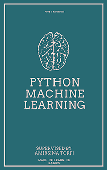

> 原文：[Welcome to Python Machine Learning course!](https://machine-learning-course.readthedocs.io/en/latest/index.html)
> 
> 协议：[CC BY-NC-SA 4.0](http://creativecommons.org/licenses/by-nc-sa/4.0/)
> 
> 欢迎任何人参与和完善：一个人可以走的很快，但是一群人却可以走的更远。

*   [在线阅读](https://github.com/apachecn/vt-cs4624-pyml-zh/blob/master/SUMMARY.md)
*   [ApacheCN 学习资源](http://www.apachecn.org/)

## 贡献指南

本项目需要校对，欢迎大家提交 Pull Request。

> 请您勇敢地去翻译和改进翻译。虽然我们追求卓越，但我们并不要求您做到十全十美，因此请不要担心因为翻译上犯错——在大部分情况下，我们的服务器已经记录所有的翻译，因此您不必担心会因为您的失误遭到无法挽回的破坏。（改编自维基百科）

## 目录

*   [作者](https://github.com/apachecn/vt-cs4624-pyml-zh/blob/master/docs/3.md)
*   [引言](https://github.com/apachecn/vt-cs4624-pyml-zh/blob/master/docs/5.md)
*   [核心概念](https://github.com/apachecn/vt-cs4624-pyml-zh/blob/master/docs/6.md)
    *   [交叉验证](https://github.com/apachecn/vt-cs4624-pyml-zh/blob/master/docs/7.md)
    *   [线性回归](https://github.com/apachecn/vt-cs4624-pyml-zh/blob/master/docs/8.md)
    *   [过拟合和欠拟合](https://github.com/apachecn/vt-cs4624-pyml-zh/blob/master/docs/9.md)
    *   [正则化](https://github.com/apachecn/vt-cs4624-pyml-zh/blob/master/docs/10.md)
*   [监督学习](https://github.com/apachecn/vt-cs4624-pyml-zh/blob/master/docs/11.md)
    *   [逻辑回归](https://github.com/apachecn/vt-cs4624-pyml-zh/blob/master/docs/12.md)
    *   [朴素贝叶斯分类](https://github.com/apachecn/vt-cs4624-pyml-zh/blob/master/docs/13.md)
    *   [决策树](https://github.com/apachecn/vt-cs4624-pyml-zh/blob/master/docs/14.md)
    *   [k 最近邻](https://github.com/apachecn/vt-cs4624-pyml-zh/blob/master/docs/15.md)
    *   [线性支持向量机](https://github.com/apachecn/vt-cs4624-pyml-zh/blob/master/docs/16.md)
*   [无监督学习](https://github.com/apachecn/vt-cs4624-pyml-zh/blob/master/docs/17.md)
    *   [聚类](https://github.com/apachecn/vt-cs4624-pyml-zh/blob/master/docs/18.md)
    *   [主成分分析](https://github.com/apachecn/vt-cs4624-pyml-zh/blob/master/docs/19.md)
*   [深度学习](https://github.com/apachecn/vt-cs4624-pyml-zh/blob/master/docs/20.md)
    *   [多层感知机](https://github.com/apachecn/vt-cs4624-pyml-zh/blob/master/docs/21.md)
    *   [卷积神经网络](https://github.com/apachecn/vt-cs4624-pyml-zh/blob/master/docs/22.md)
    *   [自编码器](https://github.com/apachecn/vt-cs4624-pyml-zh/blob/master/docs/23.md)
*   [原文的协议](https://github.com/apachecn/vt-cs4624-pyml-zh/blob/master/docs/25.md)

## 联系方式

### 负责人

*   [飞龙](https://github.com/wizardforcel): 562826179

### 其他

*   在我们的 [apachecn/vt-cs4624-pyml-zh](https://github.com/apachecn/vt-cs4624-pyml-zh) github 上提 issue.
*   发邮件到 Email: `apachecn@163.com`.
*   在我们的 [组织学习交流群](http://www.apachecn.org/organization/348.html) 中联系群主/管理员即可.

## 赞助我们

