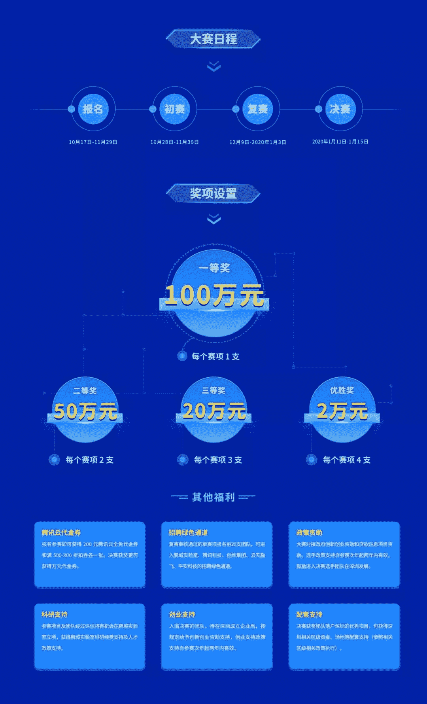
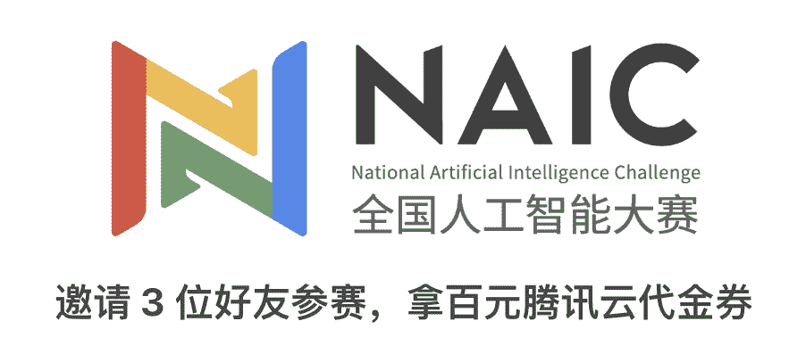

首届“全国人工智能大赛”，由深圳市人民政府主办，深圳市科创委、**鹏城实验室**及科技部指导成立的新一代人工智能产业技术创新战略联盟（AITISA）共同承办，腾讯科技、云天励飞、创维集团、平安科技等协办，**和鲸科技**和腾讯云作为大赛平台支撑。大赛以高规格、高质量、高难度的理念加速培养人工智能领域的高精尖人才，推动人工智能技术的落地。

大赛以“AI赋能视界”为主题，总奖金达到了**536万**。分为“AI+4K HDR”和“行人重识别”两个赛项，每个赛项的总奖金池金额268万，其中一等奖高达100万，无疑是今年国内总奖金和一等奖金额最高的人工智能赛事。

大赛不仅奖金高，优秀参赛团队及选手将能直接进入鹏城实验室、腾讯科技、云天励飞、创维集团、平安科技的**招聘绿色通道**；对接政府创新创业资助和贷款贴息项目资助，经过评估将有机会在鹏城实验室立项，获得鹏城实验室科研经费支持及人才政策支持；落户深圳的大赛优秀项目，可获得各区资金、场地等配套支持；入围决赛、获前三等奖及优秀奖的团队组选手，待成立企业后，按规定给予创新创业资助支持等。选手政策支持自参赛次年起两年内有效，鼓励进入决赛选手团队在深圳发展。

赛题背景

↓↓↓

AI+4K HDR赛项要求选手采用人工智能算法来完成四倍超分、画质增强、SDR/HDR转换等任务。人工智能应用于视频处理是一个非常有前景的领域，而4K视频是5G时代的主流应用之一，“AI+4K+5G”代表了科技和文化深度融合的未来方向。

SDR（Standard Dynamic Range）的视频通常无法同时保留高光和暗部的细节，尤其在过曝/欠曝的情况下，而HDR（High Dynamic Range）视频则是通过技术的手段提升该视频素材的动态范围（Dynamic Range），从而使它可同时保留、展现更多细节信息，尤其在高光与暗部处，从而为观者提供更细腻的对比度呈现与体验。

除此外，本赛题还要求实现将540p重建为已调色的、降噪的4K视频，毕竟在5G时代，超大带宽传输能力、低延迟能力将使高清视频、超高清视频加快普及，因此需要通过技术的发展，实现为观者提供更清晰、更高画质的视频观看体验。

高难度、高水平的大赛选题，为各领域的科研人员、人工智能领域的从业者与爱好者提供了高价值的学习交流契机，可以在不断的探索和思想碰撞中，找寻前沿技术的突破口。

报名通道

↓↓↓

更多福利

↓↓↓

与此同时，为了给参赛选手提供更好的线上云资源，大赛组委会现倾力推出**“邀好友参加AI大赛，拿百元腾讯云代金券”**的活动，即累计邀请3人成功参赛就可获得100元腾讯云代金券奖励，总价值5万元的腾讯云代金券等你来拿！

**短短几十年的发展，深圳从小渔村一跃成为中国的顶级一线城市，除了地理环境，最重要的是这座城市对人才的持续支持和重金投入。AI的发展正在促使社会的新变革，深圳在AI等新兴领域不断发力，在人才的资金投入和吸引上不断加码。有人才的地方就有发展，可以预见这座城市一定会越来越好！**

点击**阅读原文**，加入比赛。