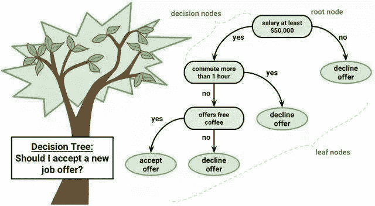

简介和 算法

> 决策树是机器学习最常用的算法之一，它将算法组织成一颗树的形式。其实这就是将平时所说的if-then语句构建成了树的形式。这个决策树主要包括三个部分：内部节点、叶节点和边。内部节点是划分的属性，边代表划分的条件，叶节点表示类别。构建决策树 就是一个递归的选择内部节点，计算划分条件的边，最后到达叶子节点的过程。

伪代码: 输入: 训练数据集D，特征集A，阈值. 输出: 决策树T.

1.  如果D中所有实例属于同一类 ,则置T为单结点树，并将 作为该结点的类，返回T.
2.  如果 , 则置T为单结点树，并将D中最多的类 作为该节点的类，返回T.
3.  否则，根据相应公式计算A中各个特征对D的(信息增益、信息增益比、基尼指数等)，选择最合适的特征 .
4.  如果 的得分小于 ,则置T为单结点树，并将 作为该结点的类，返回T.
5.  否则，根据 特征取值，对数据D进行划分，继续递归构造决策树, 返回T.

## 核心公式

> 信息熵:
> 
> 则随机变量X的熵定义为:熵越大，随机变量的不确定性就越大，当 时，随机变量的熵最大等于logn，故 . 常见的决策树由三种: ID3、C4.5、CART. 其中,  ,  ,  .

| model | feature select | 树的类型 |
| --- | --- | --- |
| ID3 | {分类:信息增益} | 多叉树 |
| C4.5 | {分类:信息增益比} | 多叉树 |
| CART | {分类:基尼指数} | 二叉树 |
| CART | {回归:平方误差} | 二叉树 |

## 算法十问

1.决策树和条件概率分布的关系？

> 决策树可以表示成给定条件下类的条件概率分布. 决策树中的每一条路径都对应是划分的一个条件概率分布. 每一个叶子节点都是通过多个条件之后的划分空间，在叶子节点中计算每个类的条件概率，必然会倾向于某一个类，即这个类的概率最大.

2.ID3和C4.5算法可以处理实数特征吗？如果可以应该怎么处理？如果不可以请给出理由？

> ID3和C4.5使用划分节点的方法分别是信息增益和信息增益比，从这个公式中我们可以看到 这是处理类别特征的方法，实数特征能够计算信息增益吗？我们可以定义X是实数特征的信息增益是，.其中,则. 对于每一个实数可以使用这种方式进行分割. 除此之外,我们还可以使用特征的分桶，将实数特征映射到有限个桶中，可以直接使用ID3和C4.5算法.

3.既然信息增益可以计算，为什么C4.5还使用信息增益比？

> 在使用信息增益的时候，如果某个特征有很多取值，使用这个取值多的特征会的大的信息增益，这个问题是出现很多分支，将数据划分更细，模型复杂度高，出现过拟合的机率更大。使用信息增益比就是为了解决偏向于选择取值较多的特征的问题. 使用信息增益比对取值多的特征加上的惩罚，对这个问题进行了校正.

4.基尼指数可以表示数据不确定性，信息熵也可以表示数据的不确定性. 为什么CART使用基尼指数？

> 信息熵0, logK都是值越大，数据的不确定性越大. 信息熵需要计算对数，计算量大；信息熵是可以处理多个类别，基尼指数就是针对两个类计算的，由于CART树是一个二叉树，每次都是选择yes or no进行划分，从这个角度也是应该选择简单的基尼指数进行计算.

5.决策树怎么剪枝？

> 一般算法在构造决策树的都是尽可能的细分，直到数据不可划分才会到达叶子节点，停止划分. 因为给训练数据巨大的信任，这种形式形式很容易造成过拟合，为了防止过拟合需要进行决策树剪枝. 一般分为预剪枝和后剪枝，预剪枝是在决策树的构建过程中加入限制，比如控制叶子节点最少的样本个数，提前停止. 后剪枝是在决策树构建完成之后，根据加上正则项的结构风险最小化自下向上进行的剪枝操作. 剪枝的目的就是防止过拟合，是模型在测试数据上变现良好，更加鲁棒.

6.ID3算法，为什么不选择具有最高预测精度的属性特征，而不是使用信息增益？

7.为什么使用贪心和其发生搜索建立决策树，为什么不直接使用暴力搜索建立最优的决策树？

> 决策树目的是构建一个与训练数据拟合很好，并且复杂度小的决策树. 因为从所有可能的决策树中直接选择最优的决策树是NP完全问题，在使用中一般使用启发式方法学习相对最优的决策树.

8.如果特征很多，决策树中最后没有用到的特征一定是无用吗？

> 不是无用的，从两个角度考虑，一是特征替代性，如果可以已经使用的特征A和特征B可以提点特征C，特征C可能就没有被使用，但是如果把特征C单独拿出来进行训练，依然有效. 其二，决策树的每一条路径就是计算条件概率的条件，前面的条件如果包含了后面的条件，只是这个条件在这棵树中是无用的，如果把这个条件拿出来也是可以帮助分析数据.

9.决策树的优点？

> 优点: 决策树模型可读性好，具有描述性，有助于人工分析；效率高，决策树只需要一次性构建，反复使用，每一次预测的最大计算次数不超过决策树的深度。缺点: 对中间值的缺失敏感；可能产生过度匹配的问题，即过拟合。

10.基尼系数存在的问题?

> 基尼指数偏向于多值属性;当类数较大时，基尼指数求解比较困难;基尼指数倾向于支持在两个分区中生成大小相同的测试。

## 面试真题

1.  决策树如何防止过拟合？
2.  信息增益比相对信息增益有什么好处？
3.  如果由异常值或者数据分布不均匀，会对决策树有什么影响？
4.  手动构建CART的回归树的前两个节点，给出公式每一步的公式推到？
5.  决策树和其他模型相比有什么优点？
6.  决策树的目标函数是什么？

