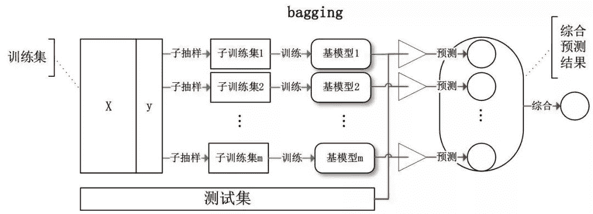
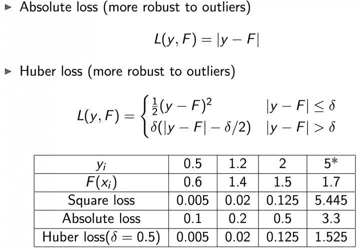

点击上方“**Datawhal****e**”，选择“星标”公众号

第一时间获取价值内容

本文主要介绍基于集成学习的决策树，其主要通过不同学习框架生产基学习器，并综合所有基学习器的预测结果来改善单个基学习器的识别率和泛化性。

集成学习

常见的集成学习框架有三种： Bagging，Boosting 和 Stacking。 三种集成学习框架在基学习器的产生和综合结果的方式上会有些区别，我们先做些简单的介绍。**1.1 Bagging**Bagging 全称叫 Bootstrap aggregating，看到 Bootstrap 我们立刻想到著名的开源前端框架（抖个机灵，是 Bootstrap 抽样方法） ，每个基学习器都会对训练集进行有放回抽样得到子训练集，比较著名的采样法为 0.632 自助法。 每个基学习器基于不同子训练集进行训练，并综合所有基学习器的预测值得到最终的预测结果。 Bagging 常用的综合方法是投票法，票数最多的类别为预测类别。

**1.2 Boosting**Boosting 训练过程为阶梯状，基模型的训练是有顺序的，每个基模型都会在前一个基模型学习的基础上进行学习，最终综合所有基模型的预测值产生最终的预测结果，用的比较多的综合方式为加权法。

**1.3 Stacking**Stacking 是先用全部数据训练好基模型，然后每个基模型都对每个训练样本进行的预测，其预测值将作为训练样本的特征值，最终会得到新的训练样本，然后基于新的训练样本进行训练得到模型，然后得到最终预测结果。

那么，为什么集成学习会好于单个学习器呢？原因可能有三：

1.  训练样本可能无法选择出最好的单个学习器，由于没法选择出最好的学习器，所以干脆结合起来一起用；

2.  假设能找到最好的学习器，但由于算法运算的限制无法找到最优解，只能找到次优解，采用集成学习可以弥补算法的不足；

3.  可能算法无法得到最优解，而集成学习能够得到近似解。比如说最优解是一条对角线，而单个决策树得到的结果只能是平行于坐标轴的，但是集成学习可以去拟合这条对角线。

偏差与方差

上节介绍了集成学习的基本概念，这节我们主要介绍下如何从偏差和方差的角度来理解集成学习。

### 2.1 集成学习的偏差与方差

偏差（Bias）描述的是预测值和真实值之差；方差（Variance）描述的是预测值作为随机变量的离散程度。放一场很经典的图：

模型的偏差与方差

*   **偏差** ： 描述样本拟合出的模型的预测结果的期望与样本真实结果的差距，要想偏差表现的好，就需要复杂化模型，增加模型的参数，但这样容易过拟合，过拟合对应上图的 High Variance，点会很分散。 低偏差对应的点都打在靶心附近，所以喵的很准，但不一定很稳；
*   **方差** ： 描述样本上训练出来的模型在测试集上的表现，要想方差表现的好，需要简化模型，减少模型的复杂度，但这样容易欠拟合，欠拟合对应上图 High Bias，点偏离中心。 低方差对应就是点都打的很集中，但不一定是靶心附近，手很稳，但不一定瞄的准。

我们常说集成学习中的基模型是弱模型，通常来说弱模型是偏差高（在训练集上准确度低）方差小（防止过拟合能力强）的模型。 但是，并不是所有集成学习框架中的基模型都是弱模型。 Bagging 和 Stacking 中的基模型为强模型（偏差低方差高），Boosting 中的基模型为弱模型。在 Bagging 和 Boosting 框架中，通过计算基模型的期望和方差我们可以得到模型整体的期望和方差。 为了简化模型，我们假设基模型的权重 、方差  及两两间的相关系数  相等。 由于 Bagging 和 Boosting 的基模型都是线性组成的，那么有：模型总体期望：模型总体方差：**2.2 Bagging 的偏差与方差**对于 Bagging 来说，每个基模型的权重等于 1/m 且期望近似相等（子训练集都是从原训练集中进行子抽样），故我们可以进一步化简得到：通过上式我们可以看到

*   整体模型的期望等于基模型的期望，这也就意味着整体模型的偏差和基模型的偏差近似。

*   整体模型的方差小于等于基模型的方差，当且仅当相关性为 1 时取等号，随着基模型数量增多，整体模型的方差减少，从而防止过拟合的能力增强，模型的准确度得到提高。但是，模型的准确度一定会无限逼近于 1 吗？并不一定，当基模型数增加到一定程度时，方差公式第一项的改变对整体方差的作用很小，防止过拟合的能力达到极限，这便是准确度的极限了。

在此我们知道了为什么 Bagging 中的基模型一定要为强模型，如果 Bagging 使用弱模型则会导致整体模型的偏差提高，而准确度降低。Random Forest 是经 典 的基于 Bagging 框架的模型，并在此基础上通过引入特征采样和样本采样来降低基模型间的相关性，在公式中显著降低方差公式中的第二项，略微升高第一项，从而使得整体降低 模型整体方差 。**2.3 Boosting 的偏差与方差**对于 Boosting 来说，基模型的训练集抽样是强相关的，那么模型的相关系数近似等于 1，故我们也可以针对 Boosting 化简公式为：通过观察整体方差的表达式我们容易发现：

*   整体模型的方差等于基模型的方差，如果基模型不是弱模型，其方差相对较大，这将导致整体模型的方差很大，即无法达到防止过拟合的效果。因此，Boosting 框架中的基模型必须为弱模型。

*   此外 Boosting 框架中采用基于贪心策略的前向加法，整体模型的期望由基模型的期望累加而成，所以随着基模型数的增多，整体模型的期望值增加，整体模型的准确度提高。

基于 Boosting 框架的 Gradient Boosting Decision Tree 模型中基模型也为树模型，同 Random Forrest，我们也可以对特征进行随机抽样来使基模型间的相关性降低，从而达到减少方差的效果。**2.4 小结**

*   我们可以使用模型的偏差和方差来近似描述模型的准确度；

*   对于 Bagging 来说，整体模型的偏差与基模型近似，而随着模型的增加可以降低整体模型的方差，故其基模型需要为强模型；

*   对于 Boosting 来说，整体模型的方差近似等于基模型的方差，而整体模型的偏差由基模型累加而成，故基模型需要为弱模型。

Random Forest

Random Forest（随机森林），用随机的方式建立一个森林。 RF 算法由很多决策树组成，每一棵决策树之间没有关联。 建立完森林后，当有新样本进入时，每棵决策树都会分别进行判断，然后基于投票法给出分类结果。**3.1 思想**Random Forest（随机森林）是 Bagging 的扩展变体，它在以决策树为基学习器构建 Bagging 集成的基础上，进一步在决策树的训练过程中引入了随机特征选择，因此可以概括 RF 包括四个部分：

1.  随机选择样本（放回抽样）；
2.  随机选择特征；
3.  构建决策树；
4.  随机森林投票（平均）。

随机选择样本和 Bagging 相同，采用的是 Bootstrap 自助采样法； 随机选择特征是指在每个节点在分裂过程中都是随机选择特征的（区别与每棵树随机选择一批特征）。这种随机性导致随机森林的偏差会有稍微的增加（相比于单棵不随机树），但是由于随机森林的“平均”特性，会使得它的方差减小，而且方差的减小补偿了偏差的增大，因此总体而言是更好的模型。随机采样由于引入了两种采样方法保证了随机性，所以每棵树都是最大可能的进行生长就算不剪枝也不会出现过拟合。**3.2 优缺点**优点

1.  在数据集上表现良好，相对于其他算法有较大的优势
2.  易于并行化，在大数据集上有很大的优势；
3.  能够处理高维度数据，不用做特征选择。

AdaBoost

AdaBoost（Adaptive Boosting，自适应增强），其自适应在于： 前一个基本分类器分错的样本会得到加强，加权后的全体样本再次被用来训练下一个基本分类器。 同时，在每一轮中加入一个新的弱分类器，直到达到某个预定的足够小的错误率或达到预先指定的最大迭代次数。**4.1 思想**Adaboost 迭代算法有三步：

1.  初始化训练样本的权值分布，每个样本具有相同权重；
2.  训练弱分类器，如果样本分类正确，则在构造下一个训练集中，它的权值就会被降低； 反之提高。 用更新过的样本集去训练下一个分类器；
3.  将所有弱分类组合成强分类器，各个弱分类器的训练过程结束后，加大分类误差率小的弱分类器的权重，降低分类误差率大的弱分类器的权重。

**4.2 细节****4.2.1 损失函数**Adaboost 模型是加法模型，学习算法为前向分步学习算法，损失函数为指数函数的分类问题。加法模型： 最终的强分类器是由若干个弱分类器加权平均得到的。前向分布学习算法： 算法是通过一轮轮的弱学习器学习，利用前一个弱学习器的结果来更新后一个弱学习器的训练集权重。 第 k 轮的强学习器为：损失函数：利用前向分布学习算法的关系可以得到损失函数为：令 ，它的值不依赖于 ，因此与最小化无关，仅仅依赖于 ，随着每一轮迭代而将这个式子带入损失函数，损失函数转化为：我们求 ，可以得到：将  带入损失函数，并对 \alpha 求导，使其等于 0，则就得到了：其中， 即为我们前面的分类误差率。最后看样本权重的更新。 利用  和 ，即可得：这样就得到了样本权重更新公式。**4.2.2 正则化**为了防止 Adaboost 过拟合，我们通常也会加入正则化项，这个正则化项我们通常称为步长（learning rate）。 定义为 v，对于前面的弱学习器的迭代加上正则化我们有：v 的取值范围为 0v1。 对于同样的训练集学习效果，较小的 v 意味着我们需要更多的弱学习器的迭代次数。 通常我们用步长和迭代最大次数一起来决定算法的拟合效果。**4.3 优缺点**优点

1.  分类精度高；
2.  可以用各种回归分类模型来构建弱学习器，非常灵活；
3.  不容易发生过拟合。

缺点

1.  对异常点敏感，异常点会获得较高权重。

GBDT

GBDT（Gradient Boosting Decision Tree）是一种迭代的决策树算法，该算法由多棵决策树组成，从名字中我们可以看出来它是属于 Boosting 策略。 GBDT 是被公认的泛化能力较强的算法。**5.1 思想**GBDT 由三个概念组成： Regression Decision Tree（即 DT）、Gradient Boosting（即 GB），和SHringkage（一个重要演变）**5.1.1 回归树（Regression Decision Tree）**如果认为 GBDT 由很多分类树那就大错特错了（虽然调整后也可以分类）。 对于分类树而言，其值加减无意义（如性别），而对于回归树而言，其值加减才是有意义的（如说年龄）。 GBDT 的核心在于累加所有树的结果作为最终结果，所以 GBDT 中的树都是回归树，不是分类树，这一点相当重要。回归树在分枝时会穷举每一个特征的每个阈值以找到最好的分割点，衡量标准是最小化均方误差。**5.1.2 梯度迭代（Gradient Boosting）**上面说到 GBDT 的核心在于累加所有树的结果作为最终结果，GBDT 的每一棵树都是以之前树得到的残差来更新目标值，这样每一棵树的值加起来即为 GBDT 的预测值。模型的预测值可以表示为： 为基模型与其权重的乘积，模型的训练目标是使预测值  逼近真实值 ，也就是说要让每个基模型的预测值逼近各自要预测的部分真实值。 由于要同时考虑所有基模型，导致了整体模型的训练变成了一个非常复杂的问题。 所以研究者们想到了一个贪心的解决手段： 每次只训练一个基模型。 那么，现在改写整体模型为迭代式：这样一来，每一轮迭代中，只要集中解决一个基模型的训练问题： 使 F_i(x) 逼近真实值 y。举个例子： 比如说 A 用户年龄 20 岁，第一棵树预测 12 岁，那么残差就是 8，第二棵树用 8 来学习，假设其预测为 5，那么其残差即为 3，如此继续学习即可。那么 Gradient 从何体现？ 其实很简单，其残差其实是最小均方损失函数关于预测值的反向梯度：也就是说，若  加上拟合了反向梯度的  得到 ，该值可能将导致平方差损失函数降低，预测的准确度提高！但要注意，基于残差 GBDT 容易对异常值敏感，举例：

很明显后续的模型会对第 4 个值关注过多，这不是一种好的现象，所以一般回归类的损失函数会用绝对损失或者 Huber 损失函数来代替平方损失函数。

GBDT 的 Boosting 不同于 Adaboost 的 Boosting，GBDT 的每一步残差计算其实变相地增大了被分错样本的权重，而对与分对样本的权重趋于 0，这样后面的树就能专注于那些被分错的样本。**5.1.13 缩减（Shrinkage）**Shrinkage 的思想认为，每走一小步逐渐逼近结果的效果要比每次迈一大步很快逼近结果的方式更容易避免过拟合。 即它并不是完全信任每一棵残差树。,  (0v1)Shrinkage 不直接用残差修复误差，而是只修复一点点，把大步切成小步。 本质上 Shrinkage 为每棵树设置了一个 weight，累加时要乘以这个 weight，当 weight 降低时，基模型数会配合增大。**5.2 优缺点**优点

1.  可以自动进行特征组合，拟合非线性数据；
2.  可以灵活处理各种类型的数据。

缺点

1.  对异常点敏感。

**5.3 与 Adaboost 的对比**相同：

1.  都是 Boosting 家族成员，使用弱分类器；
2.  都使用前向分布算法；

不同：

1.  迭代思路不同： Adaboost 是通过提升错分数据点的权重来弥补模型的不足（利用错分样本），而 GBDT 是通过算梯度来弥补模型的不足（利用残差）；
2.  损失函数不同： AdaBoost 采用的是指数损失，GBDT 使用的是绝对损失或者 Huber 损失函数；

**参考***机器学习算法中 GBDT 与 Adaboost 的区别与联系是什么？* *- Frankenstein 的回答 - 知乎*

