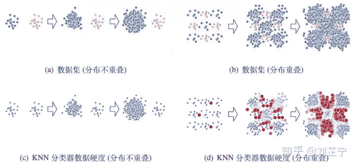
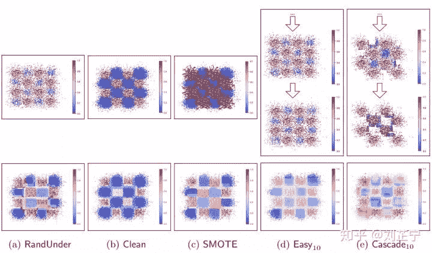

不平衡学习是机器学习问题的一个重要子域，其主要关注于如何从类别分布不均衡的数据中学习数据的模式。在这篇文章中我们主要关注不平衡分类问题，特别地，我们主要关注类别极端不平衡场景下的二分类问题所面临的困难。

在这篇文章中我们将：

*   描述类别不平衡的定义与实际应用场景

*   给出不平衡场景下常用的评价指标

*   讨论不平衡场景下分类器学习困难的来源

*   概览已有的不平衡学习方法并分析其优劣

*   给出一些直觉的可视化来帮助理解不平衡学习过程

*   给出一些场景/模型选择中的个人经验

为简洁起见，文中出现的Min代表少数类样本（正类，positive，y=1），Maj代表多数类样本（负类，negative，y=0）

## 问题概述：

当一个分类任务的数据集中来自不同类别的样本数目相差悬殊时，我们通常称该数据集为“类别不平衡”的。以一个现实任务为例：在点击率预估（click-through rate prediction）任务中，每条展示给用户的广告都产生一条新样本，而用户最终是否点击了这条广告决定了样本的标签。显然，只有很少一部分的用户会去点击网页里的嵌入广告，这就导致最终得到的训练数据集中正/负例样本的数量差距悬殊。同样的情况也发生在很多实际应用场景中，如金融欺诈检测（正常/欺诈），医疗辅助诊断（正常/患病），网络入侵检测（正常连接/攻击连接）等等[1,2,3]。 需要注意的是，尽管少数类的样本个数更少，表示的质量也更差，但其通常会携带更重要的信息，因此一般我们更关注模型正确分类少数类样本的能力。

分类问题的一个underlying assumption是各个类别的数据都有自己的分布，当某类数据少到难以观察结构的时候，我们可以考虑抛弃该类数据，转而学习更为明显的多数类模式，而后将不符合多数类模式的样本判断为异常/少数类，某些时候会有更好的效果。此时该问题退化为异常检测（anomaly detection）问题。

> *有关异常检测 (Anomaly detection)*由于只关心多数类的分布，这些方法一般为unsupervised / weakly-supervised，只使用单类别数据训练。

## 基本符号：

在二元不平衡分类中，数据集中只存在两个类别：少数类，即样本数量较少的类，与多数类，即样本数量相对较多的类别。我们使用D来表示全部训练数据样本的集合，每一个样本用(x, y)表示，其中 y ∈ {0, 1}。在二分类条件下，y取值为1代表该样本属于正类（少数类），为0则代表该样本属于负类（多数类）。

由此我们可以定义少数类集合： ‘

及多数类集合：

 

从而有：

由此，对于（高度）不平衡的数据集我们有  。为了以统一的形式描述不同数据集的不平衡程度，我们定义不平衡比IR（Imbalance Ratio）为多数类样本数量与少数类样本数量的比值：

## 模型评价准则：

对于一般的机器学习方法，最常见的评价指标无疑是分类准确度ACC (accuracy)，ACC的含义非常直观并且在通常情况下都很有效。然而对于不平衡的分类任务，ACC并不能很好地反映分类器的性能。考虑以下情况：一个含有10000条样本的数据集，其中  。此时一个将所有样本都判断成多数类样本的分类器能够获得99%的分类准确率，这是一个相当高的分数，但给一个完全无法区分出少数类样本的分类器如此高的分数显然是不合理的。由于ACC等传统评价指标的特性，在数据分布不平衡时其往往会导致分类器的输出倾向于在数据集中占多数的类别：*输出多数类会带来更高的分类准确率，但在我们所关注的少数类中表现不佳。*

类别不平衡问题有一些更加合理的评价准则，这些指标通常是基于真正例TP/真负例TF/假正例FP/假负例FN的个数计算的。在二分类场景下，上述四种样本的数量可以通过计算混淆矩阵得到（见下表）。

二分类问题的混淆矩阵（Confusion Matrix）

基于混淆矩阵我们可以使用准确率（Precision）和召回率（Recall）来评价模型在不平衡数据上的分类精度。F-score（F1）和G-mean（GM）是准确率和召回率的调和平均值 [4,5]。MCC [6]（Matthews correlation coefficient，即马修斯相关系数）考虑了各种样本的个数，是一个在类别平衡或不平衡下都可使用的评价指标。 AUCPRC [7]（Area Under Curve of Precision-Recall Curve）指准确率-召回率曲线下的面积。这些评价准则不会被不同类别中样本的数量所影响，因此通常被认为是“无偏的”，可以在类别不平衡的场景下使用。

*   

*   

*   

*   

*   

*   

需要注意的是一个常用的评价指标AUCROC（Area Under Receiver-Operator Characteristic curve）其实是有偏的，它不适用于不平衡场景下的模型评估[7]。

> Receiver Operator Characteristic (ROC) curves are commonly used to present results for binary decision problems in machine learning. However, when dealing with highly skewed datasets, Precision-Recall (PR) curves give a more informative picture of an algorithm's performance.

> -- *Davis J, et al. The Relationship Between Precision-Recall and ROC Curves, ICML 2006*

## 不平衡场景下学习困难的来源：

通常情况下，类别不平衡程度越高，数据集的分类难度越大。但在一些工作中，发现存在某些高度不平衡的数据集，在这些数据集上不加任何修改的标准学习模型（如，SVM，Decision Tree等）仍能得到很好的分类结果。显然，类别不平衡本身并不是分类困难的来源，其背后的原因需要对数据分布以及模型在训练过程中的行为进行更细致的观察。

一些研究工作尝试说明不平衡数据集上分类困难的本质原因，这些工作认为分类困难的原因来自于数据分布中的一些本质因素。如，

*   过多的少数类样本出现在多数类样本密集的区域 [8]

*   类别之间的分布严重重叠（即不同类别的样本相对密集地出现在特征空间的同一区域）[8]

*   数据中本身存在的噪声，尤其是少数类的噪声 [9]

*   少数类分布的稀疏性（sparsity）以及稀疏性导致的拆分多个子概念（sub-concepts，可理解为子clusters）并且每个子概念仅含有较少的样本数量 [10]

因素4又被称为small disjuncts问题。它导致分类困难的原因很直观：在同样的特征空间中，相比于只有一个cluster的简单少数类分布，具有多个子概念的少数类分布需要模型给出更复杂的决策边界来获得良好的预测。在模型复杂度不变的情况下，分类性能会因子概念个数的增多而变差。因此该问题的解决办法也较为简单：上更大容量的模型（DL: 更宽，更深，更强）。

至于因素1、2、3，我个人认为尽管三者的成因不同，这三个因素为学习带来的困难本质上是一样的。抛开数据集本身所带有的噪声因素来考虑。因素2，类别之间的分布严重重叠，所造成的结果即过多的少数类样本出现在多数类样本密集的区域（因素3，这话反过来说也合理）。而这些嵌入在多数类样本密集区域的少数类样本即我们通常说的离群点。以我个人而言，在不平衡分类任务中，离群点和噪声点所起到的作用没有本质上的区别。因此我们将因素1、2、3都归因为一个因素：噪声。

> 另外，在实际的工业应用当中，这些难度因素还会与其他实际问题一同出现，如特征中的缺失值，巨大的数据集规模等。

图1：在不同程度的类别不平衡下，分布重叠/不重叠的两个数据集。数据硬度指分类器训练完成后输出概率与ground truth label的残差（i.e., |F(x)-y|）

最后在图1中我们给出一个直观的可视化来帮助理解类别不平衡比/类别分布重叠之间的关系：即使不平衡比相同，类别重叠/不重叠的数据集也会表现出极其不同的分类难度。深蓝色的点代表它们可以被模型很好地分类，而深红色的样本点代表模型完全无法正确分类这些数据点。

在图1(a)中，数据集是用两个不重叠的的二维高斯分布生成的。我们可以观察到不平衡比的增长并不会影响分类该数据集的难度(图1(c))。而在图1(b)中，数据集由两个相互重叠的二维高斯混合分布生成。随着不平衡比的增加，它从一个相对简单的分类任务变成了一个极其困难的任务(图1(d))。

## 已有的不平衡学习方法概览：

标准机器学习算法假设属于不同类别的样本数量大致相似。因此类别的不均匀分布给在不平衡数据集上应用标准学习算法带来了困难：这些学习算法的设计背后隐含的优化目标是数据集上的分类准确度，而这会导致学习算法在不平衡数据上更偏向于含更多样本的多数类。多数不平衡学习（imbalance learning）算法都是为了解决这种“对多数类的偏好”而提出。

我将已有的不平衡学习算法划分为3类：*数据级方法，算法级方法*以及*集成方法*。

*   数据级方法

数据级方法是不平衡学习领域发展最早、影响力最大、使用最广泛的一类方法，也可称为重采样方法。该类方法关注于通过修改训练数据集以使得标准学习算法也能在其上有效训练。根据实现方式的不同，数据级方法可被进一步分类为：

1\. 从多数类别中删除样本的方法（欠采样，如RUS、NearMiss[11]、ENN[12]、Tomeklink[13]等）2\. 为少数类别生成新样本的方法（过采样，如SMOTE[14]，ADASYN[15]，Borderline-SMOTE[16]等）3\. 结合上述两种方案的混合类方法（过采样+欠采样去噪，如SMOTE+ENN[17]等）

标准的随机重采样方法使用随机方法来选择用于预处理的目标样本。然而随机方法可能会导致丢弃含有重要信息的样本（随机欠采样）或者引入无意义的甚至有害的新样本（随机过采样），因此有一系列更高级的方法，试图根据根据数据的分布信息来在进行重采样的同时保持原有的数据结构。

Strength: 1. 该类方法能够去除噪声/平衡类别分布：在重采样后的数据集上训练可以提高某些分类器的分类性能。2. 欠采样方法减小数据集规模：欠采样方法会去除一些多数类样本，从而可能降低模型训练时的计算开销。

Weakness: 1. 采样过程计算效率低下：这一系列的“高级”重采样方法通常使用基于距离的邻域关系（通常是k-最近邻方法）来提取数据分布信息。该方式的缺点是需要计算每个数据样本之间的距离，而计算距离需要的计算量随着数据集的大小呈平方级增长，因此在大规模数据集上应用这些方法可能会带来极低的计算效率。2. 易被噪声影响：此外在具有高不平衡比且包含大量噪声的工业数据集中，少数类的结构可能并不能被样本的分布很好地表示。而被这些重采样方法用来提取分布信息的最近邻算法很容易被噪声干扰，因此可能无法得到准确的分布信息，从而导致不合理的重采样策略。3. 过采样方法生成过多数据：当应用于大规模且高度不平衡的数据集时，过采样类的方法可能会生成大量的少数类样本以平衡数据集。这会进一步增大训练集的样本数量，增大计算开销，减慢训练速度，并可能导致过拟合。4. 不适用于无法计算距离的复杂数据集：最重要的一点是这些重采样方法依赖于明确定义的距离度量，使得它们在某些数据集上不可用。在实际应用中，工业数据集经常会含有类别特征（即不分布在连续空间上的特征，如用户ID）或者缺失值，此外不同特征的取值范围可能会有巨大的差别。在这些数据集上定义合理的距离度量十分困难。

*   算法级方法

算法级方法专注于修改现有的标准机器学习算法以修正他们对多数类的偏好。在这类方法中最流行的分支是代价敏感学习[18,19]（cost-sensitive learning），我们在此也只讨论该类算法。代价敏感学习给少数类样本分配较高的误分类代价，而给多数类样本分配较小的误分类代价。通过这种方式代价敏感学习在学习器的训练过程中人为提高了少数类别样本的重要性，以此减轻分类器对多数类的偏好。

Strength: 1. 不增加训练复杂度：使用该类算法魔改后的算法通常会有更好的表现，并且没有增加训练的计算复杂度。2. 可直接用于多分类问题：该类算法通常只修改误分类代价，因此可直接扩展到多分类问题上。

Weakness: 1. 需要领域先验知识：必须注意的是，代价敏感学习中的代价矩阵（cost matrix）需要由领域专家根据任务的先验知识提供，这在许多现实问题中显然是不可用的。因此在实际应用时代价矩阵通常被直接设置为归一化的不同类别样本数量比。由于缺乏领域知识的指导，这种擅自设置的代价矩阵并不能保证得到最优的分类性能。2. 不能泛化到不同任务：对于特定问题设计的代价矩阵只能用于该特定任务，在其他任务上使用时并不能保证良好的性能表现。3. 依赖于特定分类器：另一方面，对于诸如神经网络的需要以批次训练（mini-batch training）方法训练的模型，少数类样本仅仅存在于在很少的批次中，而大部分批次中只含有多数类样本，这会给神经网络训练带来灾难性的后果：使用梯度下降更新的非凸优化过程会很快陷入局部极值点/鞍点（梯度为0），导致网络无法进行有效学习。使用敏感代价学习来给样本加权并不能解决这个问题。

*   集成学习方法

集成学习类方法专注于将一种数据级或算法级方法与集成学习相结合，以获得强大的集成分类器。由于其在类别不平衡任务中表现出色，在实际应用中集成学习越来越受欢迎。它们中的大多数基于某种特定的集成学习算法（例如，Adaptive Boosting [20]）并在集成的过程中嵌入一种其他的不平衡学习方法（例如，SMOTE[14]）。

e.g., SMOTE+Boosting=SMOTEBoost [21]; SMOTE+Bagging=SMOTEBagging [22];

另有一些集成学习方法的基学习器也是集成学习器（例如，EasyEnsemble，BalanceCascade[23]）。因此最终的分类器是一个“集成的集成”。

“集成的集成”并不代表一定会有更好的表现，作为基学习器的集成学习方法也会影响分类性能。如上述两种方法使用AdaBoost作为基分类器，Boosting类方法本身就对噪声敏感，加上BalanceCascade本身有相同的问题，因此使用非集成分类器可能效果反而更好（如直接使用C4.5）。PS，这两种方法使用AdaBoost做基学习器的原因大概率是为了蹭热点（2010年左右）。

Strength: 1. 效果通常较好：没有什么问题是ensemble不能解决的，如果有，再多加一个base learner。根据我的经验集成学习方法（魔改的）仍然是解决不平衡学习问题最有效的方法。2. 可使用迭代过程中的反馈进行动态调整：极少数的集成方法具有了动态重采样的思想，如BalanceCascade会在每轮迭代中丢弃那些已经被当前分类器很好地分类的多数类样本（assumption是这些样本已经不含对模型有贡献的信息）。该方法在实际应用时也实现了相比于其他降采样方法更快的收敛速度，使其可以使用相对较少的分类器来得到更优的分类表现。

Weakness: 1. 包含所使用的不平衡学习方法的缺点：由于大多数不平衡集成学习方法仍然在其pipeline中使用了标准的数据级/算法级方法，因此上述两类方法的缺点也同样存在于使用他们的集成方法中。2. 过采样+集成进一步增大计算开销：当应用于实际任务时，即便集成能够提升大部分方法的分类表现，这些数据级/算法级方法仍然存在计算效率低，适用性差并且易被噪声影响的缺点。例如，作为过采样方法的SMOTE在单独使用时已经引入了大量的新训练样本，使用SMOTE生成更多的训练数据集并训练更多的分类器只会使整个训练过程变得更慢。3. 对噪声不鲁棒：BalanceCascade做出了非常有意义的探索，但其一味保留难以分类样本的策略可能导致在后期的迭代中过度拟合噪声/离群点，并最终恶化集成分类器的表现。换言之，其对噪声不鲁棒。

## **训练过程可视化**：

为了更直观地阐明上述对不平衡学习方法的分析，我构建了一个合成数据集用于可视化（图2）：

图2：checkerboard数据集的示例。图(c)中的蓝色点代表多数类样本，红色点代表少数类样本

在该数据集上测试下列五种方法：

*   RandUnder即随机降采样，它随机选取与少数类样本个数相同的多数类样本来组成一个平衡的训练集，并在其上训练一个分类器。

*   Clean指Neighborhood Cleaning Rule方法，它从数据集中移除那些最近邻都来自少数类的多数类样本。

*   SMOTE [14] 指少数类过采样技术（Synthetic Minority Over-sampling TechniquE），它根据最近邻关系向数据集中加入人工合成的少数类样本。

*   Easy [23] 指EasyEnsemble，它通过多次使用RandUnder来训练多个Adaptive Boosting [20] (AdaBoost)分类器并结合他们的输出得到一个集成分类器。需要注意的是AdaBoost本身也是一个集成分类器。

*   Cascade [23] 指BalanceCascade，它是EasyEnsemble的扩展。与Easy不同的是，它在每一轮迭代中都丢弃那些已经被当前基分类器很好地分类的多数类样本，以此减小采样空间并关注在更加难以分类的样本上。

*   所有方法皆使用AdaBoost（基）分类器。

图3：5种不平衡学习方法在人工数据集上的可视化，包括3种重采样方法(i.e., RandUnder, Clean, SMOTE)以及两种重采样+集成方法(i.e., Easy, Cascade)

图2展示了不同方法在checkerboard任务上的训练集（上列，蓝/红色点代表一个来自多数/少数类的样本）以及最终预测（下列，蓝/红色点代表分类器倾向于将一个样本分类为多数/少数类）。由于集成学习方法Easy以及Cascade使用多个不同的训练集训练基学习器，此处我们选择它们用于训练第5和第10个分类器的训练集用于可视化。

从图中可以观察到RandUnder和Easy执行简单的随机欠采样，因此可能会丢失一些信息。Clean尝试清理被少数类数据点包围的多数类离群点，但是它保留了所有的背景样本，这导致分类器在训练时无法专注于那些含有更多信息的数据点。此外由于类别之间的重叠，SMOTE受到噪声影响过度泛化了少数类的空间分布。Cascade在后期迭代中只保留了一些多数类的离群点，强行拟合这些离群点最终导致了糟糕的泛化性能。

需要强调为了可视化的效果，我们使用的该合成数据集含有相当多的噪声。在实际应用中BalanceCascade仍然是一种相当出色的不平衡学习方法。

## **人生经验：**

总而言之，要根据问题性质的不同选择不同的方法，梳理一下

*   欠采样：一般是用来平衡数据集、去噪。平衡数据集的有随机欠采样/NearMiss，采样和训练速度都很快。随机欠采样在任何情况下都能用，但在数据集不平衡程度较高时会不可避免地丢弃大部分多数类样本造成信息损失。NearMiss对噪声极端敏感，有噪声基本就废掉。去噪方法有很多，如Tomeklink，AllKNN等，需要数据集上有良好定义的距离度量，在大规模数据集上计算量大。去噪之后对有的分类器有效，有的无效。

*   过采样：随机过采样任何情况下都不要用，及其容易造成过拟合。SMOTE、ADASYN在小规模数据上可以一试。当数据规模大且不平衡程度高时，过采样方法生成巨量的合成样本，需要很多额外计算资源。同时此类过采样基于少数类样本的结构信息，在少数类的表示质量很差时甚至会反向优化：过采样效果还不如直接训练。

*   混合采样：理论上加入了去噪类的欠采样算法来清洁过采样之后的数据集。实际使用起来我没感觉到有什么不同，唯一的区别是加了去噪方法之后更慢了。

*   Cost-sensitive：在数据集不平衡程度不高时可用，训练分类器的效率跟使用原始数据训练没有什么区别。缺点是一般需要自己当“领域专家”来设置cost matrix（多了个参数要调），设的不好通常也会得到不理想的效果。此外在不平衡严重的时候，由于没有对数据集的修改，神经网络的训练会crash：连续数个mini-batch都是多数类样本，分分钟陷到local optimal/鞍点。

*   集成：随机降采样+集成，在不平衡比较高时需要较多的基学习器来达到较好的效果。注意Boosting容易被噪声影响，Bagging方法是真正的万金油，增加基学习器数量效果一般不会下降。高级降采样+集成，也可以尝试，运行会慢并且效果不能保证比随机方法好。高级过采样+集成，同上，数据规模大且不平衡程度高情况下，训练样本数量爆炸。尤其是集成方法还要训练好多个基学习器。BalanceCascade，信息利用效率高，只用很少的基学习器就能达到较好的效果，但对噪声不鲁棒。

我们为了解决上述高度不平衡、含有较多噪声、且数据规模极大的不平衡分类问题做了一些*微小的工作*，并且与传统不平衡学习方法做了全面的比较实验，我们的方法计算开销更小，结果更优。过一阵时间可能会挂到arxiv上，届时敬请关注。

## BTW：

一些经典综述：[3,24,25,26]

一个包：imbalanced-learn python package（https://github.com/scikit-learn-contrib/imbalanced-learn）

> 这个包里实现的很多方法效果都不尽人意，（尤其是集成类方法：RUSBoost/EasyEnsemble/BalanceCascade等）发现不好用的话建议自己手写一个/用其他的实现。

## References

*[1] Gamberger D, Lavrac N, Groselj C. Experiments with noise filtering in a medical domain//ICML. 1999: 143-151.*

*[2] Graepel T, Candela J Q, Borchert T, et al. Web-scale bayesian click-through rate prediction for sponsored search advertising in microsoft’s bing search engine// Omnipress, 2010.*

*[3] Sun Y, Wong A K, Kamel M S. Classification of imbalanced data: A review. International Journal of Pattern Recognition and Artificial Intelligence, 2009, 23 (04):687-719.*

*[4] Powers D M. Evaluation: from precision, recall and f-measure to roc, informed-ness, markedness and correlation. 2011.*

*[5] Sokolova M, Japkowicz N, Szpakowicz S. Beyond accuracy, f-score and roc: a family of discriminant measures for performance evaluation//Australasian joint conference on artificial intelligence. Springer, 2006: 1015-1021.*

*[6] Boughorbel S, Jarray F, El-Anbari M. Optimal classifier for imbalanced data using matthews correlation coefficient metric. PloS one, 2017, 12(6):e0177678.*

*[7] Davis J, Goadrich M. The relationship between precision-recall and roc curves// Proceedings of the 23rd international conference on Machine learning. ACM, 2006: 233-240.*

*[8] García V, Sánchez J, Mollineda R. An empirical study of the behavior of classifiers on imbalanced and overlapped data sets//Iberoamerican Congress on Pattern Recognition. Springer, 2007: 397-406.*

*[9] Napierała K, Stefanowski J, Wilk S. Learning from imbalanced data in presence of noisy and borderline examples//International Conference on Rough Sets and Current Trends in Computing. Springer, 2010: 158-167.*

*[10] Prati R C, Batista G E, Monard M C. Learning with class skews and small dis- juncts//Brazilian Symposium on Artificial Intelligence. Springer, 2004: 296-306.*

*[11] Mani I, Zhang I. knn approach to unbalanced data distributions: a case study involving information extraction//Proceedings of workshop on learning from imbalanced datasets: volume 126\. 2003.*

*[12] Wilson D L. Asymptotic properties of nearest neighbor rules using edited data. IEEE Transactions on Systems, Man, and Cybernetics, 1972(3):408-421.*

*[13]Tomek I. Two modifications of cnn. IEEE Trans. Systems, Man and Cybernetics, 1976, 6:769-772.*

*[14] Chawla N V, Bowyer K W, Hall L O, et al. Smote: synthetic minority over-sampling technique. Journal of artificial intelligence research, 2002, 16:321-357.*

*[15] He H, Bai Y, Garcia E A, et al. Adasyn: Adaptive synthetic sampling approach for imbalanced learning// 2008 IEEE International Joint Conference on Neural Networks (IEEE World Congress on Computational Intelligence). IEEE, 2008: 1322-1328.*

*[16] Han H, Wang W Y, Mao B H. Borderline-smote: a new over-sampling method in imbalanced data sets learning//International conference on intelligent computing. Springer, 2005: 878-887.*

*[17] Batista GE, Prati RC, Monard MC. A study of the behavior of several methods for balancing machine learning training data. ACM SIGKDD explorations newsletter, 2004, 6(1):20-29.*

*[18] Elkan C. The foundations of cost-sensitive learning//International joint conference on artificial intelligence: volume 17\. Lawrence Erlbaum Associates Ltd, 2001:973-978.*

*[19] Liu X Y, Zhou Z H. The influence of class imbalance on cost-sensitive learning: An empirical study//Sixth International Conference on Data Mining (ICDM’06). IEEE, 2006: 970-974.*

*[20] Freund Y, Schapire R E. A decision-theoretic generalization of on-line learning and an application to boosting. Journal of computer and system sciences, 1997,55(1):119-139.*

*[21] Chawla N V, Lazarevic A, Hall L O, et al. Smoteboost: Improving prediction of the minority class in boosting//European conference on principles of data mining and knowledge discovery. Springer, 2003: 107-119.*

*[22] Wang S, Yao X. Diversity analysis on imbalanced data sets by using ensemble models//2009 IEEE Symposium on Computational Intelligence and Data Mining. IEEE, 2009: 324-331.*

*[23] Liu X Y, Wu J, Zhou Z H. Exploratory undersampling for class-imbalance learning. IEEE Transactions on Systems, Man, and Cybernetics, Part B (Cybernetics), 2009, 39(2):539-550.*

*[24] He H, Garcia E A. Learning from imbalanced data. IEEE Transactions on Knowledge & Data Engineering, 2008(9):1263-1284.*

*[25] He H, Ma Y. Imbalanced learning: foundations, algorithms, and applications. John Wiley & Sons, 2013.*

*[26] Haixiang G,Yijing L,Shang J, et al. Learning from class-imbalanced data: Review of methods and applications. Expert Systems with Applications, 2017, 73:220-239*

*[27] Lemaître G, Nogueira F, Aridas C K. Imbalanced-learn: A python toolbox to tackle the curse of imbalanced datasets in machine learning. Journal of Machine Learning Research, 2017, 18(17):1-5. jmlr.org/papers/v18/16-.*

*文章知乎地址 : https://zhuanlan.zhihu.com/p/54199094*

