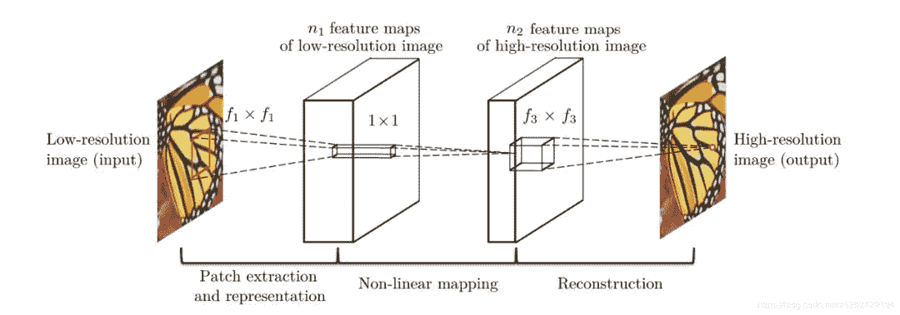
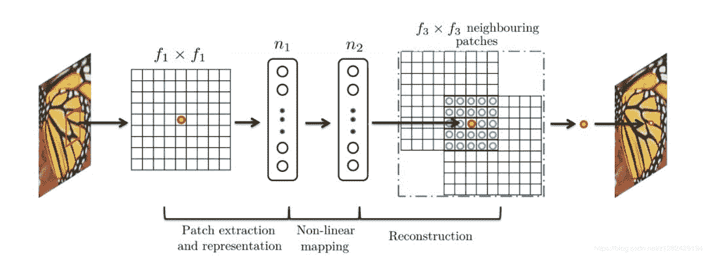
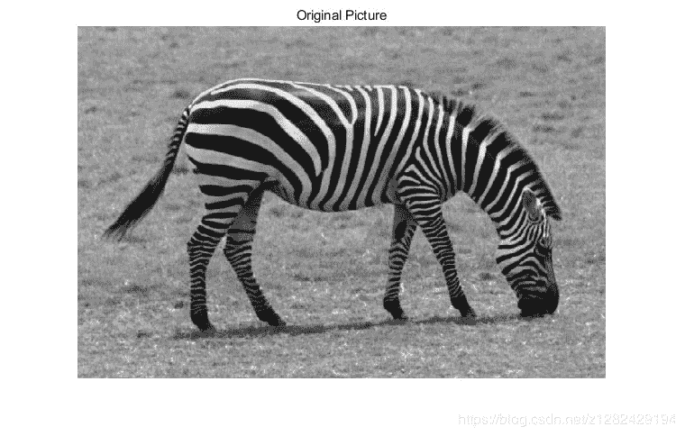
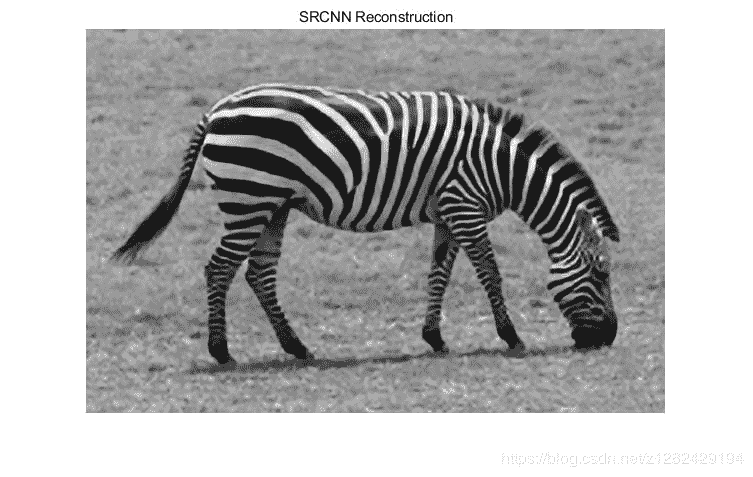
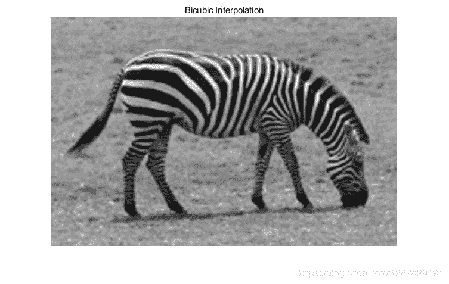

点击上方“**Datawhal****e**”，选择“星标”公众号

第一时间获取价值内容


**文章摘要**

《Learning a Deep Convolutional Network for Image Super-Resolution》的学习。

**算法模型**



此图展示了SRCNN的网络结构。



此图展示了在卷积神经网络下稀疏编码的结构。

**SRCNN整个算法包括三个操作：**

**    1\. Patch extraction and representation**

    **2\. Non-linear mapping****    3\. Reconstruction**在该论文中，利用Relu作为收敛函数，利用最小均方差函数为Loss函数。**    Loss函数：**

**TensorFlow代码**

```
// 主函数	
from model import SRCNN	
from utils import input_setup	

import numpy as np	
import tensorflow as tf	

import pprint	
import os	

flags = tf.app.flags	
flags.DEFINE_integer("epoch", 15000, "Number of epoch [15000]")	
flags.DEFINE_integer("batch_size", 128, "The size of batch images [128]")	
flags.DEFINE_integer("image_size", 33, "The size of image to use [33]")	
flags.DEFINE_integer("label_size", 21, "The size of label to produce [21]")	
flags.DEFINE_float("learning_rate", 1e-4, "The learning rate of gradient descent algorithm [1e-4]")	
flags.DEFINE_integer("c_dim", 1, "Dimension of image color. [1]")	
flags.DEFINE_integer("scale", 3, "The size of scale factor for preprocessing input image [3]")	
flags.DEFINE_integer("stride", 14, "The size of stride to apply input image [14]")	
flags.DEFINE_string("checkpoint_dir", "checkpoint", "Name of checkpoint directory [checkpoint]")	
flags.DEFINE_string("sample_dir", "sample", "Name of sample directory [sample]")	
flags.DEFINE_boolean("is_train", True, "True for training, False for testing [True]")	
FLAGS = flags.FLAGS	

pp = pprint.PrettyPrinter()	

def main(_):	
  pp.pprint(flags.FLAGS.__flags)	

  if not os.path.exists(FLAGS.checkpoint_dir):	
    os.makedirs(FLAGS.checkpoint_dir)	
  if not os.path.exists(FLAGS.sample_dir):	
    os.makedirs(FLAGS.sample_dir)	

  with tf.Session() as sess:	
    srcnn = SRCNN(sess, 	
                  image_size=FLAGS.image_size, 	
                  label_size=FLAGS.label_size, 	
                  batch_size=FLAGS.batch_size,	
                  c_dim=FLAGS.c_dim, 	
                  checkpoint_dir=FLAGS.checkpoint_dir,	
                  sample_dir=FLAGS.sample_dir)	

    srcnn.train(FLAGS)	

if __name__ == '__main__':	
  tf.app.run()
```

Tensorflow完整代码：
https://github.com/tegg89/SRCNN-Tensorflow

**结果**







     双三次差值的 ：      PSNR=26.633759 dB
     SRCNN的：            PSNR=29.290147 dB     相比两种算法的PSNR，SRCNN有着明显的提升。

**SRCNN的不足**

1.  利用Relu作为激活函数虽然速度快，但是训练的时候很”脆弱”，很容易就”die”；
2.  SRCNN需要先通过双三次插值的方法对低分辨率的图片插值放大尺寸。

**参考文献**

    [1] https://zhuanlan.zhihu.com/p/49846783

    [2] https://medium.com/coinmonks/review-srcnn-super-resolution-3cb3a4f67a7c

    [3] http://jiaqianlee.com/2018/06/09/SRCNN/

