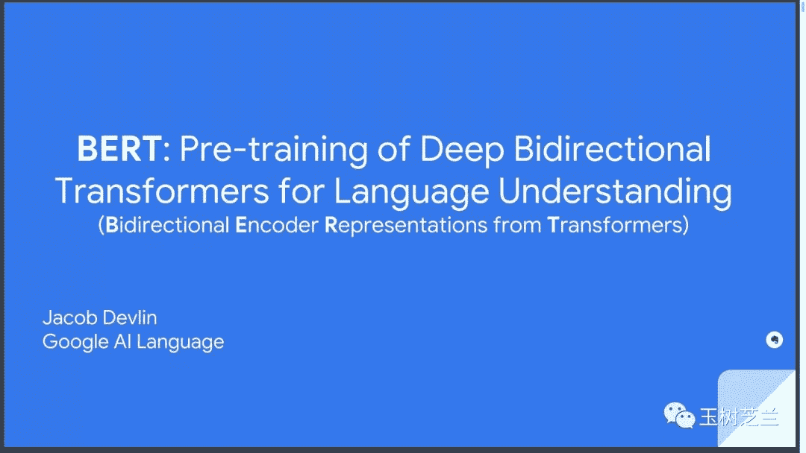
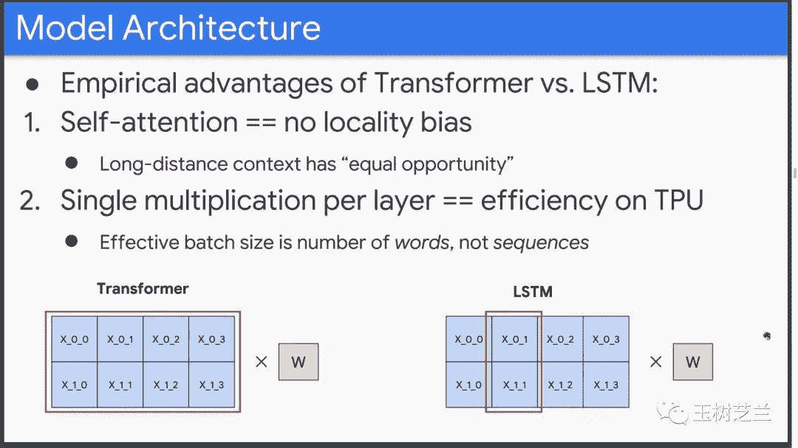
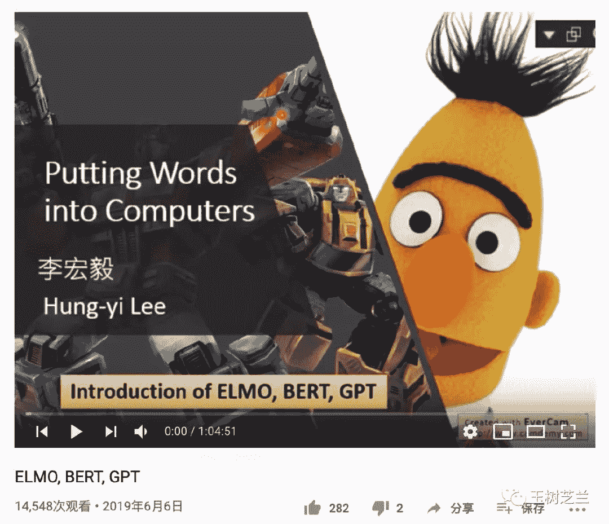

王树义

读完需要

18分钟

速读仅需6分钟

悄悄告诉你几个窍门。

***1***

**痛苦**

做科研，不能不读论文。

但是，我见过不少研究生，论文都读得愁眉苦脸的。

这其中，自然有因为拖延的关系。例如教授布置了2周后讨论论文，你原本可以每天抽出时间，慢慢消化。可你非得拖到截止日期的前一天晚上才打开看，希望毕其功于一役……这显然是态度问题。

但是，不可忽略的，有些同学，却真的不是态度问题，而是方法不当。

他们喜欢跟论文死磕。

读不懂，就一遍一遍反复读，试图从字里行间，悟出精髓。

这可能是为了遵从那句古训：

书读百遍，其义自见。

且不说这样是不是最终能走通。只论这个过程，就很痛苦，而且事倍功半。

有的同学对着一篇论文发奋了几天甚至是几周，依然看不懂。那种挫折、沮丧，别人看着都难受。

问题出在哪里呢？

***2***

**困难**

更进一步，不断涌现的论文，其实就是学术界的升级安装包。

你不断读论文，就是为了跟学术共同体保持同步。但是，只有你跟这篇论文所依赖的那些基础知识同步以后，安装这个升级包才有意义，也才能水到渠成。

而对着论文犯愁的你，不管出于什么原因，显然不大具备这个新包儿（论文）的安装条件。

所以，你需要做的，不是跟这篇论文自身较劲。而是应该尽快补充调整自己的知识架构，使得这篇论文对你而言，是可以兼容，并且升级的。

论文罗列的参考文献，可以作为你补充基础知识的一个有效手段。毕竟，作者亲自在这里为你指明的路径，如同给了你一张写有路标的迷宫地图。

这就是为什么，许多优秀的博士，都是要读数百篇文献的。

读过那些文献以后，再看什么新文献，都会很有感觉，一下子就能找到方向，看到论文的优势和弱点。

这时候，你就已经是个专业人士了。

但是，对于初学者而言，你得先让自己树立自信。而不是用一种近乎于闭卷考试的方法挑战自己。

做买卖不怕赔钱，但是怕刚开张的时候赔钱。这是有道理的，因为“贫穷陷阱”曲线有多个均衡。

同样，做科研也不怕面对困难。但是初始阶段，还是得给自己降低一些难度。

许多时候，你要读的论文来自陌生领域，你并没有那么多的时间，一篇篇文献去啃、去挖掘。

举个例子，假设你的研究方向，不是自然语言处理或者深度神经网络。但是你最近在学术研讨会上听说了一个神奇的东西，叫做 BERT 。

你自己学科里面的很多人，都在谈论他。他们用上了 BERT ，所以可以高精度、自动化处理很多从前只有人类才能做好的文本处理工作，例如情感分析，例如智能问答等。

见他们发了很好的论文，你也想一探究竟。

你找到了 BERT 的原始论文，它就在预印本平台 arxiv 上面。

但是一打开，你就晕了。

这些术语（例如“fine-tuning”），这些图，都是什么意思啊？一点头绪都没有。

怎么办？

好在，要读懂论文，是有不少窍门的。你可以善用许多从前忽视的资源，帮助自己消化和理解论文中令你感到困惑的部分。

下面我一一讲给你听。

***3***

**幻灯**

俗话说，解铃还须系铃人。

如果你觉得一个作者在论文中使用了很多公式，而且表达晦涩，那是因为要发表，他只需要顾及审稿人和领域内小圈子专业人士的感觉就可以了。

为了表达效率高，他就得用术语。为了表达精准，他就得用公式。

用术语，就是压缩；用公式，就是加密。

所以，论文其实就是一个加密压缩包。

它安全，只有内行看得懂，不会引来很多外行抬杠。

它高效，压缩了所有冗余的信息。

但这搞得你这个初学者读不懂，很不愉快。

你得先解密再解压缩，然后才能看懂。可你症结在于，你不具备解密和解压的能力。

好在，每一个作者，都要同时面对两个问题——共识与知名度。

共识是说，别人承认他；知名度是说，别人喜欢他。

要提升知名度，他就不能只闷头写论文。还得出席一些会议，做做报告和讲座什么的。

面对大领域同行，他要把一个事儿说清楚，就不能再用那么多的术语了，而必须考虑到听众的感受。

这时候，他可能更多使用描述性语言，生动的例子，甚至更吸引人的内容，例如视频或者动图。

这些会议的幻灯，很多都是公开发布的。所以你不妨搜搜看。

例如说，你在搜索引擎里面搜索 BERT 那篇论文的第一作者，加上 BERT 这个关键词，以及把资源类型指定为 ppt 之后，你就能看见很有趣的搜索结果了。

点开看看?

原来是 Jacob Devlin 在斯坦福大学一次演讲的幻灯。

这里面，清晰地定义了问题，并且梳理了各种疑问的解答。

特别地，还使用了更多的图形，来对比 BERT 和现有技术之间的差异。

通过幻灯，你可以把论文中很多没有能够展开的问题，或者许多作者认为小领域同行默知默会的知识点，都详细论述。

有了这些补充资源，再回去读论文，是不是更加清晰了？

***4***

**博客**

如果找不到作者的演示幻灯，或者看了作者的幻灯之后，你还是没能很好理解论文的内容，也不必气馁。

我们前面说的，只是通则。

例如我们假定，作者面对一群不同背景的听众时，他的幻灯会做得更加深入浅出，以调众口。

但是，有些学者，就是不分场合跟你展示数学功底。指着一个包含超过30个数学符号的长式子兴奋地说：

看，就是那么显而易见……！

这种情况下，如果他的工作足够重要，你不必担心，会有人站出来帮忙做解密和解压，也就是“科普”这件事儿的。

目前学术界有几个科普文和教程聚居地。

其中我最喜欢的一个，是 medium.com 。

BERT 论文出来之后不久，你就可以在 Medium 上面查到这篇博文。

博文写得如何？看看点赞（clap）次数也就知道了。

标红的地方显示，已经有超过3800人点赞了。这在 Medium 平台的学术科普类文章里，算是非常受欢迎了。

之后过了半个月，又有人写了这篇。

随后，因为许多与 BERT 类似的 Transformers 模型竞相出现，所以 medium 平台上的相关系列教程，也层出不穷。

例如发布在 2019 年 2 月 “How the Embedding Layers in BERT Were Implemented”一文中的这张手绘图形，就把 BERT 为什么使用3种不同的嵌入层，讲得一清二楚。

这些文章，可以让你从一个感兴趣的旁观者角度，迅速建立相关概念。有了这些基础之后，再去读论文，你的感觉会轻松许多。

***5***

**视频**

如果你足够幸运的话，还能找到很好的视频教程，作为补充资源。

其中许多视频，还是免费的。

例如 BERT ，就有不少人一言不合发视频给大家讲讲清楚。

中英文视频都有。而且排名靠前的这些教程，往往都做得品质精良，让你迅速了解 BERT 的来龙去脉。

我个人比较推荐那些大学老师做的视频。当老师受到的最宝贵训练，绝不是什么师资班的培训，而是上课的时候收获的学生反馈。

因为总是给学生上课，他会明白学生的关注点在哪里，会忽视或者错误理解什么，从而可以有的放矢强调某些东西，让你轻易避开很多认知误区陷阱。

例如说李宏毅老师讲的 BERT 介绍，就可称得上是深入浅出，形象生动。

何况，还是中文的。

***6***

**课程**

有的时候，你会发现，虽然某些令许多人关注的焦点内容（例如 BERT ）会有这样多的视频可供观赏，但是若你想仔细了解一下论文里出现的其他技术，以便对比，就未必有这么好的运气了。

在视频平台上搜寻，也许很难有收获，甚至还会找到很多噪声。

这时候，你也不要气馁。虽然你想看视频教程，但如果只在某个视频平台搜索，那就如同鱼在坑的东边，你却非得在坑西边钓一样。

系统化了的知识，你没有必要东奔西走地查找。而是可以通过在线课程来快速概览。这样不仅选择成本低，而且学习效率更高。

有的同学天然把课程等同于几大 MOOC 平台。实际上，这也是一种误解。

例如你打算回顾一下，自然语言处理近几年的发展与技术应用。那么，选择 Coursera 或者 Udacity 课程，自然也是一种办法。

但你如果喜欢更灵活地学习，可以直接到 fast.ai 上面。因为这里的特点是快速迭代，紧贴前沿，而且刚好就有一门 NLP 课程，内容非常新颖。

课程内容里，自然也包括 BERT 。

而与此同时，它也囊括了 ULMfit, GPT-2 和 XLNet 等相关技术。以写代码来理解不同技术的进展，逻辑清晰，让你一站式了解领域里面最重要的内容有哪些，特别是最近发生了什么有意思的事儿。

***7***

**代码**

提到了代码，咱们就多说几句。

Jeremy Howard 在他的课程里面一直强调，对于技术类的问题，代码比公式更重要。

描述一个算法，你用公式当然没有问题。但如你能把它写成代码，而且正确运行，那想必你是真的懂了。

同样，现在我们看很多论文，都配有代码。

如果你读论文的时候，只阅读公式看算法，搞不懂究竟是怎么回事儿，则完全可以去看看那简单的 Python 代码。

例如说 BERT ，你虽然看到各种图片，但是可能还是不知道，如果你打算做一个分类下游任务，该怎么给你的输入文本做编码呢？

这时候，如果你读代码，效果就大不相同了。

你完全可以去读 PyTorch 代码。至少读起来，更像是人话。

有好事者，就把 Tensorflow 上的各种 Transformer 模型，都搬到了 PyTorch 上。目前这个叫做 Transformer 2.0 项目，在 github 上已经有了16300颗星。

在论文里， BERT 模型输入文本的预处理，是这个样子的。你可能会很疑惑，特殊的 token （例如论文中出现的 `[CLS]` 和 `[SEP]` ），究竟如何设置，如何起作用？

这里，看一下代码示例。你会发现，原来你该这样把它们加入进去。

而且，只有真正看了代码仓库里面的示例，你才会了解， transformers 这个项目，为什么会这么火。

因为，你可以仅仅用10几条语句，就完成一个经典的文本分类任务。

于是，你也就明白，在自己的研究任务里面，用上最前沿的自然语言处理技术，根本就没有预想得那么困难。

***8***

**小结**

本文我们以 BERT 为例，为你讲述了当直接阅读科研论文时遭遇困难的原因，以及你可以求助的免费资源和路径，它们包括但不限于：

> *   幻灯。作者用幻灯和听众沟通的时候，是要在一定程度上，放弃术语和公式的便利的。这就给你一个听懂的机会。
>     
>     
> *   博客。对于一个大家都认为有用，但是学起来很困难的知识点。你可以在主流技术博客平台上找一找，很可能会有惊喜。
>     
>     
> *   视频。视频教程的好处，是可以用更为形象生动的方式，给你展现动态的过程。而且，有时你还能直接感受到讲者的幽默。
>     
>     
> *   课程。如果你需要形成知识基础，系统化的课程可以让这一过程快捷高效。
>     
>     
> *   代码。对于那些技术性的问题，数学描述算法有时候会让人有疑惑。这时候，阅读源代码，甚至编程实践出来，会极大提升你的理解程度。

当然，这不是全部。

最好的方式，当然是与专家甚至是作者本人，做面对面的高效沟通反馈。当然，这样的机会很稀缺。如果你遇到，一定要抓住。

