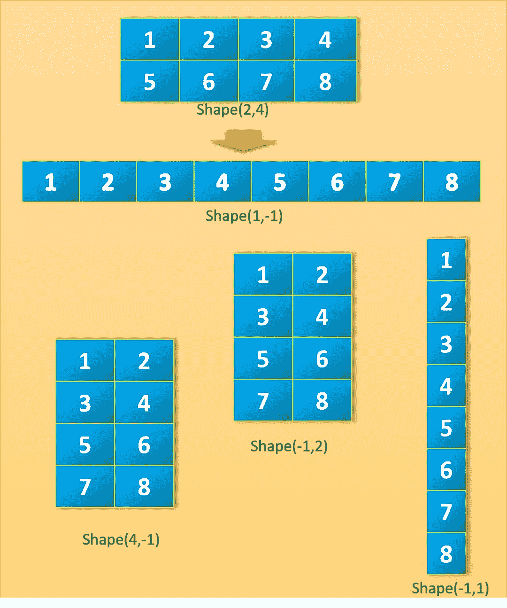
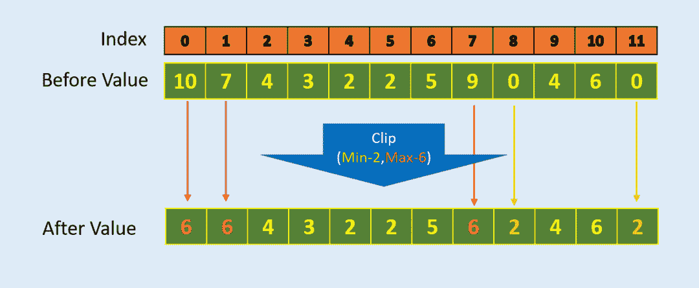
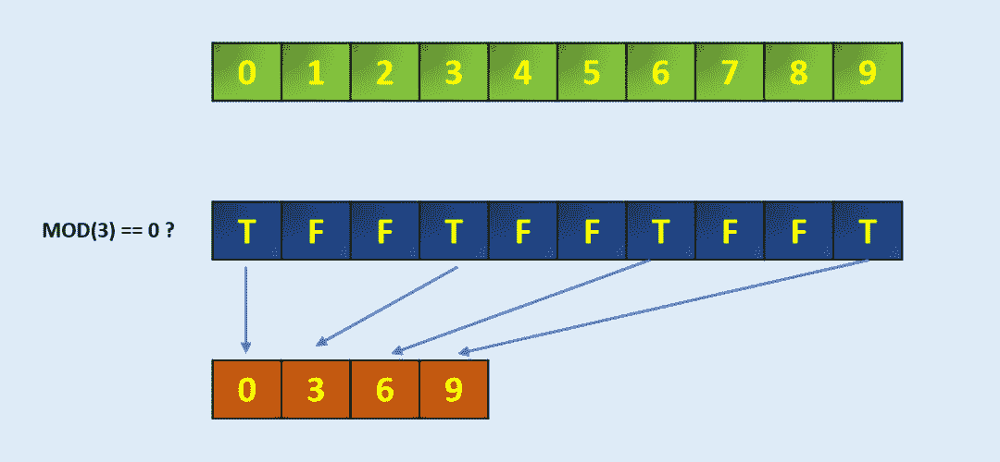
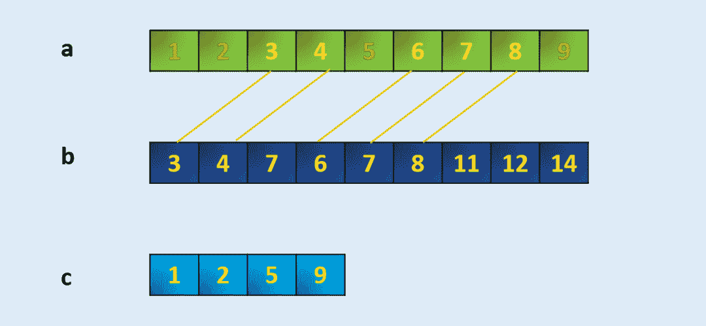

选自TowardsDataScience

**作者：Baijayanta Roy**

**机器之心编译**

> 在机器学习和数据科学工程的日常数据处理中，我们会遇到一些特殊的情况，需要用样板代码来解决这些问题。在此期间，根据社区的需求和使用，一些样板代码已经被转换成核心语言或包本身提供的基本功能。本文作者将分享 5 个优雅的 Python Numpy 函数，有助于高效、简洁的数据处理。

**在 reshape 函数中使用参数-1**Numpy 允许我们根据给定的新形状重塑矩阵，新形状应该和原形状兼容。有意思的是，我们可以将新形状中的一个参数赋值为-1。这仅仅表明它是一个未知的维度，我们希望 Numpy 来算出这个未知的维度应该是多少：Numpy 将通过查看数组的长度和剩余维度来确保它满足上述标准。让我们来看以下例子： 



*维度为-1 的不同 reshape 操作图示。*

```
a = np.array([[1, 2, 3, 4],
              [5, 6, 7, 8]])
a.shape
(2, 4)
```

假设我们给定行参数为 1，列参数为-1，那么 Numpy 将计算出 reshape 后的列数为 8。

```
a.reshape(1,-1)
array([[1, 2, 3, 4, 5, 6, 7, 8]])
```

假设我们给定行参数为-1，列参数为 1，那么 Numpy 将计算出 reshape 后的行数为 8。

```
a.reshape(-1,1)
array([[1],
       [2],
       [3],
       [4],
       [5],
       [6],
       [7],
       [8]])
```

下面的代码也是一样的道理。

```
a.reshape(-1,4)
array([[1, 2, 3, 4],
       [5, 6, 7, 8]])a.reshape(-1,2)
array([[1, 2],
       [3, 4],
       [5, 6],
       [7, 8]])a.reshape(2,-1)
array([[1, 2, 3, 4],
       [5, 6, 7, 8]])a.reshape(4,-1)
array([[1, 2],
       [3, 4],
       [5, 6],
       [7, 8]])
```

这也适用于任何更高维度张量的 reshape，但是只有一个维度的参数能赋值为-1。

```
a.reshape(2,2,-1)
array([[[1, 2],
        [3, 4]],

       [[5, 6],
        [7, 8]]])a.reshape(2,-1,1)
array([[[1],
        [2],
        [3],
        [4]],

       [[5],
        [6],
        [7],
        [8]]])
```

如果我们尝试 reshape 不兼容的形状或者是给定的未知维度参数多于 1 个，那么将会报错。

```
a.reshape(-1,-1)
ValueError: can only specify one unknown dimensiona.reshape(3,-1)
ValueError: cannot reshape array of size 8 into shape (3,newaxis)
```

总而言之，当试图对一个张量进行 reshape 操作时，新的形状必须包含与旧的形状相同数量的元素，这意味着两个形状的维度乘积必须相等。当使用 -1 参数时，与-1 相对应的维数将是原始数组的维数除以新形状中已给出维数的乘积，以便维持相同数量的元素。**Argpartition：** **在数组中找到最大的 N 个元素。**


Numpy 的 argpartion 函数可以高效地找到 N 个最大值的索引并返回 N 个值。在给出索引后，我们可以根据需要进行值排序。

```
array = np.array([10, 7, 4, 3, 2, 2, 5, 9, 0, 4, 6, 0])index = np.argpartition*(array, -5)[-5:]
index
array([ 6,  1, 10,  7,  0], dtype=int64)np.sort(array[index])
array([ 5,  6,  7,  9, 10])
```

**Clip：** **如何使数组中的值保持在一定区间内**在很多数据处理和算法中（比如强化学习中的 PPO），我们需要使得所有的值保持在一个上下限区间内。Numpy 内置的 Clip 函数可以解决这个问题。Numpy clip () 函数用于对数组中的值进行限制。给定一个区间范围，区间范围外的值将被截断到区间的边界上。例如，如果指定的区间是 [-1,1]，小于-1 的值将变为-1，而大于 1 的值将变为 1。Clip 示例：限制数组中的最小值为 2，最大值为 6。

```
#Example-1
array = np.array([10, 7, 4, 3, 2, 2, 5, 9, 0, 4, 6, 0])
print (np.clip(array,2,6))[6 6 4 3 2 2 5 6 2 4 6 2]#Example-2
array = np.array([10, -1, 4, -3, 2, 2, 5, 9, 0, 4, 6, 0])
print (np.clip(array,2,5))[5 2 4 2 2 2 5 5 2 4 5 2]
```

**Extract：** **从数组中提取符合条件的元素**我们可以使用 Numpy extract () 函数从数组中提取符合条件的特定元素。

```
arr = np.arange(10)
arrarray([0, 1, 2, 3, 4, 5, 6, 7, 8, 9])# Define the codition, here we take MOD 3 if zero
condition = np.mod(arr, 3)==0
conditionarray([ True, False, False,  True, False, False,  True, False, False,True])np.extract(condition, arr)
array([0, 3, 6, 9])
```

同样地，如果有需要，我们可以用 AND 和 OR 组合的直接条件，如下所示：

```
np.extract(((arr > 2) & (arr < 8)), arr)array([3, 4, 5, 6, 7])
```

**setdiff1d：** **如何找到仅在 A 数组中有而 B 数组没有的元素**返回数组中不在另一个数组中的独有元素。这等价于两个数组元素集合的差集。

```
a = np.array([1, 2, 3, 4, 5, 6, 7, 8, 9])
b = np.array([3,4,7,6,7,8,11,12,14])
c = np.setdiff1d(a,b)
carray([1, 2, 5, 9])
```

**小结**
以上 5 个 Numpy 函数并不经常被社区使用，但是它们非常简洁和优雅。在我看来，我们应该尽可能在出现类似情况时使用这些函数，不仅因为代码量更少，更因为它们是解决复杂问题的绝妙方法。*原文链接：* *https://towardsdatascience.com/5-smart-python-numpy-functions-dfd1072d2cb4*

