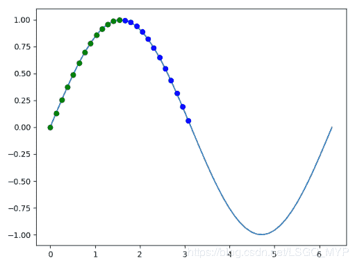

## 背景

什么是 NumPy 呢？

NumPy 这个词来源于两个单词 -- `Numerical`和`Python`。其是一个功能强大的 Python 库，可以帮助程序员轻松地进行数值计算，通常应用于以下场景：

*   执行各种数学任务，如：数值积分、微分、内插、外推等。因此，当涉及到数学任务时，它形成了一种基于 Python 的 MATLAB 的快速替代。

*   计算机中的图像表示为多维数字数组。NumPy 提供了一些优秀的库函数来快速处理图像。例如，镜像图像、按特定角度旋转图像等。

*   在编写机器学习算法时，需要对矩阵进行各种数值计算。如：矩阵乘法、求逆、换位、加法等。NumPy 数组用于存储训练数据和机器学习模型的参数。

* * *

## NumPy 基础语法

**1\. NumPy 中的数组**

NumPy 提供的最重要的数据结构是一个称为 NumPy数组 的强大对象。NumPy数组 是通常的 Python 列表的扩展。

1.1 创建一个数组

```
import numpy as np

# 1D Array
a = np.array([0, 1, 2, 3, 4])
b = np.array((0, 1, 2, 3, 4))
c = np.arange(5)
d = np.linspace(0, 2 * np.pi, 5)

print(a)  # [0 1 2 3 4]
print(b)  # [0 1 2 3 4]
print(c)  # [0 1 2 3 4]
print(d)  # [0.         1.57079633 3.14159265 4.71238898 6.28318531]
print(a[3])  # 3 
```

*   `array(object[, dtype, copy, order, subok, ndmin])`从现有的数据创建一个数组。
*   `arange([start,] stop[, step,][, dtype])` 返回给定间隔内的均匀间隔的值。

*   `linspace(start, stop[, num, endpoint, …])`返回指定间隔内的等间隔数字。

上面的代码显示了创建数组的 4 种不同方法。最基本的方法是将序列传递给 NumPy 的`array()`函数；你可以传递任何序列，而不仅仅是常见的列表（list）数据类型。对数组进行索引就像列表或任何其他 Python 序列一样。你也可以对它们进行切片。

上面的数组示例是如何使用 NumPy 表示向量的，接下来我们将看看如何使用多维数组表示矩阵和更多的信息。

```
import numpy as np

# MD Array,
a = np.array([[11, 12, 13, 14, 15],
              [16, 17, 18, 19, 20],
              [21, 22, 23, 24, 25],
              [26, 27, 28, 29, 30],
              [31, 32, 33, 34, 35]])

print(a[2, 4])  # 25 
```

NumPy 提供了创建 Zero矩阵 的方法。

*   `zeros(shape[, dtype, order])` 返回给定形状和类型的新数组，并用零填充。

```
import numpy as np

a = np.zeros(5)
b = np.zeros([2, 3])
print(a)  # [0. 0. 0. 0. 0.]
print(b)
'''
[[0. 0. 0.]
 [0. 0. 0.]]
''' 
```

NumPy 提供了创建 One矩阵 的方法。

*   `ones(shape[, dtype, order])` 返回给定形状和类型的新数组，并填充为1。

```
import numpy as np

a = np.ones(5)
b = np.ones([2, 3])
print(a)  # [1. 1. 1. 1. 1.]
print(b)
'''
[[1. 1. 1.]
 [1. 1. 1.]]
''' 
```

NumPy 提供了创建 Random矩阵 的方法。

```
import numpy as np

a = np.random.random(5)
b = np.random.random([2, 3])
print(a)  # [0.94855794 0.32057893 0.47848178 0.1779337  0.86017829]
print(b)
'''
[[0.76592562 0.71543738 0.58269856]
 [0.74960683 0.07028875 0.18083749]]
''' 
```

NumPy 提供了创建 Eye矩阵 的方法。

*   `eye(N[, M, k, dtype, order])`返回一个二维数组，对角线上有一个，其他地方为零。

```
import numpy as np

a = np.eye(4)
b = np.eye(2, 3)
print(a)
'''
[[ 1.  0.  0.  0.]
 [ 0.  1.  0.  0.]
 [ 0.  0.  1.  0.]
 [ 0.  0.  0.  1.]]
'''
print(b)
'''
[[ 1.  0.  0.]
 [ 0.  1.  0.]]
''' 
```

1.2 多维数组切片

切片多维数组比 1D数组 复杂一点，并且在使用 NumPy 时你也会经常需要使用到。

```
import numpy as np

# MD Array,
a = np.array([[11, 12, 13, 14, 15],
              [16, 17, 18, 19, 20],
              [21, 22, 23, 24, 25],
              [26, 27, 28, 29, 30],
              [31, 32, 33, 34, 35]])

# MD slicing
print(a[0, 1:4])  # [12 13 14]
print(a[1:4, 0])  # [16 21 26]
print(a[::2, ::2])
# [[11 13 15]
#  [21 23 25]
#  [31 33 35]]
print(a[:, 1])  # [12 17 22 27 32] 
```

通过对每个以逗号分隔的维度执行单独的切片，你可以对多维数组进行切片。因此，对于2D数组，我们的第一片定义了行的切片，第二片定义了列的切片。

1.3 数组属性

在使用 NumPy 时，你会想知道数组的某些信息。很幸运，在这个包里边包含了很多便捷的方法，可以给你想要的信息。

```
# Array properties
a = np.array([11, 12, 13, 14, 15])

print(type(a))  # <class 'numpy.ndarray'>
print(a.dtype)  # int32
print(a.size)  # 5
print(a.shape)  # (5, )
print(a.itemsize)  # 4
print(a.ndim)  # 1
print(a.nbytes)  # 20 
```

*   `(5, )` 数组的形状，`a`是一个包含5个元素的数组。

```
# Array properties
a = np.array([[11, 12, 13, 14, 15],
              [16, 17, 18, 19, 20],
              [21, 22, 23, 24, 25],
              [26, 27, 28, 29, 30],
              [31, 32, 33, 34, 35]])

print(type(a))  # <class 'numpy.ndarray'>
print(a.dtype)  # int32
print(a.size)  # 25
print(a.shape)  # (5, 5)
print(a.itemsize)  # 4
print(a.ndim)  # 2
print(a.nbytes)  # 100 
```

*   `type` 正如你在上面的代码中看到的，NumPy 数组实际上被称为 ndarray。
*   `shape` 数组的形状是它有多少行和列，上面的数组有5行和5列，所以它的形状是(5，5)。

*   `itemsize` 属性是每个项占用的字节数。这个数组的数据类型是`int32`，一个`int32`中有32位，一个字节中有8位，除以32除以8，你就可以得到它占用了多少字节，在本例中是4。

*   `ndim` 属性是数组的维数。这个有2个。例如，向量只有1。

*   `nbytes` 属性是数组中的所有数据消耗掉的字节数。

* * *

**2\. 使用数组**

2.1 基本运算符

```
import numpy as np

# Basic Operators
a = np.arange(25)
a = a.reshape((5, 5))
print(a)

'''
[[ 0  1  2  3  4]
 [ 5  6  7  8  9]
 [10 11 12 13 14]
 [15 16 17 18 19]
 [20 21 22 23 24]]
'''
b = np.array([10, 62, 1, 14, 2, 56, 79, 2, 1, 45,
              4, 92, 5, 55, 63, 43, 35, 6, 53, 24,
              56, 3, 56, 44, 78])
b = b.reshape((5, 5))
print(b)

'''
[[10 62  1 14  2]
 [56 79  2  1 45]
 [ 4 92  5 55 63]
 [43 35  6 53 24]
 [56  3 56 44 78]]
'''

print(a + b)
print(a - b)
print(a * b)
print(a / b)
print(a ** 2)
print(a < b)
print(a > b)
print(a.dot(b)) 
```

*   `reshape(a, newshape[, order])`在不更改数据的情况下为数组赋予新的形状。
*   `dot(a, b[, out])`函数计算两个矩阵的乘积，如果是一维数组则是它们的点积。

除了 `dot()` 之外，这些操作符都是对数组进行逐元素运算。

2.2 数组特殊运算符

```
import numpy as np

a = np.arange(9)
a = np.reshape(a, [1, 9])
print(a)  # [[0 1 2 3 4 5 6 7 8]]

print(np.sum(a))  # 36
print(np.min(a))  # 0
print(np.max(a))  # 8
print(np.cumsum(a))  # [ 0  1  3  6 10 15 21 28 36]

a = np.reshape(a, [3, 3])
print(a)
'''
[[0 1 2]
 [3 4 5]
 [6 7 8]]
'''
print(np.sum(a))  # 36
print(np.min(a))  # 0
print(np.max(a))  # 8
print(np.cumsum(a))  # [ 0  1  3  6 10 15 21 28 36]

print(np.sum(a, axis=0))  # [ 9 12 15]
print(np.sum(a, axis=1))  # [ 3 12 21]

print(np.min(a, axis=0))  # [0 1 2]
print(np.min(a, axis=1))  # [0 3 6]

print(np.max(a, axis=0))  # [6 7 8]
print(np.max(a, axis=1))  # [2 5 8]

print(np.cumsum(a, axis=0))
'''
[[ 0  1  2]
 [ 3  5  7]
 [ 9 12 15]]
'''
print(np.cumsum(a, axis=1))
'''
[[ 0  1  3]
 [ 3  7 12]
 [ 6 13 21]]
''' 
```

*   `sum(a[, axis, dtype, out, keepdims, …])` Sum of array elements over a given axis.
*   `cumsum(a[, axis, dtype, out])` Return the cumulative sum of the elements along a given axis.

`sum()`、`min()`和`max()`函数的作用非常明显。将所有元素相加，找出最小和最大元素。然而，`cumsum()`函数就不那么明显了。它将像`sum()`这样的每个元素相加，但是它将当前元素之前的和加到当前元素上。

* * *

**3\. 索引进阶**

3.1 花式索引

花式索引 是获取数组中我们想要的特定元素的有效方法，即使用我们想要检索的特定索引序列对数组进行索引，返回我们索引的元素的列表。

```
import numpy as np

# Fancy indexing
a = np.arange(0, 100, 10)
indices = [1, 5, -1]
b = a[indices]
print(a)  # [ 0 10 20 30 40 50 60 70 80 90]
print(b)  # [10 50 90]

b = a[np.array(indices)]
print(b)  # [10 50 90] 
```

3.2 布尔屏蔽

布尔屏蔽 允许我们根据我们指定的条件检索数组中的元素。

```
import numpy as np

import matplotlib.pyplot as plt

# Boolean masking
a = np.linspace(0, 2 * np.pi, 50)
b = np.sin(a)
print(len(a)) # 50

plt.plot(a, b)
mask = b >= 0
print(len(a[mask])) # 25
print(mask)
'''
[ True  True  True  True  True  True  True  True  True  True  True  True
  True  True  True  True  True  True  True  True  True  True  True  True
  True False False False False False False False False False False False
 False False False False False False False False False False False False
 False False]
'''
plt.plot(a[mask], b[mask], 'bo')

mask = np.logical_and(b >= 0, a <= np.pi / 2)
print(mask)
'''
[ True  True  True  True  True  True  True  True  True  True  True  True
  True False False False False False False False False False False False
 False False False False False False False False False False False False
 False False False False False False False False False False False False
 False False]
'''

plt.plot(a[mask], b[mask], 'go')
plt.show() 
```



我们利用这些条件来选择图上的不同点。蓝色点（在图中还包括绿点，但绿点掩盖了蓝色点），显示值 大于0 的所有点。绿色点表示值 大于0 且 小于0.5π 的所有点。

*   `numpy.pi` pi = 3.1415926535897932384626433…

*   `numpy.e` e = 2.71828182845904523536028747135266249775724709369995…

*   `sin(x, /[, out, where, casting, order, …])` Trigonometric sine, element-wise.

*   `logical_and(x1, x2, /[, out, where, …])`按元素计算x1和x2的真值。

*   `logical_or(x1, x2, /[, out, where, casting, …])`按元素计算x1或x2的真值。

*   `logical_not(x, /[, out, where, casting, …])`计算非x元素的真值。

*   `logical_xor(x1, x2, /[, out, where, …])`按元素计算x1 XOR x2的真值。

3.3 缺省索引

不完全索引是从多维数组的第一个维度获取索引或切片的一种方便方法。

```
import numpy as np

a = np.array([[11, 12, 13, 14, 15],
              [16, 17, 18, 19, 20],
              [21, 22, 23, 24, 25],
              [26, 27, 28, 29, 30],
              [31, 32, 33, 34, 35]])
print(a[3])
# [26 27 28 29 30]

print(a[3:])
'''
[[26 27 28 29 30]
 [31 32 33 34 35]]
'''
print(a[:3])
'''
[[11 12 13 14 15]
 [16 17 18 19 20]
 [21 22 23 24 25]]
'''

print(a[a >= 25])
# [25 26 27 28 29 30 31 32 33 34 35] 
```

3.4 Where 函数

`where()` 函数是另外一个根据条件返回数组中的值的有效方法。只需要把条件传递给它，它就会返回一个使得条件为真的元素的列表。

```
import numpy as np

# Where
a = np.arange(0, 100, 10)
print(a)
# [ 0 10 20 30 40 50 60 70 80 90]

b = np.where(a < 50)
c = np.where(a >= 50)[0]
print(b)  # (array([0, 1, 2, 3, 4], dtype=int64),)
print(c)  # [5 6 7 8 9]
print(np.array(b) * 2)  # [[0 2 4 6 8]]

a = np.array([[11, 12, 13, 14, 15],
              [16, 17, 18, 19, 20],
              [21, 22, 23, 24, 25],
              [26, 27, 28, 29, 30],
              [31, 32, 33, 34, 35]])
b = np.where(a > 28)
c = np.where(a > 28)[1]
print(b)
# (array([3, 3, 4, 4, 4, 4, 4], dtype=int64), array([3, 4, 0, 1, 2, 3, 4], dtype=int64))

print(np.array(b))
'''
[[3 3 4 4 4 4 4]
 [3 4 0 1 2 3 4]]
'''
print(c)
# [3 4 0 1 2 3 4] 
```

* * *

**4\. 其它**

```
import numpy as np

randMat = np.mat(np.random.rand(4, 4))

print(randMat)
'''
[[ 0.27583095  0.85371896  0.04477732  0.0351685 ]
 [ 0.99631911  0.87780066  0.40519399  0.91468947]
 [ 0.29717361  0.86168002  0.28151676  0.08364942]
 [ 0.29388903  0.74111371  0.45270016  0.4220726 ]]
'''

invRandMat = randMat.I
print(invRandMat)
'''
求逆矩阵

[[-2.95048939  1.59328107  4.89236828 -4.17662009]
 [ 2.24072267 -0.50472824 -1.59788475  1.22379156]
 [-4.67532022 -0.10375646  5.07432839 -0.39124946]
 [ 3.13454227 -0.11186758 -6.04338775  3.54823514]]
'''

myEye = randMat * invRandMat
print(myEye)

'''
矩阵乘法

[[  1.00000000e+00   5.55111512e-17  -2.22044605e-16  -2.22044605e-16]
 [  0.00000000e+00   1.00000000e+00   0.00000000e+00   0.00000000e+00]
 [  0.00000000e+00   1.11022302e-16   1.00000000e+00  -2.22044605e-16]
 [  0.00000000e+00   0.00000000e+00  -8.88178420e-16   1.00000000e+00]]
'''

print(myEye - np.eye(4))

'''
[[  0.00000000e+00   5.55111512e-17  -2.22044605e-16  -2.22044605e-16]
 [  0.00000000e+00   0.00000000e+00   0.00000000e+00   0.00000000e+00]
 [  0.00000000e+00   1.11022302e-16   2.22044605e-16  -2.22044605e-16]
 [  0.00000000e+00   0.00000000e+00  -8.88178420e-16   0.00000000e+00]]
''' 
```

* * *

## 总结

如你所见，NumPy 在其提供的库函数方面非常强大。本文仅供学员们入门使用，我们在写机器学习的算法时，慢慢补充完善。今天就到这里吧！See You！

* * *

**参考文献**

*   https://www.pluralsight.com/guides/different-ways-create-numpy-arrays

*   https://www.numpy.org.cn/reference/constants.html

*   https://www.numpy.org.cn/article/basics/an_introduction_to_scientific_python_numpy.html

* * *