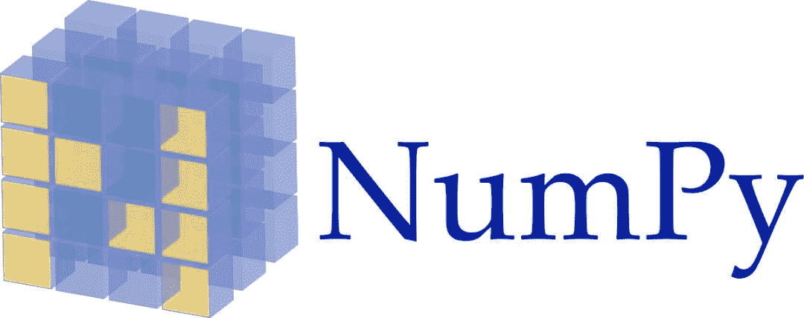
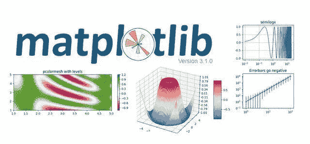
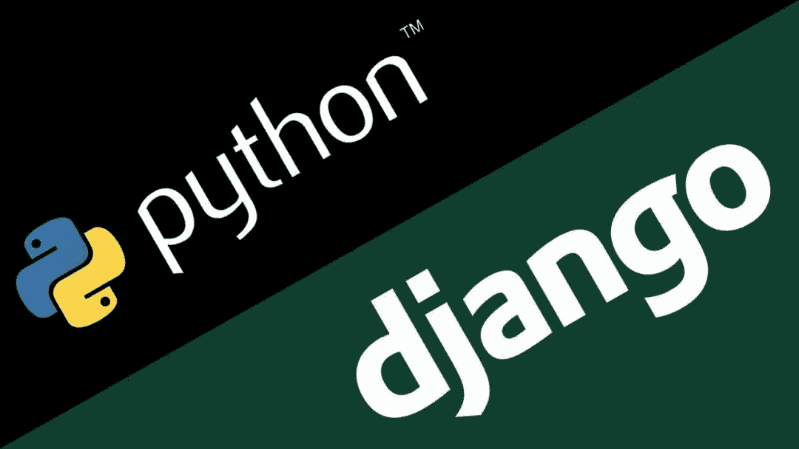
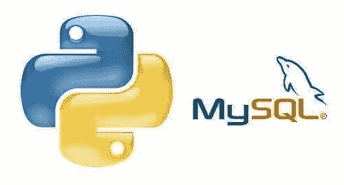
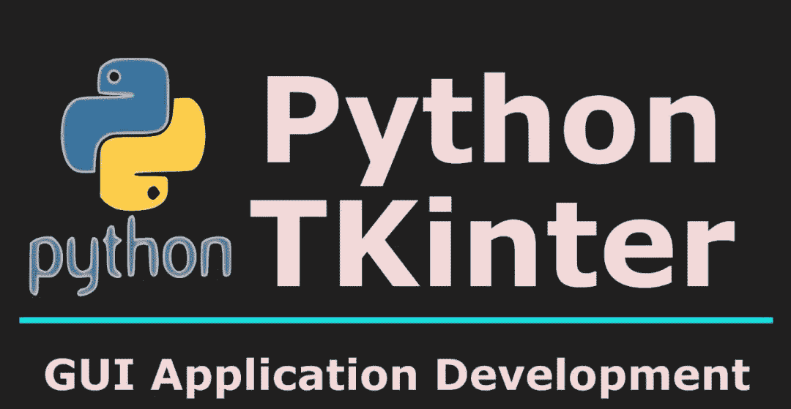
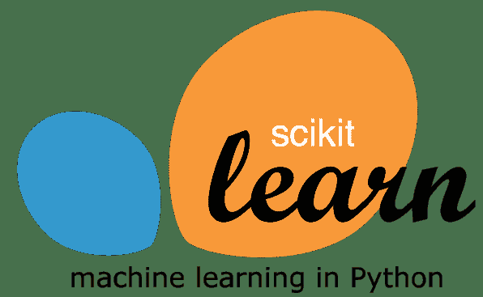
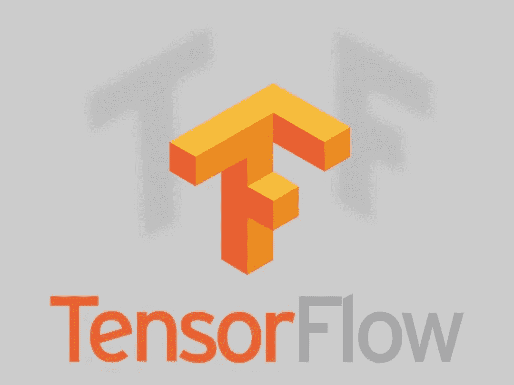

**导读：**Python作为一个设计优秀的程序语言，现在已广泛应用于各种领域，依靠其强大的第三方类库，Python在各个领域都能发挥巨大的作用。

作者：李明江 张良均 周东平 张尚佳

来源：大数据DT（ID：bigdatadt）

**01 数值计算**

数值计算是数据挖掘、机器学习的基础。Python提供多种强大的扩展库用于数值计算，常用的数值计算库如下所示。

**1\. NumPy**

支持多维数组与矩阵运算，也针对数组运算提供大量的数学函数库。通常与SciPy和Matplotlib一起使用，支持比Python更多种类的数值类型，其中定义的最重要的对象是称为ndarray的n维数组类型，用于描述相同类型的元素集合，可以使用基于0的索引访问集合中元素。

**2\. SciPy**

在NumPy库的基础上增加了众多的数学、科学及工程计算中常用的库函数,如线性代数、常微分方程数值求解、信号处理、图像处理、稀疏矩阵等，可进行插值处理、信号滤波，以及使用C语言加速计算。

**3\. Pandas**

基于NumPy的一种工具，为解决数据分析任务而生。纳入大量库和一些标准的数据模型，提供高效地操作大型数据集所需的工具及大量的能快速便捷处理数据的函数和方法，为时间序列分析提供很好的支持，提供多种数据结构，如Series、Time-Series、DataFrame和Panel。

**02 数据可视化**

数据可视化是展示数据、理解数据的有效手段，常用的Python数据可视化库如下所示。

**4\. Matplotlib**

第一个Python可视化库，有许多别的程序库都是建立在其基础上或者直接调用该库，可以很方便地得到数据的大致信息，功能非常强大，但也非常复杂。

**5\. Seaborn**

利用了Matplotlib，用简洁的代码来制作好看的图表。与Matplotlib最大的区别为默认绘图风格和色彩搭配都具有现代美感。

**6\. ggplot**

基于R的一个作图库ggplot2，同时利用了源于《图像语法》（The Grammar of Graphics）中的概念，允许叠加不同的图层来完成一幅图，并不适用于制作非常个性化的图像，为操作的简洁度而牺牲了图像的复杂度。

**7\. Bokeh**

跟ggplot一样，Bokeh也基于《图形语法》的概念。与ggplot不同之处为它完全基于Python而不是从R处引用。长处在于能用于制作可交互、可直接用于网络的图表。图表可以输出为JSON对象、HTML文档或者可交互的网络应用。

Bokeh也支持数据流和实时数据，为不同的用户提供了3种控制水平：

*   最高的控制水平用于快速制图，主要用于制作常用图像；

*   中等控制水平与Matplotlib一样允许开发人员控制图像的基本元素（例如分布图中的点）；

*   最低的控制水平主要面向开发人员和软件工程师。没有默认值，需要定义图表的每一个元素。

**8\. Plotly**

可以通过Python notebook使用，与Bokeh一样致力于交互图表的制作，但提供在别的库中几乎没有的几种图表类型，如等值线图、树形图和三维图表。

**9\. pygal**

与Bokeh和Plotly一样，提供可直接嵌入网络浏览器的可交互图像。与其他两者的主要区别在于可将图表输出为SVG格式，所有的图表都被封装成方法，且默认的风格也很漂亮，用几行代码就可以很容易地制作出漂亮的图表。

**10\. geoplotlib**

用于制作地图和地理相关数据的工具箱。可用来制作多种地图，比如等值区域图、热度图、点密度图。必须安装Pyglet（一个面向对象编程接口）方可使用。

**11\. missingno**

用图像的方式快速评估数据缺失的情况，可根据数据的完整度对数据进行排序或过滤，或者根据热度图或树状图对数据进行修正。

**03 Web开发**

Web应用开发可以说是目前软件开发中最重要的部分。Python提供各种Web开发框架，帮助使用者快速实现功能开发。常用的Python网络开发类库如下所示。

**12\. Django**

一个高级的Python Web框架，支持快速开发，提供从模板引擎到ORM所需的一切东西，使用该库构建App时，必须遵循Django的方式。

**13. Socket**

一个套接字通讯底层库，用于在服务器和客户端间建立TCP或UDP连接，通过连接发送请求与响应。

**14\. Flask**

一个基于Werkzeug、Jinja 2的Python轻量级框架（microframework），默认配备Jinja模板引擎，也包含其他模板引擎或ORM供选择，适合用来编写API服务（RESTful rervices）。

**15\. Twisted**

一个使用Python实现的基于事件驱动的网络引擎框架，建立在deferred object之上，一个通过异步架构实现的高性能的引擎，不适用于编写常规的Web Apps，更适用于底层网络。

**16\. Tornado**

一个由FriendFeed开发的Python Web框架和异步网络库，采用非阻塞网络I/O模型，可以处理数以千计的网络连接。对于long polling、WebSockets和其他需要长时间实时连接的Apps，Tornado是一个理想的Web框架，它介于Django和Flask之间，能很好地处理C10K问题。

**04 数据库管理**

数据库是企业用于存放数据的主要工具，数据库管理包括了数据定义、数据操作、数据库运行管理、数据组织、数据库库保护、数据库维护等。Python提供了所有主流关系数据库管理接口，常用的Python MySQL连接库及其简介如下所示。

**17\. MySQL-python**

又称MySQLdb，是Python连接MySQL最流行的一个驱动，很多框架也基于此库进行开发。只支持Python 2.x，且安装时有许多前置条件。由于该库基于C语言开发，在Windows平台上的安装非常不友好，经常出现失败的情况，现在基本不推荐使用，取代品为衍生版本。

**18\. mysqlclient**

完全兼容MySQLdb，同时支持Python 3.x，是Django ORM的依赖工具，可使用原生SQL来操作数据库，安装方式与MySQLdb一致。

**19\. PyMySQL**

纯Python实现的驱动，速度比MySQLdb慢，最大的特点为安装方式简洁，同时也兼容MySQL-python。

**20\. SQLAlchemy**

一种既支持原生SQL，又支持ORM的工具。ORM是Python对象与数据库关系表的一种映射关系，可有效提高写代码的速度，同时兼容多种数据库系统，如SQLite、MySQL、PostgreSQL，代价为性能上的一些损失。

**05 自动化运维**

运维的主要内容包括保障业务长期稳定运行、保障数据安全可靠、自动化完成部署任务。Python能够满足绝大部分自动化运维的需求，目前在Linux运维中已用Python实现的应用如下所示。

**21\. jumpsever跳板机**

一种由Python编写的开源跳板机（堡垒机）系统，实现了跳板机的基本功能，包含认证、授权和审计，集成了Ansible、批量命令等。

支持WebTerminal Bootstrap编写，界面美观，自动收集硬件信息，支持录像回放、命令搜索、实时监控、批量上传下载等功能，基于SSH协议进行管理，客户端无须安装agent。主要用于解决可视化安全管理，因完全开源，容易再次开发。

**22\. Magedu分布式监控系统**

一种用Python开发的自动化监控系统，可监控常用系统服务、应用、网络设备，可在一台主机上监控多个不同服务，不同服务的监控间隔可以不同，同一个服务在不同主机上的监控间隔、报警阈值可以不同，并提供数据可视化界面。

**23\. Magedu的CMDB**

一种用Python开发的硬件管理系统，包含采集硬件数据、API、页面管理3部分功能，主要用于自动化管理笔记本、路由器等常见设备的日常使用。由服务器的客户端采集硬件数据，将硬件信息发送至API，API负责将获取的数据保存至数据库中，后台管理程序负责对服务器信息进行配置和展示。

**24\. 任务调度系统**

一种由Python开发的任务调度系统，主要用于自动化地将一个服务进程分布到其他多个机器的多个进程中，一个服务进程可作为调度者依靠网络通信完成这一工作。

**25\. Python运维流程系统**

一种使用Python语言编写的调度和监控工作流的平台，内部用于创建、监控和调整数据管道。允许工作流开发人员轻松创建、维护和周期性地调度运行工作流，包括了如数据存储、增长分析、Email发送、A/B测试等诸多跨多部门的用例。

**06 GUI编程**

GUI（Graphical User Interface，图形用户界面）是指采用图形方式显示的计算机操作用户界面。Python提供多个图形开发界面的库用于GUI编程，常用Python GUI库如下所示。

**26\. Tkinter**

一个Python的标准GUI库，可以快速地创建GUI应用程序，可以在大多数的UNIX平台下使用，同样可以应用在Windows和Macintosh系统中，Tkinter 8.0的后续版本可以实现本地窗口风格，并良好地运行在绝大多数平台中。

**27\. wxPython**

一款开源软件跨平台GUI库wxWidgets的Python封装和Python模块，是Python语言的一套优秀的GUI图形库，允许程序员很方便地创建完整的、功能健全的GUI用户界面。

**28\. PyQt**

一个创建GUI应用程序的工具库，是Python编程语言和Qt的成功融合，可以运行在所有主要操作系统上，包括UNIX、Windows和Mac。PyQt采用双许可证，开发人员可以选择GPL和商业许可，从PyQt的版本4开始，GPL许可证可用于所有支持的平台。

**29\. PySide**

一个跨平台的应用程式框架Qt的Python绑定版本，提供与PyQt类似的功能，并相容API，但与PyQt不同处为其使用LGPL授权。

**07 机器学习**

Python作为一门理想的集成语言，将各种技术绑定在一起，除了为用户提供更方便的功能之外，还是一个理想的粘合平台，在开发人员与外部库的低层次集成人员之间搭建连接，以便用C/C++实现更高效的算法。

对于研究人员者而言，使用Python编程可以快速迁移代码并进行改动，而无须花费过多的精力在修改代码与代码规范上。开发者在Python中封装了很多优秀的依赖库，其中NumPy和SciPy库提供了目前解决机器学习问题所需的标准配置。

Python目前集成了大量的机器学习框架，其中常用机器学习库如下所示。

**30\. Scikit-Learn**

Scikit-Learn基于NumPy和SciPy，是专门为机器学习建造的一个Python模块，提供了大量用于数据挖掘和分析的工具，包括数据预处理、交叉验证、算法与可视化算法等一系列接口。

Sklearn的基本功能可分为6个部分：

*   分类

*   回归

*   聚类

*   数据降维

*   模型选择

*   数据预处理

其中集成了大量分类、回归和聚类的算法，包括支持向量机、逻辑回归、朴素贝叶斯、随机森林、Gradient Boosting、K-means和DBSCAN等。

**31\. Orange3**

Orange3是一个基于组件的数据挖掘和机器学习软件套装，支持Python进行脚本开发。它包含一系列的数据可视化、检索、预处理和建模技术，具有一个良好的用户界面，同时也可以作为Python的一个模块使用。

用户可通过数据可视化进行数据分析，包括统计分布图、柱状图、散点图，以及更深层次的决策树、分层聚簇、热点图、MDS（多维度分析）、线性预测等，并可使用Orange自带的各类附加功能组件进行NLP、文本挖掘、构建网络分析、推断高频数据集和关联规则数据分析。

**32\. XGBoost**

XGBoost是专注于梯度提升算法的机器学习函数库，因其优良的学习效果及高效的训练速度而获得广泛的关注。XGBoost支持并行处理，比起同样实现了梯度提升算法的Scikit-Learn库，其性能提升10倍以上。XGBoost可以处理回归、分类和排序等多种任务。

**33\. NuPIC**

NuPIC是专注于时间序列的一个机器学习平台，其核心算法为HTM算法，相比于深度学习，其更为接近人类大脑的运行结构。HTM算法的理论依据主要是人脑中处理高级认知功能的新皮质部分的运作原理。NuPIC可用于预测及异常检测，适用面非常广，仅要求输入时间序列即可。

**34\. Milk**

Milk（Machine Learning Toolkit）是Python中的一个机器学习工具包。

Milk注重提升运行速度与降低内存占用，因此大部分对性能敏感的代码都是使用C++编写的，为了便利性在此基础上提供Python接口。重点提供监督分类方法，如SVMs、KNN、随机森林和决策树，也支持无监督学习算法，如K-means和密切关系传播。

**08 深度学习**

深度学习作为机器学习的分支，绽放了耀眼的光芒。由于Python的易用性与可扩展性，众多深度学习框架提供了Python接口，其中较为流行的深度学习库如下所示。

**35\. Caffe**

Caffe（Convolutional Architecture for Fast Feature Embedding）是一个以表达式、速度和模块化为核心的深度学习框架，具备清晰、可读性高和快速的特性，在视频、图像处理方面应用较多。

Caffe中的网络结构与优化都以配置文件形式定义，容易上手，无须通过代码构建网络；网络训练速度快，能够训练大型数据集与State-of-the-art的模型；模块化的组件可以方便地拓展到新的模型与学习任务上。

**36\. Theano**

Theano诞生于2008年，是一个高性能的符号计算及深度学习库，被认为是深度学习库的始祖之一，也被认为是深度学习研究和应用的重要标准之一。其核心是一个数学表达式的编译器，专门为处理大规模神经网络训练的计算而设计。

Theano很好地整合了NumPy，可以直接使用NumPy的ndarray，使得API接口学习成本大为降低；其计算稳定性好，可以精准地计算输出值很小的函数，如log(1+x)；可动态地生成C或者CUDA代码，用来编译成高效的机器代码。

**37\. TensorFlow**

TensorFlow是相对高阶的机器学习库，其核心代码使用C++编写，并支持自动求导，使得用户可以方便地设计神经网络结构，不需要亲自编写C++或CUDA代码，也无须通过反向传播求解梯度。由于底层使用C++语言编写，运行效率得到了保证，并简化了线上部署的复杂度。

除了核心代码的C++接口以外，TensorFlow还有官方的Python、Go和Java接口以外，用户可以在一个硬件配置较好的机器中用Python进行实验，并在资源比较紧张的嵌入式环境或需要低延迟的环境中用C++部署模型。

TensorFlow不只局限于神经网络，其数据流式图还支持非常自由的算法表达，也可以轻松实现深度学习以外的机器学习算法。

**38\. Keras**

Keras是一个高度模块化的神经网络库，使用Python实现，并可以同时运行在TensorFlow和Theano上。

Keras专精于深度学习，其提供了到目前为止最方便的API，用户仅需将高级的模块拼在一起便可设计神经网络，大大降低了编程开销（code overhead）与理解开销（cognitive overhead）。

Keras同时支持卷积网络和循环网络，支持级联的模型或任意的图结构的模型，从CPU上计算切换到GPU加速无须任何代码的改动。简化了编程的复杂度的同时，在性能上丝毫不逊色于TensorFlow和Theano。

**Dtawhale高校群和在职群****已成立**

扫描下方二维码，添加**负责人微信**，可申请加入AI学习交流群（一定要备注：**入群+学校/公司+方向****，**例如：**入群+浙大+机器学习**）

▲长按加群

