点击上方“**Datawhal****e**”，选择“星标”公众号

第一时间获取价值内容

> 前言：本笔记是对近日阅读keynote“Troubleshooting Deep Neural Networks”的总结。
> 
> keynote来源：
> 
> http://josh-tobin.com/troubleshooting-deep-neural-networks

## **为什么需要讨论DL Troubleshooting？**

80%-90%时间用于debug和tune，10%-20%时间用于推导数学或者实现。

## **模型为什么会表现糟糕？**

*   实现时的bug，很多深度学习bug不可见，比如模型label顺序错误

*   超参数选择，因为模型对超参数比较敏感

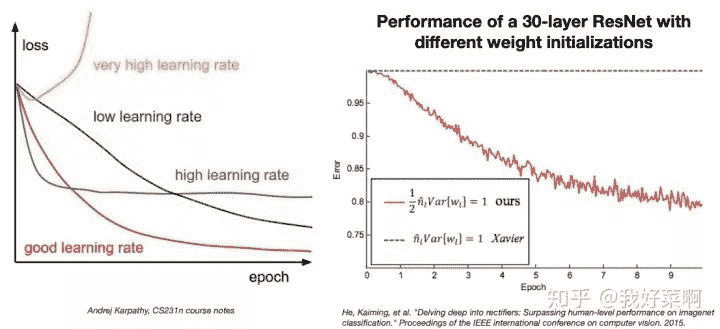

*   数据/模型拟合

*   数据集创建，常见问题如下：

    *   没有足够数据

    *   类别不平衡

    *   噪声标签

    *   训练和测试的分布不同

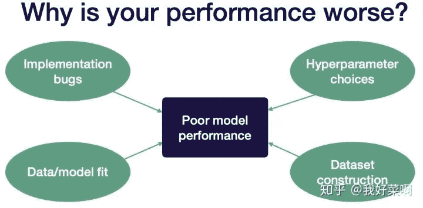

## **DL Troubleshooting策略**

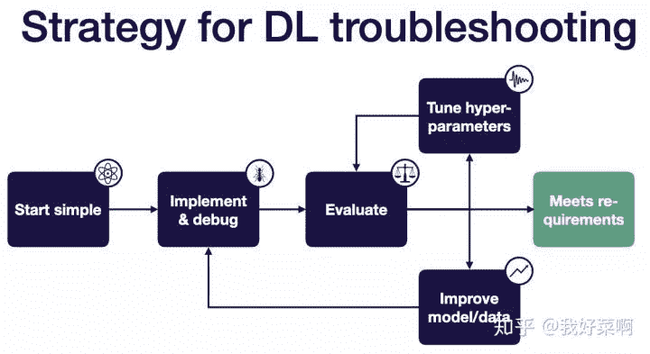

## **Start simple：尽可能使用最简单的模型和数据，比如在数据的一个子集上使用LeNet**

*   选择简单结构

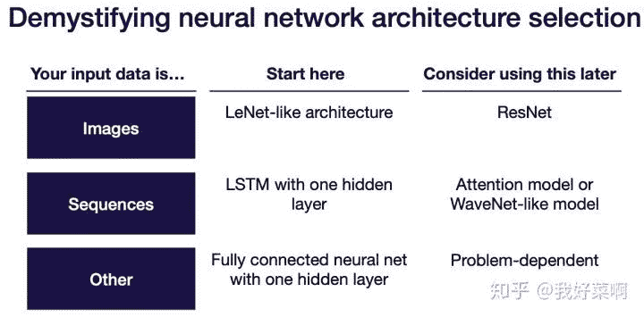

*   使用sensible配置

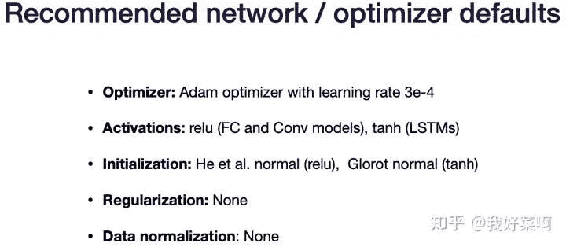

*   对输入归一化

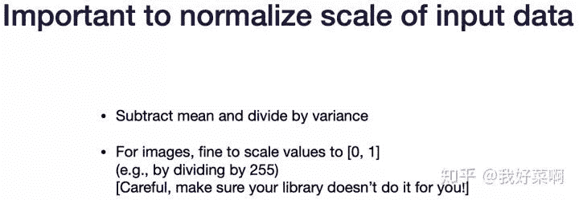

*   简化问题

    *   使用更小的训练数据

    *   使用更小的图像尺寸

    *   创建一个更简单的合成训练集

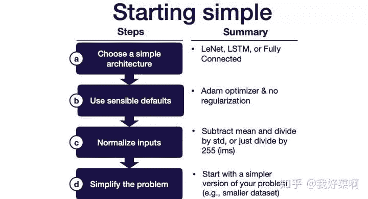

## **Implement & debug：使得模型在一个batch上过拟合或者复现已知结果**

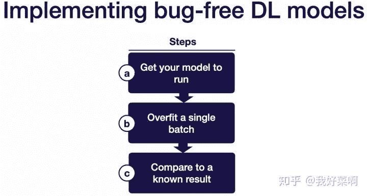

**最常见的5种深度学习bug：**

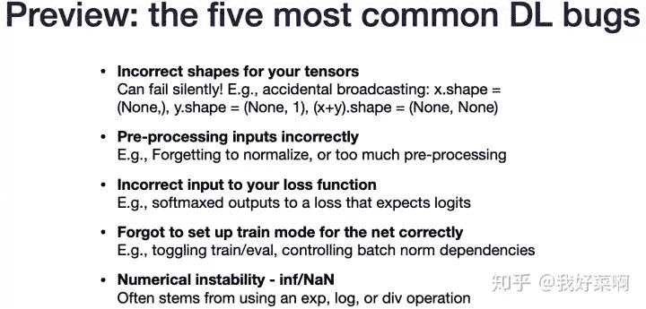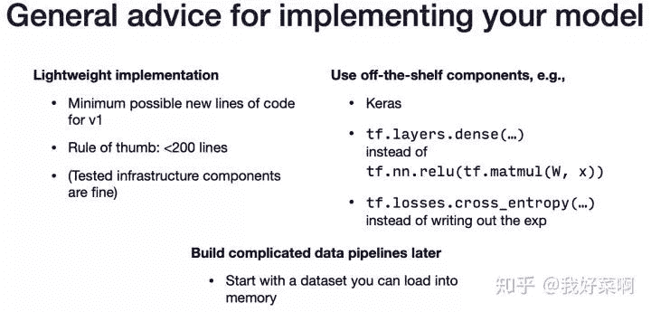

**Get your model to run**

常见问题及解决方法：

*   shape mismatch、casting issue等，可以在模型创建阶段使用调试器逐步调试，具体地，shape mismatch可能存在未定义形状、错误形状等问题，比如在错误维度求和、取平均等、忘记在卷积层后flatten张量等；casting issue中常见问题：没有将图像从uint8转换到float32等。

*   Out of Memory，逐一去除内存密集型操作，具体地，常见问题如下：tensor过大（batch size过大或者太大的全连接层）、数据过多（将太大的数据集加载到内存中或为数据集创建分配了太大的缓冲区）、拷贝错误（由于在同一会话中创建多个模型而导致的内存泄漏、重复创建操作（例如，在一次又一次调用的函数中））

**Overfit a single batch**

常见问题:

*   error上升：损失函数的符号错误、学习率太高、softmax使用在错误维度

*   error爆炸：数值问题、学习率太低

*   error震荡：数据或者标签有误、学习率太低

*   error不动：学习率太低、梯度没有在整个模型传播、过分正则化、损失函数的输入错误、数据或者标签有误

**Compare to a known result**

*   在相似数据集上评估官方提供的模型实现

*   在benchmark上评估官方提供的模型实现

*   非官方模型实现

*   参考文章结果（没有代码）

*   自己代码实现在benchmark上的结果

*   相似模型在相似数据集上的结果

*   非常简单的baseline，如线性回归

## **Evaluate：使用bias-variance decomposition决定下一步措施**

Test error = irreducible error + bias + variance (+ distribution shift) + val overfitting (train, val, and test all come from the same distribution)

## **Improve model/data：如果欠拟合，使得模型更大；如果过拟合，增加数据或者添加正则化**

**解决欠拟合**（使用顺序由上到低下）：

*   使得模型变大，比如增加层数或者在每层中使用更多单元

*   减少正则化

*   错误分析

*   选择一个不同结构

*   调整超参数

*   增加特征

**解决过拟合**（使用顺序由上到低下）：

*   增加更多数据

*   增加归一化

*   数据增强

*   增加正则化（如dropout、L2、weight decay）

*   错误分析

*   使用一个不同结构

*   调整超参数

*   及时停止

*   去除特征

*   减少模型大小

**解决分布转换**（distribution shift）：

*   分析测试-验证集错误 & 收集更多训练数据

*   分析测验-验证集错误 & 合成更多训练数据

*   使用领域适应改变训练和测试分布（领域适应，使用未标注数据或者有限的标注数据，将source上的训练结果泛化到target上）

**平衡数据集**

如果验证集上的结果好于测试结果，在验证集上过拟合。上述情况通常发生在小验证集上或者大规模超参数调整

## **Tune hype-parameters：由粗到细地随机搜索**

**超参数优化面临如下问题：**

网络：多少层？如何参数初始化？卷积核大小？

优化器：batch size？学习率？beta1，beta 2？

正则化：？

**方法1：人工选择超参数**

*   需要理解算法，训练/评估网络，猜测一个更好的超参数值/重新评估，可以和其他方法相结合。

*   优点：对于经验丰富的专家，消耗非常小的计算量得到好结果

*   缺点：需要对算法有很深的见解、非常耗时

**方法2：网格搜索**

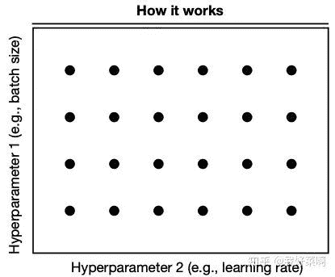

*   优点：实现非常简单、能够产生好结果

*   缺点：不高效、需要先验知识

**方法3：随机搜索**

**方法4：由粗到细搜索**

*   先在大区域中找到使得结果比较好的子区域，重复上述过程

*   优点：可以缩小非常高性能的超参数、实际使用最多的方法

*   缺点：somewhat manual process

**方法5：贝叶斯方法**

*   从预先估计参数分布开始，包含超参数值与模型性能之间关系的概率模型，交替如下过程：使用最大化期望结果对应的超参数值进行训练，根据训练结果更新概率模型

*   优点：最高效的hand-off方法以选择超参数

*   缺点：从头开始难以实施、很难与现成的工具集成

**结论**

*   由于错误种类多，深度学习debugging困难

*   为了训练一个没有bug的深度学习模型，需要将构造模型看作一个迭代过程

*原文链接：**https://zhuanlan.zhihu.com/p/89566632*

**Dtawhale高校群和在职群****已成立**

扫描下方二维码，添加**负责人微信**，可申请加入AI学习交流群（一定要备注：**入群+学校/公司+方向****，**例如：**入群+浙大+机器学习**）

▲长按加群

