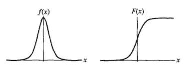
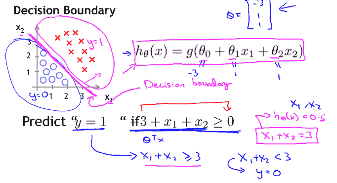
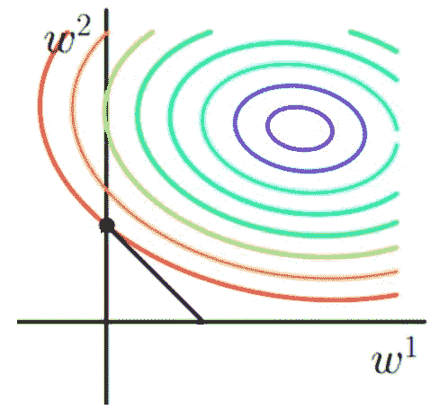
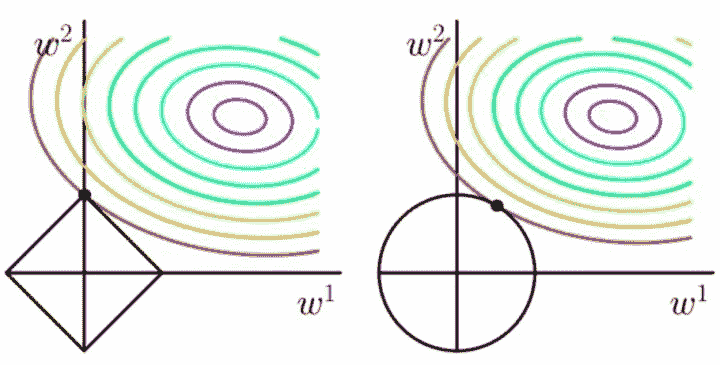
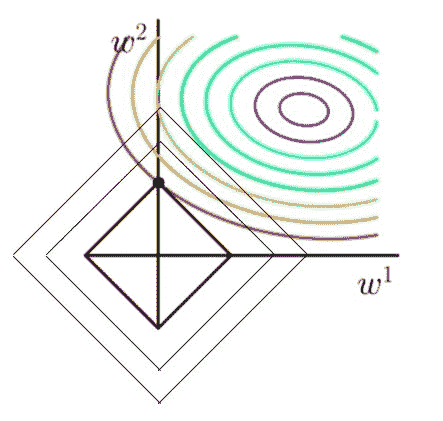
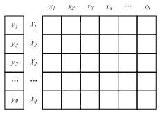
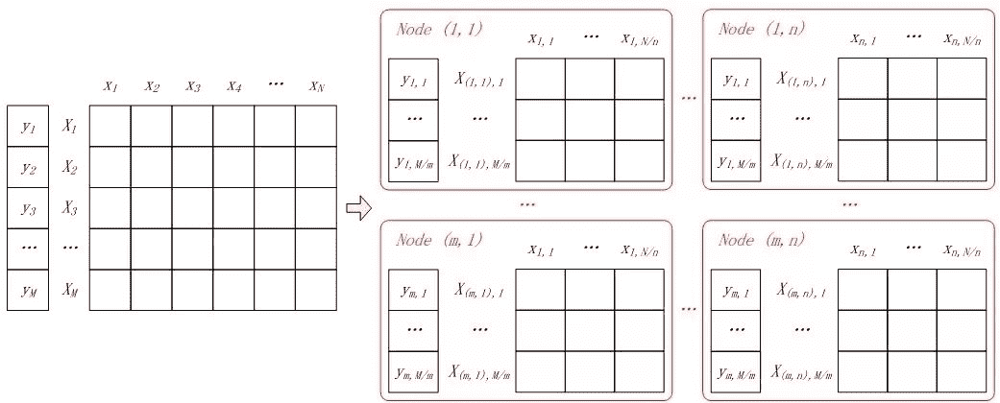
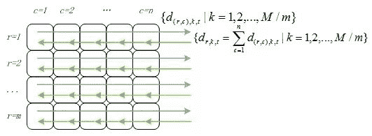
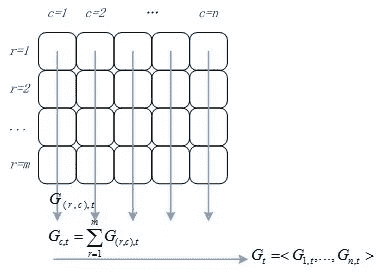
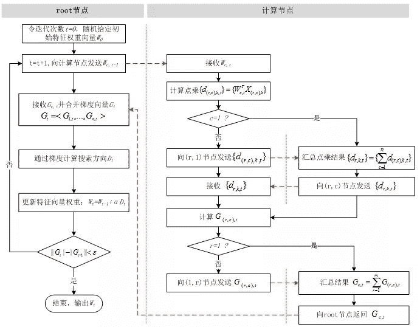

点击上方“**Datawhal****e**”，选择“星标”公众号

第一时间获取价值内容

**模型介绍**

Logistic Regression 是一个非常经典的算法，其中也包含了非常多的细节，曾看到一句话： 如果面试官问你熟悉哪个机器学习模型，可以说 SVM，但千万别说 LR，因为细节真的太多了。Logistic Regression 虽然被称为回归，但其实际上是分类模型，并常用于二分类。 Logistic Regression 因其简单、可并行化、可解释强深受工业界喜爱。Logistic 回归的本质是： 假设数据服从这个分布，然后使用极大似然估计做参数的估计。**1.1 Logistic 分布**Logistic 分布是一种连续型的概率分布，其**分布函数**和**密度函数**分别为：其中， 表示**位置参数**， 为**形状参数**。 我们可以看下其图像特征：Logistic 分布是由其位置和尺度参数定义的连续分布。 Logistic 分布的形状与正态分布的形状相似，但是 Logistic 分布的尾部更长，所以我们可以使用 Logistic 分布来建模比正态分布具有更长尾部和更高波峰的数据分布。 在深度学习中常用到的  函数就是 Logistic 的分布函数在  的特殊形式。**1.2 Logistic 回归**之前说到 Logistic 回归主要用于分类问题，我们以二分类为例，对于所给数据集假设存在这样的一条直线可以将数据完成线性可分。决策边界可以表示为  ，假设某个样本点  那么可以判断它的类别为 1，这个过程其实是感知机。Logistic 回归还需要加一层，它要找到分类概率  与输入向量  的直接关系，然后通过比较概率值来判断类别。考虑二分类问题，给定数据集考虑到  取值是连续的，因此它不能拟合离散变量。 可以考虑用它来拟合条件概率 ，因为概率的取值也是连续的。但是对于 （若等于零向量则没有什么求解的价值）， 取值为 R ，不符合概率取值为 0 到 1，因此考虑采用广义线性模型。最理想的是单位阶跃函数：但是这个阶跃函数不可微，对数几率函数是一个常用的替代函数：于是有：我们将  视为  为正例的概率，则  为  为其反例的概率。 两者的比值称为**几率（odds）**，指该事件发生与不发生的概率比值，若事件发生的**概率**为 。 则对数几率：将  视为类后验概率估计，重写公式有：也就是说，输出  的对数几率是由输入  的**线性函数**表示的模型，这就是**逻辑回归模型**。 当  的值越接近正无穷， 概率值也就越接近 1。 因此**逻辑回归的思路**是，先拟合决策边界(不局限于线性，还可以是多项式)，再建立这个边界与分类的概率联系，从而得到了二分类情况下的概率。在这我们思考个问题，我们使用对数几率的意义在哪？ 通过上述推导我们可以看到 Logistic 回归实际上是使用线性回归模型的预测值逼近分类任务真实标记的对数几率，其优点有：

1.  直接对**分类的概率**建模，无需实现假设数据分布，从而避免了假设分布不准确带来的问题；
2.  不仅可预测出类别，还能得到该**预测的概率**，这对一些利用概率辅助决策的任务很有用；
3.  对数几率函数是**任意阶可导的凸函数**，有许多数值优化算法都可以求出最优解。

**1.3 代价函数**逻辑回归模型的数学形式确定后，剩下就是如何去求解模型中的参数。 在统计学中，常常使用极大似然估计法来求解，即找到一组参数，使得在这组参数下，我们的数据的似然度（概率）最大。设：似然函数：为了更方便求解，我们对等式两边同取对数，写成对数似然函数：在机器学习中我们有损失函数的概念，其衡量的是模型预测错误的程度。 如果取整个数据集上的平均对数似然损失，我们可以得到:即在逻辑回归模型中，我们**最大化似然函数**和**最小化损失函数**实际上是等价的。**1.4 求解**求解逻辑回归的方法有非常多，我们这里主要聊下梯度下降和牛顿法。 优化的主要目标是找到一个方向，参数朝这个方向移动之后使得损失函数的值能够减小，这个方向往往由一阶偏导或者二阶偏导各种组合求得。 逻辑回归的损失函数是：**1.4.1 随机梯度下降**梯度下降是通过  对  的一阶导数来找下降方向，并且以迭代的方式来更新参数，更新方式为 :其中   为迭代次数。 每次更新参数后，可以通过比较  小于阈值或者到达最大迭代次数来停止迭代。**1.4.2 牛顿法**牛顿法的基本思路是，**在现有极小点估计值的附近对 f(x) 做二阶泰勒展开，进而找到极小点的下一个估计值**。 假设  为当前的极小值估计值，那么有：然后令 φ，得到了  。 因此有迭代更新式：其中  为海森矩阵：此外，这个方法需要目标函数是二阶连续可微的，本文中的  是符合要求的。**1.5 正则化**正则化是一个通用的算法和思想，所以会产生过拟合现象的算法都可以使用正则化来避免过拟合。在经验风险最小化的基础上（也就是训练误差最小化），尽可能采用简单的模型，可以有效提高泛化预测精度。 如果模型过于复杂，变量值稍微有点变动，就会引起预测精度问题。 正则化之所以有效，就是因为其降低了特征的权重，使得模型更为简单。正则化一般会采用  范式或者  范式，其形式分别为  和 。**1.5.1 L1 正则化** 回归，相当于为模型添加了这样一个先验知识：  服从零均值拉普拉斯分布。 首先看看拉普拉斯分布长什么样子：由于引入了先验知识，所以似然函数这样写：取  再取负，得到目标函数：等价于原始损失函数的后面加上了  正则，因此  正则的本质其实是为模型增加了“**模型参数服从零均值拉普拉斯分布**”这一先验知识。**1.5.2 L2 正则化** 回归，相当于为模型添加了这样一个先验知识：  服从零均值正态分布。首先看看正态分布长什么样子：由于引入了先验知识，所以似然函数这样写：取  再取负，得到目标函数：等价于原始的损失函数后面加上了  正则，因此  正则的本质其实是为模型增加了“**模型参数服从零均值正态分布**”这一先验知识。**1.5.3 L1 和 L2 的区别**从上面的分析中我们可以看到， 正则化增加了所有权重  参数的绝对值之和逼迫更多  为零，也就是变稀疏（  因为其导数也趋 0, 奔向零的速度不如  给力了）。 我们对稀疏规则趋之若鹜的一个关键原因在于它能**实现特征的自动选择**。 一般来说，大部分特征  都是和最终的输出  没有关系或者不提供任何信息的。 在最小化目标函数的时候考虑  这些额外的特征，虽然可以获得更小的训练误差，但在预测新的样本时，这些没用的特征权重反而会被考虑，从而干扰了对正确  的预测。  正则化的引入就是为了完成特征自动选择的光荣使命，它会学习地去掉这些无用的特征，也就是把这些特征对应的权重置为 0。 正则化中增加所有权重  参数的平方之和，逼迫所有  尽可能趋向零但不为零（ 的导数趋于零）。 因为在未加入  正则化发生过拟合时，拟合函数需要顾忌每一个点，最终形成的拟合函数波动很大，在某些很小的区间里，函数值的变化很剧烈，也就是某些  值非常大。 为此， 正则化的加入就惩罚了权重变大的趋势。我们以二维样本为例，图解阐述加入  正则化和  正则化之后目标函数求解时发生的变化。

*   原函数曲线等高线（同颜色曲线上，每一组  带入后值都相同)

那现在我们看下加了  正则化和  正则化之后，目标函数求解的时候，最终解会有什么变化。从上边两幅图中我们可以看出：

*   如果不加  和  正则化的时候，对于线性回归这种目标函数凸函数的话，我们最终的结果就是最里边的紫色的小圈圈等高线上的点。
*   当加入  正则化的时候，我们先画出  的图像，也就是一个菱形，代表这些曲线上的点算出来的  范数  都为 。 那我们现在的目标是不仅是原曲线算的值要小（越来越接近中心的紫色圈圈），还要使得这个菱形越小越好（ 越小越好）。 那么还和原来一样的话，过中心紫色圈圈的那个菱形明显很大，因此我们要取到一个恰好的值。 那么如何求值呢？

1.  以同一条原曲线目标等高线来说，现在以最外圈的红色等高线为例，我们看到，对于红色曲线上的每个点都可做一个菱形，根据上图可知，当这个菱形与某条等高线相切（仅有一个交点）的时候，这个菱形最小，上图相割对比较大的两个菱形对应的  范数更大。 用公式说这个时候能使得在相同的  ，由于相切的时候的 $ C||w||_ 1}小，即 w_1|+|w_2|所以能够使得\frac{1 N}  \sum_{i = 1}^N{(y_i -w^T x_i)^2 }+ C |w||_{1 $ 更小；
2.  有了第一条的说明我们可以看出，最终加入  范数得到的解一定是某个菱形和某条原函数等高线的切点。 现在有个比较重要的结论来了，**我们经过观察可以看到，几乎对于很多原函数等高曲线，和某个菱形相交的时候及其容易相交在坐标轴（比如上图），也就是说最终的结果，解的某些维度及其容易是 0，比如上图最终解是**  **，这也就是我们所说的 **** 更容易得到稀疏解（解向量中 0 比较多）的原因；**
3.  当然光看着图说， 的菱形更容易和等高线相交在坐标轴一点都没说服力，只是个感性的认识，我们接下来从更严谨的方式来证明，简而言之就是假设现在我们是一维的情况下 ，其中  是目标函数， 是没加  正则化项前的目标函数， 是  正则项，要使得 0 点成为最值可能的点，虽然在 0 点不可导，但是我们只需要让 0 点左右的导数异号，即  即可也就是  的情况下，0 点都是可能的最值点。

当加入  正则化的时候，分析和  正则化是类似的，也就是说我们仅仅是从菱形变成了圆形而已，同样还是求原曲线和圆形的切点作为最终解。 当然与  范数比，我们这样求的  范数的**从图上来看，不容易交在坐标轴上，但是仍然比较靠近坐标轴。****因此这也就是我们老说的， 范数能让解比较小（靠近 0），但是比较平滑（不等于 0）。**综上所述，我们可以看见，加入正则化项，在最小化经验误差的情况下，可以让我们选择解更简单（趋向于 0）的解。结构风险最小化： 在经验风险最小化的基础上（也就是训练误差最小化），尽可能采用简单的模型，以此提高泛化预测精度。**因此，加正则化项就是结构风险最小化的一种实现。****正则化之所以能够降低过拟合的原因在于，正则化是结构风险最小化的一种策略实现。****简单总结下**：给 loss function 加上正则化项，能使新得到的优化目标函数  ，需要在  和  中做一个权衡，如果还像原来只优化  的情况下，那可能得到一组解比较复杂，使得正则项  比较大，那么  就不是最优的，因此可以看出加正则项能让解更加简单，符合奥卡姆剃刀理论，同时也比较符合在偏差和方差（方差表示模型的复杂度）分析中，通过降低模型复杂度，得到更小的泛化误差，降低过拟合程度。 正则化就是在 loss function 后边所加正则项为  范数，加上  范数容易得到稀疏解（0 比较多）。  正则化就是 loss function 后边所加正则项为  范数的平方，加上  正则相比于  正则来说，得到的解比较平滑（不是稀疏），但是同样能够保证解中接近于 0（但不是等于 0，所以相对平滑）的维度比较多，降低模型的复杂度。**1.6 并行化**从逻辑回归的求解方法中我们可以看到，无论是随机梯度下降还是牛顿法，或者是没有提到的拟牛顿法，都是需要计算梯度的，因此逻辑回归的并行化最主要的就是对目标函数梯度计算的并行化。我们看到目标函数的梯度向量计算中只需要进行向量间的点乘和相加，可以很容易将每个迭代过程拆分成相互独立的计算步骤，由不同的节点进行独立计算，然后归并计算结果。下图是一个标签和样本矩阵，行为特征向量，列为特征维度。sample_matrix样本矩阵按行划分，将样本特征向量分布到不同的计算节点，由各计算节点完成自己所负责样本的点乘与求和计算，然后将计算结果进行归并，则实现了按行并行的 LR。 按行并行的 LR 解决了样本数量的问题，但是实际情况中会存在针对高维特征向量进行逻辑回归的场景，仅仅按行进行并行处理，无法满足这类场景的需求，因此还需要按列将高维的特征向量拆分成若干小的向量进行求解。并行计算总共会被分为两个并行化计算步骤和两个结果归并步骤：**步骤一**： 各节点并行计算点乘，计算  ，其中  ， 表示第 t 次迭代中节点  上的第 k 个特征向量与特征权重分量的点乘， 为第 t 次迭代中特征权重向量在第 c 列节点上的分量； **步骤二**： 对行号相同的节点归并点乘结果：**步骤三**： 各节点独立算标量与特征向量相乘： 可以理解为由第 r 行节点上部分样本计算出的目标函数梯度向量在第 c 列节点上的分量。**步骤四**： 对列号相同的节点进行归并： 就 是目标函数的梯 度向量  在第 c 列节点上的分量，对其进行归并得到目标函数的梯度向量：

这个过程如下图所示：

所以并行计算 LR 的流程如下所示。

所以并行 LR 实际上就是在求解损失函数最优解的过程中，针对寻找损失函数下降方向中的梯度方向计算作了并行化处理，而在利用梯度确定下降方向的过程中也可以采用并行化。

**与其他模型的对比**

**2.1 与线性回归**

逻辑回归是在线性回归的基础上加了一个  函数（非线形）映射，使得逻辑回归称为了一个优秀的分类算法。本质上来说，两者都属于广义线性模型，但他们两个要解决的问题不一样，逻辑回归解决的是分类问题，输出的是离散值，线性回归解决的是回归问题，输出的连续值。

我们需要明确  函数到底起了什么作用：

*   线性回归是在实数域范围内进行预测，而分类范围则需要在  ，逻辑回归减少了预测范围；
*   线性回归在实数域上敏感度一致，而逻辑回归在 0 附近敏感，在远离 0 点位置不敏感，这个的好处就是模型更加关注分类边界，可以增加模型的鲁棒性。

**2.2 与最大熵模型**

逻辑回归和最大熵模型本质上没有区别，最大熵在解决二分类问题时就是逻辑回归，在解决多分类问题时就是多项逻辑回归。

首先进行符号定义：

1.  表示，输入时  ，输出的   的概率；
2.  是一个指示函数，若  ，则  ，否则  ；
3.  我们的目标就是从训练数据中，学习得到一个模型，使得   最大化，也就是输入  ，预测结果是   的概率最大，也就是使得   最大。

对于逻辑回归而言：

我们这里可以用更泛化的形式来表示 π：

回到我们的目标：令  最大，可以用极大似然估计的方法来求解。

然后我们求偏导：

另偏导数为 0：

使用  这个函数，我们可以重写等式：

想要证明逻辑回归跟最大熵模型是等价的，那么，只要能够证明它们的  是相同，结论自然就出来了。现在，我们不知道最大熵模型的 ，但是我们知道下面的一些性质：

利用信息论，我们可以得到  的熵，定义如下：

现在，我们有了目标： 最大，也有了上面的4个约束条件。求解约束最优化问题，可以通过拉格朗日乘子，将约束最优化问题转换为无约束最优化的对偶问题。我们的拉格朗日式子可以写成如下：

对  求偏导，得到：

令偏导 = 0，得到：

从而得到：

因为有约束条件：

所以：

因此，可以得到：

把  代入 ，并且简化一下式子：

这就是逻辑回归中提到的那个泛化的式子，这就证明了逻辑回归是最大熵模型的一个特殊例子。到此，逻辑回归与最大熵模型的关系就解释完毕了。

**2.3 与 SVM**

**相同点：**

*   都是分类算法，本质上都是在找最佳分类超平面；
*   都是监督学习算法；
*   都是判别式模型，判别模型不关心数据是怎么生成的，它只关心数据之间的差别，然后用差别来简单对给定的一个数据进行分类；
*   都可以增加不同的正则项。

**不同点：**

*   LR 是一个统计的方法，SVM 是一个几何的方法；
*   SVM 的处理方法是只考虑 Support Vectors，也就是和分类最相关的少数点去学习分类器。而逻辑回归通过非线性映射减小了离分类平面较远的点的权重，相对提升了与分类最相关的数据点的权重；
*   损失函数不同：LR 的损失函数是交叉熵，SVM 的损失函数是 HingeLoss，这两个损失函数的目的都是增加对分类影响较大的数据点的权重，减少与分类关系较小的数据点的权重。对 HingeLoss 来说，其零区域对应的正是非支持向量的普通样本，从而所有的普通样本都不参与最终超平面的决定，这是支持向量机最大的优势所在，对训练样本数目的依赖大减少，而且提高了训练效率；
*   LR 是参数模型，SVM 是非参数模型，参数模型的前提是假设数据服从某一分布，该分布由一些参数确定（比如正太分布由均值和方差确定），在此基础上构建的模型称为参数模型；非参数模型对于总体的分布不做任何假设，只是知道总体是一个随机变量，其分布是存在的（分布中也可能存在参数），但是无法知道其分布的形式，更不知道分布的相关参数，只有在给定一些样本的条件下，能够依据非参数统计的方法进行推断。所以 LR 受数据分布影响，尤其是样本不均衡时影响很大，需要先做平衡，而 SVM 不直接依赖于分布；
*   LR 可以产生概率，SVM 不能；
*   LR 不依赖样本之间的距离，SVM 是基于距离的；
*   LR 相对来说模型更简单好理解，特别是大规模线性分类时并行计算比较方便。而 SVM 的理解和优化相对来说复杂一些，SVM 转化为对偶问题后，分类只需要计算与少数几个支持向量的距离，这个在进行复杂核函数计算时优势很明显，能够大大简化模型和计算。

**2.4 与朴素贝叶斯**

朴素贝叶斯和逻辑回归都属于分类模型，当朴素贝叶斯的条件概率  服从高斯分布时，它计算出来的  形式跟逻辑回归是一样的。

两个模型不同的地方在于：

*   逻辑回归是判别式模型  ，朴素贝叶斯是生成式模型  ：判别式模型估计的是条件概率分布，给定观测变量 x 和目标变量 y 的条件模型，由数据直接学习决策函数   或者条件概率分布   作为预测的模型。判别方法关心的是对于给定的输入 x，应该预测什么样的输出 y；而生成式模型估计的是联合概率分布，基本思想是首先建立样本的联合概率概率密度模型  ，然后再得到后验概率  ，再利用它进行分类，生成式更关心的是对于给定输入 x 和输出 y 的生成关系；
*   朴素贝叶斯的前提是条件独立，每个特征权重独立，所以如果数据不符合这个情况，朴素贝叶斯的分类表现就没逻辑会好了。

**模型细节**

**3.1 为什么适合离散特征**

我们在使用逻辑回归的时候很少会把数据直接丢给 LR 来训练，我们一般会对特征进行离散化处理，这样做的优势大致有以下几点：

1.  离散后稀疏向量内积乘法运算速度更快，计算结果也方便存储，容易扩展；
2.  离散后的特征对异常值更具鲁棒性，如 age>30 为 1 否则为 0，对于年龄为 200 的也不会对模型造成很大的干扰；
3.  LR 属于广义线性模型，表达能力有限，经过离散化后，每个变量有单独的权重，这相当于引入了非线性，能够提升模型的表达能力，加大拟合；
4.  离散后特征可以进行特征交叉，提升表达能力，由 M+N 个变量编程 M*N 个变量，进一步引入非线形，提升了表达能力；
5.  特征离散后模型更稳定，如用户年龄区间，不会因为用户年龄长了一岁就变化；

总的来说，特征离散化以后起到了加快计算，简化模型和增加泛化能力的作用。

**3.2 为什么不用平方误差**

假设目标函数是 MSE，即：

这里  的导数项为：

根据 w 的初始化，导数值可能很小（想象一下  函数在输入较大时的梯度）而导致收敛变慢，而训练途中也可能因为该值过小而提早终止训练（梯度消失）。

另一方面，交叉熵的梯度如下，当模型输出概率偏离于真实概率时，梯度较大，加快训练速度，当拟合值接近于真实概率时训练速度变缓慢，没有 MSE 的问题。

**引用**

        [1]  https://zhuanlan.zhihu.com/p/35356992        [2]  https://www.zhihu.com/question/37096933/answer/70426653        [3]  https://blog.csdn.net/sinat_27652257/article/details/80543604        [4]  https://www.zhihu.com/question/21704547        [5] https://www.zhihu.com/question/26768865              [6]  https ://blog.csdn.net/songbinxu/article/details/79633790#%E5%9B%9Blr-%E6%AD%A3%E5%88%99%E5%8C%96         [7]  https://blog.csdn.net/yang090510118/article/details/394780 33        [8]  http://blog.sina.com.cn/s/blog_6cb8e53d0101oetv.html        [9]  https://www.zhihu.com/question/31989952/answer/54184582

