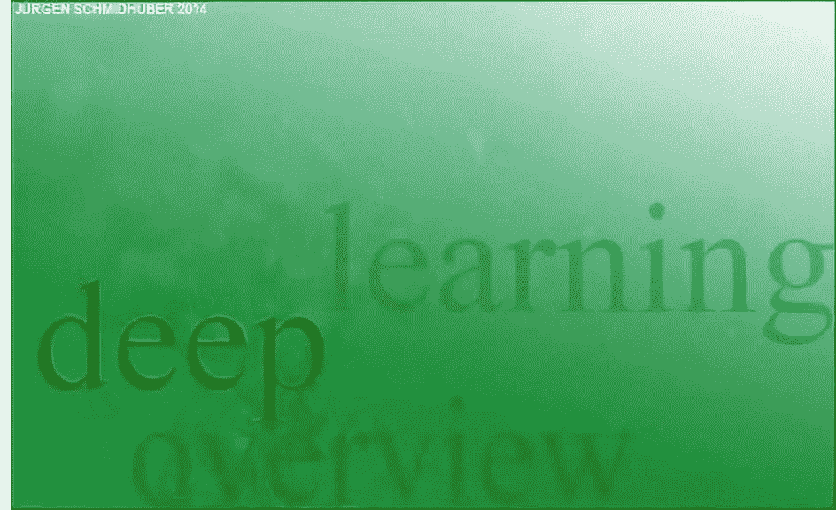
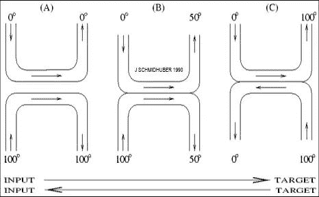

AI科技评论整理

**作者：Jürgen Schmidhuber****编译：MrBear**

毫无疑问，深度学习是影响当今世界科技发展的最重要的技术之一。2018 年，深度学习「三巨头」因其在这个领域的卓越贡献荣获图灵奖。在人们感慨人工智能迎来春天的同时，也有人为「LSTM 之父」Jürgen Schmidhuber 未能分享这份荣誉而感到遗憾。事实上，除了 LSTM 之外，深度神经网络、卷积神经网络、无监督学习、自监督学习、元学习、知识蒸馏、对抗生成网络等重要技术的诞生与 Jürgen 都有着千丝万缕的联系。

近日，Jürgen 亲自撰文介绍了自己从上世纪90年代起在深度学习领域所做出的巨大贡献。正如 Jürgen 所言，对于科学研究来说，「唯一真正重要的是研究的质量」。也许多年以后，当人们回顾这段历史，我们会意识到，最重要的并不是谁发明了某项技术，而是技术本身对于人类文明发展所具有的无上价值！

Jürgen 在洋洋洒洒写了近两万字之后，总结道：「放眼于以英语为主导的学术圈，我们往往不能看清一个事实——深度学习是在官方语言不是英语的地方被发明的。」对我们中国（当前人工智能研究领域最大非英语为母语地区）的人们来说，似乎尤其应当认识到这点。

Jürgen 还提到：

> 深度学习只是人工智能研究的一小部分，它主要局限于被动的模式识别。 ……而人工智能本身也只是更宏大的科学追求的一部分，它将宇宙从简单的初始条件推向越来越深不可测的复杂性。 最后，即使这个令人敬畏的过程可能也只是所有逻辑上可能存在的宇宙中更宏大、更有效的计算中的沧海一粟。

**AI 科技评论将 Jürgen 撰写的这篇文章编译了下来，以飨读者。由于文章较长，且多为历史，如果您对过往并不感兴趣，也可以只看目录，然后迅速翻到最后的「结论」部分。**

* * *

**Jürgen **：我们团队的深度学习（DL）神经网络（NN）技术推动了模式识别和机器学习的巨大变革，如今，这些技术被学术界和工业界广泛应用。到 2020 年，我们将庆祝这场革命背后早在 30 年前在不到 12 个月的时间里相继发表出来的许多基本思想，那一年正是 1990-1991 年，是深度学习在慕尼黑工业大学诞生的「奇迹之年」！

当时，很少有人对这一研究领域感兴趣，但是四分之一个世纪过去了，基于这些思想设计的神经网络出现在了包括智能手机在内的逾 3 亿台设备上，每天会被使用数十亿次，消耗着这个世界上相当大一部分的计算资源。

下面，本文将总结深度学习领域在 1990-1991 年究竟发生了什么重要的事件，这不仅为行外人士提供了一个对该领域宏观的介绍，同时也为那些对该领域十分了解的专家提供了评估原始资料来源的参考。我们还提到了一些后期工作，这些工作进一步发展了 在 1990-1991 年（在慕尼黑工业大学、瑞典人工智能实验室 IDSIA，以及其它地方）诞生的思想，本文还介绍了其他人的一些相关工作。本文的目录如下：

0. 人工神经网络深度学习的研究背景

1. 第一个基于无监督预训练的深度学习器（1991）

2. 对一个网络进行压缩/蒸馏，用于一个网络（1991）

3. 根本性的深度学习问题（梯度弥散/爆炸，1991）

4\. 长短时记忆网络（LSTM）：有监督的深度学习（基本思想诞生于 1991 年）

5. 通过对抗生成神经网络实现人工好奇心（1990）

6. 通过最大化学习进度的神经网络实现人工好奇心（1990）

7. 用于无监督数据建模的对抗性网络（1991）

8\. 端到端的可微「快速权值」：能学着对神经网络进行编程的网络（1991）

9. 通过神经网络学习顺序注意力机制（1990）

10. 分层强化学习（1990）

11. 通过循环神经世界模型规划并进行强化学习（1990）

12\. 将目标定义命令作为额外的神经网络输入（1990）

13. 作为神经网络输入/通用值函数的高维奖励信号（1990）

14. 确定性的策略梯度（1990）

15. 用网络调整网络/合成梯度（1990）

16. 用于在线循环神经网络的时间复杂度为 O(n3) 的梯度计算

17. 深度神经「热交换器」（1990）

18. 我的博士毕业论文（1991）

19. 从无监督预训练到纯粹的监督式学习（1995-1995，,2006-2011）

20. 令人惊讶的关于人工智能的 FKI 系列技术报告（1990 年代）

21. 结语

* * *

### **0. 人工神经网络深度学习的研究背景**

人类大脑拥有约 1,000 亿个神经元，平均每个神经元都会与其余的 10,000 个神经元相连。在这些神经元中，有一些是为其它神经元提供数据（声音、视觉、触觉、疼痛、饥饿）的输入神经元。另一些神经元则是控制肌肉的输出神经元。而大多数神经元则隐藏在输入和输出之间的处理过程中，这也正是我们进行思考的地方。显然，大脑是通过改变连接的强度或权重进行学习的，这样可以决定神经元之间互相影响的强度，而这种机制似乎也对人们一生中积累的经验进行了编码。

我们的人工神经网络（NN）的工作原理与上述人类的神经系统相类似，它能够比先前的各种方法更好地进行学习，从而完成语音识别、手写数字识别或视频识别，最小化损失、最大化受益，甚至自动驾驶汽车等任务[DL1][DL4]。

大多数现代的商业应用都重点关注让神经网络能够模仿人类「老师」的监督学习[DL1][DL4]。经过了多次试验，Seppo Linnainmaa 在 1970 年提出了一种基于梯度的计算方法[BP1]，我们现在通常将其称为反向传播算法或自动微分的逆序模式，该算法被用来逐渐减弱某些神经网络连接，同时增强其它的连接，从而使神经网络与带有监督信号的「老师」的行为越来越相似（相关变体见[BPA][BPB][BP2]）。

如今，那些最为强大的神经网络往往具有很深的结构，也就是说，他们有许多层神经元或若干后续的计算阶段。然而，在 1980 年代，基于梯度的训练方法并不适用于深度神经网络，仅在浅层神经网络上有较好的表现[DL1][DL2]。

这种「深度学习问题」在循环神经网络（RNN，于 1945 年首次被非正式地提出[MC43]，于 1956 年被正式提出[K56]——相关变体见[PDA2]）上体现的最明显。循环神经网络与人类大脑相类似，但与限制更多的前馈神经网络（FNN）不同，RNN 具有反馈连接。这种结构使 RNN 成为了功能强大、通用性强，可以进行并行计算的计算模型，它能够处理任意长度的输入序列（例如，语音或视频）。

RNN 基本上可以实现所有可以在你的笔记本电脑上运行的程序。如果我们想要构建一个通用人工智能系统，则其底层的计算基础必然是类似于 RNN 的结构，因为 FNN 从根本上存在不足。RNN 与 FNN 的关系，就好比通用计算机和专用计算器的关系。

尤其是，不同于 FNN，RNN 基本上可以处理任意深度的问题[DL1]。然而，在 1980 年代，早期的 RNN 实际上并不能学习较深的问题。我希望克服这一缺点，实现基于 RNN 的「通用深度学习」。

* * *

### **1. 第一个基于无监督预训练的深度学习器（1991）**

为了解决上述的「深度学习问题」，我首先想到了通过对一个层次化 RNN 的无监督预训练促进深度 RNN 中的监督学习（1991），从而实现了第一个「非常深的学习器」，我们将其称为「神经序列组块」（Neural Sequence Chunker）[UN0]，或称「神经历史压缩器」[UN1]。每个更高层的 RNN 会使用预测性编码技术最小化下层 RNN 中的数据表征的描述长度（或负对数概率）。其中，预测性编码技术试图在给定先前的输入的情况下，预测接下来的数据流中的下一个输入，并且只在存在不可预测的数据时更新神经激活值，因此此时只存储未知的东西。换句话说，神经序列组块会学着压缩数据流，从而减缓「深度学习问题」，使其能够通过标准的反向传播方法求解。

尽管那时的计算机要比现在同等价位的计算机运算得慢一百万倍，但是截止到 1993 年，我的方法可以解决之前无法解决的、深度大于 1000[UN2] 的「非常深的深度学习」（需要超过 1000 个后续的计算步骤，步骤越多则学习的深度越深）。在 1993 年，我们还发布了一个「连续」版本的神经历史压缩器[UN3]。

据我所知，序列组块[UN0]同时还是第一个由在不同（自组织的）时间尺度上运行的 RNN构成的系统（实际上，我还有一种方法，可以将所有这些 RNN 「蒸馏」到一个很深的、在单个时间尺度上运行的 RNN 中——详见本文第 2 章）。几年之后，其他的研究者也开始在多时间尺度 RNN 的研究领域发表相关工作（例如，[HB96]，相关的工作还有 Clockwork RNN[CW]）。

在这项工作发表十多年后[UN1]，一种针对限制更强的前馈神经网络的类似方法被提出，这种方法通过堆叠的前馈神经网络的无监督预训练使监督训练的性能得到了提升，该方法被称为深度置信网络（DBN）[UN4]。在这篇于 2006 年发表的论文中，作者的证明与我在 1990 年代初期为我的堆叠式 RNN 所使用的证明几乎如出一辙：每个更高的层试图缩短下层中数据表征的描述长度（或负对数概率）。

在上述的基于无监督预训练的深度学习器被提出后不久，「深度学习问题」（详见第 3 章）也通过我们的纯监督 LSTM 被解决了（详见第四章）。后来，在 2006 到 2011 年间，我的实验室又推动了一次非常相似的从无监督预训练到纯监督学习的转变。在「奇迹之年」过去 20 年后，这一次，通用性较低的前馈神经网络（FNN）催生了在癌症检测和许多其它问题上的革命性应用，而不是循环神经网络（RNN）。详细情况见第十九章。

当然，前馈神经网络深度学习的起源要追溯到更早的时期。1965 年，Ivakhnenko 和 Lapa 为具有任意层数的深度多层感知机发布了第一个通用可行的学习算法[DEEP1]。例如，Ivakhnenko 于 1971 年发表的论文[DEEP2] 就已经提出了一个 8 层的深度学习网络，该网络采用了一种高被引方法[DL2] 进行训练，这种方法直到 2000 年后仍然被广泛使用。但是，与 Ivakhnenko 与其后继者在 1970 年代和 1980 年代提出的深度 FNN 不同，我们的深度 RNN 具有通用的并行序列计算架构[UN0-3]。

直到 1990 年代初期，大多数神经网络方面的研究仍然仅限于包含 10 个以内的后续计算步骤的非常浅的网络，而我们的方法已经可以使包含 1,000 个这样的后续计算步骤的网络正常工作。我想说的是，正是我们让神经网络变得这么深（尤其是 RNN，它是所有网络中最深、功能最强大的）。

* * *

### **2. 对一个网络进行压缩/蒸馏，用于一个网络（1991）**

在我们上面提到的关于神经历史压缩器（第 1 章）的论文中，还介绍了一种将网络的层次结构（较高层网络相较于较低层网络，往往在慢得多的自组织时间尺度上运行）压缩到一个深度 RNN[UN1] 中，从而在尽管存在第 0 章提到的障碍的情况下，学着解决非常深的网络的学习问题。这部分的内容在参考文献 [UN1][DIST1] 的第 4 章有介绍，它们讨论了「有意识」的组块和「下意识」的自动化，介绍了将一个神经网络的知识迁移到另一个神经网络上的通用原则。

假设有一个「老师」神经网络和一个「学生」神经网络，「老师」神经网络已经学会了对在给定其它数据的情况下，预测数据（的条件期望）。那么我们可以通过训练「学生」神经网络模仿「老师」神经网络的行为，将「老师」神经网络的知识压缩到一个「学生」神经网络中（同时重新训练学生神经网络去完成之前学过的技能，从而避免它遗忘这些技能）。

我将这种操作称作将一个网络的行为「折叠」或「压缩」到另一个网络中。如今，这种方法被广泛使用，有的研究者（例如，Hinton）也将它称为将「老师」网络的行为「蒸馏」[DIST2] 或「克隆」到一个「学生」网络中。

* * *

### **3. 根本性的深度学习问题（梯度弥散/爆炸，1991）**

在介绍背景知识的第 0 章中，我们指出深度学习是很困难的。但是为什么它很困难呢？我喜欢将其中的一个主要原因称为「根本性的深度学习问题」，而我的第一个学生 Sepp Hochreiter 于 1991 年在他的毕业论文 [VAN1] 中提出了这个问题，并且对其进行了分析。 

作为这篇论文的一部分，Sepp 实现了上面（第 1 章）介绍的「神经历史压缩器」和其它基于 RNN 的系统（第 11 章）。除此之外，他还做了更多的工作——他的工作正式说明了，深度神经网络受困于如今非常著名的「梯度弥散」或「梯度爆炸」问题：在典型的深度网络或循环网络中，反向传播的误差信号要么迅速衰减，要么增长得超出界限。在这两种情况下，学习都会失败。这样的分析催生了如今的 LSTM 的基本原理 （详见第 4 章）。

（在 1994 年，还有其他研究者的研究成果 [VAN2] 和 Sepp 于 1991 年发表的有关梯度弥散的研究成果 [VAN1] 基本一模一样。甚至在公开发表了论文 [VAN3] 之后，本文参考文献 [VAN2] 的第一作者还发表了一系列论文（例如 [VAN4]），并且只引用了他自己在 1994 年发表的论文，但对 Sepp 的原创性工作只字不提。）

请注意，在 Sepp 的论文指出那些深度神经网络中反向传播的问题之前 20 年，有一位名字相似的学生（Seppo Linnanimaa）于 1970 年在他的论文中发表了现代的反向传播算法，或称自动微分的逆向模式[BP1]。

* * *

### **4\. 长短时记忆网络（LSTM）：****有监督的深度学习**

长短时记忆虚幻神经网络（LSTM）[LSTM1-6] 克服了 Sepp 在其 1991 年发表的毕业论文 [VAN1]（详见第 3 章） 中提出的根本性的深度学习问题。我认为这是机器学习历史上最重要的论文之一。它还通过我们在 1995 年发布的技术报告 [LSTM0] 中所称的 LSTM 的基本原理（例如，恒定误差流）为解决根本性的深度学习问题提供了重要的思路。这催生了如下所述的大量后续工作。

明年，我们将庆祝 LSTM 首次未能通过同行评审的 25 周年。1997年，在经过了主要的同行评审出版物 [LSTM1]（现在是「Neural Computation」期刊历史上引用量最多的文章）发表之后，LSTM 模型和它的训练过程都得到了进一步的改进，这些工作由瑞士人工智能实验室「IDSIA」的瑞士 LSTM 基金支撑，我后来的学生 Felix Gers、Alex Graves 等人参与到了这些工作中。

其中一个具有里程碑意义的工作是：带有遗忘门 [LSTM2] 的「vanilla LSTM」架构，这是1999年到 2000 年间被提出的 LSTM 变体，直到现在仍然被广泛使用（例如，在谷歌的 Tensorflow 中）。LSTM 的遗忘门实际上是一种端到端可微的快速权值控制器，我们在 1991 年也提出了这种结构[FAST0](详见第八章)。

Alex 是我们首次成功地将 LSTM 应用于语音领域的工作的第一作者 (2004)[LSTM10]。2005 年，我们发布了第一个具有完全基于时间的反向传播功能的 LSTM 和双向 LSTM 发 [LSTM3]（现在被广泛使用）。2006 年，另一个重要的里程碑是：用于同时对齐和序列识别的训练方法 「连接时序分类」（简称 CTC）[CTC]。自 2007 年以来，CTC 成为基于 LSTM 的语音识别的必要技术。例如，在 2015 年，「CTC-LSTM」的组合显著提升了谷歌语音识别系统的性能 [GSR15][DL4]。

在 2000 年代初期，我们说明了 LSTM 如何学习传统模型（如隐马尔可夫模型）无法学习的语言 [LSTM13]。过了一段时间，这份工作才被理解；但到了 2016~2017 年，谷歌翻译 [WU][GT16] 和 Facebook 翻译 [FB17] 均基于两个连接的 LSTM 被提出，其中一个 LSTM 被用于输入文本，另一个被用于输出翻译，这种模型的性能比之前的模型要好得多[DL4]。

2009 年，我的博士学生 Justin Bayer 作为第一作者完成了一个自动设计类似于 LSTM 的架构的系统，该系统在某些应用上的性能超过了「vanilla LSTM」。2017 年，谷歌开始使用类似的「神经网络架构搜索」（NAS）技术。

自 2006 年起，我们一直与软件公司（例如，LifeWare）通力合作，大大提升了首写字母识别系统的能力。2009 年，在 Alex 的努力下，利用「连接时序分类」（CTC）技术训练的 LSTM 模型成为了首次在国际竞赛（三个 ICDAR 2009 举办的联通首写字母识别大赛（法文、波斯文、阿拉伯文））中夺冠的 RNN 模型。这极大地吸引了工业界的兴趣。

不久之后，LSTM 便被广泛应用于涉及包括语言、语音、视频在内的序列数据的一切任务 [LSTM10-11][LSTM4][DL1]。截至 2017年，人们基于 LSTM 模型构建了Facebook 的机器翻译系统（每周需要完成超过300 亿份翻译任务）[FB17][DL4]，超过 10 亿台 iPhone 上运行的苹果的「Quicktype」智能输入法 [DL4]，亚马逊的 Alexa 语音助手，谷歌的语音识别（自 2015 年起内置于安卓设备）[GSR15][DL4]、图像字幕生成[DL4]、机器翻译[GT16][DL4]、自动邮件回复[DL4] 等系统。美国的「商业周刊」将 LSTM 成为「商业化程度最高的人工智能研究成果」。

到 2016 年为止，谷歌数据中心超过四分之一的算力都被用于 LSTM（相比之下，只有 5% 被用于另一种名为「卷积神经网络」的流行的深度学习技术——详见第 19 章）[JOU17]。谷歌 2019 年发布的新的设备内置的语音识别（现阶段内置于你的手机上，而不是部署在服务器上）仍然是基于 LSTM 模型设计的。

通过我的学生 Rupesh Kumar Srivastava 和 Klaus Greff 的工作，LSTM 的原理也催生了我们在 2015 年 5 月提出的「Highway」神经网络[HW1]，这是第一个具有数百层非常深的 FNN 结构的网络。微软提出的广为人知的 ResNet[HW2]（ImageNet 2015 竞赛的冠军方案）就是 Highway 神经网络的一种特例。然而，早期的 Highway 网络就可以在 ImageNet 上取得与 ResNet 大致相当的性能[HW3]。Highway 层还常常被用于自然语言处理领域，而此时更为简单的残差层则性能较差[HW3]。

我们还通过没有「老师」监督信息的强化学习（RL）技术训练 LSTM 模型（例如，我的博士后 Bram Bakker 于 2002 年发表的工作 [LSTM-RL]）。我们还通过神经演化来训练 LSTM，例如我的博士生 Daan Wierstra 于 2005 年发表的工作 [LSTM12]，Daan 后来成为了 DeepMind 公司的 1 号员工，而 DeepMind 的联合创始人正是我实验室中的另一名博士生 Shane Legg（Shane 和 Dann 是 DeepMind 公司里最早发表人工智能论文的计算机科学博士）。

强化学习与 LSTM 的结合具有重要的意义。例如， 2019 年，DeepMind 在「星际争霸」游戏（该游戏在很多方面都要比国际象棋和围棋更加困难）中击败了职业玩家，而它们使用的正式一种名为「Alphastar」的算法，该算法的决策中枢拥有通过强化学习训练的深度 LSTM 核心 [DM3]。OpenAI 的「Dactyl」仿人机械手也采用了通过强化学习训练的 LSTM 核心，它能够学着在没有「老师」监督信息的情况下，控制灵巧的机器人手[OAI1]，同时「OpenAI Five」也于 2018 年通过学习在 DOTA2 游戏中成功击败了人类职业玩家 [OAI2]。

上面提到的这一切成果的重要基础都是在 1991 年奠定的。后来，在慕尼黑工业大学和（当时还是私人的）瑞士 Dalle Molle 人工智能研究所（IDSIA）的基础基金以及我在 1990 年代和 2000 年代早期的「神经网络寒冬」中从瑞士、德国、欧盟获得的公共基金的资助下，我的团队还研发出了「LSTM&CTC」等成果，试图在几乎没有人对神经网络感兴趣的年代保持这一领域的活力。

在此，我要特别鸣谢 Kurt Bauknecht、Leslie Kaelbling、Ron Wiliams 以及 Ray Solomonoff 等教授，他们对我提交的基金申请的积极评价在很大程度上帮助我自从 1990 年代以来获得了来自 SNF 的资金支持。

* * *

### **5. 通过对抗生成神经网络实现人工好奇心（1990）**

当人类与自己身处的世界交互时，他们会学着预测自己行为的后果。人们有很强的好奇心，会通过设计实验得出新的数据，并且可以从中学到更多知识。1990 年，为了构建具有好奇心的人工智能体，我提出了一种新型的主动无监督学习（或自监督学习）算法[AC90, AC90b]。该方法以一个极小极大博弈为基础，其中一个神经网络最小化另一个神经网络最大化的目标函数。现在，我把这种两个无监督的对抗性神经网络之间的博弈称为对抗性好奇心 [AC19]，以区别于我们后来自从 1991 年提出的人工好奇心 （详见第六章）。

然而，对抗性好奇心的工作原理如何呢？我们不妨将第一个神经网络成为控制器 C，C 以一定概率生成可能对某个环境产生影响的输出。第二个神经网络被称为世界模型 M，M 可以预测环境对于 C 的输出做出的反应，其使用梯度下降法最小化其误差，从而逐渐成为更好的预测器。然而，在一个「零和博弈」中，C 试图找到的是使得 M 的误差最大的输出。因此，M 的损失就是 C 的增益。

也就是说，C 的目的是生成新的输出或者实验来产生仍然能使 M 感到新奇的数据，直到生成的数据对于 M 来说十分熟悉、最终变得「无聊」。近年来，研究者们基于这个原理进行的相关总结和拓展请参阅 [AC09]。

因此，在 1990 年，我们已经拥有了无监督（或自监督）的同时满足「生成式」和「对抗性」（这里我们采用很久以后在 2014 年的 [GAN1] 中出现的术语）两大特征的神经网络，它们生成能够产生新数据的实验输出，这不仅仅适用于静态的模式，同时也可以用于模式的序列，甚至是通用场景下的强化学习。

当下火热的对抗生成网络（GAN）[GAN0][GAN1]（2010-2014） 是对抗性好奇心[AC90] 的一种应用，其中环境仅仅返回 C 目前的输出是否属于一个给定的集合 [AC19]。

此外，请注意：对抗性好奇心 [AC90, AC90b]、GAN[GAN0, GAN1] 以及对抗可预测性最小化（详见第七章）是密切相关的概念。而它们与早期的对抗性机器学习问题的设定 [GS59][H90] 又很不一样，早期的对抗性机器学习既不涉及无监督神经网络，也不涉及数据建模，而且也没有使用梯度下降方法 [AC19]。

* * *

### **6. 通过最大化学习进度的神经网络实现人工好奇心（1990）**

最近，有许多综述文章 [AC06][AC09][AC10] 对关于 1990 年提出的对抗性好奇心（AC1990，详见第 5 章）的改进进行了总结。在这里，我将重点介绍1991 年 [AC91][AC91b] 对对抗性好奇心的第一个重要改进。

在这份工作中，AC1990 的世界模型 M 的误差（需要最小化，详见第五章）是控制器 C 的奖励（需要最大化）。这在许多确定性的环境中是一种非常好的策略。然而，在随机化的环境中，这种策略则可能失效。C 可能会学着重点关注 M 总是由于随机性或由于其计算限制而得到高预测误差的情况。例如，一个由 C 控制的智能体可能会面对一个播放着极其难以预测的白噪声的电视屏幕而束手无策 [AC10]。

因此，正如我们在 1991 年所指出的，在随机环境中，C 的奖励不应该是 M 的误差，而应该是 M 的误差在后续训练迭代过程中的一阶导数的近似，即 M 获得的改进[AC91][AC91b]。因此，尽管面对上述充满噪声的电视屏幕会导致很高的误差，但 C 也不会在陷入这种困境时获得奖励。完全可预测和根本不可预测的情况都会使好奇心消失。这种思路催生了许多人工智能科学家和艺术家 [AC09] 的后续工作 [AC10]。

* * *

### **7. 用于无监督数据建模的对抗性网络（1991）**

在我 1990 年发表首篇关于对抗生成网络的工作（详见第 5 章）后不久，我在科罗拉多大学博尔德分校做博士后时，又提出了一种无监督对抗性极小极大值原理的变体。神经网络最重要的任务之一就是学习图像等给定数据的统计量。

为了实现这一目标，我再次在一个极小极大博弈中使用了梯度下降 / 上升的原理，其中一个神经网络将最小化另一个神经网络最大化的目标函数。这种两个无监督对抗性神经网络之间的对抗被称为可预测性最小化 (PM，1990 年代提出)。与后来的 [GAN1] 不同，PM 是一个纯粹的极大极小博弈，例如 [PM2] 中的等式 2。相关综述文章请参阅 [AC19])。

第一个关于 PM 的小型实验 [PM1] 是在大约 30 年前进行的，当时其计算成本大约是现在的 100 万倍。5 年后，当计算成本降低了 10 倍时，我们得以说明，应用于图像的半线性 PM 变体会自动生成在神经科学领域广为人知的特征检测器（例如，从中心到周围的检测器、从周围到中心的检测器，以及方向敏感的棒状检测器 [PM2]）。

* * *

### **8\. 端到端的可微「快速权值」：****能学着对神经网络进行编程的网络（1991）**

一个典型的神经网络拥有比神经元更多的连接。在传统的神经网络中，神经元的激活值变化较快，而连接权值变化则较慢。也就是说，大量的权重无法实现短期记忆或临时变量，只有少数神经元的激活值可以做到。具有快速变化的 「快速权值」的非传统神经网络则克服了这一局限性。

神经网络的动态连接或快速权值是由 Christoph v. d. Malsburg 于 1981 年提出的 [FAST]，其他学者对此进行了更深入的研究，例如 [FASTb]。然而，这些作者并没有采用端到端可微的系统，通过梯度下降学习来迅速操作「快速权重」的存储。我在 1991 年发表了下面这样的系统 [FAST0][FAST1]，其中慢速神经网络学着去控制独立的快速神经网络的权值。也就是说，我将存储和控制像在传统计算机中那样分开，但是，是以完全的神经方式（而不是以混合方式）做到这一点。这种思路催生了许多后续的工作，下面我将列举其中的一些。

一年之后，我提出了基于梯度下降的、通过二维张量或外积更新实现的对快速权值的主动控制 [FAST2]（可以与我们在该领域最新的工作对比 [FAST3][FAST3a]）。我们的动机是，在端到端可微控制下获得比同样大小的标准 RNN 更多的可能的临时变量：从 O（H）变成O（H^2），其中 H 为隐藏单元的数量。25 年后，其他研究者也采用了这种方法 [FAST4a]。论文 [FAST2] 也明确地讨论了对端到端可微网络中「内部注意力关注点」（Internal Spotlights of Attention）的学习问题。相关工作请参阅第九章有关学习注意力的内容。

我也曾说明了「快速权值」可以如何被用于元学习或「Learning to Learn」，这也是我自 1987 年以后的一个主要的研究课题 [META1]。在 1992 年后的参考文献 [FASTMETA1-3] 中，慢速 RNN 和快速 RNN 是相同的：网络中每个连接的初始权值都是由梯度下降法训练的，但是在一个迭代周期中，每个连接都可以由网络本身编址、阅读、并修改（通过 O（log^n）个特殊的输出单元，其中 n 是连接的数目）。

而连接的权值可能迅速变化，从某种意义上说，网络具有了「自我参照」效应（认知心理学概念，指记忆材料与自我联系时记忆效果优于其它编码条件），这是由于理论上它可以学着运行任意可计算的权值变化算法或学习算法（作用于该网络的所有权值）。这催生了 1990 年代和 2000 年代的许多后续工作。

不使用「老师」监督信号的深度强化学习（RL）也可以从快速权值中受益（即使系统的动力不可微）。2005 年，我之前的博士后 Faustino Gomez [FAST5]（现为 NNAISENSE 的 CEO）也说明了这一点，而那时人们负担得起的电脑的运行速度相较于 1990 年代已经提升了 1000 倍。

此外，据我所知，我们同年在深度强化学习领域所做的相关工作（但是没有使用快速权值）是第一份在标题中包含了「Learn deep」词组的机器学习论文 [DL6]（2005 年，不久之后许多人开始讨论「深度学习」）。

在过去的几十年中，我们发表了大量其它的方法来学习如何通过非常紧凑的代码，快速生成大型神经网络的大量的权值，例如：[KO0][KO1][KO2][CO1][CO2][CO3]。在此，我们利用了「成功的大型神经网络的柯尔莫哥洛夫复杂性或算法的信息量实际上可能非常小」这一规律。

值得一提的是，在 2013 年 7 月，「压缩网络搜索」（Compressed Network Search）[CO2] 成为了第一个在没有任何无监督预训练（与第一章不同）的情况下，使用强化学习技术成功地直接根据高维感知数据（视频）学会控制策略的深度学习模型。不久之后，DeepMind 也开发出了一个用于高维感知输入的深度强化学习模型 [DM1][DM2]。

现在，最著名的基于快速权值的端到端可微神经网络 [FAST0] 实际上是我们 2000 年提出的 vanilla LSTM 网络 [LSTM2]（详见第 4 章），它的遗忘门可以学着控制内部 LSTM 神经元的自循环连接的快速权值。今天，所有主要的 IT 公司都大量使用 vanilla LSTM[DL4]。同样，这个模型的起源可以追溯到 1991 年（详见第 4 章和第 8 章）。

* * *

### **9. 通过神经网络学习顺序注意力机制（1990）**

与传统的神经网络不同，人类使用连续的目光移动和选择性注意力来检测和识别模式。这可能比传统 FNN 高度并行的方法有效得多。这正是我们在 30 年前（1990 年及之前）提出顺序注意力学习神经网络的原因 [ATT0][ATT1]。不久之后，我还明确地提出了在 RNN 中对「内部注意力关注点」的学习 [FAST2]（详见第 8 章）。

因此，当时我们已经提出了现在非常常用的两种类型的神经顺序注意力机制：

（1）（在潜在空间中）通过神经网络中的乘法单元实现的端到端可微的「软」注意力 [FAST2]；（2）（在观测空间中）实现的强化学习（RL）环境中的「硬」注意力机制 [ATT0][ATT1]。

这催生了许多后续的工作。今天，许多人都在使用带有顺序注意力学习机制的神经网络。

我为 CMSS 1990 所写的综述论文  [ATT2] 在它的第 5 章中总结了我们早期关于注意力机制的工作。据我所知，这是首次实现结合了 glimpse 注意力机制（使用注意力组件，即固定控制器同时训练识别和预测组件）的神经系统。20 年后，我这篇 1990 年的论文的审稿人（Hinton）在一篇他以第二作者身份发表的相关论文中写道 [ATT3]：「据我们所知，这是首次使用一个注意力组件（固定控制器）实现结合了 glimpse 来同时训练识别组件...的系统」。（相关内容请参阅第 10 章）

* * *

### **10. 分层强化学习（1990）**

传统的不具有「老师」的强化学习（RL）不能层次化地将问题分解为更容易解决的子问题。正是我在 1990 年提出分层强化学习（HRL）的原因，HRL 使用基于神经网络的端到端可微分的子目标生成器[HRL0]，以及学着生成子目标序列的循环神经网络（RNN）[HRL1][HRL2]。强化学习系统获得形如（start，goal）的额外输入。有一个评价器神经网络会学着预测从起始状态到目标状态的奖励/开销。基于 RNN 的子目标生成器也可以获取（start，goal），并使用评价器神经网络的副本通过梯度下降来学习成本最低的中间子目标序列。强化学习系统试图使用这样的子目标序列来实现最终目标。

我们在 1990-1991 年间发表的论文 [HRL0][HRL1] 是后续各种分层强化学习论文（例如，[HRL4]）的先驱。不久之后，其他的研究者们也开始发表 HRL 领域的论文。例如，本文的参考文献 [ATT2] 的审稿人正是参考文献 [HRL3] 的尾作（相关工作请参见第 9章）。

* * *

### **11. 通过循环神经世界模型规划并进行强化学习（1990）**

1990 年，我提出了基于两个 RNN 的组合 （控制器 C 和世界模型 M）的强化学习和规划（请参阅第五章）。M 学着去预测 C 行为的后果。C 则学着使用 M 提前几个时间步进行规划，从而选择最大化预测累积奖励的动作序列 [AC90]。近年来，这一思路也催生了许多后续工作（例如，[PLAN2-6]）。

1990 年的 FKI 科技报告 [AC90] 也提出了一些其它最近变得很热门的概念。详情请参阅第 5、12、13、14、20 章。

* * *

### **12. 将目标定义命令作为额外的神经网络输入（1990）**

在现在的强化学习神经网络中，有一个被广泛使用的概念：用额外的目标定义输入模式来编码各类人物，这样一来神经网络就知道下一步该执行哪个任务。我们在 1990 年的许多工作中 [ATT0][ATT1][HRL0][HRL1] 提到了这一概念。在 [ATT0][ATT1] 中，我们使用一个强化学习神经控制器学着通过一系列的「扫视」（Saccade）操作去控制任务的「凹轨迹」（Fovea），从而找到视觉场景下的特定目标，因此可以学习到顺序注意力（详见第 9 章）。

我们通过特殊的不变的「目标输入向量」将用户定义的目标输入给系统（详见第 3 章第 2 节 [ATT1]），而系统通过「凹轨迹移动」（Fovea-Shifting）来形成其视觉输入流。

具有端到端可微字目标生成器的分层强化学习（HRL，详见第 10 章）[HRL0][HRL1] 也使用了一个具有形如（start，goal）的任务定义输入的神经网络，学着预测从起始状态到目标状态的成本。（25 年后，我之前的学生 Tom Schauls 在 DeepMind 提出了「通用值函数近似器」[UVF15]）。

这一思想催生了许多后续的工作。例如，我们开发的「POWERPLAY」系统（2011）[PP][PP1] 也使用了任务定义的输入将不同的任务区分开来，不断地提出自己IDE新目标和新任务，以一种主动的、部分无监督的或自监督的方式逐渐学着成为一个越来越通用的问题求解器。2015 年，使用高维视频输入和内在动机（intrinsic motivation）的强化学习机器人也学着去探索 [PP2]。

* * *

### **13\. 作为神经网络输入/通用值函数的高维奖励信号（1990）**

传统的强化学习是基于一维奖励信号的。然而，人类有数百万种作用于不同种类刺激（例如，疼痛和愉悦）的信息传感器。据我所知，参考文献 [AC90] 是第一篇关于具有多维、向量值的损失和奖励信号的强化学习的论文，这些信号从许多不同的感知渠道传入，我们将预测所有这些传感器接受信号的累计值，而不仅仅是单个标量的整体奖励，这与之后的通用值函数（GVF）相类似。不同于之前的自适应评价（adaptive critics），我们 1990 年发表的这篇论文 [AC90] 提出的学习机制是多维循环的。

不同于传统的强化学习，这些信息量巨大的奖励信号也被用作使控制器神经网络学着执行最大化累积奖励的动作的输入。

* * *

### **14. 确定性策略梯度（1990）**

在我 1990 年发表的论文 [AC90] 的「Augmenting the Algorithm by Temporal Difference Methods」一章中，我们也结合了用于预测累积奖励（可能是多维奖励，详见第十三章）的基于动态规划的时间差分方法 [TD] 以及基于梯度的世界预测模型（详见第十一章），从而计算单个控制网络的权值变化。相关工作请参阅第 2.4 节介绍的 1991 年的后续工作 [PLAN3]（以及类似的 [NAN1]）。

25 年后，DeepMind 提出了该方法的一种变体「确定性策略梯度算法」（Deterministic Policy Gradient algorithm，DPG）[DPG][DDPG]。

* * *

### **15. 用网络调整网络/合成梯度（1990）**

1990 年，我提出了各种学着调整其它神经网络的神经网络 [NAN1]。在这里，我将重点讨论 「循环神经网络中的局部监督学习方法」（An Approach to Local Supervised Learning in Recurrent Networks）。待最小化的全局误差度量是循环神经网络的输出单元在一段时间内接收到的所有误差的总和。在传统的基于时间的反向传播算法中（请参阅综述文章 [BPTT1-2]），每个单元都需要一个栈来记住过去的激活值，这些激活值被用于计算误差传播阶段权值变化的贡献。

我没有让算法使用栈式的无限存储容量，而是引入了第二种自适应神经网络，该网络学着将循环神经网络的状态与相应的误差向量相关联。这些局部估计的误差梯度（并非真实梯度）则会被用于调整 循环神经网络 [NAN1][NAN2][NAN3][NAN4]。

不同于标准的反向传播，该方法在空间和时间上都是局部的 [BB1][NAN1]。25 年后，DeepMind 将这种技术称为「合成梯度」(Synthetic Gradients)[NAN5]。

* * *

### **16. 用于在线循环神经网络的时间复杂度为 O(n3) 的梯度计算**

我们最初在 1987 年发表的用于完全循环连续运行的网络的固定大小的存储学习算法 [ROB] ，在每一个时间步需要 O(n^4) 的计算复杂度，其中 n 是非输入单元的数目。我提出了一种方法来计算完全相同的梯度，它需要固定大小的与之前的算法同阶的存储空间。但是，每个时间步的平均时间复杂度只有 O(n^3)[CUB1][CUB2]。然而，这项工作并非没有意义，因为伟大的循环神经网络研究的先驱 Ron Williams 首先采用了这种方法 [CUB0]！

此外，1987 年，当我发表我当时认为是首篇关于遗传编程（GP，即自动演化的计算机程序 [GP1]）的文论文时，也犯下了类似的错误，直到后来我才发现 Nichael Cramer 已经于 1985 年发表了 GP 算法 [GP0]（而且在 1980 年， Stephen F. Smith 已经出了一种相关的方法，作为一个更大的系统的一部分 [GPA]）。

自那以后，我一直尽我所能做到公正和诚信。至少，我们 1987 年的论文 [GP1] 似乎是第一篇将 GP 用于带有循环结构以及可变大小的代码的论文，也是首次关于在逻辑编程语言中实现 GP。

* * *

### **17. 深度神经「热交换器」（1990）**

「神经热交换器」（NHE）是一种用于深度多层神经网络的监督式学习方法，受启发于物理意义上的热交换器。输入「加热」会经过许多连续层的转换，而目标则从深层管道的另一端进入并且进行「冷却」。与反向传播不同，该方法完全是局部的，使其不需要进行并行计算也可以较快运行。

自 1990 年 [NHE] 发表以来，我不定期地在各大学的演讲中会提到该方法，它的与亥姆霍兹机 (Helmholtz Machine) 关系密切。同样，该方法的实验是由我杰出的学生 Sepp Hochreiter 完成的（详见第 3 章、第 4 章）。

* * *

### **18. 我的博士毕业论文（1991）**

1991 年，我发表了我在慕尼黑工业大学的博士论文 [PHD]，总结了我自 1989 年以来的一些早期工作，其中包括：第一个强化学习（RL）神经经济学方法（Neural Bucket Brigade）[BB1][BB2]、用于局部时空循环神经网络的学习算法 [BB1]、具有端到端可微子目标生成器的分层强化学习（HRL，详见第 10 章）、通过两个被称为控制器 C 和世界模型 M 的循环神经网络组合进行强化学习和规划、顺序注意力学习神经网络、学着调整其他神经网络的神经网络（包括「合成梯度」，详见第 15 章），以及用于实现「好奇心」的无监督或自监督的生成对抗网络（详见第 5 章）。

当时，许多其他人的神经网络研究受到了统计力学的启发（例如，[HOP]）。我在 1990-1991 年间的工作（以及我早先于 1987 年发表的学位论文）呈现了另一种面向程序的机器学习的观点。

1931 年，Kurt Gödel 在创立理论计算科学时用基于整数的通用编码语言表示数据（例如公理和定理）和程序（例如针对数据进行的操作的证明生成序列）。众所周知，他使用这种语言构建正式的声明（statement），这些声明可以说明其它正式声明的计算过程，特别是「自我参照」的正式声明，声明它们不能通过任何计算定理被证明。这样一来，他便给出了数学、计算和人工智能的基本极限。

自从 1990 年发表 [AC90] 以来，我经常指出：神经网络的权值应该被看作是它的程序。一些研究者认为深度神经网络的目标是学习观测数据的有用的内部表示（甚至针对表征学习举办了名为 ICLR 的国际学术会议），但我一直倾向于认为神经网络的目标是学习一个计算此类表征的程序（参数）。

在 Gödel 的启发下，我构建输出为其它神经网络的程序或权值矩阵的神经网络，甚至是可以运行和检查自己的权值变化算法或学习算法的自参照循环神经网络（详见第 8 章）。

与 Gödel 的工作不同的是，这里的通用编程语言并不是基于整数，而是基于实数值，这样一来典型神经网络的输出对于其程序而言就是可微的。也就是说，一个简单的程序生成器（高效的梯度下降过程 [BP1]）可以在程序空间中计算出一个方向，在该方向上可以发现更好的程序 [AC90]，尤其是更好的「程序生成」程序（详见第 8 章）。我自 1989 年以来的大量工作都利用了这一事实。

* * *

### **19. 从无监督预训练到纯粹的监督式学习（1995-1995，,2006-2011）**

正如第 1 章中所提到的，我构建的第一个非常深的学习器是 1991 年的栈式循环神经网络，它使用无监督预训练学习深度大于 1000 的问题。但不久之后，我们发表了更多无需任何预训练的解决「深度学习」问题的通用方法（详见第 3 章），通过纯粹的监督式长短时记忆网络（LSTM）来替代无监督的栈式循环神经网络 [UN1-3]（详见第4 章）。

也就是说，在公元 2000 年之前，无监督的预训练已经不再那么重要了，因为 LSTM 并不需要它了。实际上，这种从无监督预训练到纯粹的监督式学习的转变早在 1991 年就开始了。

多年之后，在 2006 年到 2010 年间，也出现了非常类似的转变，但这次这种转变并不是针对于循环神经网络（RNN），而是发生在没那么通用的前馈神经网络（FNN）上。同样的，我的小实验室在这次转变中也起到了核心作用。2006 年，研究者通过栈式 FNN 的无监督预训练改进了 FNN 中的监督学习 [UN4]（详见第 1 章）。但是在 2010 年，我们的团队以及我杰出的罗马尼亚博士后 Dan Ciresan [MLP1] 说明可以通过简单的反向传播训练深度 FNN，而且对于重要的应用来说完全不需要无监督预训练。

我们的系统在当时著名并广为使用的 MNIST 手写数字识别数据集上取得了新的最佳性能记录 [MLP1]。这一成就是通过在高度并行的图形处理单元 GPU 上加速传统的 FNN 实现的。一位著名的评论员将此成为「唤醒了机器学习社区」。今天，很少有商业深度学习应用仍然使用无监督的预训练。

我在瑞士人工智能实验室 IDSIA 的团队，通过将传统的 FNN 替换为另一种名为卷积神经网络（CNN）的神经网络，进一步改进了上述关于 FNN 中纯粹监督式深度学习的工作（2010）。自 1970 年起，研究者们便发明并不断改进了 CNN [CNN1-4]。

我们对基于 GPU 的快速 CNN 的监督式集成（请参阅 Ciresan 等人于 2011 年发表的论文）[GPUCNN1] 是一个重大的突破（相较于早期对 CNN 进行加速的工作快了许多 [GPUCNN]），并在 2011 年 5 月 15 日至 2012 年 9 月 10 日期间连续 4 次在重要的计算机视觉竞赛中夺冠 [GPUCNN5]。尤其是，我们的快速深度卷积神经网络是第一个在手写汉字识别竞赛（ICDAR 2011）中夺冠的算法，也是在所有国际竞赛中实现超越人类的视觉模式识别能力的算法（我们在 IJCNN 2011 的现场交通标志识别大赛中获得了第一名，误差率为 0.56%，也是该比赛中唯一超越人类的方法，人类的平均误差为 1.16%，本届比赛第三名方案的误差为 1.69%）；我们的模型也在 2012 年 5 月的 ISBI 大会举办的图像分割大赛中首次夺冠，在 2012 年 9 月 10 日的 ICPR 大会举办的目标检测大赛中首次夺冠，同时也是第一个在医学癌症图像检测竞赛中夺冠的模型 [GPUCNN5]；我们的快速 CNN 图像扫描器比之前方法的运行速度要快 1000 倍以上 [SCAN]。

在 2011 年的一次竞赛中，我们的系统将目标识别误差率降低了一半以上，而此时距离「奇迹之年」已经过去了 20 年 [GPUCNN2]。不久之后，其他研究者也在图像识别竞赛中也采用了类似的方法 [GPUCNN5]。

与我们的 LSTM 在 2009 年取得的结果一样（详见第 4 章），我们的上述结果以及 2010-2011 年在前馈神经网络上取得的结果引起了工业界极大的兴趣。例如，在2010 年，我们为全世界最大的钢铁制造商 Arcelor Mittal 提出了我们基于 GPU 的深度快速网络，从而大大改进了钢铁缺陷检测技术 [ST]。这可能是深度学习技术在重工业领域取得的第一个重大突破。如今，大多数人工智能初创公司和主要的 IT 公司以及其它著名的公司都在使用这种监督式的快速 GPU 神经网络。

* * *

### **20. 令人惊讶的关于人工智能的 FKI 系列技术报告（1990 年代）**

许多后来广为使用的「现代」深度学习基本思想都是我们在「奇迹之年」（1990-1991）于慕尼黑工业大学（TU Munich）发表的（那时柏林墙刚刚倒塌不久）：无监督或自监督学习、数据生成对抗网络（用于人工好奇心和相关的概念，详见第 5 章；也可以参阅本文第 7 章介绍的我在科罗拉多大学的后续工作）以及深度学习的根本性问题（梯度弥散/爆炸，详见第 3 章）机器解决方案：（1）用于非常深的（循环）神经网络（详见第 1 章）的无监督预训练；（2）催生 LSTM 的基本思路（详见第 4 章和第 8 章）。

当时，我们还提出了序列注意力学习神经网络，这是另一种已经变得非常流行的概念（关于观测空间的「硬」注意力机制和潜在空间的「软」注意力机制的介绍都请参阅第 9 章）；还有学着对另一个神经网络的快速权值、甚至是它们自己的权值进行编程的神经网络（详见第 8 章），以及上述提到的所有其它技术：从分层强化学习（详见第十章）到使用循环神经世界模型进行规划（详见第 11 章），等等。

当然，要想将这些算法商业化运行，人们不得不等待更快的计算机的诞生。然而，直到 2010 年代中期，我们的产品被苹果、谷歌、Facebook、亚马逊、三星、百度、微软等巨头所使用，每天被数十亿台电脑使用数十亿次以上 [DL4]。

上述大多数研究结果首次发表在慕尼黑工业大学的 FKI 系列科技报告中，我为其手动绘制了许多示意图，本文展示了其中的一部分（详见第 10、11、13、18章）。现在，FKI 系列报告在人工智能的历史上起到了重要的作用，它介绍了许多重要的概念：

*   用于非常深的神经网络的无监督预训练（FKI-148-91 [UN0]，详见第 1 章）

*   将一个神经网络压缩/蒸馏成另一个（FKI-148-91 [UN0]，详见第 2 章）

*   长短期记忆网络（FKI-207-95 [LSTM0]，详见第 4、8 章）

*   通过学习进度最大化的神经网络实现好奇心（FKI-149-91 [AC91]，详见第 6 章）

*   端到端快速权重和学着对其它神经网络编程的神经网络（像传统计算机一样，将神经网路的存储和控制分离开来，FKI-147-91 [FAST0]，详见第 8 章）

*   通过神经网络学习顺序注意力（FKI-128-90 [ATT0]，详见第 9 章）

*   将目标定义命令作为额外的神经网络输入（FKI-128-90 [ATT0]，FKI-129-90 [HRL0]，详见第 12章）

*   分层强化学习（FKI-129-90 [HRL0]，详见第 10 章）

*   用网络调整网络/合成梯度（FKI-125-90 [NAN2]，详见第 15 章）

*   用于在线循环神经网络的三次梯度计算也在  FKI-151-91 [CUB1] 中被提出，详见第 16 章。

值得一提的是，报告 FKI-126-90 [AC90]还介绍了大量现在被广为使用的概念：

*   通过循环世界模型进行规划（详见第 11 章）

*   将高维奖励信号作为额外的神经网络输入/通用值函数（详见第 13 章）

*   确定性策略梯度（详见第 14 章）

*   同时满足生成式和对抗性的神经网络（详见第5 章和第 7 章）

*   人工好奇心及相关概念。

后来，举世瞩目的 FKI 科技报告自 1990 年代起介绍了一系列大大压缩神经网络从而提升其泛化能力的方法 [KO0][FM]。

FKI 报告发布不久之后就通过了同行评审。例如，在1992 年，我与伟大的 David MacKay 进行了一次有趣的竞赛，看看谁能在一年之内在「Neural Computation」（当时是我们这个领域的顶级期刊）上发表更多的文章。到 1992 年底，我们都发表了 4 篇文章，但最终还是 David 赢了，因为他发表的论文（大多数都与用于神经网络的贝叶斯方法有关）比我长得多。

免责声明：当然，从科学层面上来说，像发表的论文数量和 H 指数这样的指标很苍白——唯一真正重要的是研究的质量 [NAT1]。

* * *

### **21. 结语**

放眼于以英语为主导的学术圈，我们往往不能看清一个事实[DLC]——深度学习是在官方语言不是英语的地方被发明的：

*   这个研究领域始于 1965 年的乌克兰（当时还属于苏联），那时诞生了第一个具有任意深度的、可以学习的神经网络 [DEEP1-2]（详见第 1 章）；

*   五年后，现代反向传播方法在苏联「隔壁的」芬兰出现（1970）[BP1]（详见第 0 章）；

*   基本的深度卷积神经网络（现在被广泛使用）架构是在 1970 年代的日本被发明的，到了 1987 年，卷积网络与权值共享和反向传播相结合。

*   无监督或自监督的对抗性网络（两个网络在一个用于人工好奇心的极小极大博弈中对抗）起源于慕尼黑（1990，详见第 5 章），慕尼黑也是 1980 年代第一批真正的自动驾驶汽车的诞生地，1994 年进行了高速公路交通实验。

*   基于反向传播的深度学习的根本性问题也在慕尼黑被发现（1991，详见第 3 章）[VAN1]。第一个克服这个问题的「现代」深度学习网络也是如此，它们通过无监督的预训练 [UN1-2]（1991，详见第 1 章） 和长短时记忆网络 [LSTM0-7] 克服这个问题，LSTM 可以说是商业化程度最高的人工智能成果 [AV1]（第 4 章）。

*   LSTM 在瑞士得到了进一步发展，这里也诞生了第一个在图像识别竞赛获胜的基于 GPU 的 CNN（2011，详见第  19 章——现在计算机视觉领域的所有研究者都在使用这个方法）、第一个在视觉模式识别中超越人类的神经网络（2011），以及第一个有超过 100 层、非常深的前馈神经网络 [HW1]（详见第 4 章）。

*   大约在 1990 年，瑞士也成为了万维网的发源地，这使得人工智能可以在全世界范围内被迅速传播。截至 2017 年，瑞士在人工智能研究领域的引用影响力仍然居于世界前列——尽管中国现在是人工智能论文产出最多的国家 [THE17]。

当然，深度学习只是人工智能研究的一小部分，它主要局限于被动的模式识别。我们将其视为通过元学习或 「learning to Learn」的学习算法（于 1987 年发表，研究更通用的人工智能的副产品，具有人工好奇心和创造力的系统定义了自己的问题并设定自己的目标（1990），演化计算（1987）、RNN 演化、压缩网络搜索、在真实部分可观测的环境下（此时用于棋类游戏的传统强化学习不起作用，1989）的智能体的强化学习、通用人工智能、如 Gödel Machine 这样的最优通用学习机（2003 至今）、对运行在通用计算机上的程序的最优搜索等。

当然，人工智能本身只是更宏大的科学追求的一部分，它将宇宙从简单的初始条件推向越来越深不可测的复杂性 [SA17]。最后，即使这个令人敬畏的过程可能也只是所有逻辑上可能存在的宇宙中更宏大、更有效的计算中的沧海一粟 [ALL1][ALL2][ALL3]。

注：本文中涉及到的所有参考文献详见原文：http://people.idsia.ch/~juergen/deep-learning-miraculous-year-1990-1991.html#NAN1

* * *

