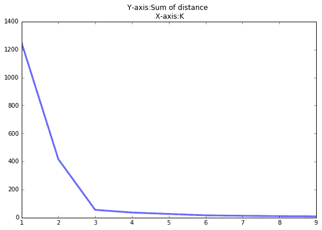
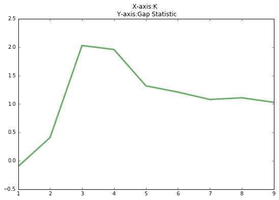

点击上方“**Datawhal****e**”，选择“星标”公众号

第一时间获取价值内容

K-means 是我们最常用的基于距离的聚类算法，其认为两个目标的距离越近，相似度越大。

**算法**

**1.1 牧师-村民模型**K-means 有一个著名的解释：牧师—村民模型：

> 有四个牧师去郊区布道，一开始牧师们随意选了几个布道点，并且把这几个布道点的情况公告给了郊区所有的村民，于是每个村民到离自己家最近的布道点去听课。听课之后，大家觉得距离太远了，于是每个牧师统计了一下自己的课上所有的村民的地址，搬到了所有地址的中心地带，并且在海报上更新了自己的布道点的位置。牧师每一次移动不可能离所有人都更近，有的人发现A牧师移动以后自己还不如去B牧师处听课更近，于是每个村民又去了离自己最近的布道点……就这样，牧师每个礼拜更新自己的位置，村民根据自己的情况选择布道点，最终稳定了下来。

我们可以看到该牧师的目的是为了让每个村民到其最近中心点的距离和最小。**1.2 算法步骤**所以 K-means 的算法步骤为：

1.  选择初始化的 k 个样本作为初始聚类中心  ；
2.  针对数据集中每个样本  计算它到 k 个聚类中心的距离并将其分到距离最小的聚类中心所对应的类中；
3.  针对每个类别  ，重新计算它的聚类中心 （即属于该类的所有样本的质心）；
4.  重复上面 2 3 两步操作，直到达到某个中止条件（迭代次数、最小误差变化等）。

**1.3 复杂度**我们先看下伪代码：时间复杂度：，其中，t 为迭代次数，k 为簇的数目，n 为样本点数，m 为样本点维度。空间复杂度：，其中，k 为簇的数目，m 为样本点维度，n 为样本点数。

**优缺点**

**2.1 优点**

*   容易理解，聚类效果不错，虽然是局部最优， 但往往局部最优就够了；
*   处理大数据集的时候，该算法可以保证较好的伸缩性；
*   当簇近似高斯分布的时候，效果非常不错；
*   算法复杂度低。

**2.2 缺点**

*   K 值需要人为设定，不同 K 值得到的结果不一样；
*   对初始的簇中心敏感，不同选取方式会得到不同结果；
*   对异常值敏感；
*   样本只能归为一类，不适合多分类任务；
*   不适合太离散的分类、样本类别不平衡的分类、非凸形状的分类。

**算法调优与改进**

针对 K-means 算法的缺点，我们可以有很多种调优方式：如数据预处理（去除异常点），合理选择 K 值，高维映射等。以下将简单介绍：**3.1 数据预处理**K-means 的本质是基于欧式距离的数据划分算法，均值和方差大的维度将对数据的聚类产生决定性影响。所以未做归一化处理和统一单位的数据是无法直接参与运算和比较的。常见的数据预处理方式有：数据归一化，数据标准化。此外，离群点或者噪声数据会对均值产生较大的影响，导致中心偏移，因此我们还需要对数据进行异常点检测。**3.2 合理选择 K 值**K 值的选取对 K-means 影响很大，这也是 K-means 最大的缺点，常见的选取 K 值的方法有：手肘法、Gap statistic 方法。手肘法：当 K < 3 时，曲线急速下降；当 K > 3 时，曲线趋于平稳，通过手肘法我们认为拐点 3 为 K 的最佳值。手肘法的缺点在于需要人工看不够自动化，所以我们又有了 Gap statistic 方法，这个方法出自斯坦福大学的几个学者的论文： Estimating the number of clusters in a data set via the gap statistic其中  为损失函数，这里  指的是  的期望。这个数值通常通过蒙特卡洛模拟产生，我们在样本里所在的区域中按照均匀分布随机产生和原始样本数一样多的随机样本，并对这个随机样本做 K-Means，从而得到一个 。如此往复多次，通常 20 次，我们可以得到 20 个  。对这 20 个数值求平均值，就得到了的近似值。最终可以计算 Gap Statisitc。而 Gap statistic 取得最大值所对应的 K 就是最佳的 K。由图可见，当 K=3 时，Gap(K) 取值最大，所以最佳的簇数是 K=3。Github 上一个项目叫 gap_statistic ，可以更方便的获取建议的类簇个数。**3.3 采用核函数**基于欧式距离的 K-means 假设了了各个数据簇的数据具有一样的的先验概率并呈现球形分布，但这种分布在实际生活中并不常见。面对非凸的数据分布形状时我们可以引入核函数来优化，这时算法又称为核 K-means 算法，是核聚类方法的一种。核聚类方法的主要思想是通过一个非线性映射，将输入空间中的数据点映射到高位的特征空间中，并在新的特征空间中进行聚类。非线性映射增加了数据点线性可分的概率，从而在经典的聚类算法失效的情况下，通过引入核函数可以达到更为准确的聚类结果。**3.4 K-means++**我们知道初始值的选取对结果的影响很大，对初始值选择的改进是很重要的一部分。在所有的改进算法中，K-means++ 最有名。K-means++ 算法步骤如下所示：

1.  随机选取一个中心点  ；
2.  计算数据到之前 n 个聚类中心最远的距离 ，并以一定概率  选择新中心点  ；
3.  重复第二步。

简单的来说，就是 K-means++ 就是选择离已选中心点最远的点。这也比较符合常理，聚类中心当然是互相离得越远越好。但是这个算法的缺点在于，难以并行化。所以 k-means II 改变取样策略，并非按照 k-means++ 那样每次遍历只取样一个样本，而是每次遍历取样 k 个，重复该取样过程  次，则得到  个样本点组成的集合，然后从这些点中选取 k 个。当然一般也不需要  次取样，5 次即可。**3.5 ISODATA**ISODATA 的全称是迭代自组织数据分析法。它解决了 K 的值需要预先人为的确定这一缺点。而当遇到高维度、海量的数据集时，人们往往很难准确地估计出 K 的大小。ISODATA 就是针对这个问题进行了改进，它的思想也很直观：当属于某个类别的样本数过少时把这个类别去除，当属于某个类别的样本数过多、分散程度较大时把这个类别分为两个子类别。

**收敛证明**

我们先来看一下 K-means 算法的步骤：先随机选择初始节点，然后计算每个样本所属类别，然后通过类别再跟新初始化节点。这个过程有没有想到之前介绍的 EM 算法 。我们需要知道的是 K-means 聚类的迭代算法实际上是 EM 算法。EM 算法解决的是在概率模型中含有无法观测的隐含变量情况下的参数估计问题。在 K-means 中的隐变量是每个类别所属类别。K-means 算法迭代步骤中的 `每次确认中心点以后重新进行标记` 对应 EM 算法中的 E 步 `求当前参数条件下的 Expectation` 。而 `根据标记重新求中心点` 对应 EM 算法中的 M 步 `求似然函数最大化时（损失函数最小时）对应的参数` 。首先我们看一下损失函数的形式：其中：为了求极值，我们令损失函数求偏导数且等于 0：k 是指第 k 个中心点，于是我们有：可以看出，新的中心点就是所有该类的质心。EM 算法的缺点就是，容易陷入局部极小值，这也是 K-means 有时会得到局部最优解的原因。

**参考**

[1] 《机器学习》周志华 [2] https://zhuanlan.zhihu.com/p/20463356 [3] http://sofasofa.io/forum_main_post.php?postid=1000282

