<section>

<section>

<section>

<section>

<section>

<section>

<section>

<section>

<section>

<section>

<section>

<section>

机器之心平台

**来源：腾讯技术工程**

</section>

</section>

</section>

</section>

</section>

</section>

</section>

</section>

</section>

</section>

</section>

> 模型可解释性方面的研究，在近两年的科研会议上成为关注热点，因为大家不仅仅满足于模型的效果，更对模型效果的原因产生更多的思考，这样的思考有助于模型和特征的优化，更能够帮助更好的理解模型本身和提升模型服务质量。本文对机器学习模型可解释性相关资料汇总survey。

## 综述

机器学习业务应用以输出决策判断为目标。可解释性是指人类能够理解决策原因的程度。机器学习模型的可解释性越高，人们就越容易理解为什么做出某些决定或预测。模型可解释性指对模型内部机制的理解以及对模型结果的理解。其重要性体现在：建模阶段，辅助开发人员理解模型，进行模型的对比选择，必要时优化调整模型；在投入运行阶段，向业务方解释模型的内部机制，对模型结果进行解释。比如基金推荐模型，需要解释：为何为这个用户推荐某支基金。

机器学习流程步骤：收集数据、清洗数据、训练模型、基于验证或测试错误或其他评价指标选择最好的模型。第一步，选择比较小的错误率和比较高的准确率的高精度的模型。第二步，面临准确率和模型复杂度之间的权衡，但一个模型越复杂就越难以解释。一个简单的线性回归非常好解释，因为它只考虑了自变量与因变量之间的线性相关关系，但是也正因为如此，它无法处理更复杂的关系，模型在测试集上的预测精度也更有可能比较低。而深度神经网络处于另一个极端，因为它们能够在多个层次进行抽象推断，所以他们可以处理因变量与自变量之间非常复杂的关系，并且达到非常高的精度。但是这种复杂性也使模型成为黑箱，我们无法获知所有产生模型预测结果的这些特征之间的关系，所以我们只能用准确率、错误率这样的评价标准来代替，来评估模型的可信性。

事实上，每个分类问题的机器学习流程中都应该包括模型理解和模型解释，下面是几个原因：

*   **模型改进**：理解指标特征、分类、预测，进而理解为什么一个机器学习模型会做出这样的决定、什么特征在决定中起最重要作用，能让我们判断模型是否符合常理。一个深度的神经网络来学习区分狼和哈士奇的图像。模型使用大量图像训练，并使用另外的一些图像进行测试。90%的图像被准确预测，这值得我们高兴。但是在没有计算解释函数(explainer function)时，我们不知道该模型主要基于背景：狼图像通常有一个下雪的背景，而哈士奇的图像很少有。所以我们不知不觉地做了一个雪地探测器，如果只看准确率这样的指标，我们就不会看到这一点。知道了模型是如何使用特征进行预测的，我们就能直觉地判断我们的模型是否抓住了有意义的特征，模型是或否能泛化到其他样本的预测上。

*   **模型可信性与透明度**：理解机器学习模型在提高模型可信度和提供审视预测结果透明度上是非常必要的，让黑箱模型来决定人们的生活是不现实的，比如贷款和监狱刑法。另一个对机器学习结果可信度提出质疑的领域是药品，模型结果会直接决定病人的生与死。机器学习模型在区分恶性肿瘤和不同类型的良性肿瘤方面是非常准确的，但是我们依然需要专家对诊断结果进行解释，解释为什么一个机器学习模型将某个患者的肿瘤归类为良性或恶性将大大帮助医生信任和使用机器学习模型来支持他们工作。长久来看，更好地理解机器学习模型可以节省大量时间、防止收入损失。如果一个模型没有做出合理的决定，在应用这个模型并造成不良影响之前，我们就可以发现这一点。

*   **识别和防止偏差**：方差和偏差是机器学习中广泛讨论的话题。有偏差的模型经常由有偏见的事实导致，如果数据包含微妙的偏差，模型就会学习下来并认为拟合很好。一个有名的例子是，用机器学习模型来为囚犯建议定罪量刑，这显然反映了司法体系在种族不平等上的内在偏差。其他例子比如用于招聘的机器学习模型，揭示了在特定职位上的性别偏差，比如男性软件工程师和女性护士。机器学习模型在我们生活的各个层面上都是强有力的工具，而且它也会变得越来越流行。所以作为数据科学家和决策制定者来说，理解我们训练和发布的模型如何做出决策，让我们可以事先预防偏差的增大以及消除他们，是我们的责任。

可解释性特质：

*   **重要性**：了解“为什么”可以帮助更深入地了解问题，数据以及模型可能失败的原因。

*   **分类**：建模前数据的可解释性、建模阶段模型可解释性、运行阶段结果可解释性。

*   **范围**：全局解释性、局部解释性、模型透明度、模型公平性、模型可靠性。

*   **评估**：内在还是事后？模型特定或模型不可知？本地还是全局？

*   **特性**：准确性、保真性、可用性、可靠性，鲁棒性、通用性等。

*   **人性化解释**：人类能够理解决策原因的程度，人们可以持续预测模型结果的程度标示。

### 动机

在工业界中，数据科学或机器学习的主要焦点是更偏“应用”的解决复杂的现实世界至关重要的问题，而不是理论上有效地应用这些模型于正确的数据。机器学习模型本身由算法组成，该算法试图从数据中学习潜在模式和关系，而无需硬编码固定规则。因此，解释模型如何对业务起作用总是会带来一系列挑战。有一些领域的行业，特别是在保险或银行等金融领域，数据科学家通常最终不得不使用更传统的机器学习模型（线性或基于树的）。原因是模型可解释性对于企业解释模型所采取的每个决策非常重要。

残酷的现实是，如果没有对机器学习模型或数据科学pipeline如何运作的合理理解，现实中的项目很少成功。现实中的数据科学项目，通常会有业务和技术两方面。数据科学家通常致力于构建模型并为业务提供解决方案。但是，企业可能不知道模型如何工作的复杂细节。

数据科学从业者将知道存在典型的模型可解释性与模型性能权衡。这里需要记住的一点是，模型性能不是运行时或执行性能，而是模型在决策中的准确程度。有几种模型，包括简单的线性模型甚至是基于树的模型，它们可以很容易地解释模型为获得特定的洞察力或预测而做出的决策，但是你可能需要牺牲模型性能，因为它们总是不能产生最好的结果是由于高偏差（线性模型）或高方差的固有问题，导致过度拟合（完全成长的树模型）。更复杂的模型，如集合模型和最近的深度学习模型系列通常会产生更好的性能，但被认为是黑盒模型，因为很难解释模型如何真正做出决定。

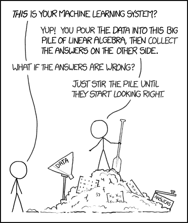

### 理解模型可解释性

模型解释作为一个概念仍然主要是理论和主观的。任何机器学习模型的核心都有一个响应函数，它试图映射和解释独立（输入）自变量和（目标或响应）因变量之间的关系和模式。当模型预测或寻找见解时，需要做出某些决定和选择。模型解释试图理解和解释响应函数所做出的这些决定，即what，why以及how。模型解释的关键是透明度，质疑能力以及人类理解模型决策的难易程度。模型解释的三个最重要的方面解释如下。

1.  **是什么驱动了模型的预测？**我们应该能够查询我们的模型并找出潜在的特征交互，以了解哪些特征在模型的决策策略中可能是重要的。这确保了模型的公平性。

2.  **为什么模型会做出某个决定？**我们还应该能够验证并证明为什么某些关键特征在预测期间驱动模型所做出的某些决策时负有责任。这确保了模型的可靠性。

3.  **我们如何信任模型预测？**我们应该能够评估和验证任何数据点以及模型如何对其进行决策。对于模型按预期工作的关键利益相关者而言，这应该是可证明且易于理解的。这确保了模型的透明度。

在比较模型时，除了模型性能之外，如果模型的决策比其他模型的决策更容易理解，那么模型被认为比其他模型具有更好的可解释性。

### 可解释性的重要性

在解决机器学习问题时，数据科学家往往倾向于关注模型性能指标，如准确性，精确度和召回等等（毫无疑问，这很重要！）。这在大多数围绕数据科学和机器学习的在线竞赛中也很普遍。但是，指标只能说明模型预测决策的部分故事。随着时间的推移，由于环境中的各种因素导致的模型概念漂移，性能可能会发生变化。因此，了解推动模型采取某些决策的因素至关重要。

如果一个模型工作得很好，为什么还要深入挖掘呢？在解决现实世界中的数据科学问题时，为了让企业信任您的模型预测和决策，他们会不断提出“我为什么要相信您的模型？”这一问题，这一点非常有意义。如果一个人患有癌症或糖尿病，一个人可能对社会构成风险，或者即使客户会流失，您是否会对预测和做出决策（如果有的话）感到满意？也许不是，如果我们能够更多地了解模型的决策过程（原因和方式），我们可能会更喜欢它。这使我们更加透明地了解模型为何做出某些决策，在某些情况下可能出现的问题，并且随着时间的推移它有助于我们在这些机器学习模型上建立一定程度的信任。

*   了解预测背后的原因在评估信任方面非常重要，如果计划基于预测采取行动，或者选择是否部署新模型，那么这是至关重要的。

*   无论人类是直接使用机器学习分类器作为工具，还是在其他产品中部署模型，仍然存在一个至关重要的问题：如果用户不信任模型或预测，他们就不会使用它。

这是我们在本文中多次讨论的内容，也是决定数据科学项目在行业中取得成功的关键区别之一。这推动了模型解释的必要性和重要性的紧迫性。

### 可解释性的标准

有一些特定的标准可用于分类模型解释方法。Christoph Molnar，2018年“可解释的机器学习，制作黑箱模型可解释指南”中提到了一个很好的指南。

*   **内在还是事后？**内在可解释性就是利用机器学习模型，该模型本质上是可解释的（如线性模型，参数模型或基于树的模型）。事后可解释性意味着选择和训练黑匣子模型（集合方法或神经网络）并在训练后应用可解释性方法（特征重要性，部分依赖性图）。我们将更多地关注我们系列文章中的事后模型可解释方法。

*   **模型特定或模型不可知？**特定于模型的解释工具非常特定于内在模型解释方法，这些方法完全依赖于每个模型的功能和特征。这可以是系数，p值，与回归模型有关的AIC分数，来自决策树的规则等等。与模型无关的工具与事后方法更相关，可用于任何机器学习模型。这些不可知方法通常通过分析（和输入的扰动）特征输入和输出对来操作。根据定义，这些方法无法访问任何模型内部，如权重，约束或假设。

*   **本地还是全局？**这种解释分类讨论了解释方法是解释单个预测还是整个模型行为？或者如果范围介于两者之间？我们将很快谈论全球和地方的解释。

### 可解释性的范围

如何定义可解释性的范围和界限？一些有用的方面可以是模型的透明度，公平性和责任性。全局和局部模型解释是定义模型解释范围的明确方法。

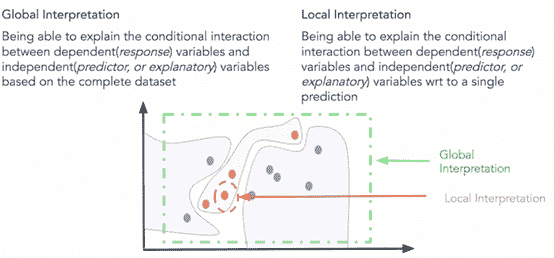

**全局可解释**：就是试图理解“模型如何进行预测？”和“模型的子集如何影响模型决策？”。要立即理解和解释整个模型，我们需要全局可解释性。全局可解释性是指能够基于完整数据集上的依赖（响应）变量和独立（预测变量）特征之间的条件交互来解释和理解模型决策。尝试理解特征交互和重要性始终是理解全球解释的一个很好的一步。当然，在尝试分析交互时，在超过两维或三维之后可视化特征变得非常困难。因此，经常查看可能影响全局知识模型预测的模块化部分和特征子集会有所帮助。全局解释需要完整的模型结构，假设和约束知识。

**局部解释**：试图理解“为什么模型为单个实例做出具体决策？”和“为什么模型为一组实例做出具体决策？”。对于本地可解释性，我们不关心模型的固有结构或假设，我们将其视为黑盒子。为了理解单个数据点的预测决策，我们专注于该数据点并查看该点周围的特征空间中的局部子区域，并尝试基于该局部区域理解该点的模型决策。本地数据分布和特征空间可能表现完全不同，并提供更准确的解释而不是全局解释。局部可解释模型 - 不可知解释（LIME）框架是一种很好的方法，可用于模型不可知的局部解释。我们可以结合使用全局和局部解释来解释一组实例的模型决策。

**模型透明度**：为试图理解“如何根据算法和特征创建模型？”。我们知道，通常机器学习模型都是在数据特征之上利用算法来构建将输入映射到潜在输出（响应）的表示。模型的透明度可能试图了解模型的构建方式以及可能影响其决策的更多技术细节。这可以是神经网络的权重，CNN滤波器的权重，线性模型系数，决策树的节点和分裂。但是，由于业务可能不太精通这些技术细节，因此尝试使用不可知的局部和全局解释方法来解释模型决策有助于展示模型透明度。

### 可解释性的作用

对于想要了解模型如何工作的数据科学家来说，评估模型的准确性通常是不够的。数据科学家通常想知道**模型输入变量如何工作**以及**模型的预测如何根据输入变量的值而变化**。

机器学习算法和模型的工程应用中用到最多的主要是树类模型(lgb,xgb)和神经网络(cnn, rnn)，使用者往往习惯于很少去思考其中的含义和解释性。需要思考一个模型的哪些东西是可解释的？

所以有几个问题值得讨论：

*   哪些特征在模型看到是最重要的？

*   关于某一条记录的预测，每一个特征是如何影响到最终的预测结果的？

*   从大量的记录整体来考虑，每一个特征如何影响模型的预测的？

为什么这些解释信息是有价值的呢：

*   **调试模型用**
    一般的真实业务场景会有很多不可信赖的，没有组织好的脏数据。你在预处理数据时就有可能加进来了潜在的错误，或者不小心泄露了预测目标的信息等，考虑各种潜在的灾难性后果，debug的思路就尤其重要了。当你遇到了用现有业务知识无法解释的数据的时候，了解模型预测的模式，可以帮助你快速定位问题。

*   **指导工程师做特征工程**
    特征工程通常是提升模型准确率最有效的方法。特征工程通常涉及到到反复的操作原始数据(或者之前的简单特征)，用不同的方法来得到新的特征。有时候你完成FE的过程只用到了自己的直觉。这其实还不够，当你有上百个原始特征的时候，或者当你缺乏业务背景知识的时候，你将会需要更多的指导方向。如何创造出这样优秀的特征呢？如何找到最重要的特征的方法，并且可以发现两个特别相关的特征，当面对越来越多的特征的时候，这些方法就会很重要啦。

*   **指导数据采集的方向**
    对于网上下载的数据集你完全控制不了。不过很多公司和机构用数据科学来指导他们从更多方面收集数据。一般来说，收集新数据很可能花费比较高或者不是很容易，所以大家很想要知道哪些数据是值得收集的。基于模型的洞察力分析可以教你很好的理解已有的特征，这将会帮助你推断什么样子的新特征是有用的。

*   **指导人们做决策**
    一些决策是模型自动做出来的，虽然亚马逊不会用人工来决定展示给你网页上的商品，但是很多重要的决策是由人来做出的，而对于这些决定，模型的洞察力会比模型的预测结果更有价值。

*   **建立模型和人之间的信任**
    很多人在做重要决策的时候不会轻易的相信模型，除非他们验证过模型的一些基本特性，这当然是合理的。实际上，把模型的可解释性展示出来，如果可以匹配上人们对问题的理解，那么这将会建立起大家对模型的信任，即使是在那些没有数据科学知识的人群中。

## 方法

### 模型效果评估指标图


**Confusion Matrix**

一个完美的分类模型就是，如果一个客户实际上属于类别 good，也预测成good，处于类别 bad，也就预测成 bad。实际上一些是 good 的客户，根据我们的模型，却预测他为 bad，对一些原本是 bad 的客户，却预测他为 good。我们需要知道，这个模型到底预测对了多少，预测错了多少，混淆矩阵就把所有这些信息，都归到一个表里：

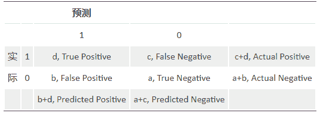

Sensitivity（覆盖率，True Positive Rate）= 正确预测到的正例数 / 实际正例总数；Recall (True Positive Rate，or Sensitivity) =true positive/total actual positive=d/c+d；

PV+ (命中率，Precision, Positive Predicted Value) = 正确预测到的正例数 / 预测正例总数；Precision (Positive Predicted Value, PV+) =true positive/ total predicted positive=d/b+d；

Specificity (负例的覆盖率，True Negative Rate) = 正确预测到的负例个数 / 实际负例总数；Specificity (True Negative Rate) =true negative/total actual negative=a/a+b；

图中关于混淆矩阵结果理解：recall：0.54；precision：0.915；specificity：0.95；

**Lift**

它衡量的是，与不利用模型相比，模型的预测能力 “变好” 了多少。实质上它强调的是投入与产出比。不利用模型，我们只能利用 “正例的比例是 c+d/a+b+c+d” 这个样本信息来估计正例的比例（baseline model），而利用模型之后，我们不需要从整个样本中来挑选正例，只需要从我们预测为正例的那个样本的子集（b+d）中挑选正例，这时预测的准确率为 d/b+d。

显然，lift(提升指数)越大，模型的运行效果越好。如果这个模型的预测能力跟 baseline model 一样，那么 d/b+d 就等于 c+d/a+b+c+d（lift 等于 1），这个模型就没有任何 “提升” 了（套一句金融市场的话，它的业绩没有跑过市场）。

**ROC曲线 & PR曲线 & KS曲线**

实际应用中，通常是先基于训练好的分类器得出测试样本的预测概率，然后将该测试样本的预测概率与给定的阈值进行比较，若该预测概率大于给定阈值，则将该测试样本划分为正类，反之则将其划分为反类。对于不同的分类任务，该分类阈值的取值也是不一样的。

*   ROC曲线（The Receiver Operating Characteristic Curve）给出的是不同分类阈值情况下真正率（TPr）和假正率（FPr）的变化曲线。PR曲线（Precision-Recall Curve）给出的是不同分类阈值情况下查准率（Precision）和查全率（Recall）的变化曲线。有文献指出，ROC曲线相比PR曲线有一个非常好的特性：就是当正负样本分布发生变化的时候，ROC曲线的形状能够基本保持不变，而PR曲线的形状会发生较剧烈的变化。为了使得ROC曲线之间能更好的进行比较，通常采用AUC，即ROC曲线下的面积来衡量一个分类算法的性能。其中，AUC的值越大，表明分类性能越好。

*   KS（Kolmogorov-Smirnov Curve）曲线横轴为不同的分类阈值，纵轴为真正率（TPr）和假正率（FPr）的变化曲线。KS值=max|TPr-FPr|，等价于ΔTPr=ΔFPr，这和ROC曲线上找最优阈值的条件一致。KS值常在征信评分模型中用于衡量区分预测正负样本的分隔程度。一般来说，KS值越大，表明正负样本区分的程度越好，说明模型区分度越高。但并非所有的情况KS值都是越高越好的，尤其在征信模型中，如正负样本完全分错的情况下，KS值依旧可以很高。征信模型最期望得到的信用分数分布为正态分布，如果KS值过大，如0.9，就可以认为正负样本分得过开了，不太可能是正态分布，反而比较可能是极端化的分布状态（如U字型），这样的分数就很不好，基本可以认为不可用。

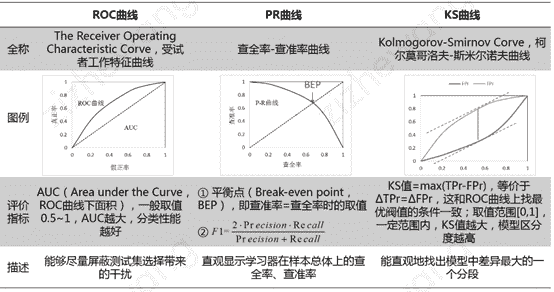

**Cumulative gains chart**

横坐标表示：代表我们样本的百分比，假设有10000个样本，0.1代表1000个，1代表10000个样本。

纵坐标表示：代表横轴所代表的那么多样本中，判断正确的比率。

baseline表示：如果我们不用模型，那我们对每一个人的打分都是一样的，正率在所有样本空间都是一样的，连接起来就成为一条直线。

曲线含义：采用模型进行预测。y值的分子代表模型预测且预测为正例的人数，分母是整个群体正例人数。

**Silhouette Analysis**

Silhouette指的是一种解释和验证数据集群内一致性的方法。该技术提供了每个对象分类的简洁图形表示。

轮廓值是对象与其自身群集（内聚）相比与其他群集（分离）相似程度的度量。轮廓范围从-1到+1，其中高值表示对象与其自己的簇很好地匹配并且与相邻簇很不匹配。如果大多数对象具有高值，则群集配置是合适的。如果许多点具有低值或负值，则群集配置可能具有太多或太少的群集。

图中通过Silhouette方法大致对数据集样本分类有了掌握，可以看到0/1类别大致比例。

**Learning Curve**

概念：学习曲线就是通过画出不同训练集大小时训练集和交叉验证的准确率，可以看到模型在新数据上的表现，进而来判断模型是否方差偏高或偏差过高，以及增大训练集是否可以减小过拟合。

**Bias**是用**所有可能的训练数据集**训练出的**所有模型**的输出的**平均值**与**真实模型**的输出值之间的差异。

**Variance**是**不同的训练数据集训练出的模型**输出值之间的差异。

解读：当训练集和测试集的误差收敛但却很高时，为高偏差。左上角的偏差很高，训练集和验证集的准确率都很低，很可能是欠拟合。我们可以增加模型参数，比如，构建更多的特征，减小正则项。此时通过增加数据量是不起作用的。当训练集和测试集的误差之间有大的差距时，为高方差。当训练集的准确率比其他独立数据集上的测试结果的准确率要高时，一般都是过拟合。右上角方差很高，训练集和验证集的准确率相差太多，应该是过拟合。我们可以增大训练集，降低模型复杂度，增大正则项，或者通过特征选择减少特征数。理想情况是是找到偏差和方差都很小的情况，即收敛且误差较小。

### Permutation Importance

一个最基本的问题大概会是什么特征对我模型预测的影响最大呢？这个东西就叫做“feature importance”即特征重要性。anyway，字面意思看着就很重要啦。我们有很多方法来衡量特征的重要性，这里呢，将会介绍一种方法：排列重要性。这种方法和其他方法比起来，优势有：

*   计算速度快

*   广泛使用和理解

*   我们希望特征重要性与属性具有一致性

**工作原理**：排列重要性，一定是在model训练完成后，才可以计算的。简单来说，就是改变数据表格中某一列的数据的排列，保持其余特征不动，看其对预测精度的影响有多大。大概三个步骤：

*   训练好模型

*   拿某一个feature column, 然后随机打乱顺序。然后用模型来重新预测一遍，看看自己的metric或者loss 。function变化了多少。

*   把上一个步骤中打乱的column复原，换下一个column重复上一个步骤，直到所有column都算一遍。

代码示例：

```
`from xgboost import XGBClassifier    
from sklearn.model_selection import train_test_split
import eli5   # python计算permutation importance工具包   
from eli5.sklearn import PermutationImportance

path = './census_income_dataset.csv'
data = pd.read_csv(path)
#...省略数据预处理过程
X_train, X_test, y_train, y_test = train_test_split(df, y, test_size=0.2, random_state = 400)

# 训练XGBoost模型
model = xgb.XGBClassifier(
                        learning_rate =0.05,
                         n_estimators=100,
                         max_depth=3,
                         min_child_weight=1,
                         gamma=0.3,
                         subsample=0.8,
                         colsample_bytree=0.8,
                         objective= 'multi:softprob',
                         nthread=4,
                         scale_pos_weight=1,
                         num_class=2,
                         seed=27
                    ).fit(X_train, y_train)

perm = PermutationImportance(model, random_state = 1).fit(X_test, y_test) # 实例化
eli5.show_weights(perm, feature_names = X_test.columns.tolist())` 
```

<figcaption></figcaption>

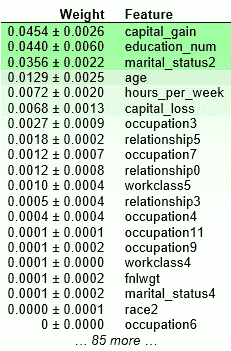

结果分析：

*   靠近上方的绿色特征，表示对模型预测较为重要的特征；

*   为了排除随机性，每一次 `shuffle` 都会进行多次，然后取结果的均值和标准差；

*   部分特征出现负值，表示其 `shuffle` 之后，对精度反而有所提升。这通常出现在特征不那么重要的时候。当数据集较小的时候，这种情况更为常见；

*   “+ - ”之后的数字衡量的是一次重新洗牌后的表现如何变化；

这个数据集是收入水平数据集，这个例子里，最重要的特征是“capital_gain”, 这看起来是合理的。

### PDP

部分依赖图（PDP或PD图）显示特征对机器学习模型的预测结果的边际效应，可以展示一个特征是如何影响预测的。部分依赖图可以显示目标与特征之间的关系是线性的，单调的还是更复杂的。例如，当应用于线性回归模型时，部分依赖图总是显示线性关系。

回归的部分依赖函数定义为：


*   xSxS是部分依赖图要画的特征集合

*   xCxC是其他特征

通常，集合SS中有一到两个特征，这个集合中的特征我们想知道他们对预测的影响。在集合SS和集合CC中的特征并集组成了全部特征空间x。边际化机器学习模型输出在集合C的特征分布上。PDP的一个假设是，C中的特征与s中的特征不相关。如果违反这个假设，部分依赖图的平均值将包括非常不可能甚至不可能的数据点。

**边缘化概念**
边缘化是一种通过累加一个变量的可能值以判定另一个变量的边缘分布的方法。这听起来有点抽象，让我们看一个例子：

假设我们想知道天气是如何影响英国人的幸福感的，也就是P(幸福感|天气)。假定我们具有衡量某人的幸福感所需的定义和设备，同时记录了某个英格兰人和某个苏格兰人所处位置的天气。可能苏格兰人通常而言要比英格兰人幸福。所以我们其实在衡量的是P(幸福感, 国|天气)，即，我们同时考察幸福感和国。

边缘化告诉我们，我们可以通过累加国家的所有可能值（英国由3国组成：英格兰、苏格兰、威尔士），得到想要计算的数字，即P(幸福感|天气) = P(幸福感, 国=英格兰|天气) + P(幸福感, 国=苏格兰|天气) + P(幸福感, 国=威尔士|天气)。

部分函数f^xSf^xS通过计算在训练数据的平均值，即Monte Carlo方法：


*   x(i)CxC(i)是数据集中的真实特征值，这些特征是不关注的特征。

**特征重要性**可以告诉你哪些特征是最重要的或者是不重要的。

**partial dependence**图可以告诉你一个特征是如何影响预测的。

**PDP分析步骤如下：**

1.  训练一个Xgboost模型（假设F1 … F4是我们的特征，Y是目标变量，假设F1是最重要的特征）。

2.  我们有兴趣探索Y和F1的直接关系。

3.  用F1（A）代替F1列，并为所有的观察找到新的预测值。采取预测的平均值。（称之为基准值）

4.  对F1（B）… F1（E）重复步骤3，即针对特征F1的所有不同值。

5.  PDP的X轴具有不同的F1值，而Y轴是虽该基准值F1值的平均预测而变化。

PDP特别适合用来回答类似这样的问题：

*   在所有的收入水平的特征中，年龄和学历是如何影响收入的？或者说，在不同的国家相同年龄的人群收入水平有多少相似呢？

*   预测推荐基金时，投资偏好的不同会带来多大的影响？还是有其他更重要的影响因素？

如果你对线性回归或者逻辑回归比较熟悉，那么partial dependence可以被类比为这两类模型中的“系数”。并且partial dependence在复杂模型中的作用比在简单模型中更大，抓出更复杂的特性。

同样还是用census_income的数据集，不同的个体在各个方面都是不一样的。比如种族，年龄，受教育程度等等。一眼看过去，很难区分这些特征对结果的影响有多大。为了清晰的分析，我们还是先只拿出某一行数据，比如说这一行数据里，有种族White，45岁，Bachelors。我们将会用已有模型来预测结果，将这一行的某一个变量，反复的进行修改和重新预测，比如将年龄修改从45修改为60，等等。持续观察预测结果，在不同的年龄时有什么样的变化。

这里的例子，只用到了一行数据。特征之间的相互作用关系通过这一行来观察可能不太妥当，那么考虑用多行数据来进行试验，然后根据平均值画出图像来。

```
`from pdpbox import pdp

feature = 'age'
# 创建好画图所需的数据
pdp_goals = pdp.pdp_isolate(model, X_train, df.columns, feature)
# 画出“age”这一特征的partial dependence plot
pdp.pdp_plot(pdp_goals, feature)
plt.show()` 
```

<figcaption></figcaption>

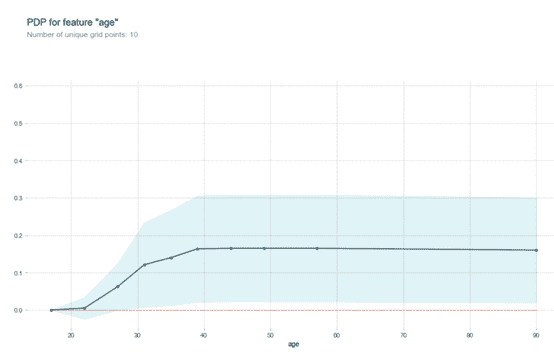

第一：y轴是预测结果的变化量。
第二：蓝色阴影区域代表了**置信**的大小。
从这幅图可以看出，age的增加肯定可以增加高收入概率，但是增加到一定的时候，对这个概率影响不大了。

**置信区间概念**

给定置信水平，根据估计值确定真实值可能出现的区间范围，该区间通常以估计值为中心，该区间则为置信区间。

```
`feature = 'education_num'
pdp_goals = pdp.pdp_isolate(model, X_train, df.columns, feature)
pdp.pdp_plot(pdp_goals, feature)
plt.show()` 
```

<figcaption></figcaption>

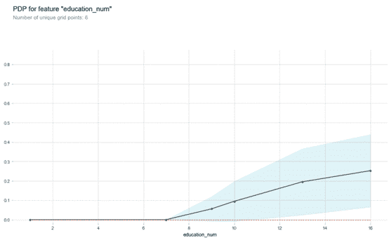

从这副图可以看出，受教育程度对收入起积极作用，随着受的教育越多，收入越高，也符合常人理解。

```
`fig, axes, summary_df_1 = info_plots.target_plot_interact(
    df=dataset, features=['age', 'education_num'], feature_names=['age', 'education_num'], target='income_level'
)` 
```

<figcaption></figcaption>

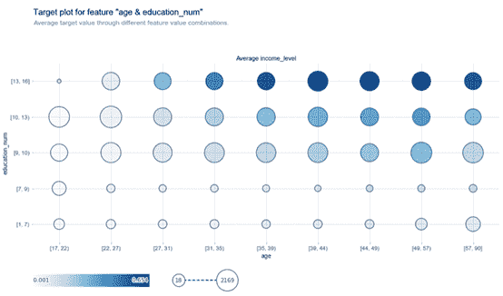

在此图表中，气泡大小不太重要，因为它与观测数量（事件发生的次数）有关。最重要的见解来自气泡的颜色，较暗的气泡意味着更高的默认概率。这是一个强大的工具，因为它可以深入了解我们选择的两个变量对因变量的影响。

```
`features_to_plot = ['age', 'education_num']
inter1  = pdp.pdp_interact(model, df, df.columns, features_to_plot)
pdp.pdp_interact_plot(inter1, features_to_plot, plot_type='grid', x_quantile=True, ncols = 2, plot_pdp=True)
plt.show()` 
```

<figcaption></figcaption>

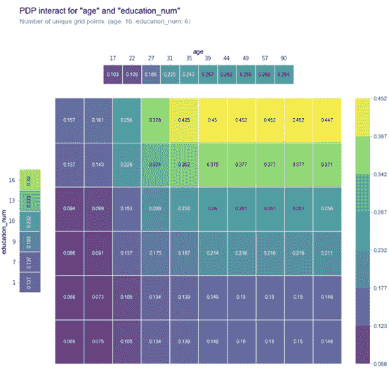

上图可以看出，受教育程度和年龄对收入水平有着正相关作用，且随着受教育程度增加，年龄从35-90，高收入的概率越来越大。

```
`fig, axes = pdp.pdp_interact_plot(
    inter1, ['age', 'education_num'], plot_type='contour', x_quantile=True, ncols=2, 
    plot_pdp=True
)` 
```

<figcaption></figcaption>

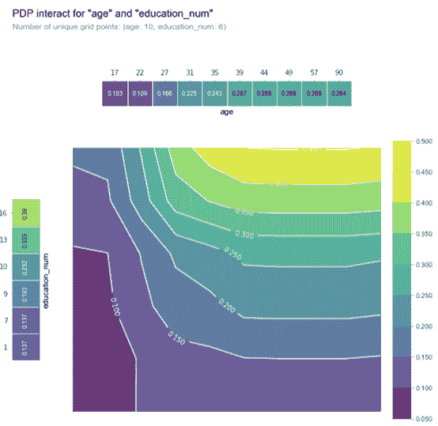

重要的是要记住，在该图中，较暗的颜色并不一定意味着较高的默认概率。在这里，我们绘制了受教育等级和年龄与收入等级概率。我们可以推断，在这两个自变量中，education_num起着更重要的作用，因为等高线图主要是垂直的，遵循x轴刻度标记（至少达到一个点）。

### ICE

部分依赖图（PDP）和个体条件期望图（ICE）说明了**一个或多个输入变量**与黑盒模型的**预测结果**之间的关系。它们都基于可视化，模型不可知的技术。ICE图可以更深入地探索个体差异并识别模型输入之间的**子组和相互作用**。

另一方面，ICE图使得可以深入到单个观察的水平。它们可以帮助探索个体差异，并确定模型输入之间的子组和交互。可以将每个ICE曲线视为一种模拟，显示如果改变特定观察的一个特征，模型预测会发生什么。为避免可视化过载，ICE图一次只显示一个模型变量。

可以将每个ICE曲线视为一种模拟，显示如果您改变特定观察的一个特征，模型预测会发生什么。如图9所示，通过在曲线变量的唯一值上复制个体观察并对每个重复进行评分，获得一个观察的ICE曲线。

下图中的PD图结果基本上是平坦的，给人的印象是X1与模型的预测之间没有关系。

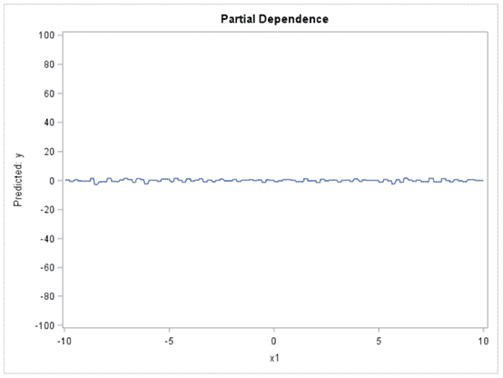

当我们观察ICE图时，它们呈现出一幅截然不同的图：这种关系对于一次观察非常正面，但对另一次观察则非常负面。因此，与PD图告诉我们的情况相反，ICE图显示X1实际上与目标有关；。基本上，ICE图分离PD功能（毕竟是平均值）以揭示相互作用和个体差异。

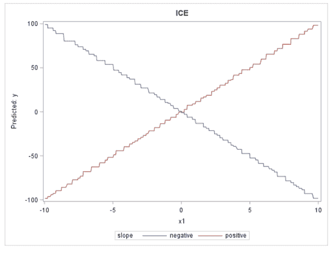

当对大数据集分析时，则可能需要进行一些调整。例如，可以对选定的变量进行分箱，也可以对数据集进行采样或分组。这些技术可以更快地提供实际图的合理近似值。

如果想进一步了解PD和ICE图，Ray Wright写了一篇很好的论文，展示了PD和ICE图如何用于比较和获得机器学习模型的洞察力，特别是所谓的“黑盒”算法，如随机森林，神经网络和梯度增强。在他的论文中，他还讨论了PD图的局限性，并提供了有关如何为大数据生成可缩放图的建议。https://www.sas.com/content/dam/SAS/support/en/sas-global-forum-proceedings/2018/1950-2018.pdf

### LIME

局部可解释不可知模型（LIME）是一种算法，它提供了一种新颖的技术，以可解释和可信任的方式解释任何预测模型的结果。它的工作原理是围绕想要解释的预测在本地训练可解释的模型。这个工作发表于2016年KDD的论文。工具学习地址。

**流程**：

*   训练模型，模型（记作 ff）可以是LR、NN、Wide and deep、C4.5 Decision tree、Random forest、GBDT等任意模型。

*   训练结束后我们需要解析模型，先选择一个待解析的样本，样本通过模型计算可以得到一个prediction（包含预测的label以及预测为1的probability），这时我们在这个样本的附近选择新的样本并用模型计算出多个prediction，这样样本组合新的样本集。

*   然后使用新的可解析的特征和prediction作为label来训练新的简单模型（例如LR），然后使用简单模型的权重作为这些特征的重要性作为输出。

**通俗来说**：

就是选择一个样本以及样本附近的点，然后训练一个简单模型来拟合，虽然简单模型不能在完整数据集上有效，但至少在这个点附近都是有效的，这个简单模型的特征是人类可解析的，而训练出的权重也可以表示特征重要性。

论文中算法描述:

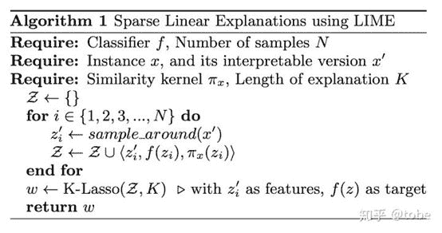

为了更好地理解LIME的工作原理，让我们考虑两种不同类型的可解释性：

*   **全局可解释性**：全局解释有助于我们理解由训练的响应函数建模的整个条件分布，但全局解释可以是近似的或基于平均值。

*   **局部可解释性**：局部解释促进对单个数据点或分布的小范围的理解，例如一组输入记录及其相应的预测。由于小范围的条件分布很可能是线性的，因此局部解释可能比全局解释更准确。LIME旨在提供局部可解释性，因此对于特定决策或结果最为准确。

我们希望解释器与模型无关，并且在局部可靠。局部可靠的解释捕获要解释的实例邻域中的分类器行为。为了学习局部解释，LIME使用可解释的模型近似分类器围绕特定实例的决策边界。LIME与模型无关，这意味着它将模型视为黑盒子，并且不对模型行为做出任何假设。这使得LIME适用于任何预测模型。

LIME的核心在于三个方面：

*   这里不对模型整体提供解释，而是局部对每一个样本单独进行解释

*   即使机器学习模型训练过程会产生一些抽象的特征，但是解释基于当前输入数据的变量特征

*   通过局部建立简单模型进行预测来对大多数重要特征进行解释

LIME作用在单个样本上。

**首先**，我们取出一个样本，并(permute)重复这个数据同时增加一些微小扰动，这样就得到了一个新的数据集，数据集中包含相似的样本，都基于取出来的那个样本。对于这个新数据集中的每一个样本，我们可以计算它跟取出的样本之间的相似性，即在permutation中它被调整了多大，所有的统计距离、相似性矩阵都可以用在这里，比如用指定宽度的指数内核将欧式距离转化为相似度。

**下一步**，使用最初训练的复杂模型，在新数据上进行预测。正因为新数据样本间的细微差别，我们可以跟踪那些微小扰动对预测结果的影响。

**最后**，我们在新数据上训练出一个简单模型（通常是线性模型），并使用最重要的特征进行预测。最重要的特征有不同的决定方法，在指定加入模型解释中的特征数量（通常在5到10附近）的前提下，可以

*   选择在使用复杂模型进行预测时回归拟合上具有最高权重的特征

*   运用正向选择，选择可以提高复杂模型的预测的回归拟合的变量

*   在复杂的机器学习模型预测的基础上，选择正则化的收缩率最小的lasso预测拟合的特征

*   使用不多于我们已经选择了的特征的节点数量来构建决策树

```
`## 创建LIME解释器
explainer = lime.lime_tabular.LimeTabularExplainer(X_train ,feature_names = features_name, class_names=['0','1'], categorical_features=data_cat_features, 
categorical_names=cat_columns, kernel_width=3)
predict_fn_xgb = lambda x: xgb.predict_proba(x).astype(float)
exp = explainer.explain_instance(X_test[2], predict_fn_xgb, num_features=6)
exp.show_in_notebook(show_all=False)` 
```


上图给我们解释了对于一个样本的预测结果，是哪些特征决定样本被分类到类别0，哪些特征决定样本被分类到类别1，且具体列出样本在这些特征的数值大小。很直观和明确的解释为什么模型做这个决定。

### SHAP

Shaply值由美国洛杉矶加州大学教授罗伊德·夏普利（Lloyd Shapley）提出，用于解决合作博弈的贡献和收益分配问题。N人合作中，单个成员的贡献不一样，收益分配也应该不一样。理想的分配方式是：贡献=收益；

贡献和收益分配是否有可以量化的方法呢？

Shapley方法就是这样一种方法：Shapley值：单个成员所得与自己的贡献相等。

<section style="text-align: center">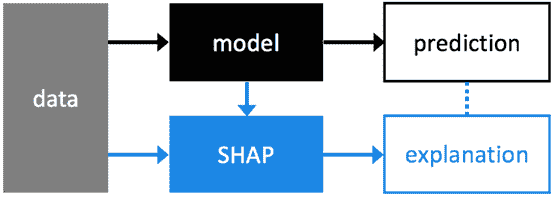</section>

<figcaption></figcaption>

基于Shap值的模型解释是一种和模型无关的方法。如上图，模型预测和Shap值解释是两个并行流程，Shap对模型预测的结果进行解释。NIPS 论文地址：A Unified Approach to Interpreting Model Predictions，也可以参考这篇博客：One Feature Attribution Method to (Supposedly) Rule Them All: Shapley Values。

原理：一个特征的shapley value是该特征在所有的特征序列中的平均边际贡献。

优点：

*   解决了多重共线性问题;

*   不仅考虑单个变量的影响，而且考虑变量组的影响，变量之间可能存在协同效应;

缺点：计算效率低。

适用范围：

*   计算个体的特征shapley value;

*   所有个体的每个特征的shapley value的绝对值求和或求平均即为整体的特征重要性;

**Shap方法的两大特性**

*   特征归因（收益）一致性:

    **定义**

*   模型改变（A->B），特征x的贡献不递减（增加或者保持现状），则归因（收益）也不递减;

    **特点**

*   特征作用越大（小），重要度越高（低）,和模型变化无关;

    **全局特征一致性**

*   mean(|Tree SHAP|): Shap值;

*   Gain : 特征用于划分时所带来的训练损失减益的平均值;

*   Split Count: 根据特征用于划分的次数计算重要性;

*   Permutation: 将特征的值随机排列，用排列前后的模型误差来计算重要性;

    **局部样本（Fever=yes,cough=yes的样本）一致性**

*   Saabas[5] : 树创建完成后,根据样本预测值，将父节点和子节点value的差异，作为父节点的特征重要性;

*   Tree SHAP : 基于Shap值矩阵（样本数*特征数），计算出Fever和Cough的重要性;

*   特征归因（收益）可加性:

    解释性方法如果具有**特征归因可加性**，特征重要性和模型预测值可以通过特征贡献的线性组合来表示。简单模型最好的解释是它本身；复杂模型，直接进行解释并不容易，需要通过代理模型来解释。接下来引入代理模型(解释模型)来描述特征归因可加性。

**树模型Shap值的解**


*   N为全体特征集合，S为N的一个排列子集（顺序相关）

*   求和第一项：排列数

*   求和第二项：对于任意子集S，特征i的贡献

*   特征i的shap值可以理解为i的贡献归因

详细内容参考论文。

**用Shap值识别特征交叉**

Shap方法计算两两特征交叉影响:


<figcaption></figcaption>

通俗理解：交叉影响=两个人合作贡献增益，减去各自单干的贡献；

**单个特征的贡献**

Shap方法计算单个特征的贡献（剔除交叉影响）:


通俗理解：个人影响=个人合作贡献，减去其它N-1个人的贡献；下面还是以收入水平数据集进行案例分析：

```
`row_to_show = 5
data_for_prediction = X_test.iloc[row_to_show]  # use 5 row of data here. Could use multiple rows if desired
data_for_prediction_array = data_for_prediction.values.reshape(1, -1)

# 计算model的shap值
explainer = shap.TreeExplainer(model)
# 计算样本数据的shap值
shap_values = explainer.shap_values(data_for_prediction)

shap.initjs()
shap.force_plot(explainer.expected_value[1], shap_values[1], data_for_prediction)` 
```

<figcaption></figcaption>


**图形解释**

*   Base value :模型在数据集上的输出均值：-0.1524

*   Output value:模型在单个样本的输出值：0.68

*   起正向作用的特征：marital_status2、occupation3

*   起负向作用的特征：capital_gain、education_num

**特征解释**

*   解释Output value（单个样本）和Base value（全体样本Shap平均值)的差异，以及差异是由哪些特征造成的

*   红色是起正向作用的特征，蓝色是起负向作用的特征

```
`shap_values_b = explainer.shap_values(X_test)
shap.force_plot(explainer.expected_value[0], shap_values_b[0], X_test, link="logit")` 
```

<figcaption></figcaption>


**特征解释**

*   解释Output value和Base value的差异，以及差异是由哪些特征造成的

Summary Plots:

```
`shap_values = explainer.shap_values(X_test)
shap.summary_plot(shap_values[1], X_test)` 
```

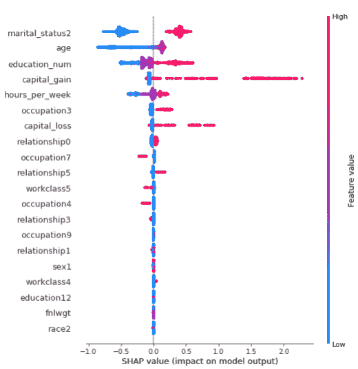

<figcaption></figcaption>

**图形解释**

*   每个点是一个样本（人），图片中包含所有样本

*   X轴：样本按Shap值排序-

*   Y轴：特征按Shap值排序

*   颜色：特征的数值越大，越红

**特征解释**：

*   martial_status2这个特征最重要，且值越大，收入会相对更高，到达一定峰值，会明显下降

*   年龄也是影响结果的重要特征，年龄小收入普遍低，但年龄到达一定程度，并不会增加收入，存在年龄小，收入高的人群。

*   收入水平和capital_gain大致呈正相关。

```
`shap.summary_plot(shap_values[1],X_test, plot_type="bar")` 
```


上图是特征重要性图谱，由上向下重要性依次减弱。

```
`shap_values = explainer.shap_values(df)
shap.dependence_plot('age', shap_values[1], df, interaction_index="capital_gain")` 
```

<figcaption></figcaption>

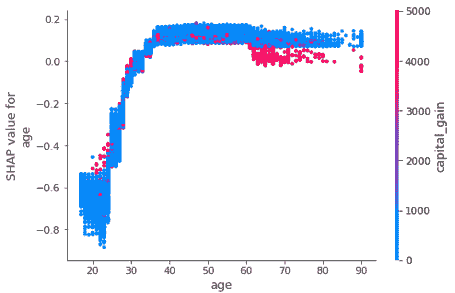

**图形解释:**

*   X轴：age

*   Y轴（左）：一个样本的age对应的Shap值

*   颜色：capital_gain越大越红

**特征解释**:

*   排除所有特征的影响，描述age和capital_gain的关系。

*   年龄大的人更趋向于有大的资本收益，小部分年轻人有大的资本收益。

### RETAIN

**概述**

论文使用称为RETAIN的建模策略解决了这个限制，这是一种两级神经网络顺序数据的注意模型，提供对预测结果的详细解释保持与RNN相当的预测精度。为此，RETAIN依赖于关注机制被建模以表示在遭遇期间医生的行为。一个区别RETAIN的功能（参见图1）是利用注意力生成来利用序列信息机制，同时学习可解释的表示。并模仿医生的行为，RETAIN以相反的时间顺序检查患者的过去访问，从而促进更稳定的注意后代。因此，RETAIN会识别最有意义的访问次数并量化访问量有助于预测的功能。


<figcaption></figcaption>

模型使用两套权重，一套是visit-level attention ，另外一套是variable-level attention。使用两个RNN网络分别产生。

Step1：使用线性embedding
Step2：产生visit-level attention。其中输入RNN中的数据采用时间逆序输入。对于稀疏的attention，使用Sparsemax而不是Softmax。
Step3：产生variable-levelattention，其中输入RNN中的数据采用时间逆序输入。
Step4：根据以上两步生成的attentionweight，生成context vector。Ci表示病人第i次visit。
Step5：根据Context Vector生成预测结果。

### LRP

逐层相关性传播（LRP）是一种通过在神经网络中运行反向传递来识别重要像素的方法。向后传递是保守的相关再分配过程，其中对较高层贡献最大的神经元从其获得最大相关性。LRP程序如下图所示。


该方法可以在大多数编程语言中容易地实现并且集成到现有的神经网络框架中。当应用于深度ReLU网络时，LRP可以被理解为预测的深度泰勒分解。

这里有如何实现LRP用于解释深度模型的代码教程，有兴趣可以动手实现，用于解释自己的深度模型。

# 参考文献

*   Interpretable Machine Learning

    https://christophm.github.io/interpretable-ml-book/pdp.html

*   Partial dependence ——集成树的可解析性

    https://zhuanlan.zhihu.com/p/40356430

*   Machine Learning for Insights Challenge

    https://zhuanlan.zhihu.com/p/45898896

*   https://yyqing.me/post/2018/2018-09-25-kaggle-model-insights

*   http://rstudio-pubs-static.s3.amazonaws.com/283647_c3ab1ccee95a403ebe3d276599a85ab8.html

*   《通向人类可理解、可解释的人工智能》

*   https://github.com/lopusz/awesome-interpretable-machine-learning

*   https://github.com/jphall663/awesome-machine-learning-interpretability

*   https://github.com/Henrilin28/awesome-Interpretable-ML

*   http://xiangruix.com/2018/07/31/lime/

*   https://www.jianshu.com/p/b52efa66154e

*   https://zhuanlan.zhihu.com/p/32891505

*   https://suensummit.github.io/intro-lime/#1

*   https://www.oreilly.com/learning/introduction-to-local-interpretable-model-agnostic-explanations-lime

*   https://github.com/slundberg/shap

*   http://km.oa.com/group/22630/articles/show/380452?kmref=search&from_page=1&no=1

感谢 **zizhewang(汪子哲)** 同学协助整理本文，汇总对机器学习模型可解释性相关资料。


</section>