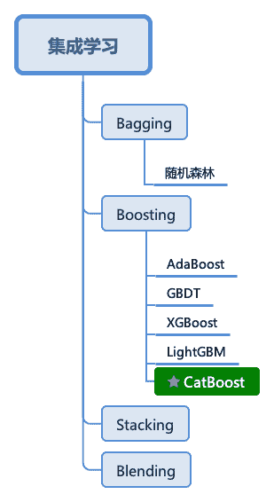
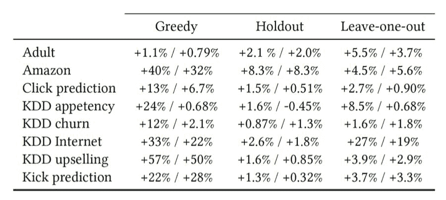
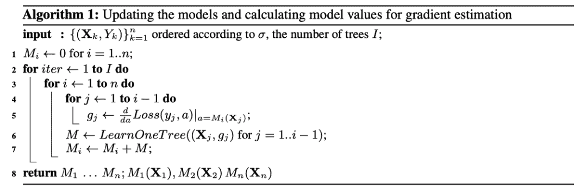
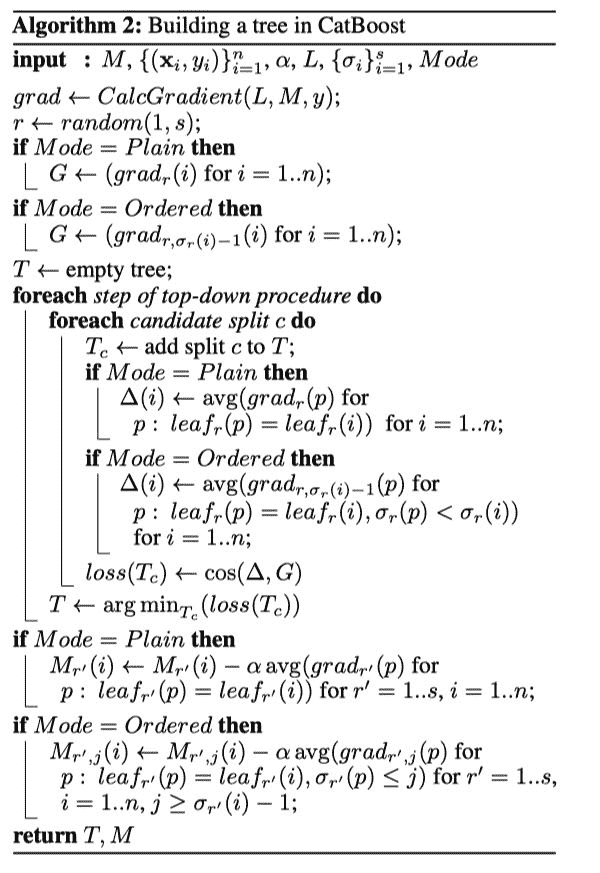

<section>

点击上方“**Datawhal****e**”，选择“星标”公众号

第一时间获取价值内容

<section>


</section>

<section>

<section style="text-align: left">

<section>

<section>

<section>

<section style="text-align: justify">

**CatBoost**

</section>

</section>

</section>

</section>

</section>

</section>

<section>CatBoost是俄罗斯的搜索巨头Y andex在2017年开源的机器学习库，也是Boosting族算法的一种，同前面介绍过的XGBoost和LightGBM类似，依然是在GBDT算法框架下的一种改进实现，是一种基于对称决策树（oblivious trees）算法的参数少、支持类别型变量和高准确性的GBDT框架，主要说解决的痛点是高效合理地处理类别型特征，这个从它的名字就可以看得出来，CatBoost是由catgorical和boost组成，另外是处理梯度偏差（Gradient bias）以及预测偏移（Prediction shift）问题，提高算法的准确性和泛化能力。</section>



<section style="text-align: center">集成学习</section>

<section>CatBoost主要有以下五个特性：</section>

*   <section>无需调参即可获得较高的模型质量，采用默认参数就可以获得非常好的结果，减少在调参上面花的时间</section>

*   <section>支持类别型变量，无需对非数值型特征进行预处理</section>

*   <section>快速、可扩展的GPU版本，可以用基于GPU的梯度提升算法实现来训练你的模型，支持多卡并行</section>

*   <section>提高准确性，提出一种全新的梯度提升机制来构建模型以减少过拟合</section>

*   <section>快速预测，即便应对延时非常苛刻的任务也能够快速高效部署模型</section>

<section>CatBoost的主要算法原理可以参照以下两篇论文：</section>

*   <section>

    <section>Anna Veronika Dorogush, Andrey Gulin, Gleb Gusev, Nikita Kazeev, Liudmila Ostroumova Prokhorenkova, Aleksandr Vorobev "Fighting biases with dynamic boosting". arXiv:1706.09516, 2017</section>

    </section>

*   <section>

    <section>Anna Veronika Dorogush, Vasily Ershov, Andrey Gulin "CatBoost: gradient boosting with categorical features support". Workshop on ML Systems at NIPS 2017

    </section>

    </section>

<section>

<section style="text-align: left">

<section>

<section>

<section>

<section style="text-align: justify">

**Categorical features**

</section>

</section>

</section>

</section>

</section>

</section>

<section>所谓类别型变量（Categorical features）是指其值是离散的集合且相互比较并无意义的变量，比如用户的ID、产品ID、颜色等。 因此，这些变量无法在二叉决策树当中直接使用。 常规的做法是将这些类别变量通过预处理的方式转化成数值型变量再喂给模型，比如用一个或者若干个数值来代表一个类别型特征。</section>

<section>目前广泛用于**低势**（一个有限集的元素个数是一个自然数）类别特征的处理方法是 `One-hot encoding` ： 将原来的特征删除，然后对于每一个类别加一个0/1的用来指示是否含有该类别的数值型特征。 `One-hot encoding` 可以在数据预处理时完成，也可以在模型训练的时候完成，从训练时间的角度，后一种方法的实现更为高效，CatBoost对于低势类别特征也是采用后一种实现。</section>

<section>显然，在**高势**特征当中，比如 `user ID` ，这种编码方式会产生大量新的特征，造成维度灾难。 一种折中的办法是可以将类别分组成有限个的群体再进行 `One-hot encoding` 。 一种常被使用的方法是根据目标变量统计（Target Statistics，以下简称TS）进行分组，目标变量统计用于估算每个类别的目标变量期望值。 甚至有人直接用TS作为一个新的数值型变量来代替原来的类别型变量。 重要的是，可以通过对TS数值型特征的阈值设置，基于对数损失、基尼系数或者均方差，得到一个对于训练集而言将类别一分为二的所有可能划分当中最优的那个。 在LightGBM当中，类别型特征用每一步梯度提升时的梯度统计（Gradient Statistics，以下简称GS）来表示。 虽然为建树提供了重要的信息，但是这种方法有以下两个缺点：</section>

*   <section>增加计算时间，因为需要对每一个类别型特征，在迭代的每一步，都需要对GS进行计算；</section>

*   <section>增加存储需求，对于一个类别型变量，需要存储每一次分离每个节点的类别。</section>

<section>为了克服这些缺点，LightGBM以损失部分信息为代价将所有的长尾类别归位一类，作者声称这样处理高势特征时比起 `One-hot encoding` 还是好不少。 不过如果采用TS特征，那么对于每个类别只需要计算和存储一个数字。</section>

<section>如此看到，采用TS作为一个新的数值型特征是最有效、信息损失最小的处理类别型特征的方法。 TS也被广泛采用，在点击预测任务当中，这个场景当中的类别特征有用户、地区、广告、广告发布者等。 接下来我们着重讨论TS，暂时将 `One-hot encoding` 和GS放一边。</section>

<section>**Target statistics**</section>

<section>一个有效和高效的处理类别型特征 的方式是用一个与某些TS相等的数值型变量 来代替第 个训练样本的类别 。 通常用基于类别的目标变量 的期望来进行估算： 。</section>

<section>**Greedy TS**</section>

<section>估算 最直接的方式就是用训练样本当中相同类别 的目标变量 的平均值。</section>

<section style="text-align: center"><embed style="width: 20.127ex" src="https://mmbiz.qlogo.cn/mmbiz_svg/3a3QxMHZ8YxfaUIIic9J4Cx3bfN0lMFxV9hmCnfXYT163siaOm2HAmTJKwdRNiartpkOYRvElbarhU6icebvcQh71bndWEQ7A10f/0?wx_fmt=svg"></section>

<section>显然，这样的处理方式很容易引起过拟合。 举个例子，假如在整个训练集当中所有样本的类别 都互不相同，即 个样本有 个类别，那么新产生的数值型特征的值将与目标变量的值相同。 某种程度上，这是一种目标穿越（target leakage），非常容易引起过拟合。 比较好的一种做法是采用一个先验概率 进行平滑处理：</section>

<section style="text-align: center"><embed style="width: 25.605ex" src="https://mmbiz.qlogo.cn/mmbiz_svg/3a3QxMHZ8YxfaUIIic9J4Cx3bfN0lMFxVp5Q6OQibRO3GEuOT6Qt89ZCrZ9FcJ9d5vAvH3JSjGyM6SCawxicq913JI7hobH58Qn/0?wx_fmt=svg"></section>

<section>其中 是先验概率 的权重，而对于先验概率，通常的做法是设置为数据集当中目标变量的平均值。</section>

<section>不过这样的平滑处理依然无法完全避免目标穿越： 特征 是通过自变量 的目标 计算所得。 这将会导致条件偏移： 对于训练集和测试集， 的分布会有所不同。 再举个例子，假设第 个特征为类别型特征，并且特征所有取值为无重复的集合，然后对于每一个类别 ，对于一个分类任务，我们有 。 然后在训练集当中， ，于是用阈值 就可以仅用一次分裂就训练集完美分开。 但是，对于测试集，因为还无法判断此时目标变量的类别，所以这一项 ，最后得到的TS值为 ，并且得到的模型在$p</section>

<section style="text-align: center"><embed style="width: 31.34ex" src="https://mmbiz.qlogo.cn/mmbiz_svg/3a3QxMHZ8YxfaUIIic9J4Cx3bfN0lMFxVeDKz7LXWZTz7sKFBcqlERqLxI9C2frMVTiaoh3ghcicvJx86on3Mib32hSoIrOsyQ9v/0?wx_fmt=svg"></section>

<section>其中， 是第 个训练样本。</section>

<section>在我们的例子当中，<embed style="width: 16.939ex" src="https://mmbiz.qlogo.cn/mmbiz_svg/3a3QxMHZ8YxfaUIIic9J4Cx3bfN0lMFxVib1FA9w6T0jKWSt597fW504pSCDicjmMBYEuOAgaGnA4V8lWTlPg69SeYgK82Qianibd/0?wx_fmt=svg">，  ，显然无法满足上述条件。</section>

<section>**Holdout TS**</section>

<section>留出TS，就是将训练集一分为二： ，然后根据下式用 来计算TS，并将 作为训练样本。</section>

<section style="text-align: center"><embed style="width: 27.753ex" src="https://mmbiz.qlogo.cn/mmbiz_svg/3a3QxMHZ8YxfaUIIic9J4Cx3bfN0lMFxVkvyibCpVNFeoMbH511qp4NvbU2qc1k6nE76ia6PdBMJIF0n8uicNu50xzUfL2nPdBoK/0?wx_fmt=svg"></section>

<section>这样处理能够满足同分布的问题，但是却大大减少了训练样本的数量。</section>

<section>**Leave-one-out TS**</section>

<section>初看起来，留一TS（Leave-one-out TS）能够非常好地工作：</section>

*   <section>对于训练样本：</section>

*   <section>对于测试样本：</section>

<section>但事实上，这并没有给预防target leakage带来多少益处。 举个例子，考虑一个常数类别型特征： 对于所有的样本， ，在二分类的条件下，让 表示 的样本数量，则有：</section>

*   <section>对于测试样本：</section>

<section>此时，同样可以用阈值 将训练集完美的分类。</section>

<section>**Ordered TS**</section>

<section>从在线学习按照时间序列获得样本得到的启发，CatBoost依靠排序原则，采用了一种更为有效的策略。 主要有以下几个步骤：</section>

*   <section>产生一个随机排列顺序 并对数据集进行编号</section>

*   <section>对于训练样本：</section>

*   <section>对于测试样本：</section>

*   <section>根据带先验概率的Greedy TS计算</section>

<section>这样计算得到的 Ordered TS能够满足P1，同时也能够使用所有的训练样本。 且比在线学习的划窗（sliding window）处理能够进一步减小 的方差。 需要注意的是，CatBoost在不同的迭代上会采用不同的排列顺序。</section>

<section>下面是Ordered TS与其它各种TS在不同数据集上面在logloss/zero-one loss上面的效果比较：</section>



<section style="text-align: center">TS比较</section>

<section>**特征组合**</section>

<section>CatBoost的另外一项重要实现是将不同类别型特征的组合作为新的特征，以获得高阶依赖（high-order dependencies），比如在广告点击预测当中用户ID与广告话题之间的联合信息，又或者在音乐推荐引用当中，用户ID和音乐流派，如果有些用户更喜欢摇滚乐，那么将用户ID和音乐流派分别转换为数字特征时，这种用户内在的喜好信息就会丢失。 然而，组合的数量会随着数据集中类别型特征的数量成指数增长，因此在算法中考虑所有组合是不现实的。 为当前树构造新的分割点时，CatBoost会采用贪婪的策略考虑组合。 对于树的第一次分割，不考虑任何组合。 对于下一个分割，CatBoost将当前树的所有组合、类别型特征与数据集中的所有类别型特征相结合，并将新的组合类别型特征动态地转换为数值型特征。 CatBoost还通过以下方式生成数值型特征和类别型特征的组合： 树中选定的所有分割点都被视为具有两个值的类别型特征，并像类别型特征一样地被进行组合考虑。

</section>

<section>

<section style="text-align: left">

<section>

<section>

<section>

<section style="text-align: justify">

**Gradient bias**

</section>

</section>

</section>

</section>

</section>

</section>

<section>CatBoost，和所有标准梯度提升算法一样，都是通过构建新树来拟合当前模型的梯度。 然而，所有经典的提升算法都存在由有偏的点态梯度估计引起的过拟合问题。 在每个步骤中使用的梯度都使用当前模型中的相同的数据点来估计，这导致估计梯度在特征空间的任何域中的分布与该域中梯度的真实分布相比发生了偏移，从而导致过拟合。 为了解决这个问题，CatBoost对经典的梯度提升算法进行了一些改进，简要介绍如下：</section>

<section>在许多利用GBDT框架的算法（例如，XGBoost、LightGBM）中，构建下一棵树分为两个阶段： 选择树结构和在树结构固定后计算叶子节点的值。 为了选择最佳的树结构，算法通过枚举不同的分割，用这些分割构建树，对得到的叶子节点中计算值，然后对得到的树计算评分，最后选择最佳的分割。 两个阶段叶子节点的值都是被当做梯度或牛顿步长的近似值来计算。 在CatBoost中，第二阶段使用传统的GBDT框架执行，第一阶段使用修改后的版本。</section>

<section>既然原来的梯度估计是有偏的，那么能不能改成无偏估计呢？</section>

<section>设 为构建 棵树后的模型， 为构建 棵树后第 个训练样本上面的梯度值。 为了使得  无偏于模型  ，我们需要在没有 参与的情况下对模型 进行训练。 由于我们需要对所有训练样本计算无偏的梯度估计，乍看起来对于 的训练不能使用任何样本，貌似无法实现的样子。 我们运用下面这个技巧来处理这个问题： 对于每一个样本 ，我们训练一个单独的模型 ，且该模型从不使用基于该样本的梯度估计进行更新。 我们使用 来估计 上的梯度，并使用这个估计对结果树进行评分。 用伪码描述如下，其中 是需要优化的损失函数， 是标签值，  是公式计算值。</section>



<section style="text-align: center">Gradient bias</section>

<section>值得注意的是 模型的建立并没有样本  的参与，并且CatBoost中所有的树 的共享同样的结构。</section>

<section>在CatBoost中，我们生成训练数据集的 个随机排列。 采用多个随机排列是为了增强算法的鲁棒性，这在前面的Odered TS当中对于类别型特征的处理有介绍到： 针对每一个随机排列，计算得到其梯度，为了与Ordered TS保持一致，这里的排列与用于计算Ordered TS时的排列相同。 我们使用不同的排列来训练不同的模型，因此不会导致过拟合。 对于每个排列 ，我们训练 个不同的模型 ，如上所示。 这意味着为了构建一棵树，需要对每个排列存储并重新计算，其时间复杂度近似于 ： 对于每个模型 ，我们必须更新 。 因此，时间复杂度变成 。 当然，在具体实现当中，CatBoost使用了其它的技巧，可以将构建一个树的时间复杂度降低到 。

</section>

<section>

<section style="text-align: left">

<section>

<section>

<section>

<section style="text-align: justify">

**Prediction shift**

</section>

</section>

</section>

</section>

</section>

</section>

<section>预测偏移（Prediction shift）是由上一节所讨论的梯度偏差造成的。 本节希望用数学语言严格地对预测偏差进行描述和分析。</section>

<section>首先来看下梯度提升的整体迭代过程：</section>

*   <section>对于梯度提升： <embed style="width: 42.097ex" src="https://mmbiz.qlogo.cn/mmbiz_svg/3a3QxMHZ8YxfaUIIic9J4Cx3bfN0lMFxVX8eDdjWfLPV3HwicZzavyhV2oIxe0LYAdbfiaDSlgyTdxJrSe3Bd4jmden7VoWvh4s/0?wx_fmt=svg"></section>

*   <section><embed style="width: 25.484ex" src="https://mmbiz.qlogo.cn/mmbiz_svg/3a3QxMHZ8YxfaUIIic9J4Cx3bfN0lMFxVrpBfXV6bB5Eb7RxLMBJGfNO7eHibZlfibycywPWG2mreCHr61giaIrTum7lmKicbBEiad/0?wx_fmt=svg"></section>

*   <section><embed style="width: 32.15ex" src="https://mmbiz.qlogo.cn/mmbiz_svg/3a3QxMHZ8YxfaUIIic9J4Cx3bfN0lMFxVjR1xYPJp5TM5BDxRBr7h9BTxAqavII53Vf4BmvMUMzgVh2msMy5ylXw5MCCxmGQH/0?wx_fmt=svg"></section>

*   <section><embed style="width: 41.822ex" src="https://mmbiz.qlogo.cn/mmbiz_svg/3a3QxMHZ8YxfaUIIic9J4Cx3bfN0lMFxVwJXtumQH3jFNkMeDNiaeVwrn0mqoupsck37k3MzV1ia0mxo3tK47Kia9UzbA2wR3Mt2/0?wx_fmt=svg"></section>

<section>在这个过程当中，偏移是这样发生的：</section>

*   <section>根据 进行随机计算的条件分布 与测试集的分布 发生偏移</section>

*   <section>这样导致基学习器 与  产生偏差</section>

*   <section>最后影响模型 的泛化能力</section>

<section>下面以一个回归任务为例，从理论上分析计算偏差的值。</section>

<section>假设以下边界条件：</section>

*   <section>损失函数：</section>

*   <section>两个相互独立的特征 ，随机变量，符合伯努利分布，先验概率</section>

*   <section>目标函数：</section>

*   <section>梯度提升迭代次数为2</section>

*   <section>树深度为1</section>

*   <section>学习率：</section>

<section>最后得到的模型为： ，其中 分别基于 和  。</section>

<section>区分数据集是否独立，我们有以下两个推论：</section>

*   <section>如果使用了规模为 的两个独立数据集 和  来分别估算  和 ，则对于任意 ，有： <embed style="width: 30.377ex" src="https://mmbiz.qlogo.cn/mmbiz_svg/3a3QxMHZ8YxfaUIIic9J4Cx3bfN0lMFxVWhUk9a56KzyOPOOW5lnHDoKhCcPeH9cbwFnr4zHGlf4G7Yk2PJqXZdAM8rKPVPicC/0?wx_fmt=svg"></section>

*   <section>如果使用了相同的数据集 来估算  和 ，则有： <embed style="width: 47.564ex" src="https://mmbiz.qlogo.cn/mmbiz_svg/3a3QxMHZ8YxfaUIIic9J4Cx3bfN0lMFxVv5SO0ZLNZlsP4SbXfsv9jvicHib7zeMYM0W2GTNpnMFz55rxjYBqxn8tEG2ibuYxUqY/0?wx_fmt=svg"></section>

<section>显然，偏差部分 与数据集的规模 成反比，与映射关系 也有关系，在我们的例子当中，与 成正比。

</section>

<section>

<section style="text-align: left">

<section>

<section>

<section>

<section style="text-align: justify">

**Ordered boosting**

</section>

</section>

</section>

</section>

</section>

</section>

<section>为了克服上一节所描述的预测偏移问题，我们提出了一种新的叫做Ordered boosting的算法。 假设用 棵树来学习一个模型，为了确保 无偏，需要确保模型 的训练没有用到样本 。 由于我们需要对所有训练样本计算无偏的梯度估计，乍看起来对于 的训练不能使用任何样本，貌似无法实现的样子，但是事实上可以通过一些技巧来进行克服，具体的算法在前面已经有所描述，而且是作者较新的论文当中的描述，这里不再赘述。 本节主要讲讲Ordered boosting的具体实现。</section>

<section>Ordered boosting算法好是好，但是在大部分的实际任务当中都不具备使用价值，因为需要训练 个不同的模型，大大增加的内存消耗和时间复杂度。 在CatBoost当中，我们实现了一个基于GBDT框架的修改版本。</section>

<section>前面提到过，在传统的GBDT框架当中，构建下一棵树分为两个阶段： 选择树结构和在树结构固定后计算叶子节点的值。 CatBoost主要在第一阶段进行优化。</section>

<section>**First phase**</section>

<section>在建树的阶段，CatBoost有两种提升模式，Ordered和Plain。 Plain模式是采用内建的ordered TS对类别型特征进行转化后的标准GBDT算法。 Ordered则是对Ordered boosting算法的优化。</section>

<section>**Ordered boosting mode**</section>

<section>一开始，CatBoost对训练集产生 个独立的随机序列。 序列 用来评估定义树结构的分裂， 用来计算所得到的树的叶子节点的值。 因为，在一个给定的序列当中，对于较短的序列，无论是TS的计算还是基于Ordered boosting的预测都会有较大的方差，所以仅仅用一个序列可能引起最终模型的方差，这里我们会有多个序列进行学习。</section>

<section>CatBoost采用对称树作为基学习器，对称意味着在树的同一层，其分裂标准都是相同的。 对称树具有平衡、不易过拟合并能够大大减少测试时间的特点。 建树的具体算法如下伪码描述。</section>



<section style="text-align: center">Building a tree in CatBoost</section>

<section>在Ordered boosting模式的学习过程当中，我们维持一个模型 ，其中 表示基于在序列 当中的前 个样本学习得到的模型对于第 个样本的预测。 在算法的每一次迭代 ，我们从 当中抽样一个随机序列 ，并基于此构建第 步的学习树 。 然后，基于 ，计算相应的梯度<embed style="width: 26.071ex" src="https://mmbiz.qlogo.cn/mmbiz_svg/3a3QxMHZ8YxfaUIIic9J4Cx3bfN0lMFxVS1Otcxy1oT41aGqHVOibsp0tyUgUhsjohB0A4KtoxGc3js1kQwe3bibgpia2Icl9ZzR/0?wx_fmt=svg">。 接下来，我们会用余弦相似度来近似梯度 ，其中对于每一个样本 ，我们取梯度 。 在候选分裂评估过程当中，第 个样本的叶子节点的值 由与 同属一个叶子的 的所有样本的前 个样本的梯度值 求平均得到。 需要注意的是， 取决于选定的序列 ，因为 会影响第 个样本的Ordered TS。 当树 的结构确定以后，我们用它来提升所有的模型 ，我们需要强调下，一个相同的树结构 会被用于所有的模型，但是会根据 和  的不同设置不同的叶子节点的值以后应用于不同的模型。</section>

<section>**Plain boosting mode**</section>

<section>Plain boosting模式的算法与标准GBDT流程类似，但是如果出现了类别型特征，它会基于 得到的TS维持 个支持模型 。</section>

<section>**Second phase**</section>

<section>当所有的树结构确定以后，最终模型的叶子节点值的计算与标准梯度提升过程类似。 第 个样本与叶子 进行匹配，我们用 来计算这里的TS。 当最终模型 在测试期间应用于新的样本，我们采用整个训练集来计算TS。

</section>

<section>

<section style="text-align: left">

<section>

<section>

<section>

<section style="text-align: justify">

**GPU加速**

</section>

</section>

</section>

</section>

</section>

</section>

<section>就GPU内存使用而言，CatBoost至少与LightGBM一样有效，CatBoost的GPU实现可支持多个GPU，分布式树学习可以通过样本或特征进行并行化。

</section>

<section>

<section style="text-align: left">

<section>

<section>

<section>

<section style="text-align: justify">

**sklearn参数**

</section>

</section>

</section>

</section>

</section>

</section>

<section>`sklearn` 本身的文档当中并没有CatBoost的描述， CatBoost python-reference_parameters-list 上面看到主要参数如下：</section>

*   <section>`iterations` : 迭代次数， 解决机器学习问题能够构建的最大树的数目，default=1000</section>

*   <section>`learning_rate` : 学习率，default=0.03</section>

*   <section>`depth` : 树的深度，default=6</section>

*   <section>`l2_leaf_reg` :  正则化数，default=3.0</section>

*   <section>`model_size_reg` :模型大小正则化系数，数值越到，模型越小，仅在有类别型变量的时候起作用，取值范围从0到 ，GPU计算时不可用， default=None</section>

*   <section>`rsm` : =None,</section>

*   <section>`loss_function` : 损失函数，字符串 (分类任务，default= `Logloss` ，回归任务，default= `RMSE` )</section>

*   <section>`border_count` : 数值型变量的分箱个数</section>

*   *   <section>CPU： 1～65535的整数，default=254</section>

    *   <section>GPU： 1～255的整数，default=128</section>

*   <section>`feature_border_type` : 数值型变量分箱个数的初始量化模式，default=GreedyLogSum</section>

*   *   <section>Median</section>

    *   <section>Uniform</section>

    *   <section>UniformAndQuantiles</section>

    *   <section>MaxLogSum</section>

    *   <section>MinEntropy</section>

    *   <section>GreedyLogSum</section>

*   <section>`per_float_feature_quantization` : 指定特定特征的分箱个数，default=None,</section>

*   <section>`input_borders` =None,</section>

*   <section>`output_borders` =None,</section>

*   <section>`fold_permutation_block` : 对数据集进行随机排列之前分组的block大小，default=1</section>

*   <section>`od_pval` : 过拟合检测阈值，数值越大，越早检测到过拟合，default=0</section>

*   <section>`od_wait` : 达成优化目标以后继续迭代的次数，default=20</section>

*   <section>`od_type` : 过拟合检测类型，default=IncToDec</section>

*   *   <section>IncToDec</section>

    *   <section>Iter</section>

*   <section>`nan_mode` : 缺失值的预处理方法，字符串类型，default=Min</section>

*   *   <section>`Forbidden` : 不支持缺失值</section>

    *   <section>`Min` : 缺失值赋值为最小值</section>

    *   <section>`Max` : 缺失值赋值为最大值</section>

*   <section>`counter_calc_method` : 计算Counter CTR类型的方法，default=None</section>

*   <section>`leaf_estimation_iterations` : 计算叶子节点值时候的迭代次数，default=None,</section>

*   <section>`leaf_estimation_method` : 计算叶子节点值的方法，default=Gradient</section>

*   *   <section>Newton</section>

    *   <section>Gradient</section>

*   <section>`thread_count` : 训练期间的进程数，default=-1，进程数与部件的核心数相同</section>

*   <section>`random_seed` : 随机数种子，default=0</section>

*   <section>`use_best_model` : 如果有设置 `eval_set` 设置了验证集的话可以设为True，否则为False</section>

*   <section>`verbose` : 是否显示详细信息，default=1</section>

*   <section>`logging_level` : 打印的日志级别，default=None</section>

*   <section>`metric_period` : 计算优化评估值的频率，default=1</section>

*   <section>`ctr_leaf_count_limit` : 类别型特征最大叶子数，default=None</section>

*   <section>`store_all_simple_ctr` : 是否忽略类别型特征，default=False</section>

*   <section>`max_ctr_complexity` : 最大特征组合数，default=4</section>

*   <section>`has_time` : 是否采用输入数据的顺序，default=False</section>

*   <section>`allow_const_label` : 使用它为所有对象用具有相同标签值的数据集训练模型，default=None</section>

*   <section>`classes_count` : 多分类当中类别数目上限，defalut=None</section>

*   <section>`class_weights` : 类别权重，default=None</section>

*   <section>`one_hot_max_size` : one-hot编码最大规模，默认值根据数据和训练环境的不同而不同</section>

*   <section>`random_strength` : 树结构确定以后为分裂点进行打分的时候的随机强度，default=1</section>

*   <section>`name` : 在可视化工具当中需要显示的实验名字</section>

*   <section>`ignored_features` : 在训练当中需要排除的特征名称或者索引，default=None</section>

*   <section>`train_dir` : 训练过程当中文件保存的目录</section>

*   <section>`custom_loss` : 用户自定义的损失函数</section>

*   <section>`custom_metric` : 自定义训练过程当中输出的评估指标，default=None</section>

*   <section>`eval_metric` : 过拟合检测或者最优模型选择的评估指标</section>

*   *   <section>loss-functions</section>

*   <section>`bagging_temperature` : 贝叶斯bootstrap强度设置，default=1</section>

*   <section>`save_snapshot` : 训练中断情况下保存快照文件</section>

*   <section>`snapshot_file` : 训练过程信息保存的文件名字</section>

*   <section>`snapshot_interval` : 快照保存间隔时间，单位秒</section>

*   <section>`fold_len_multiplier` : 改变fold长度的系数，default=2</section>

*   <section>`used_ram_limit` : 类别型特征使用内存限制，default=None</section>

*   <section>`gpu_ram_part` : GPU内存使用率，default=0.95</section>

*   <section>`allow_writing_files` : 训练过程当中允许写入分析和快照文件，default=True</section>

*   <section>`final_ctr_computation_mode` : Final CTR计算模式</section>

*   <section>`approx_on_full_history` : 计算近似值的原则，default=False</section>

*   <section>`boosting_type` : 提升模式</section>

*   *   <section>Ordered</section>

    *   <section>Plain</section>

*   <section>`simple_ctr` : 单一类别型特征的量化设置</section>

*   *   <section>CtrType</section>

    *   <section>TargetBorderCount</section>

    *   <section>TargetBorderType</section>

    *   <section>CtrBorderCount</section>

    *   <section>CtrBorderType</section>

    *   <section>Prior</section>

*   <section>`combinations_ctr` : 组合类别型特征的量化设置</section>

*   *   <section>CtrType</section>

    *   <section>TargetBorderCount</section>

    *   <section>TargetBorderType</section>

    *   <section>CtrBorderCount</section>

    *   <section>CtrBorderType</section>

    *   <section>Prior</section>

*   <section>`per_feature_ctr` : 以上几个参数的设置具体可以细看下面的文档</section>

*   *   <section>Categorical features</section>

*   <section>`task_type` : 任务类型，CPU或者GPU，default=CPU</section>

*   <section>`device_config` : =None</section>

*   <section>`devices` : 用来训练的GPU设备号，default=NULL</section>

*   <section>`bootstrap_type` : 自采样类型，default=Bayesian</section>

*   *   <section>Bayesian</section>

    *   <section>Bernoulli</section>

    *   <section>MVS</section>

    *   <section>Poisson</section>

    *   <section>No</section>

*   <section>`subsample` : bagging的采样率，default=0.66</section>

*   <section>`sampling_unit` : 采样模式，default=Object</section>

*   *   <section>Object</section>

    *   <section>Group</section>

*   <section>`dev_score_calc_obj_block_size` : =None,</section>

*   <section>`max_depth` : 树的最大深度</section>

*   <section>`n_estimators` : 迭代次数</section>

*   <section>`num_boost_round` : 迭代轮数</section>

*   <section>`num_trees` : 树的数目</section>

*   <section>`colsample_bylevel` : 按层抽样比例，default=None</section>

*   <section>`random_state` : 随机数状态</section>

*   <section>`reg_lambda` : 损失函数 范数，default=3.0</section>

*   <section>`objective` : =同损失函数</section>

*   <section>`eta` : 学习率</section>

*   <section>`max_bin` : =同 `border_coucnt`</section>

*   <section>`scale_pos_weight` : 二分类任务当中1类的权重，default=1.0</section>

*   <section>`gpu_cat_features_storage` : GPU训练时类别型特征的存储方式，default=GpuRam</section>

*   *   <section>CpuPinnedMemory</section>

    *   <section>GpuRam</section>

*   <section>`data_partition` : 分布式训练时数据划分方法</section>

*   *   <section>特征并行</section>

    *   <section>样本并行</section>

*   <section>`metadata` : =None</section>

*   <section>`early_stopping_rounds` : 早停轮次，default=False</section>

*   <section>`cat_features` : =指定类别型特征的名称或者索引</section>

*   <section>`grow_policy` : 树的生长策略</section>

*   <section>`min_data_in_leaf` : 叶子节点最小样本数，default=1</section>

*   <section>`min_child_samples` : 叶子节点最小样本数，default=1</section>

*   <section>`max_leaves` : 最大叶子数，default=31</section>

*   <section>`num_leaves` : 叶子数</section>

*   <section>`score_function` : 建树过程当中的打分函数</section>

*   <section>`leaf_estimation_backtracking` : 梯度下降时回溯类型</section>

*   <section>`ctr_history_unit` : =None</section>

*   <section>`monotone_constraints` : =None</section>

<section>如果有遗漏，具体可以参阅 CatBoost python-reference_parameters-list</section>

<section>区分具体的机器学习任务有：</section>

<section>**CatBoostClassifier**</section>

<section>CatBoostClassifier</section>

<section>

```
 <section>
      class CatBoostClassifier(iterations=None,
     </section>

<section>
                               learning_rate=None,
     </section>

<section>
                               depth=None,
     </section>

<section>
                               l2_leaf_reg=None,
     </section>

<section>
                               model_size_reg=None,
     </section>

<section>
                               rsm=None,
     </section>

<section>
                               loss_function=None,
     </section>

<section>
                               border_count=None,
     </section>

<section>
                               feature_border_type=None,
     </section>

<section>
                               per_float_feature_quantization=None,                         
     </section>

<section>
                               input_borders=None,
     </section>

<section>
                               output_borders=None,
     </section>

<section>
                               fold_permutation_block=None,
     </section>

<section>
                               od_pval=None,
     </section>

<section>
                               od_wait=None,
     </section>

<section>
                               od_type=None,
     </section>

<section>
                               nan_mode=None,
     </section>

<section>
                               counter_calc_method=None,
     </section>

<section>
                               leaf_estimation_iterations=None,
     </section>

<section>
                               leaf_estimation_method=None,
     </section>

<section>
                               thread_count=None,
     </section>

<section>
                               random_seed=None,
     </section>

<section>
                               use_best_model=None,
     </section>

<section>
                               verbose=None,
     </section>

<section>
                               logging_level=None,
     </section>

<section>
                               metric_period=None,
     </section>

<section>
                               ctr_leaf_count_limit=None,
     </section>

<section>
                               store_all_simple_ctr=None,
     </section>

<section>
                               max_ctr_complexity=None,
     </section>

<section>
                               has_time=None,
     </section>

<section>
                               allow_const_label=None,
     </section>

<section>
                               classes_count=None,
     </section>

<section>
                               class_weights=None,
     </section>

<section>
                               one_hot_max_size=None,
     </section>

<section>
                               random_strength=None,
     </section>

<section>
                               name=None,
     </section>

<section>
                               ignored_features=None,
     </section>

<section>
                               train_dir=None,
     </section>

<section>
                               custom_loss=None,
     </section>

<section>
                               custom_metric=None,
     </section>

<section>
                               eval_metric=None,
     </section>

<section>
                               bagging_temperature=None,
     </section>

<section>
                               save_snapshot=None,
     </section>

<section>
                               snapshot_file=None,
     </section>

<section>
                               snapshot_interval=None,
     </section>

<section>
                               fold_len_multiplier=None,
     </section>

<section>
                               used_ram_limit=None,
     </section>

<section>
                               gpu_ram_part=None,
     </section>

<section>
                               allow_writing_files=None,
     </section>

<section>
                               final_ctr_computation_mode=None,
     </section>

<section>
                               approx_on_full_history=None,
     </section>

<section>
                               boosting_type=None,
     </section>

<section>
                               simple_ctr=None,
     </section>

<section>
                               combinations_ctr=None,
     </section>

<section>
                               per_feature_ctr=None,
     </section>

<section>
                               task_type=None,
     </section>

<section>
                               device_config=None,
     </section>

<section>
                               devices=None,
     </section>

<section>
                               bootstrap_type=None,
     </section>

<section>
                               subsample=None,
     </section>

<section>
                               sampling_unit=None,
     </section>

<section>
                               dev_score_calc_obj_block_size=None,
     </section>

<section>
                               max_depth=None,
     </section>

<section>
                               n_estimators=None,
     </section>

<section>
                               num_boost_round=None,
     </section>

<section>
                               num_trees=None,
     </section>

<section>
                               colsample_bylevel=None,
     </section>

<section>
                               random_state=None,
     </section>

<section>
                               reg_lambda=None,
     </section>

<section>
                               objective=None,
     </section>

<section>
                               eta=None,
     </section>

<section>
                               max_bin=None,
     </section>

<section>
                               scale_pos_weight=None,
     </section>

<section>
                               gpu_cat_features_storage=None,
     </section>

<section>
                               data_partition=None
     </section>

<section>
                               metadata=None, 
     </section>

<section>
                               early_stopping_rounds=None,
     </section>

<section>
                               cat_features=None, 
     </section>

<section>
                               grow_policy=None,
     </section>

<section>
                               min_data_in_leaf=None,
     </section>

<section>
                               min_child_samples=None,
     </section>

<section>
                               max_leaves=None,
     </section>

<section>
                               num_leaves=None,
     </section>

<section>
                               score_function=None,
     </section>

<section>
                               leaf_estimation_backtracking=None,
     </section>

<section>
                               ctr_history_unit=None,
     </section>

<section>
                               monotone_constraints=None)
     </section>

`br`
```

</section>

<section>**CatBoostRegressor**</section>

<section>CatBoostRegressor</section>

<section>

```
 <section>
      class CatBoostRegressor(iterations=None,
     </section>

<section>
                              learning_rate=None,
     </section>

<section>
                              depth=None,
     </section>

<section>
                              l2_leaf_reg=None,
     </section>

<section>
                              model_size_reg=None,
     </section>

<section>
                              rsm=None,
     </section>

<section>
                              loss_function='RMSE',
     </section>

<section>
                              border_count=None,
     </section>

<section>
                              feature_border_type=None,
     </section>

<section>
                              per_float_feature_quantization=None,
     </section>

<section>
                              input_borders=None,
     </section>

<section>
                              output_borders=None,
     </section>

<section>
                              fold_permutation_block=None,
     </section>

<section>
                              od_pval=None,
     </section>

<section>
                              od_wait=None,
     </section>

<section>
                              od_type=None,
     </section>

<section>
                              nan_mode=None,
     </section>

<section>
                              counter_calc_method=None,
     </section>

<section>
                              leaf_estimation_iterations=None,
     </section>

<section>
                              leaf_estimation_method=None,
     </section>

<section>
                              thread_count=None,
     </section>

<section>
                              random_seed=None,
     </section>

<section>
                              use_best_model=None,
     </section>

<section>
                              best_model_min_trees=None,
     </section>

<section>
                              verbose=None,
     </section>

<section>
                              silent=None,
     </section>

<section>
                              logging_level=None,
     </section>

<section>
                              metric_period=None,
     </section>

<section>
                              ctr_leaf_count_limit=None,
     </section>

<section>
                              store_all_simple_ctr=None,
     </section>

<section>
                              max_ctr_complexity=None,
     </section>

<section>
                              has_time=None,
     </section>

<section>
                              allow_const_label=None,
     </section>

<section>
                              one_hot_max_size=None,
     </section>

<section>
                              random_strength=None,
     </section>

<section>
                              name=None,
     </section>

<section>
                              ignored_features=None,
     </section>

<section>
                              train_dir=None,
     </section>

<section>
                              custom_metric=None,
     </section>

<section>
                              eval_metric=None,
     </section>

<section>
                              bagging_temperature=None,
     </section>

<section>
                              save_snapshot=None,
     </section>

<section>
                              snapshot_file=None,
     </section>

<section>
                              snapshot_interval=None,
     </section>

<section>
                              fold_len_multiplier=None,
     </section>

<section>
                              used_ram_limit=None,
     </section>

<section>
                              gpu_ram_part=None,
     </section>

<section>
                              pinned_memory_size=None,
     </section>

<section>
                              allow_writing_files=None,
     </section>

<section>
                              final_ctr_computation_mode=None,
     </section>

<section>
                              approx_on_full_history=None,
     </section>

<section>
                              boosting_type=None,
     </section>

<section>
                              simple_ctr=None,
     </section>

<section>
                              combinations_ctr=None,
     </section>

<section>
                              per_feature_ctr=None,
     </section>

<section>
                              ctr_target_border_count=None,
     </section>

<section>
                              task_type=None,
     </section>

<section>
                              device_config=None,                        
     </section>

<section>
                              devices=None,
     </section>

<section>
                              bootstrap_type=None,
     </section>

<section>
                              subsample=None,                        
     </section>

<section>
                              sampling_unit=None,
     </section>

<section>
                              dev_score_calc_obj_block_size=None,
     </section>

<section>
                              max_depth=None,
     </section>

<section>
                              n_estimators=None,
     </section>

<section>
                              num_boost_round=None,
     </section>

<section>
                              num_trees=None,
     </section>

<section>
                              colsample_bylevel=None,
     </section>

<section>
                              random_state=None,
     </section>

<section>
                              reg_lambda=None,
     </section>

<section>
                              objective=None,
     </section>

<section>
                              eta=None,
     </section>

<section>
                              max_bin=None,
     </section>

<section>
                              gpu_cat_features_storage=None,
     </section>

<section>
                              data_partition=None,
     </section>

<section>
                              metadata=None,
     </section>

<section>
                              early_stopping_rounds=None,
     </section>

<section>
                              cat_features=None,
     </section>

<section>
                              grow_policy=None,
     </section>

<section>
                              min_data_in_leaf=None,
     </section>

<section>
                              min_child_samples=None,
     </section>

<section>
                              max_leaves=None,
     </section>

<section>
                              num_leaves=None,
     </section>

<section>
                              score_function=None,
     </section>

<section>
                              leaf_estimation_backtracking=None,
     </section>

<section>
                              ctr_history_unit=None,
     </section>

<section>
                              monotone_constraints=None)
     </section>

`br`
```

</section>

<section>

<section style="text-align: left">

<section>

<section>

<section>

<section style="text-align: justify">

**应用场景**

</section>

</section>

</section>

</section>

</section>

</section>

<section>作为GBDT框架内的算法，GBDT、XGBoost、LightGBM能够应用的场景CatBoost也都适用，并且在处理类别型特征具备独有的优势，比如广告推荐领域。

</section>

<section>

<section style="text-align: left">

<section>

<section>

<section>

<section style="text-align: justify">

**优缺点**

</section>

</section>

</section>

</section>

</section>

</section>

<section>**优点**</section>

*   <section>能够处理类别特征</section>

*   <section>能够有效防止过拟合</section>

*   <section>模型训练精度高</section>

*   <section>调参时间相对较多</section>

<section>**缺点**</section>

*   <section>对于类别特征的处理需要大量的内存和时间</section>

*   <section>不同随机数的设定对于模型预测结果有一定的影响

    </section>

<section>

<section style="text-align: left">

<section>

<section>

<section>

<section style="text-align: justify">

**参考**

</section>

</section>

</section>

</section>

</section>

</section>

*   <section>https://book.douban.com/subject/26708119/</section>

*   <section>https://book.douban.com/subject/33437381/</section>

*   <section>https://catboost.ai/</section>

*   <section>https://github.com/catboost/catboost</section>

*   <section>https://papers.nips.cc/paper/7898-catboost-unbiased-boosting-with-categorical-features.pdf</section>

*   <section>http://learningsys.org/nips17/assets/papers/paper_11.pdf</section>

*   <section>https://catboost.ai/docs/concepts/python-reference_parameters-list.html

    </section>

</section>

