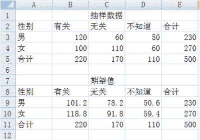

点击上方“**Datawhal****e**”，选择“星标”公众号

第一时间获取价值内容

<section>

</section>

<section>在机器学习领域通常会根据实际的业务场景拟定相应的不同的业务指标，针对不同机器学习问题如回归、分类、排序，其评估指标也会不同。

</section>

<section>

<section style="text-align: left">

<section>

<section>

<section>

<section style="text-align: justify">

**准确率、精确率、召回率、F1值**

</section>

</section>

</section>

</section>

</section>

</section>

<section>**定义**
</section>

*   <section>准确率（Accuracy）：正确分类的样本个数占总样本个数，</section>

*   <section>精确率（Precision）：预测正确的正例数据占预测为正例数据的比例，</section>

*   <section>召回率（Recall）：预测为正确的正例数据占实际为正例数据的比例，</section>

*   <section>F1 值（F1 score）：</section>

<section>**计算**</section>

<section>背景：假如有 100 个广告，某用户对 80 个不感兴趣，对其中 20 个感兴趣，目标是找出所有用户感兴趣的广告，现在挑出 40 个，其中 10 个感兴趣的，请问如何评估一下他的工作。</section>

| 
 | 实际正类 | 实际负类 |
| --- | --- | --- |
| 

<section>预测正类</section>

 | 

<section>TP=10</section>

 | 

<section>FP=30</section>

 |
| 

<section>预测负类</section>

 | 

<section>FN=10</section>

 | 

<section>TN=50</section>

 |

<section>通过混淆矩阵，我们可以算出来 <embed style="width: 44.005ex" src="https://mmbiz.qlogo.cn/mmbiz_svg/3a3QxMHZ8YxfaUIIic9J4C7b0JyOrKuP5jXKeibP4IvpmZY0t5sqcxHwBwibu4HrYfToS0sNib92ghLfn3QEK7NcbzNJZIYZ6d74/0?wx_fmt=svg"></section>

<section>**优缺点**</section>

<section>准确率、精确率、召回率、F1 值主要用于分类场景。</section>

<section>准确率可以理解为预测正确的概率，其缺陷在于：当正负样本比例非常不均衡时，占比大的类别会影响准确率。如异常点检测时：99.9% 的都是非异常点，那我们把所有样本都视为非异常点准确率就会非常高了。</section>

<section>精确率可以理解为预测出的东西有多少是用户感兴趣的，召回率可以理解为用户感兴趣的东西有多少被预测出来了。一般来说精确率和召回率是一对矛盾的度量。为了更好的表征学习器在精确率和召回率的性能度量，我们引入 F1 值。</section>

<section>在个别领域可能我们对精确率和召回率的偏重不同，故我们引入  ，来表达出对精确率和召回率的不同偏好。</section>

<section style="text-align: center"><embed style="width: 22.026ex" src="https://mmbiz.qlogo.cn/mmbiz_svg/3a3QxMHZ8YxfaUIIic9J4C7b0JyOrKuP5MqibC97zvPfSGnYSH5QFLuUU5mUibFh0xloq9Y6icicLF0WGqLnf6IibiaP0brJC0zCMCz/0?wx_fmt=svg"></section>

<section> 时精确率影响力更大，  是召回率影响更大。

</section>

<section>

<section style="text-align: left">

<section>

<section>

<section>

<section style="text-align: justify">

**P-R、ROC、AUC**

</section>

</section>

</section>

</section>

</section>

</section>

<section>**定义**</section>

*   <section>P-R 曲线：横轴召回率，纵轴精确率。</section>

*   <section>ROC（receiver operating characteristic curve接收者操作特征曲线）：采用不分类阈值时的TPR（真正例率）与FPR（假正例率）围成的曲线，以FPR为横坐标，TPR为纵坐标。如果 ROC 是光滑的，那么基本可以判断没有太大的overfitting。</section>

*   <section>AUC（area under curve）：计算从（0, 0）到（1, 1）之间整个ROC曲线一下的整个二维面积，用于衡量二分类问题其机器学习算法性能的泛化能力。其另一种解读方式可以是模型将某个随机正类别样本排列在某个随机负类别样本之上的概率。</section>

<section>**计算**</section>

<section>**P-R**</section>

<section style="text-align: left">P-R 曲线上的点代表不同阈值下模型将大于阈值的结果视为正样本，小于阈值的为负样本。</section>

<section>我们可以看到不同召回率下模型 A 和模型 B 的精确率表现不同，所以如果只对某点来衡量模型的性能是非常片面的，而只有通过 P-R 曲线的整体表现才能够进行更为全面的评估。</section>

<section>**ROC、AUC**</section>

<section>除了 F1 和 P-R 曲线外，ROC 和 AUC 也可以综合反应一个模型的性能。二分类真实值：  分为正样本的概率：</section>

<section>针对   对数据进行排序，将阈值一次取为   值，故阈值依次取值为 0.1，0.35，0.4，0.8</section>

<section>然后我们依次计算不同阈值下的 TPR 和 FPR。我们以   为例</section>

| 
 | 实际正类 | **实际负类** |
| --- | --- | --- |
| 

<section>预测正类</section>

 | 

<section>TP=2</section>

 | 

<section>FP=0</section>

 |
| 

<section>预测负类</section>

 | 

<section>FN=1</section>

 | 

<section>TN=1</section>

 |

<section>真阳性率：</section>

<section>假阳性率：</section>

<section>即可得到一个点的坐标。</section>

<section>计算完四种阈值后得到：</section>

| **阈值**
 | 

<section>**0.8**</section>

 | 

<section>**0.4**</section>

 | 

<section>**0.35**</section>

 | 

<section>**0.1**</section>

 |
| --- | --- | --- | --- | --- |
| 

<section>FPR</section>

 | 

<section>0</section>

 | 

<section>0.5</section>

 | 

<section>0.5</section>

 | 

<section>1</section>

 |
| 

<section>TPF</section>

 | 

<section>0.5</section>

 | 

<section>0.5</section>

 | 

<section>1</section>

 | 

<section>1</section>

 |

<section>画图如下：</section>

<section>我们可以看到 ROC 曲线是通过移动分类器的阈值来生成曲线上的关键点。ROC 曲线一般都处于   直线的上方，所以AUC的取值一般是 0.5～1，AUC 越大，说明分类性能更好。</section>

<section>**优缺点**</section>

<section>P-R、ROC、AUC 主要用于分类场景。</section>

<section>相比 P-R 曲线来说，ROC 曲线有一个很大的特点：ROC 曲线的形状不会随着正负样本分布的变化而产生很大的变化，而 P-R 曲线会发生很大的变化。</section>

<section>如上图测试集负样本数量增加 10 倍以后 P-R 曲线发生了明显的变化，而 ROC 曲线形状基本不变。在实际环境中，正负样本的数量往往是不平衡的，所以这也解释了为什么 ROC 曲线使用更为广泛。

</section>

<section>

<section style="text-align: left">

<section>

<section>

<section>

<section style="text-align: justify">

**MSE、RMSE、MAE、R2**

</section>

</section>

</section>

</section>

</section>

</section>

<section>**定义**</section>

*   <section>MSE(Mean Squared Error) 均方误差，</section>

*   <section>RMSE(Root Mean Squared Error) 均方根误差，</section>

*   <section>MAE(Mean Absolute Error) 平均绝对误差，</section>

*   <section>，决定系数，<embed style="width: 44.166ex" src="https://mmbiz.qlogo.cn/mmbiz_svg/3a3QxMHZ8YxfaUIIic9J4C7b0JyOrKuP53wPfKlS6zgJo4hFcGd7dOnkmTDIDicKEPK86wmzvUZqNJ3BRABvWa4AuoGmW4nVsn/0?wx_fmt=svg"></section>

<section>**优缺点**</section>

<section><embed style="width: 31.588ex" src="https://mmbiz.qlogo.cn/mmbiz_svg/3a3QxMHZ8YxfaUIIic9J4C7b0JyOrKuP5yLel4ToQ7wTkwZ4LsicNLXqnPnIPdo0tAJticGc6BHiaXtzice6ohY83sib2QMX1wKSAia/0?wx_fmt=svg"> 主要用于回归模型。</section>

MSE 和 RMSE 可以很好的反应回归模型预测值和真实值的偏离成都，但如果存在个别离群点的偏离程度非常大时，即使其数量非常少也会使得RMSE指标变差（因为用了平方）。解决这种问题主要有三个方案：

1.  如果认为是异常点时，在数据预处理的时候就把它过滤掉；

2.  如果不是异常点的话，就提高模型的预测能力，将离群点产生的原因建模进去；

3.  <section>此外也可以找鲁棒性更好的评价指标，如： ， <g transform="translate(4104.9, 0)"><g><path d="M230 637Q203 637 198 638T193 649Q193 676 204 682Q206 683 378 683Q550 682 564 680Q620 672 658 652T712 606T733 563T739 529Q739 484 710 445T643 385T576 351T538 338L545 333Q612 295 612 223Q612 212 607 162T602 80V71Q602 53 603 43T614 25T640 16Q668 16 686 38T712 85Q717 99 720 102T735 105Q755 105 755 93Q755 75 731 36Q693 -21 641 -21H632Q571 -21 531 4T487 82Q487 109 502 166T517 239Q517 290 474 313Q459 320 449 321T378 323H309L277 193Q244 61 244 59Q244 55 245 54T252 50T269 48T302 46H333Q339 38 339 37T336 19Q332 6 326 0H311Q275 2 180 2Q146 2 117 2T71 2T50 1Q33 1 33 10Q33 12 36 24Q41 43 46 45Q50 46 61 46H67Q94 46 127 49Q141 52 146 61Q149 65 218 339T287 628Q287 635 230 637ZM630 554Q630 586 609 608T523 636Q521 636 500 636T462 637H440Q393 637 386 627Q385 624 352 494T319 361Q319 360 388 360Q466 361 492 367Q556 377 592 426Q608 449 619 486T630 554Z"></path></g><g transform="translate(759, 363) scale(0.707)"><path d="M109 429Q82 429 66 447T50 491Q50 562 103 614T235 666Q326 666 387 610T449 465Q449 422 429 383T381 315T301 241Q265 210 201 149L142 93L218 92Q375 92 385 97Q392 99 409 186V189H449V186Q448 183 436 95T421 3V0H50V19V31Q50 38 56 46T86 81Q115 113 136 137Q145 147 170 174T204 211T233 244T261 278T284 308T305 340T320 369T333 401T340 431T343 464Q343 527 309 573T212 619Q179 619 154 602T119 569T109 550Q109 549 114 549Q132 549 151 535T170 489Q170 464 154 447T109 429Z"></path></g></g>。
    </section>

<section>

<section style="text-align: left">

<section>

<section>

<section>

<section style="text-align: justify">

**余弦距离的应用**

</section>

</section>

</section>

</section>

</section>

</section>

<section>样本间的距离有不同的定义方式，常见的有欧式距离、曼哈顿距离、汉明距离、余弦距离等等。这里我们主要介绍下余弦距离及其应用。</section>

<section>**定义**</section>

<section>余弦相似度的定义如下：</section>

<section>取值范围为： 。</section>

<section>如果我们想得到类似距离的表示，只需要将 1 减去余弦相似度即可：</section>

<section style="text-align: center"><embed style="width: 44.719ex" src="https://mmbiz.qlogo.cn/mmbiz_svg/3a3QxMHZ8YxfaUIIic9J4C7b0JyOrKuP5ggpjib3jVl7nzNC2hbGDBib2kCOTjus4uwcv329rqHSAoXwmAqXRxIJU2npSXTjyibx/0?wx_fmt=svg"></section>

<section>其取值范围为： 。</section>

<section>我们要注意，虽然我们称其为余弦距离，但其并不是严格定义的距离。我们知道距离的严格定义需要满足：非负性，对称性，三角不等式。</section>

*   <section>非负性：</section>

<section>特别的：</section>

<section style="text-align: center"><embed style="width: 44.336ex" src="https://mmbiz.qlogo.cn/mmbiz_svg/3a3QxMHZ8YxfaUIIic9J4C7b0JyOrKuP5yrtnYVBoiabRlKNOGaY1aA0rOpbnvdBpwZStJZEYibFfffntQKyXLVM5VH9v7VQPdP/0?wx_fmt=svg"></section>

*   <section>

    <section>对称性：</section>

    <section style="text-align: center"><embed style="width: 59.41ex" src="https://mmbiz.qlogo.cn/mmbiz_svg/3a3QxMHZ8YxfaUIIic9J4C7b0JyOrKuP5PYa7K9Osoichr7D67RoRCgNbVDeqiabjrYeyyyolJkAkLiao3uicNdpthibCt3IMLiaAov/0?wx_fmt=svg"></section>

    </section>

*   <section>

    <section>三角不等式：</section>

    <section>给出反例：</section>

    <section style="text-align: center"><embed style="width: 31.181ex" src="https://mmbiz.qlogo.cn/mmbiz_svg/3a3QxMHZ8YxfaUIIic9J4C7b0JyOrKuP5xWKeWicPJ0fyQTRITjdubScWG9TTkYu0IOTAahKGiaPGWQFA7rNP8siaPVrlLMj5pE0/0?wx_fmt=svg"></section>

    <section>因此有：</section>

    <section style="text-align: center"><embed style="width: 49.728ex" src="https://mmbiz.qlogo.cn/mmbiz_svg/3a3QxMHZ8YxfaUIIic9J4C7b0JyOrKuP5nZxG5caKtmlMtS7KD5ec35Man5GBKPCVu4W8fX4xhzLRsdL5ibbvTqGVYyRhAZ580/0?wx_fmt=svg"></section>

    </section>

<section>通过以上证明我们可以看出来，余弦距离是不满足距离的定义的。</section>

<section>**优缺点**</section>

<section>我们知道余弦相似度关注的是两个向量之间的角度关系，并不关心其绝对大小。在推荐系统的最直接的优点在于：不同用户对电影的打分力度不同，有的严一点平均打分低，有的松一点平均打分都很高，用余弦相似性可以排除打分程度的干扰，关注相对差异。</section>

<section>总的来说欧式距离体现的数值上的绝对差异，而余弦距离体现方向上的相对差异。

</section>

<section>

<section style="text-align: left">

<section>

<section>

<section>

<section style="text-align: justify">

**A/B测试**

</section>

</section>

</section>

</section>

</section>

</section>

<section>

<section style="text-align: left">A/B 测试是验证模型最终效果的主要手段。 当进行 A/B 测试时，通常会采用两个（或多 个）组： A 组和 B 组。 第一个组是对照组，第二个组会改变其中一些因素。
</section>

</section>

<section>**为什么需要 A/B 测试**</section>

1.  <section>离线评估无法消除模型过拟合的影响，因此得出的离线评估结果无法完全替代线上评估结果；</section>

2.  <section>离线评估无法完全还原线上的工程环境，如：数据丢失、标签缺失等情况；</section>

3.  <section>某些评估指标离线状态下无法评估，比如：用户点击率、留存时长、PV 访问量等。</section>

<section>**理论基础**</section>

<section>中心极限定理：给定一个任意分布的总体，每次从这些总体中随机抽取 n 个抽样，一共抽 m 次。然后把这 m 组抽样分别求出平均值。这些平均值的分布接近正态分布。</section>

<section>中心极限定理是 A/B 测试分析数据的基础，我们可以通过随机抽取样本来估计出总体样本的均值和方差。</section>

<section>**设计原则**</section>

<section>对用户进行分桶，将用户分成实验组和对照组，对实验组的用户用新模型，对照组用就模型。分桶过程中注意样本的**独立性**和采样方式的**无偏性**，从而确保同一用户只能被分到一个桶中。</section>

<section>**假设检验**</section>

<section>假设检验的基本原理是先对总体的特征作出某种假设，然后通过抽样研究的统计推理，对此假设应该被拒绝还是接受作出推断。假设检验意味着我们需要给出一个决定：到底是相信原假设，还是相信备择假设。</section>

<section>其大概步骤为：</section>

1.  <section>提出问题（给出零假设和备选假设，两个假设互补）；</section>

2.  <section>收集证据（零假设成立时，得到样本平均值的概率：p 值）；</section>

3.  <section>判断标准（显著水平  ，0.1% 1% 5%）；</section>

4.  <section>做出结论（p<= ，拒绝零假设，否则接受）。</section>

<section>假设检验的精髓在于，根据已有数据信息构造出合理的检验统计量，当我看到这个统计量大于某一个数值的时候的就舍弃原假设，不然我就相信它。</section>

<section>常见假设检验的种类包括：t 检验，z 检验，卡方检验。</section>

<section>**t 检验**</section>

<section>也称学生检验，主要用于样本含量较小（例如 n<30），总体标准差 σ 未知的正态分布。目的在于比较样本均数，所代表的未知总体均数 μ 和已知总体均数  <svg xmlns="http://www.w3.org/2000/svg" viewBox="0 -750 1413.9 1050.9" style="vertical-align: -0.681ex;width: 3.199ex;height: 2.378ex;"><g stroke="currentColor" fill="currentColor" stroke-width="0" transform="matrix(1 0 0 -1 0 0)"><g><g><g><g>μ</g></g></g></g></g></svg>  的比较。</section>

<section>适用条件：</section>

1.  <section>已知一个总体均数；</section>

2.  <section>可得到一个样本均数及该样本标准差；</section>

3.  <section>样本来自正态或近似正态总体。</section>

<section>步骤：</section>

1.  <section>建立假设  <svg xmlns="http://www.w3.org/2000/svg" viewBox="0 -750 6229.4 1035.4" style="vertical-align: -0.646ex;width: 14.094ex;height: 2.342ex;"><g stroke="currentColor" fill="currentColor" stroke-width="0" transform="matrix(1 0 0 -1 0 0)"><g><g transform="translate(2068.1, 0)"><g><g>μ</g></g></g> <g transform="translate(4815.5, 0)"><g><g>μ</g></g></g></g></g></svg> ，即先假定两个总体平均数之间没有显著差异；</section>

2.  <section>计算统计量 T 值，对于不同类型的问题选用不同的统计量计算方法；</section>

3.  <section>根据自由度  ，查 T 值表，找出规定的 T 理论值并进行比较。理论值差异的显著水平为 0.01 级或 0.05 级;</section>

4.  <section>比较计算得到的t值和理论T值，推断发生的概率，依据给出的T值与差异显著性关系表作出判断。</section>

<section>**z 检验**</section>

<section>z 检验是一般用于大样本(即样本容量大于 30)平均值差异性检验的方法。它是用标准正态分布的理论来推断差异发生的概率，从而比较两个平均数的差异是否显著。</section>

<section>步骤：</section>

1.  <section>建立虚无假设  <svg xmlns="http://www.w3.org/2000/svg" viewBox="0 -750 6229.4 1035.4" style="vertical-align: -0.646ex;width: 14.094ex;height: 2.342ex;"><g stroke="currentColor" fill="currentColor" stroke-width="0" transform="matrix(1 0 0 -1 0 0)"><g><g transform="translate(2068.1, 0)"><g><g>μ</g></g></g> <g transform="translate(4815.5, 0)"><g><g>μ</g></g></g></g></g></svg>  ，即先假定两个平均数之间没有显著差异；</section>

2.  <section>计算统计量 Z 值，对于不同类型的问题选用不同的统计量计算方法；</section>

3.  <section>比较计算所得 Z 值与理论 Z 值，推断发生的概率，依据 Z 值与差异显著性关系表作出判断。</section>

<section>**卡方检验**</section>

<section>前两个都是正态分布检验，卡方检验属于非参数检验。主要是比较两个及两个以上样本率(构成比）以及两个分类变量的关联性分析。其根本思想就是在于比较理论频数和实际频数的吻合程度问题。</section>

<section>卡方检验是以   分布为基础的一种常用假设检验方法，它的无效假设   是：观察频数与期望频数没有差别。</section>

<section>卡方检验的基本思想是：首先假设   成立，基于此前提计算出   值，它表示观察值与理论值之间的偏离程度。根据   分布及自由度可以确定在 H0 假设成立的情况下获得当前统计量及更极端情况的概率 P。如果 P 值很小，说明观察值与理论值偏离程度太大，应当拒绝零假设，表示其具有显著性差异；否则就接受零假设。</section>

<section> 值表示观察值与理论值之问的偏离程度，其大致步骤如下：</section>

1.  <section>设 A 代表某个类别的观察频数，E 代表基于   计算出的期望频数，A 与 E 之差称为残差；</section>

2.  <section>残差可以表示某一个类别观察值和理论值的偏离程度，但如果将残差简单相加以表示各类别观察频数与期望频数的差别，则有一定的不足之处。因为残差有正有负，相加后会彼此抵消，总和仍然为 0，为此可以将残差平方后求和；</section>

3.  <section>另一方面，残差大小是一个相对的概念，相对于期望频数为 10 时，期望频数为 20 的残差非常大，但相对于期望频数为 1000 时 20 的残差就很小了。考虑到这一点，人们又将残差平方除以期望频数再求和，以估计观察频数与期望频数的差别。</section>

<section>进行上述操作之后，就得到了常用的   统计量，其公式如下：</section>

<section style="text-align: center"><embed style="width: 55.201ex" src="https://mmbiz.qlogo.cn/mmbiz_svg/3a3QxMHZ8YxfaUIIic9J4C7b0JyOrKuP5yD9khgKuVNJJJqr8icSHMvwMqvcfuyibzMuaJFBXiaicSNJGukg0J0C7fJhR9HeZTjnS/0?wx_fmt=svg"></section>

<section> 为 i 水平的观察频数，  为 i 水平的期望频数，n 为总频数，  为 i 水平的期望频率。i 水平的期望频数   等于总频数 n 乘 i 水平的期望概率  ，k 为单元格数。当 n 比较大时，  统计量近似服从 k-1 (计算   时用到的参数个数)个自由度的卡方分布。</section>

<section>例子——独立性检验：</section>

<section>某机构欲了解现在性别与收入是否有关，他们随机抽样 500 人，询问对此的看法，结果分为“有关、无关、不好说“三种答案，图中为调查得到的数据：</section>

1.  <section>

    <section>零假设 H0：性别与收入无关。</section>

    </section>

2.  <section>

    <section>确定自由度为 (3-1)×(2-1)=2，选择显著水平 α=0.05。</section>

    </section>

3.  <section>

    <section>求解男女对收入与性别相关不同看法的期望次数，这里采用所在行列的合计值的乘机除以总计值来计算每一个期望值，在单元格 B9 中键入“=B5*E3/E5”，同理求出其他值。</section>

    </section>

1.  <section>利用卡方统计量计算公式计算统计量，在单元格 B15 中键入 “=(B3-B9)^2/B9”，其余单元格依次类推，结果如下所示：</section>

1.  <section>

    <section>最后得出统计量为 14.32483，而显著水平为 0.05 自由度为 2 卡方分布的临界值为 5.9915。</section>

    </section>

2.  <section>

    <section>比较统计量度和临界值，统计量 14.32483 大于临界值 5.9915，故拒绝零假设。</section>

    </section>

<section>**参考**</section>

*https://wiki.mbalib.com/wiki/%E5%8D%A1%E6%96%B9%E6%A3%80%E9%AA%8C*

