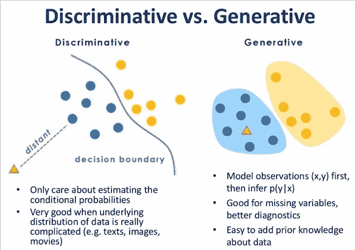

<section style="text-align: left">

点击上方“**Datawhal****e**”，选择“星标”公众号

第一时间获取价值内容

<section>

</section>

<section>生成式模型和判别式模型的概念是机器学习领域非常重要的基础知识，但能准确区分开二者并不是一件非常容易的事情，笔者经常是看一遍忘一遍，为了巩固下知识点，我将从以下几个方面对两种模型进行介绍和对比。

</section>

<section>

<section style="text-align: left">

<section>

<section>

<section>

<section style="text-align: justify">

**概念**

</section>

</section>

</section>

</section>

</section>

</section>

<section>首先我们需要明确，两种不同的模型都用于监督学习任务中。监督学习的任务就是从数据中学习一个模型，并用基于这个模型对给定的输入预测相应的输出。这种模型的一般形式为决策函数   或者条件概率分布  。</section>

<section>我们先用一张图来初步感受一下，等看完文章后再回来看一遍会更直观：</section>

<section>**定义**</section>

<section>**生成式模型**先对数据的联合分布   进行建模，然后再通过贝叶斯公式计算样本属于各类别的后验概率  。</section>

<section>**判别式模型**直接进行条件概率建模，由数据直接学习决策函数   或条件概率分布  作为预测的模型。**判别方法不关心背后的数据分布，关心的是对于给定的输入，应该预测什么样的输出。**</section>

<section>用一句话总结就是生成模型估计的是**联合概率分布**，判别式模型估计的是**条件概率分布**。</section>

<section>**举例**</section>

<section>可能经过上面的表述仍然不能够直观的理解两个模型的差异，我这里举两个例子：</section>

<section>**例子 A**</section>

<section>两种模型来如何确定一只羊是山羊还是绵羊？</section>

<section>**生成式模型**：首先根据山羊的数据和绵羊的数据分别学习出山羊的特征   和绵羊的特征  ，然后从待识别的羊中提取特征 x，将这些特征分别放到山羊模型和绵羊模型中并得到条件概率   和   ，如果   ，那么我就认为这只羊属于山羊，否则为绵羊。</section>

<section>**判别式模型**：直接从山羊和绵羊的数据中提取特征 x 并学习得到模型   ，然后从待识别的羊中提取特征 x，然后带入到模型中以判断这只羊是绵羊和山羊概率（比如 LR 中，结果大于 0.5 为正例，小于 0.5 为反例）。</section>

<section>我们可以看到，生成式模型强调数据本身特点，判别式模型强调数据边界。在分类的过程中，生成式模型对每个结果都要亲自试一试，遍历完一遍后取概率最大的结果；而判别式模型直接通过模型得到结果。</section>

<section>**例子 B**</section>

<section>维基百科中有这样的一个例子：</section>

<section>对于给定数据集  <embed style="width: 42.257ex" src="https://mmbiz.qlogo.cn/mmbiz_svg/3a3QxMHZ8YxfaUIIic9J4C7b0JyOrKuP5EDqfjmPb3Mibt3sW6syq4VmU15IVduytmTFEwufUV510LFFjuueWrPMOJRfVDLogu/0?wx_fmt=svg"> 。</section>

<section>**生成式模型**   ：</section>

| 
 | y=0 | y=1 |
| --- | --- | --- |
| 

<section>x=1</section>

 | 

<section>1/6</section>

 | 

<section>2/6</section>

 |
| 

<section>x=2</section>

 | 

<section>2/6</section>

 | 

<section>1/6</section>

 |

<section>如果现在有一个  ，那我们可以得到：</section>

<section style="text-align: center"><embed style="width: 79.629ex" src="https://mmbiz.qlogo.cn/mmbiz_svg/3a3QxMHZ8YxfaUIIic9J4C7b0JyOrKuP54wPfuWsAibgqlVAxTsfGjToEOXHOCPuTfI6YpEy7uJkrUzkdnCwDibvwqwQrcI23r8/0?wx_fmt=svg"></section>

<section>所以我们把   判别为类别 0。</section>

<section>**判别式模型**  ：</section>

| 
 | y=0 | y=1 |
| --- | --- | --- |
| 

<section>x=1</section>

 | 

<section>1/3</section>

 | 

<section>2/3</section>

 |
| 

<section>x=2</section>

 | 

<section>2/3</section>

 | 

<section>1/3</section>

 |

<section>对于给定的  ，我们直接可以得到   和   的值。

</section>

<section>

<section style="text-align: left">

<section>

<section>

<section>

<section style="text-align: justify">

**特点**

</section>

</section>

</section>

</section>

</section>

</section>

<section>**生成式模型**的特点在于，其可以从统计的角度表示数据的分布情况，能**反映同类数据本身的相似度**，不关心各类的边界在哪；</section>

<section>而**判别式模型**直接学习的是条件概率分布，所以其**不能反映训练数据本身的特性**，其目的在于**寻找不同类别之间的最优分界面**，反映异类数据之间的差异。</section>

<section>由生成模型可以得到判别模型，但由判别模型得不到生成模型。</section>

<section>当存在隐变量（当我们找不到引起某一现象的原因的时候，我们就把这个在起作用但是无法确定的因素，叫“隐变量”） 时，仍可以利用生成方法学习，此时判别方法不能用。因为生成式模型同时对 x 和 y 建立概率模型，所以如果 x 中有出现没有观察到的量或者只有部分 y 的时候，就可以很自然地使用 EM 算法 来进行处理。极端情况下，在完全没有 y 信息的情况下，GM 仍然是可以工作的——无监督学习可以看成是 GM 的一种。

</section>

<section>

<section style="text-align: left">

<section>

<section>

<section>

<section style="text-align: justify">

**优缺点**

</section>

</section>

</section>

</section>

</section>

</section>

<section>**生成式模型 **</section>

<section>**优点**
</section>

1.  <section>由于统计了数据的分布情况，所以其实际带的信息要比判别模型丰富，对于研究单类问题来说也比判别模型灵活性强；</section>

2.  <section>模型可以通过增量学习得到（增量学习是指一个学习系统能不断地从新样本中学习新的知识，并能保存大部分以前已经学习到的知识。）；</section>

3.  <section>收敛速度更快，当样本容量增加的时，生成模型可以更快的收敛于真实模型；</section>

4.  <section>隐变量存在时，也可以使用。</section>

<section>**缺点**</section>

1.  <section>学习和计算过程比较复杂，由于学习了更多的样本信息，所以计算量大，如果我们只是做分类，就浪费了这部分的计算量；</section>

2.  <section>准确率较差；</section>

3.  <section>往往需要对特征进行假设，比如朴素贝叶斯中需要假设特征间独立同分布，所以如果所选特征不满足这个条件，将极大影响生成式模型的性能。</section>

<section>**判别式模型 **</section>

<section>**优点**</section>

1.  <section>由于关注的是数据的边界，所以能清晰的分辨出多类或某一类与其他类之间的差异，所以准确率相对较高；</section>

2.  <section>计算量较小，需要的样本数量也较小；</section>

<section>**缺点**</section>

1.  <section>不能反映训练数据本身的特性；</section>

2.  <section>收敛速度较慢。</section>

<section>

<section style="text-align: left">

<section>

<section>

<section>

<section style="text-align: justify">

**代表算法**

</section>

</section>

</section>

</section>

</section>

</section>

<section>**生成式模型**：朴素贝叶斯、贝叶斯网络、隐马尔可夫模型、隐马尔可夫模型；</section>

<section>**判别式模型**：k 近邻法、决策树、逻辑斯谛回归模型、最大熵模型、支持向量机、条件随机场。</section>

<section>**参考**</section>

1.  <section>https://www.zhihu.com/question/20446337</section>

2.  <section>https://blog.csdn.net/zouxy09/article/details/8195017</section>

3.  <section>http://freemind.pluskid.org/machine-learning/discriminative-modeling-vs-generative-modeling/
    </section>

<section></section>

</section>